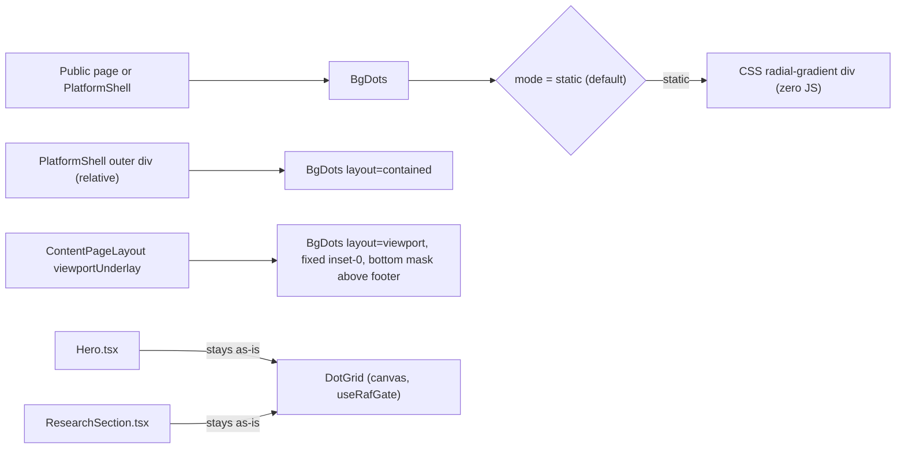

## Target file

Edit only [app_wide_static_dot_grid_background.plan.md](file:///Users/bennyrubanov/.cursor/plans/app_wide_static_dot_grid_background.plan.md) — no code, no other markdown.

## Standards to inherit from [the older plan](file:///Users/bennyrubanov/.cursor/plans/app-wide_dot_grid_background_24f3b942.plan.md)

- `## Goal` (kept).
- `## Architecture` with a `mermaid` diagram.
- `## Tasks` body with numbered subtasks (`### 1.`, `### 2.`, …), each followed by a real code block / file-level diff and a short Notes line.
- Dedicated `## Verify` section listing exact commands + DevTools checks.
- `## Out of scope` section.
- Frontmatter `todos` stay short, statuses match reality.

## Standards to drop (deliberate)

- `docs/bg-dots-app-wide.md` reference doc — your global rule: no new markdown docs without explicit ask.
- "For AI / contributors" duplicate checklist in current new plan — replaced by the numbered `## Tasks` section, which is itself the playbook.

## Concrete edits to apply

### 1. Frontmatter rewrite

Replace `todos` with the live state:

- `bgdots_component_shipped` — **completed** (file exists; `layout`, `viewportBottomFade`, `viewportBottomFadeLength` props live).
- `migrate_strategy_models_poc` — **pending** — switch `[strategy-models-client.tsx](file:///Users/bennyrubanov/Coding_Projects/aitrader/src/components/strategy-models/strategy-models-client.tsx)` from `mode="auto"` to `mode="static" layout="viewport"`.
- `platform_shell_static` — **pending** — mount in `[platform-shell.tsx](file:///Users/bennyrubanov/Coding_Projects/aitrader/src/components/platform/platform-shell.tsx)`.
- `contentpagelayout_public_pages` — **pending** — opt-in `viewportUnderlay` per public page.
- `verify_static_no_canvas` — **pending**.
- Remove `define_landing_exclusion` from todos — promote it to a top-level rule under `## Goal` ("Landing exception" already exists; just delete the duplicate todo).

Keep `name`, `overview`, `isProject: false`.

### 2. Add `## Architecture` with mermaid

### 3. Replace body with numbered `## Tasks`

- `### 1. Component (shipped)` — link [`bg-dots.tsx`](file:///Users/bennyrubanov/Coding_Projects/aitrader/src/components/landing/bg-dots.tsx); list current props (`mode`, `layout`, `dotSize`, `gap`, `color`, `className`, `interactive`, `viewportBottomFade`, `viewportBottomFadeLength`); document the default fade `min(52rem, 78vh)` and how to tune.
- `### 2. Mount in platform shell` — keep the existing code block; require `relative` on the outer `div` and `relative z-10` on `SidebarProvider`.
- `### 3. Mount per public page via `viewportUnderlay``—`ContentPageLayout`snippet; explicitly call out the bottom fade so footer stays clean (no`Footer.tsx` edits).
- `### 4. Migrate strategy-models POC` — change `mode="auto"` → `mode="static"` and keep `layout="viewport"`; show the small diff.
- `### 5. Do NOT touch existing canvases` — verbatim from older plan style; `Hero.tsx` and `ResearchSection.tsx` keep their `DotGrid`.
- `### 6. Verify` — `npx tsc --noEmit`, `npx eslint <touched files>`, DevTools: no `<canvas>` from `BgDots`, click-through works (`pointer-events-none`), bottom of viewport fades above footer.

### 4. Anti-patterns / Out of scope

- Anti-patterns: keep current list, add **"Don't override the bottom fade unless the surface has no footer"**.
- Out of scope: keep current list (Hero/Research, theming tokens, repo `docs/*.md`).

## Non-changes

- Don't add or modify any `.tsx` / `.ts` / `.css` / `Footer.tsx`.
- Don't introduce `docs/*.md`.
- Don't restate the older plan inside the newer one — keep the `## Relation to older plan` line that already cross-links.
