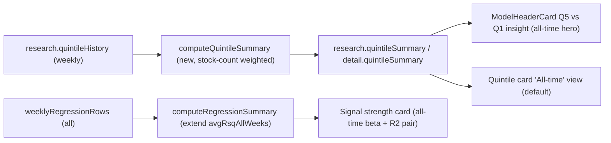

## Why — the single most trustworthy "one-look" stat

For a lay reader the best "does this model's rank separate winners from losers?" stat is the **all-time Q5−Q1 mean spread / wk** paired with its **win rate**:

- Expressed in % return terms (intuitive, unlike β's slope units).
- Uses every week — central tendency, resistant to single-week noise.
- Directly verifiable by the Quintile ladder immediately below it.
- Standard long/short factor metric from academic work.

`avgBetaAllWeeks` is defensible and complementary but β units are not lay-readable. **R²** answers "how strong is the tilt?" and belongs beside β — not as a hero.



---

## Step 1 — Pure aggregation helper

File: [src/lib/quintile-analysis.ts](src/lib/quintile-analysis.ts)

Add new type + function:

```ts
export type QuintileSummary = {
  weeksObserved: number;
  rows: Array<{ quintile: number; avgReturn: number; weekCount: number; stockTotal: number }>;
  avgSpread: number | null;
  winRate: QuintileWinRate | null;
};

export function computeQuintileSummary(history: QuintileSnapshot[]): QuintileSummary {
  if (!history.length) {
    return { weeksObserved: 0, rows: [], avgSpread: null, winRate: null };
  }
  const acc = new Map<number, { weightedSum: number; stockTotal: number; weekCount: number }>();
  for (const snap of history) {
    for (const r of snap.rows) {
      const cur = acc.get(r.quintile) ?? { weightedSum: 0, stockTotal: 0, weekCount: 0 };
      cur.weightedSum += r.return * r.stockCount;
      cur.stockTotal += r.stockCount;
      cur.weekCount += 1;
      acc.set(r.quintile, cur);
    }
  }
  const rows = Array.from(acc.entries())
    .sort(([a], [b]) => a - b)
    .map(([quintile, { weightedSum, stockTotal, weekCount }]) => ({
      quintile,
      avgReturn: stockTotal > 0 ? weightedSum / stockTotal : 0,
      weekCount,
      stockTotal,
    }));
  const q1 = rows.find((r) => r.quintile === 1)?.avgReturn;
  const q5 = rows.find((r) => r.quintile === 5)?.avgReturn;
  const avgSpread = typeof q1 === 'number' && typeof q5 === 'number' ? q5 - q1 : null;
  return {
    weeksObserved: history.length,
    rows,
    avgSpread,
    winRate: computeQuintileWinRate(history),
  };
}
```

Extend `RegressionSummary`:

```ts
export type RegressionSummary = {
  latestBeta: number | null;
  avgBetaAllWeeks: number | null;
  medianBetaAllWeeks: number | null;
  avgBetaRecent8w: number | null;
  avgRsqAllWeeks: number | null; // NEW
  avgRsqRecent8w: number | null;
  betaPositiveRate: number | null;
  totalWeeks: number;
};
```

Update `computeRegressionSummary` body to compute `avgRsqAllWeeks`:

```ts
const rsqAll = sorted
  .map((r) => r.rSquared)
  .filter((b): b is number => b != null && Number.isFinite(b));
// ...
avgRsqAllWeeks: mean(rsqAll),
```

### Tests

File: [src/lib/platform-performance-payload.test.ts](src/lib/platform-performance-payload.test.ts)

Add these assertions (reusing the existing `weeklyRows` fixture where possible):

1. 3-week fixture with known Q5 and Q1 returns — assert `computeQuintileSummary(history).avgSpread` equals the expected stock-count-weighted `Q5 mean − Q1 mean`.
2. `weeksObserved === history.length`.
3. `rows.find(r => r.quintile === 5).stockTotal === sum of Q5 stockCount across weeks`.
4. Empty history → `{ weeksObserved: 0, rows: [], avgSpread: null, winRate: null }`.
5. Existing `computeRegressionSummary` test gains one assertion: `avgRsqAllWeeks` equals the naive mean of all provided `rSquared` values.

---

## Step 2 — Payload wiring

File: [src/lib/platform-performance-payload.ts](src/lib/platform-performance-payload.ts)

1. Import `computeQuintileSummary` and `QuintileSummary`; re-export both from the module.
2. Extend the `PlatformPerformancePayload.research` type (~line 254) to include:

```ts
quintileSummary: QuintileSummary;
```

3. In `buildPayloadForStrategy` (~line 407), after `quintileHistory` is built, add the call:

```ts
const quintileSummary = computeQuintileSummary(quintileHistory);
```

Include `quintileSummary` in the returned `research` object.

4. In `getStrategyDetail` (~line 1013–1200), do the same and include `quintileSummary` on the returned `StrategyDetail`:

```ts
quintileSummary: QuintileSummary;
```

---

## Step 3 — Quintile card UI (primary change)

File: [src/components/performance/performance-page-public-client.tsx](src/components/performance/performance-page-public-client.tsx)

### 3a. State shape change

Replace:

```ts
const [smoothMonthlyQuintiles, setSmoothMonthlyQuintiles] = useState<boolean>(false);
```

with:

```ts
type QuintileAverage = 'weekly' | 'monthly' | 'allTime';
const [quintileAverage, setQuintileAverage] = useState<QuintileAverage>('allTime');
```

Derive (for minimal churn in existing memos):

```ts
const isWeeklySmoothed = quintileView === 'weekly' && quintileAverage === 'monthly';
```

Also reset `quintileAverage` to `'allTime'` in the `slug`-change `useEffect` that already resets `quintileMonth` / `fourWeekQuintileDate`.

### 3b. `activeQuintileRows`

```ts
const activeQuintileRows = useMemo(() => {
  if (quintileView === 'fourWeek') return selectedFourWeekSnapshot?.rows ?? [];
  if (quintileAverage === 'allTime') {
    return (
      research?.quintileSummary.rows?.map((r) => ({
        quintile: r.quintile,
        stockCount: r.weekCount,
        return: r.avgReturn,
      })) ?? []
    );
  }
  if (isWeeklySmoothed) {
    return (
      selectedMonthlySnapshot?.rows?.map((r) => ({
        quintile: r.quintile,
        stockCount: r.weekCount,
        return: r.avgReturn,
      })) ?? []
    );
  }
  return selectedQuintileSnapshot?.rows ?? [];
}, [
  quintileView,
  quintileAverage,
  isWeeklySmoothed,
  research?.quintileSummary.rows,
  selectedFourWeekSnapshot?.rows,
  selectedMonthlySnapshot?.rows,
  selectedQuintileSnapshot?.rows,
]);
```

### 3c. Segmented control replaces the checkbox

Remove this block:

```tsx
{quintileView === 'weekly' && (
  <label className="inline-flex cursor-pointer items-center gap-2 text-xs text-muted-foreground">
    <input type="checkbox" ... checked={smoothMonthlyQuintiles} ... />
    Smooth to monthly average
  </label>
)}
```

Replace with:

```tsx
{
  quintileView === 'weekly' && (
    <div className="flex items-center gap-1 rounded-md border bg-card p-0.5 shadow-sm text-xs">
      {(['allTime', 'monthly', 'weekly'] as const).map((v) => (
        <button
          key={v}
          type="button"
          onClick={() => setQuintileAverage(v)}
          className={cn(
            'px-2.5 py-1 rounded font-medium transition-colors',
            quintileAverage === v
              ? 'bg-trader-blue text-white'
              : 'text-muted-foreground hover:text-foreground'
          )}
        >
          {v === 'allTime' ? 'All-time' : v === 'monthly' ? 'This month' : 'This week'}
        </button>
      ))}
    </div>
  );
}
```

### 3d. Date dropdown visibility

Wrap the existing Weekly date-dropdown block with:

```tsx
{quintileView === 'weekly' &&
  quintileAverage === 'weekly' &&
  (research?.quintileHistory?.length ?? 0) > 1 && (
  /* existing weekly dropdown */
)}
```

Wrap the existing Monthly dropdown block with:

```tsx
{quintileView === 'weekly' &&
  quintileAverage === 'monthly' &&
  monthlyQuintileHistory.length > 1 && (
  /* existing monthly dropdown */
)}
```

`allTime` → no date dropdown.

### 3e. Summary line above the ladder

Find the current `activeQuintileSpread` summary `<p>` (around the "Q5 outperformed Q1 by …" copy). Wrap it with the existing `quintileView !== 'fourWeek' && quintileAverage !== 'allTime'` guard and ADD a new sibling block for `'allTime'`:

```tsx
{
  quintileAverage === 'allTime' && research?.quintileSummary?.avgSpread != null && (
    <p className="text-sm text-muted-foreground mt-3">
      Q5 averaged{' '}
      <strong
        className={research.quintileSummary.avgSpread >= 0 ? 'text-green-600' : 'text-red-600'}
      >
        {fmt.pct(research.quintileSummary.avgSpread, 2)}
      </strong>{' '}
      more than Q1 per week across <strong>{research.quintileSummary.weeksObserved} weeks</strong>
      {research.quintileSummary.winRate
        ? `, positive in ${research.quintileSummary.winRate.wins} of ${research.quintileSummary.winRate.total} (${Math.round(research.quintileSummary.winRate.rate * 100)}%)`
        : ''}
      . Higher-rated stocks outperformed lower-rated ones on average.
    </p>
  );
}
```

### 3f. Description copy

Append to the Quintile `CardDescription` (after the existing "Q5 = top 20 …" sentence):

> "All-time view shows the model's central tendency across every weekly snapshot; drill into This month or This week to see specific periods."

### 3g. Partial-month warning

Update the conditional so it only renders when `quintileAverage === 'monthly'`:

```tsx
{quintileAverage === 'monthly' && selectedMonthlyIsPartial && (
  /* existing amber warning */
)}
```

### 3h. Win-rate summary scoping

The existing `weeklyQuintileWinRate` / `monthlyQuintileWinRate` blocks: leave them, but scope them:

- Weekly win rate → `quintileView === 'weekly' && quintileAverage === 'weekly'`
- Monthly win rate → `quintileView === 'weekly' && quintileAverage === 'monthly'`
- All-time win rate → already rendered inline in the 3e summary line; no separate block.

---

## Step 4 — Strategy-model header Quintile insight card

File: [src/components/model-header-card-insights.ts](src/components/model-header-card-insights.ts)

```ts
export type ModelHeaderQuintileInsight = {
  winRate: { wins: number; total: number; rate: number } | null;
  avgSpread: number | null; // NEW — all-time Q5−Q1 mean / wk
  weeksObserved: number; // NEW
  latestWeekSpread: number | null; // kept for drilldown
  latestWeekRunDate: string | null;
};

export function hasQuintileInsight(q: ModelHeaderQuintileInsight | null | undefined): boolean {
  if (!q) return false;
  if (q.avgSpread != null && Number.isFinite(q.avgSpread)) return true;
  if (q.winRate && q.winRate.total > 0) return true;
  return q.latestWeekSpread != null && Number.isFinite(q.latestWeekSpread);
}
```

File: [src/components/ModelHeaderCard.tsx](src/components/ModelHeaderCard.tsx) (replace the `quintileInsightEl` IIFE ~lines 331–408)

```tsx
const quintileInsightEl =
  replaceBeatSlot &&
  quintileHeaderInsight &&
  (() => {
    const q = quintileHeaderInsight;
    const wr = q.winRate;
    const avgSpread = q.avgSpread;
    const showAvg = avgSpread != null && Number.isFinite(avgSpread);
    const spread = q.latestWeekSpread;
    const pctFmt = (v: number | null) => (v == null ? '—' : `${Math.round(v * 100)}%`);
    return (
      <InsightCardShell
        icon={LayoutGrid}
        title="Q5 vs Q1"
        subtitle="Signal — avg Q5 minus Q1 per week"
      >
        <div className="mt-1">
          {showAvg ? (
            <>
              <p
                className={cn(
                  insightHighlightClass,
                  avgSpread! > 0
                    ? 'text-green-600 dark:text-green-400'
                    : avgSpread! < 0
                      ? 'text-red-600 dark:text-red-400'
                      : 'text-foreground'
                )}
              >
                {fmtSignedPctFromDecimal(avgSpread, 2)}
              </p>
              <p className="text-xs leading-snug text-muted-foreground">
                {wr && wr.total > 0
                  ? `Q5 beat Q1 in ${wr.wins} of ${wr.total} weeks (${pctFmt(wr.rate)})`
                  : `${q.weeksObserved} weeks observed`}
                {spread != null && Number.isFinite(spread)
                  ? ` · latest ${fmtSignedPctFromDecimal(spread, 2)}`
                  : ''}
                {q.latestWeekRunDate ? ` (${fmt.date(q.latestWeekRunDate)})` : ''}
              </p>
            </>
          ) : wr && wr.total > 0 ? (
            /* existing win-rate fallback block — unchanged */
            <>
              <p
                className={cn(
                  insightHighlightClass,
                  wr.rate > 0.5
                    ? 'text-green-600 dark:text-green-400'
                    : wr.rate < 0.5
                      ? 'text-red-600 dark:text-red-400'
                      : 'text-foreground'
                )}
              >
                {Math.round(wr.rate * 100)}%
              </p>
              <p className="text-xs leading-relaxed text-muted-foreground">
                <span className="font-medium text-foreground tabular-nums">{wr.wins}</span>
                {' of '}
                <span className="font-medium text-foreground tabular-nums">{wr.total}</span>
                {' weeks, Q5 (top-rated) outperformed Q1 (bottom-rated)'}
              </p>
            </>
          ) : spread != null && Number.isFinite(spread) ? (
            /* existing latest-week fallback — unchanged */
            <>
              <p
                className={cn(
                  insightHighlightClass,
                  spread > 0
                    ? 'text-green-600 dark:text-green-400'
                    : spread < 0
                      ? 'text-red-600 dark:text-red-400'
                      : 'text-foreground'
                )}
              >
                {fmtSignedPctFromDecimal(spread, 2)}
              </p>
              <p className="text-xs leading-relaxed text-muted-foreground">
                Q5 minus Q1 return
                {q.latestWeekRunDate ? (
                  <>
                    {' · Week of '}
                    <span className="font-medium text-foreground tabular-nums">
                      {fmt.date(q.latestWeekRunDate)}
                    </span>
                  </>
                ) : null}
              </p>
            </>
          ) : (
            <p className={cn(insightHighlightClass, 'text-muted-foreground')}>—</p>
          )}
          <Link
            href={quintileInsightHref}
            className="mt-auto inline-flex items-center gap-1 text-xs font-medium text-trader-blue hover:underline dark:text-trader-blue-light"
          >
            Quintile analysis
            <ArrowRight className="size-3" />
          </Link>
        </div>
      </InsightCardShell>
    );
  })();
```

### Call-site wiring

File: [src/components/performance/performance-page-public-client.tsx](src/components/performance/performance-page-public-client.tsx)

Find the `quintileHeaderInsight` object passed to `<ModelHeaderCard ... />` (grep `quintileHeaderInsight=`) and add:

```ts
avgSpread: research?.quintileSummary?.avgSpread ?? null,
weeksObserved: research?.quintileSummary?.weeksObserved ?? 0,
```

File: [src/app/strategy-models/[slug]/page.tsx](src/app/strategy-models/[slug]/page.tsx) (~lines 140–150)

```tsx
quintileHeaderInsight={
  detail.quintileSummary.weeksObserved > 0 ||
  detail.quintileLatestWeekSpread != null
    ? {
        winRate: detail.quintileWinRate,
        avgSpread: detail.quintileSummary.avgSpread,
        weeksObserved: detail.quintileSummary.weeksObserved,
        latestWeekSpread: detail.quintileLatestWeekSpread,
        latestWeekRunDate: detail.quintileLatestWeekRunDate,
      }
    : null
}
```

---

## Step 5 — `/strategy-models` ranked cards parity

File: [src/app/api/platform/strategy-models-ranked/route.ts](src/app/api/platform/strategy-models-ranked/route.ts)

1. Import:

```ts
import {
  buildQuintileHistory,
  computeQuintileSummary,
  computeQuintileWinRate,
  computeRegressionSummary,
  getStrategiesList,
} from '@/lib/platform-performance-payload';
```

2. Extend `RankedStrategyModel`:

```ts
quintileAvgSpread: number | null;
quintileWeeksObserved: number;
```

3. After `buildQuintileHistory(...)` in the loop:

```ts
const qSummary = computeQuintileSummary(qHistory);
```

4. In both `rows.push({ ... })` branches (success and catch) add:

```ts
quintileAvgSpread: qSummary.avgSpread,
quintileWeeksObserved: qSummary.weeksObserved,
```

File: [src/components/strategy-models/strategy-models-client.tsx](src/components/strategy-models/strategy-models-client.tsx)

Locate the Q5−Q1 column block (search `quintileWinRate` or `Q5 vs Q1`). Replace its hero rendering with an IIFE that prefers `quintileAvgSpread`:

```tsx
(() => {
  const avg = ranked.quintileAvgSpread;
  const avgFinite = avg != null && Number.isFinite(avg);
  return (
    <>
      <p
        className={cn(
          'text-lg font-bold tabular-nums tracking-tight',
          avgFinite
            ? avg > 0
              ? 'text-green-600 dark:text-green-400'
              : avg < 0
                ? 'text-red-600 dark:text-red-400'
                : 'text-foreground'
            : 'text-muted-foreground'
        )}
      >
        {avgFinite ? fmtSignedPctFromDecimal(avg, 2) : '—'}
      </p>
      <p className="text-[10px] text-muted-foreground mt-0.5">
        {ranked.quintileWinRate
          ? `Q5>Q1 in ${Math.round(ranked.quintileWinRate.rate * 100)}% of ${ranked.quintileWeeksObserved}w`
          : `${ranked.quintileWeeksObserved}w observed`}
        {ranked.quintileLatestWeekSpread != null && Number.isFinite(ranked.quintileLatestWeekSpread)
          ? ` · latest ${fmtSignedPctFromDecimal(ranked.quintileLatestWeekSpread, 2)}`
          : ''}
      </p>
    </>
  );
})();
```

If `fmtSignedPctFromDecimal` is not already imported in this file, add a local helper (copy from `ModelHeaderCard.tsx`).

Change the column label from its current text to `Q5 − Q1 · all-time avg`.

---

## Step 6 — Signal Strength: add all-time β + R² line

File: [src/components/performance/performance-page-public-client.tsx](src/components/performance/performance-page-public-client.tsx) (Signal strength card at ~line 2727+)

Inside the `<CardHeader>` immediately after the existing `<CardDescription>` and before the toggle row, add:

```tsx
{
  research?.regressionSummary && research.regressionSummary.totalWeeks > 0 && (
    <p className="text-xs text-muted-foreground mt-1">
      All-time avg β {fmt.num(research.regressionSummary.avgBetaAllWeeks, 4)}
      {' · '}
      All-time R² {fmt.num(research.regressionSummary.avgRsqAllWeeks, 4)}
      {' · '}
      β&gt;0 in {Math.round((research.regressionSummary.betaPositiveRate ?? 0) * 100)}% of{' '}
      {research.regressionSummary.totalWeeks} weeks
    </p>
  );
}
```

Keep the existing period-specific β / R² / α block below unchanged.

---

## Step 7 — QA

1. `npx tsc --noEmit` — no new errors in touched files. (Pre-existing notification errors are acceptable, unchanged.)
2. `npx tsx --tsconfig tsconfig.json --test src/lib/platform-performance-payload.test.ts` — all existing tests pass + 5 new assertions (4 quintile-summary, 1 regression-summary).
3. `/performance/[slug]`:
   - Header **Q5 vs Q1** card leads with `avgSpread` (colored), subtitle shows win rate + latest week.
   - Main Quintile card opens in **All-time** view; no date dropdown visible; ladder rows show weighted averages; summary line reads "Q5 averaged +X.XX% more than Q1 per week across N weeks, positive in Y of Z (Q%)".
   - Signal strength header has the new muted all-time β / R² / β>0 line.
4. `/strategy-models`:
   - Q5−Q1 column hero is `avgSpread` (colored by sign); subtitle shows win rate %, weeks observed, latest week.
   - Column label reads "Q5 − Q1 · all-time avg".
5. `/strategy-models/[slug]`: header Q5 vs Q1 card matches `/performance` behavior.

---

## Non-goals

- No DB / cron changes.
- No new regression math; R² already computed per week.
- No changes to 4-week non-overlap toggle (kept as separate methodology).
- No changes to the Beta header insight card logic (already all-time from the prior plan).
- No removal of any existing weekly/monthly/4-week view; this plan only re-orders defaults and adds All-time.
