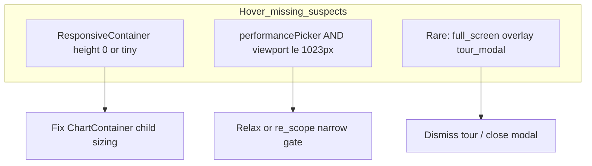

# Chart hover still missing — investigation and remediation plan

## Why this can happen (two independent causes)

### 1. Recharts `ResponsiveContainer` not inheriting height (most likely for `PerformanceChart` + `ExplorePortfoliosEquityChart`)

[`ChartContainer`](src/components/ui/chart.tsx) wraps children in a `flex` div with `aspect-video` and passes a **fixed height** via consumer `className` (e.g. `h-[320px]`). Elsewhere in this repo, charts that behave correctly **explicitly** force the inner Recharts wrapper to fill height:

- [`src/components/platform/stock-chart-dialog.tsx`](src/components/platform/stock-chart-dialog.tsx) default `chartClassName` includes `[&_.recharts-responsive-container]:!h-full`.
- [`src/components/StockDetailClient.tsx`](src/components/StockDetailClient.tsx) passes the same pattern into its chart shell.

[`PerformanceChart`](src/components/platform/performance-chart.tsx) and [`ExplorePortfoliosEquityChart`](src/components/platform/explore-portfolios-equity-chart.tsx) **do not** pass that selector today. In nested `flex` / `min-h-0` layouts (common under [`PlatformShell`](src/components/platform/platform-shell.tsx) and cards), Recharts can end up with a **zero or unstable plot height**, so the SVG effectively has **no hover surface** even though controls/chips still render.

### 2. `performancePicker` intentionally turns off scrub/tooltip on “narrow” **viewport** (not container)

In [`ExplorePortfoliosEquityChart`](src/components/platform/explore-portfolios-equity-chart.tsx), when `variant === 'performancePicker'` **and** `useIsNarrowExploreChartLayout()` is true (`(max-width: 1023px)`), the chart uses:

- `RechartsTooltip` with `cursor={false}` and `content={() => null}` (no floating tooltip / no vertical cursor).
- `onMouseMove` / `onMouseLeave` unset on `LineChart`.

That matches the inline contract at props (lines 206–208): picker UX avoids X-scrub on narrow. If the user is on a **≤1023px** window (small laptop, split screen, responsive devtools, or a wide monitor with a narrow browser chrome), **every** `performancePicker` surface looks like “no hover” compared to desktop `PerformanceChart` — including:

- “Portfolio returns” on [`performance-page-public-client.tsx`](src/components/performance/performance-page-public-client.tsx) (lines 772–797).
- Sidebar chart in [`sidebar-portfolio-config-picker.tsx`](src/components/platform/sidebar-portfolio-config-picker.tsx) (lines 899–912).

The **`explore`** variant does **not** use that branch (`isPicker && isNarrowLayout` is false when `isPicker` is false), so if hover is missing on **Explore** too, cause (1) is the better explanation.

### 3. Clarification — repro on desktop **wider than 1023px** (user-observed)

If **`window.innerWidth > 1023`**, then `useIsNarrowExploreChartLayout()` is **false**, so **`isPicker && isNarrowLayout` never applies**. In that case:

- The **narrow `performancePicker` gate** (§2) is **not** the explanation for missing hover on those pages at that viewport.
- **§1 remains the primary hypothesis** (shared [`ChartContainer`](src/components/ui/chart.tsx) missing `[&_.recharts-responsive-container]:!h-full` / equivalent): flex + `min-h-0` ancestors can still collapse the Recharts plot height **independent of viewport width**.
- **Phase 2 (Option A)** is still worth doing for small-viewport parity with `PerformanceChart`, but it is **orthogonal** to “wide desktop, still no hover” — implement **Phase 1 first**, then confirm in DevTools that `.recharts-responsive-container` has a **non-zero computed height** before chasing overlays or other causes.

---

## Phase 0 — Confirm which branch you are in (5 minutes, no code)

On the page where hover fails:

1. Note **URL** and whether the chart is **Explore** vs **multi-line picker** (strategy-models “Portfolio returns”, sidebar “Values” chart = `performancePicker`).
2. In DevTools console: `window.innerWidth`. If **≤1023** and the chart is `performancePicker`, **no tooltip/cursor is expected today** (line emphasis may still react when hovering **directly on strokes**). If **>1023**, treat §2 as inactive and focus on §1 / §3.
3. Elements panel: find `.recharts-wrapper` (or `.recharts-responsive-container`) and check **computed width/height**. If height is **0** or a few px, that confirms cause (1).

---

## Phase 1 — Shared fix: make `ChartContainer` size like the stock charts (primary remediation)

**File:** [`src/components/ui/chart.tsx`](src/components/ui/chart.tsx)

- Extend the default `className` on the outer `ChartContainer` div (the same `cn(...)` that already sets `flex`, `aspect-video`, etc.) to include the same **child targeting** used by stock charts, e.g. `[&_.recharts-responsive-container]:!h-full` and, if needed, `min-h-0` / `w-full` variants so the responsive layer fills the explicit `h-[…]` from consumers.
- Keep consumer `className` merges unchanged; this should lift **all** `ChartContainer` users (including `PerformanceChart`, explore equity chart, dialogs) without per-callsite duplication.

**Verify after change:** Phase 0 step 3 shows non-zero `.recharts-responsive-container` height; hovering the **plot** shows Recharts tooltip DOM (`recharts-tooltip-wrapper` / active cursor layer depending on version).

---

## Phase 2 — `performancePicker`: align behavior with user expectations

**File:** [`src/components/platform/explore-portfolios-equity-chart.tsx`](src/components/platform/explore-portfolios-equity-chart.tsx)

Pick **one** product direction (implement the chosen one only):

- **Option A (parity):** On `performancePicker`, **always** render `ChartTooltip` + `ChartTooltipContent` + vertical `cursor` (same as wide desktop), and keep `onMouseMove` / `onMouseLeave` for sidebar sync. Accept possible UX friction on small screens, or add `touchAction`/lightweight mobile behavior if needed.
- **Option B (narrower gate):** Keep “lite” mode only when the **chart card** is narrow (e.g. `container`-type query via `ResizeObserver` on the chart wrapper) instead of **viewport** `max-width: 1023px`, so laptop split view still gets tooltips when the chart column is wide enough.
- **Option C (docs-only):** If product wants to keep current picker contract, add a **single short UI hint** near picker charts on narrow viewports (“Hover values on wider screens” or similar) — only if you explicitly want copy; otherwise skip.

Recommendation: **Option A** if the goal is “always feels like `PerformanceChart`”; **Option B** if you want to preserve reduced interaction only in truly tight layouts.

---

## Phase 3 — Regression pass (same pages as the original brief)

- [`platform-overview-client.tsx`](src/components/platform/platform-overview-client.tsx) spotlight `PerformanceChart`.
- [`your-portfolio-client.tsx`](src/components/platform/your-portfolio-client.tsx) main chart.
- [`explore-portfolios-client.tsx`](src/components/platform/explore-portfolios-client.tsx) chart mode (`explore` variant).
- [`performance-page-public-client.tsx`](src/components/performance/performance-page-public-client.tsx) `performancePicker` block + slug portfolio `ConfigPerformanceChartBlock` / `PerformanceChart`.
- Optional: [`explore-portfolio-detail-dialog.tsx`](src/components/platform/explore-portfolio-detail-dialog.tsx) embedded `PerformanceChart`.

---

## Out of scope unless Phase 0 proves it

- **Post-onboarding tour** ([`post-onboarding-platform-tour.tsx`](src/components/platform/post-onboarding-platform-tour.tsx)): only blocks interaction while `active && tourReady`; dismiss/skip if testing during a tour.
- **Formatter guard** in `ChartTooltipContent` (`item.name` check) — only revisit if tooltips render but rows are empty; not a “no hover” root cause.

---

## Related

- Earlier UX brief: [`chart-hover-tooltip-parity.plan.md`](chart-hover-tooltip-parity.plan.md)
