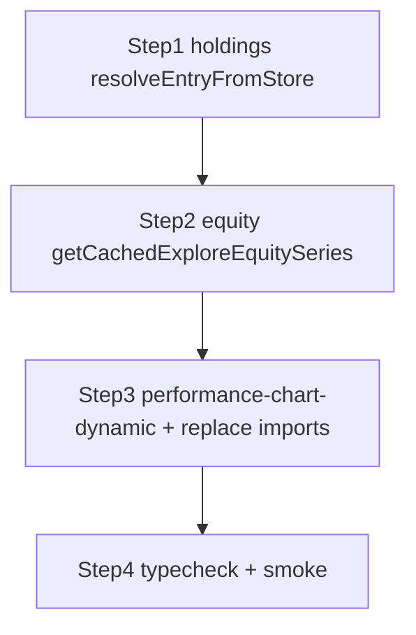

# Client crash hardening — implementation spec

**Goal:** Old mobile Chrome sessions crashed until full reinstall (cleared all storage + cache). Likely causes: (A) **localStorage/sessionStorage** blobs read without the same **normalization** as `fetch` responses, so UI code sees `undefined` and throws; (B) **stale tab** after deploy → **dynamic import** of `performance-chart` fails (`ChunkLoadError`), Next shows a generic client error.

**Non-goals this PR:** CDN header changes, service workers, rewriting `portfolio-config-performance-cache` (high regression risk without tests).

---

## Step 1 — Explore holdings cache (`src/lib/portfolio-config-holdings-cache.ts`)

**Function to edit:** `resolveEntryFromStore` (starts ~line 322).

**Current bug:** Memory and disk hits return `padExploreHoldingsPayload(value)` only. Network path uses `normalizePayload` before `remember`. Disk/memory can still expose `undefined` top-level fields if JSON was partial.

**Do exactly this:**

1. After you have a `ExploreHoldingsPayload` candidate from **memory** (`memoryEntry.value`) or **disk** (`diskEntry.value`), compute:

   `const coerced = normalizePayload(candidate as ExploreHoldingsApiResponse);`

   (`normalizePayload` already exists in this file; `ExploreHoldingsApiResponse` is already a type here—use the existing import/type, do not duplicate.)

2. **Return `coerced`**, not `padExploreHoldingsPayload(...)`, for:

   - fresh memory hit  
   - stale-but-usable memory hit  
   - fresh disk hit  
   - stale-but-usable disk hit  

3. Whenever you `memoryStore.set(logicalKey, ...)`, store **`{ value: coerced, updatedAt: ...original updatedAt... }`** so the in-memory copy stays aligned with what you return.

4. **Do not** delete LRU keys or payload keys just because you ran `normalizePayload`. It does not throw; it always returns an object.

5. **Optional cleanup:** If `padExploreHoldingsPayload` becomes unused everywhere after this, remove it; if still used elsewhere, leave it. Do not change `CACHE_PREFIX`, TTLs, or `invalidateExploreHoldingsCache` behavior.

**Regression check:** `normalizePayload` is idempotent for values already produced by the fetch path. Acceptable change: invalid `livePoint` blobs become `null` (same as a fresh fetch would). It does **not** deep-sanitize each `holdings[]` element; out-of-scope unless you add separate guards.

---

## Step 2 — Explore equity series cache (`src/lib/explore-equity-series-cache.ts`)

**Function to edit:** `getCachedExploreEquitySeries` (starts ~line 139).

**Current bug:** Fresh memory and fresh session hits return `memoryEntry.value` / `sessionEntry.value` with **no** `normalize()`. Fetch path uses `normalize(await r.json())` before `remember`.

**Do exactly this:**

1. When returning from a **fresh memory** hit, set:

   `const coerced = normalize(memoryEntry.value);`  
   update `memoryStore.set(key, { value: coerced, updatedAt: memoryEntry.updatedAt });`  
   return `coerced`.

2. When hydrating from **session** (`readSessionEntry`), after freshness check:

   `const coerced = normalize(sessionEntry.value);`  
   `memoryStore.set(key, { value: coerced, updatedAt: sessionEntry.updatedAt });`  
   return `coerced`.

3. **Garbage handling (optional but recommended):** If after `normalize`, `coerced.dates.length === 0` **and** `coerced.series.length === 0`, treat as miss: `sessionStorage.removeItem(storageKey(key))`, do not `memoryStore.set`, return `null`. (Avoid deleting when only benchmarks dropped but series exists.)

4. **Do not** bump `CACHE_PREFIX` in this PR unless you discover a breaking schema change.

**Regression check:** `normalize` can set `benchmarks` to `null` when benchmark array lengths disagree with `dates` (existing logic). That may temporarily hide benchmark lines until refetch—acceptable vs crash. Extra `normalize()` per hit is cheap.

---

## Step 3 — PerformanceChart chunk-load recovery

**Create a new file** e.g. `src/components/platform/performance-chart-dynamic.tsx` next to `performance-chart.tsx`.

**Why a factory:** Every call site today uses `ssr: false` but **different `loading` skeletons** (different `Skeleton` heights/classes). A single shared `dynamic(...)` would regress layout. Use a **factory function** instead.

**Requirements:**

1. Export **`createPerformanceChartDynamic(options: { loading: () => React.ReactNode })`** that returns `next/dynamic(...)` with:

   - `ssr: false` (all current call sites use this—keep fixed).  
   - `loading: options.loading` (caller passes the **exact** skeleton JSX each file uses today).  
   - Plus failure handling from items 2–3 below.

2. **Load failure hook:** Prefer `dynamic(..., { onError })` if your Next.js `DynamicOptions` type includes `onError`. If it does **not** exist in this repo’s Next version, stop and use a **class error boundary** around the dynamic component that catches render errors from failed lazy loads (check Next docs for the recommended pattern)—still one-shot `sessionStorage` reload only. Do not ship blind if typings reject `onError`.

3. **`onError` / boundary behavior** must:

   - Reads `sessionStorage.getItem('aitrader:perf_chart_chunk_reload')`.  
   - If **missing**: `sessionStorage.setItem('aitrader:perf_chart_chunk_reload', '1')` then `window.location.reload()`.  
   - If **already set**: do **not** reload again; render a minimal inline fallback (e.g. “Unable to load chart — refresh the page”) so the user is not stuck in a loop.

4. At each call site, replace:

   `const PerformanceChart = dynamic(() => import('...performance-chart').then(...), { ssr: false, loading: () => ... });`  

   with:

   `const PerformanceChart = createPerformanceChartDynamic({ loading: () => ...same skeleton as before... });`  

   Keep variable names (`PerformanceChart` vs `RecommendedPerformanceChart`) unchanged unless imports require it.

**Files that currently dynamic-import `performance-chart`** (verify with repo search before editing):

- `src/components/platform/your-portfolio-client.tsx`
- `src/components/platform/platform-overview-client.tsx`
- `src/components/platform/performance-page-client.tsx`
- `src/components/platform/public-portfolio-config-performance.tsx`
- `src/components/platform/portfolio-onboarding-dialog.tsx`
- `src/components/performance/performance-page-public-client.tsx`
- `src/components/auth/auth-preview-placeholder.tsx`

**Do not** add a second reload path (no duplicate error boundary that also reloads). One owner only.

**Do not** put unconditional global reload in `src/app/providers.tsx`—that would run on sign-up/checkout and can wipe in-progress forms.

**Regression check:** Static import in `explore-portfolio-detail-dialog.tsx` is unchanged unless you explicitly choose to migrate it (not required for this plan).

---

## Step 4 — Verification

1. `pnpm exec tsc --noEmit` (or project’s usual typecheck command).

2. Run existing tests touching explore / holdings if any (`grep` test files for `portfolio-config-holdings-cache` / `explore-equity-series-cache`).

3. Manual: open explore strategy page, hard-reload, confirm charts; clear `sessionStorage` keys matching `aitrader.platform.cache.v2.explore-equity-series` and confirm refetch still works.

---

## Step 5 — Optional (separate PR)

Sentry (or similar) with source maps, release id, PII scrubbing. Not required to close the crash hardening story.

---

## `portfolio-config-performance-cache.ts` — explicit instruction

**Do not** add hand-rolled JSON coercion in this PR. If server response shape changes later, bump `CACHE_PREFIX` there and clear session keys, plus add tests—coercion without tests is the highest regression surface.

---

## Sense-check summary (triple-checked)

| Item | Safe? |
|------|--------|
| Holdings: `normalizePayload` on read | Yes — pure, idempotent on own writes; no key deletion. |
| Equity: `normalize` on read | Yes — same as fetch; optional empty miss avoids serving useless cache. |
| Memory store write-back with coerced value | Yes — prevents re-reading stale shape from RAM. |
| Chunk reload with sessionStorage guard | Yes — prevents infinite reload loop. |
| Scoped wrapper vs `providers.tsx` reload | Yes — avoids checkout/sign-up data loss. |
| Skip config-performance coercion | Yes — avoids silent wrong metrics. |

---

## Mermaid (order of work)

