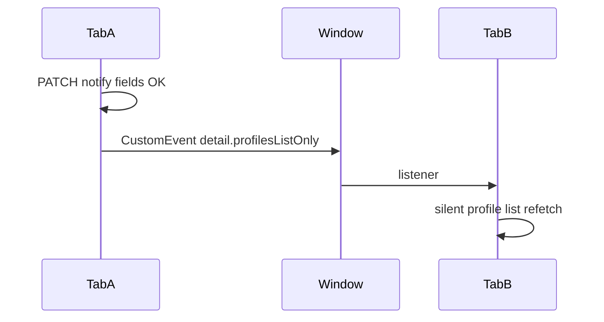

# Cross-tab portfolio notification state sync

## Goal

When portfolio notify fields change in one tab (Your portfolios bell, Portfolio alerts dialog, Notification settings followed-portfolio rows), **other open tabs** refetch profile rows so bell icons and toggles match the server—without unnecessary heavy cache clears.

## Approach

Reuse [`USER_PORTFOLIO_PROFILES_INVALIDATE_EVENT`](src/components/platform/portfolio-unfollow-toast.tsx) and extend [`UserPortfolioProfilesInvalidateDetail`](src/components/platform/portfolio-unfollow-toast.tsx) with a **list-only** flag (e.g. `profilesListOnly?: boolean`).

Dispatch a small helper after successful `PATCH` to `/api/platform/user-portfolio-profile` that only touched notify channels (or equivalent semantics).

## Implementation checklist

1. **Extend detail + export helper** in [`portfolio-unfollow-toast.tsx`](src/components/platform/portfolio-unfollow-toast.tsx): `profilesListOnly?: boolean`; `invalidateUserPortfolioProfilesList()` dispatches `{ detail: { profilesListOnly: true } }`. Do **not** set `profileId` on this helper (see regressions below).

2. **[`your-portfolio-client.tsx`](src/components/platform/your-portfolio-client.tsx)** invalidate `useEffect` (~1727–1767): if `d?.profilesListOnly`, run `void loadProfiles({ silent: true })` then **return**—skip `portfolioTimelineCache.clear()` / `portfolioTimelineInflight.clear()`. Order: keep existing `entryMerge` and `entrySettingsOnly` branches first; treat `profilesListOnly` as another early exit before the heavy clear.

3. **[`user-portfolio-profiles-client.ts`](src/lib/user-portfolio-profiles-client.ts)** `bindInvalidateListener`: if `profilesListOnly`, same as `entrySettingsOnly` (delete default cache key `inflight`/`resolved`).

4. **Dispatch after mutations**

   - [`your-portfolio-client.tsx`](src/components/platform/your-portfolio-client.tsx) `togglePortfolioAlerts`: on success, call `invalidateUserPortfolioProfilesList()`; remove redundant `loadProfiles` if the same-tab listener always runs (avoid double GET—verify synchronous dispatch order).

   - [`portfolio-alerts-dialog.tsx`](src/components/platform/portfolio-alerts-dialog.tsx): on successful save, dispatch list-only invalidation.

   - [`notifications-settings-section.tsx`](src/components/platform/notifications-settings-section.tsx): after successful `patchProfile` (and any batch code that PATCHes the same notify fields on `user-portfolio-profile`), dispatch list-only invalidation.

5. **Subscribe notification settings** in [`notifications-settings-section.tsx`](src/components/platform/notifications-settings-section.tsx): `useEffect` + `window.addEventListener` / cleanup. On `profilesListOnly`, call a **narrow refetch** (e.g. only `fetch('/api/platform/user-portfolio-profile')` + merge `profiles` state) instead of full `load()` if feasible—**or** document that full `load()` is acceptable. Prefer narrow fetch to avoid resetting prefs UX mid-edit.

6. **[`platform-overview-client.tsx`](src/components/platform/platform-overview-client.tsx)** listener (~2043–2056): today **every** event clears movement caches, bumps `movementRefreshEpoch`, and usually bumps `profileFetchNonce`. For `profilesListOnly`, **only** call `refreshOverviewProfiles()` (already uses `bypassCache: true`) and **return early** without clearing `portfolioMovementFetchCache` / inflight / warm maps and **without** incrementing `profileFetchNonce` unless product requires it. This is the main regression guard.

## Regression review (must satisfy before merge)

| Risk | Mitigation |
|------|------------|
| Overview movement warm + card refetch storm on every notify toggle in another tab | `profilesListOnly` early branch: **no** movement cache clear, **no** `setMovementRefreshEpoch`, **no** `profileFetchNonce` bump—only `refreshOverviewProfiles()`. |
| Your-portfolios timeline cache wiped on notify toggle | `profilesListOnly` early branch: **no** `portfolioTimelineCache.clear()`. |
| `invalidateUserEntryPerformanceCache(profileId)` runs on spurious `profileId` | List-only events **omit** `profileId` (notify toggles do not change entry performance inputs). |
| `entrySettingsOnly` + `profilesListOnly` both true | Never combine; handler order: `entryMerge` → `entrySettingsOnly` → `profilesListOnly` → full. |
| Double `loadProfiles` in same tab | Single path: either only dispatch or only direct `loadProfiles`, not both. |
| Notification settings: full `load()` disrupts in-progress prefs edits | Prefer refetch **profiles slice only** on `profilesListOnly`. |
| Explore client has no listener | Optional follow-up: followed list may lag until navigation unless listener + `loadFollowedProfiles` added. |

## QA

- Two tabs: Your portfolios + Notification settings; toggle bell and per-portfolio row; icons and rows match within one refetch.

- Your portfolios + Platform overview: toggle bell in one tab; overview profile row notify UI (if any) updates **without** obvious movement / card reload churn (watch network for unnecessary movement fetches).

- Entry settings save from Your portfolios: still uses existing `invalidateUserPortfolioProfilesEntrySave`; behavior unchanged.

## Effect in the product (what users will notice)

- **Before:** Tab B could show alerts “on” while Tab A had already turned them off until B was refreshed.

- **After:** Any successful portfolio-notify `PATCH` broadcasts a **light** invalidation. Tabs that listen run a **silent** refetch of the user portfolio profile list (or overview’s equivalent), so bell state and settings rows **converge within a moment** without a full page reload.

- **Performance:** List-only invalidation avoids nuking movement/timeline caches used for charts and movement tables, so cross-tab sync should **not** trigger the expensive “full portfolio invalidate” path used for unfollow / major structural changes.
