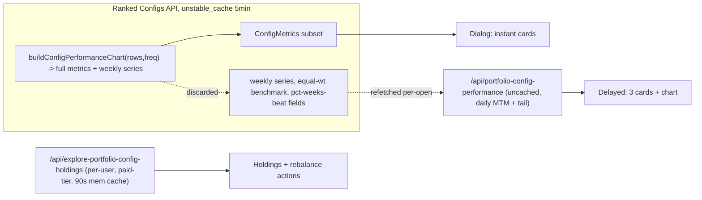

## Root cause (current data flow)



The 3 delayed metric cards and the chart block on the same fetch that also enriches the chart with daily mark-to-market. Holdings are on a separate per-user, auth-gated endpoint.

---

## Part A — Detailed metrics (preload + skeleton fallback)

All three delayed values are already computed in [src/lib/portfolio-configs-ranked-core.ts](src/lib/portfolio-configs-ranked-core.ts) inside `computeRankedConfigMetrics` via the `full` object (`FullConfigPerformanceMetrics`) and then discarded. Cost to preload: zero extra compute, ~24 bytes per config (~2KB total).

**Changes:**

1. Extend `ConfigMetrics` in [src/lib/portfolio-configs-ranked-core.ts](src/lib/portfolio-configs-ranked-core.ts#L43-L58):
   - `pctWeeksBeatingSp500: number | null`
   - `pctWeeksBeatingNasdaq100EqualWeight: number | null`
   - `endingValueNasdaq100EqualWeight: number | null` (lets client derive `outperformanceVsNasdaqEqual` from the existing pattern, consistent with `endingValueSp500`)
2. Populate them in `computeRankedConfigMetrics` from the existing `full` object:
   ```ts
   pctWeeksBeatingSp500: full?.pctWeeksBeatingSp500 ?? null,
   pctWeeksBeatingNasdaq100EqualWeight: full?.pctWeeksBeatingNasdaq100EqualWeight ?? null,
   endingValueNasdaq100EqualWeight: full?.benchmarks.nasdaq100EqualWeight.endingValue ?? null,
   ```
3. In [src/components/platform/explore-portfolio-detail-dialog.tsx](src/components/platform/explore-portfolio-detail-dialog.tsx#L997-L1024), read the 3 delayed cards from `m.*` first, falling back to `exploreFullMetrics` if present (so older cached responses still work during rollout).
4. Add a `loading` prop to the local `FlipCard` at [line 176](src/components/platform/explore-portfolio-detail-dialog.tsx#L176) that renders a `Skeleton` in place of the value line (reuse the existing `Skeleton` import). Pass `loading={explorePerfLoading && value === '—'}` only for cards whose value genuinely depends on a still-pending field.

After (1)-(3) ship, the skeletons will essentially never fire once the 5-min cache warms.

---

## Part B — Overview chart (cheap preload + keep existing skeleton)

The ranked configs pipeline already builds the weekly `series` inside `buildConfigPerformanceChart` but only keeps the metrics. The expensive part of the dialog's separate fetch is the daily mark-to-market enrichment in [src/app/api/platform/portfolio-config-performance/route.ts:127-154](src/app/api/platform/portfolio-config-performance/route.ts#L127-L154) — it calls `buildDailyMarkedToMarketSeriesForConfig` + `buildLatestMtmPointFromLastSnapshot` against the admin client.

**Trade-off:**

- Weekly series preload: ~52–260 points × 4 numbers × ~100 configs = ~100-400 KB in the cached payload. Cheap, but not free on cold cache rebuild.
- Daily MTM preload: way too heavy to pre-compute for every ranked config (admin DB reads per config); keep it per-open.

**Recommended approach:**

1. Include only the weekly `series` in the ranked configs payload (per-config, optional — gated so we can ship without ballooning payload if it matters). Dialog renders instantly at weekly granularity.
2. After dialog opens, still fetch `/portfolio-config-performance` in the background (as today). When daily series arrives, swap `setExplorePerfSeries` from weekly to daily for smoother intra-week marks. The existing `disableLineAnimation` prop avoids flicker.
3. Keep the existing `explorePerfLoading` skeleton at [line 865-866](src/components/platform/explore-portfolio-detail-dialog.tsx#L865-L866) as a fallback for cold/empty states only — show it only when `explorePerfSeries.length === 0 && explorePerfLoading`.

**Alternative (simpler, if payload size is a concern):** keep the chart fetch as-is and just improve the skeleton — show a lightweight static chart placeholder (axis grid + skeleton line) instead of a block.

---

## Part C — Holdings and rebalance actions (hover + pointer-down prefetch)

Holdings live at [src/app/api/platform/explore-portfolio-config-holdings/route.ts](src/app/api/platform/explore-portfolio-config-holdings/route.ts) which:

- Requires auth + paid tier (cannot be baked into the public ranked configs payload).
- Performs admin queries for holdings rows plus two `nasdaq_100_daily_raw` lookups per call.
- Already has a 90-second in-memory server cache keyed by `(user, tier, strategy, config, date)` and a client cache via `getCachedExploreHoldings`.

Preloading all configs' holdings on page load would fan out N requests per user session — not acceptable. IntersectionObserver-based prefetch has the same problem (fires for every scrolled-past card).

**Recommended approach — Signal 2 (hover) + Signal 3 (pointer-down), gated and deduped:**

1. In `ExplorePortfoliosClient` (or in the `ConfigCard` component used by the ranked list), attach:
   - `onPointerDown` / `onTouchStart` → call `loadExplorePortfolioConfigHoldings(slug, config.id, null)` immediately. Works on all devices; fires only on actual click intent; zero wasted requests.
   - `onMouseEnter` → start a 150 ms timer. On timer fire, call the same loader. `onMouseLeave` cancels the timer. Skips mouse-pass-throughs; only deliberate desktop pauses prefetch.
2. Gate both signals behind `exploreHoldingsUnlocked` (paid-tier + strategy entitlement). For free/anon users this becomes a no-op so we don't waste requests hitting a 401.
3. Maintain a page-lifetime `Set<configId>` of already-prefetched IDs. Skip if already prefetched.
4. No cancellation logic — rely on the 90 s server cache and the client `getCachedExploreHoldings` cache to absorb duplicates. The dialog's existing fetch will hit the cache if prefetch is still in flight (promise is memoized inside `loadExplorePortfolioConfigHoldings`).
5. Keep the existing holdings skeleton path inside the dialog — `holdingsLoading` already gates it. Prefetch just means it's usually already hot, so the skeleton rarely appears.
6. Rebalance actions (the asOf date `Select` and prev/current comparison) key off `rebalanceDates` from the same payload, so the same prefetch covers them.

Skip the heavier `includeAllDates=1` mode for prefetch — that is O(rebalance dates) DB round trips per config.

**Expected traffic for a paid user on Explore:** roughly 1 request per card they deliberately consider (hover) or click (pointer-down), deduped per session. Typical session: 2-5 extra requests vs. 0 today.

---

## Part D — Proper skeleton loading states for Holdings and Rebalance actions

Current state in [src/components/platform/explore-portfolio-detail-dialog.tsx](src/components/platform/explore-portfolio-detail-dialog.tsx):

- Holdings tab ([line 1297-1301](src/components/platform/explore-portfolio-detail-dialog.tsx#L1297-L1301)): two plain `Skeleton h-36` blocks only when `exploreActionsLoading && exploreHoldingsTimeline.rows.length === 0`.
- Rebalance actions tab ([line 1473-1477](src/components/platform/explore-portfolio-detail-dialog.tsx#L1473-L1477)): two plain `Skeleton h-28` blocks with the same gate.
- Both tabs show a plain text "Loading N more rebalance date(s)…" ([line 1433-1438](src/components/platform/explore-portfolio-detail-dialog.tsx#L1433-L1438) and [line 1516-1521](src/components/platform/explore-portfolio-detail-dialog.tsx#L1516-L1521)) while streaming remaining dates — no visible skeleton.

**Changes:**

1. Add a local `ExploreHoldingsCardSkeleton` component that mirrors the real holdings card:
   - Outer `rounded-md border bg-card/40 p-2` wrapper.
   - Header row: `Skeleton w-24 h-3` (date) + `Skeleton w-20 h-3` (portfolio value) justified between.
   - Table region: `rounded-md border` wrapper with 5 rows, each row having 4 columns mirroring `#`, `Stock`, `Value`, `Cost basis` widths (`w-6`, `w-12`, `w-24`, `w-16`).
2. Add a local `ExploreRebalanceActionsCardSkeleton` that mirrors the actions card:
   - Same outer wrapper + date/notional header.
   - Inner action table skeleton (3-4 rows of `Skeleton` across `action / symbol / from%→to% / notional` columns). Height approx `h-28`.
3. Replace the initial-load skeletons in both tabs with 2 copies of the above components.
4. Replace the "Loading N more rebalance date(s)…" text with actually rendering N `ExploreHoldingsCardSkeleton` / `ExploreRebalanceActionsCardSkeleton` beneath the already-loaded rows (cap at ~3 to avoid absurd layouts on very-long histories; show remainder as a small count badge). This gives live feedback that more dates are streaming.
5. Make sure both skeleton variants are mobile-responsive (`w-full`, `min-w-0`, no fixed widths that overflow).
6. The paywall and "no history" states remain unchanged.

Zero backend impact — purely presentational.

---

## Summary of computational impact

- Part A: zero new compute, ~2 KB payload bump. Essentially free.
- Part B (recommended): zero new compute, ~100-400 KB payload bump on cold cache rebuild. Served from `unstable_cache` for 5 min.
- Part C: 1 request per deliberately-hovered or clicked card for paid users, session-deduped. Typical paid session: 2-5 extra requests. No impact on public/anon users (gated).
- Part D: zero backend impact — UI-only.

All three data-layer parts sit behind existing caches (`unstable_cache` for ranked configs, 90s mem cache for holdings). No net new Supabase load at steady state.
