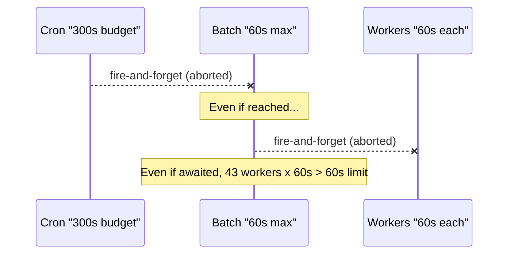
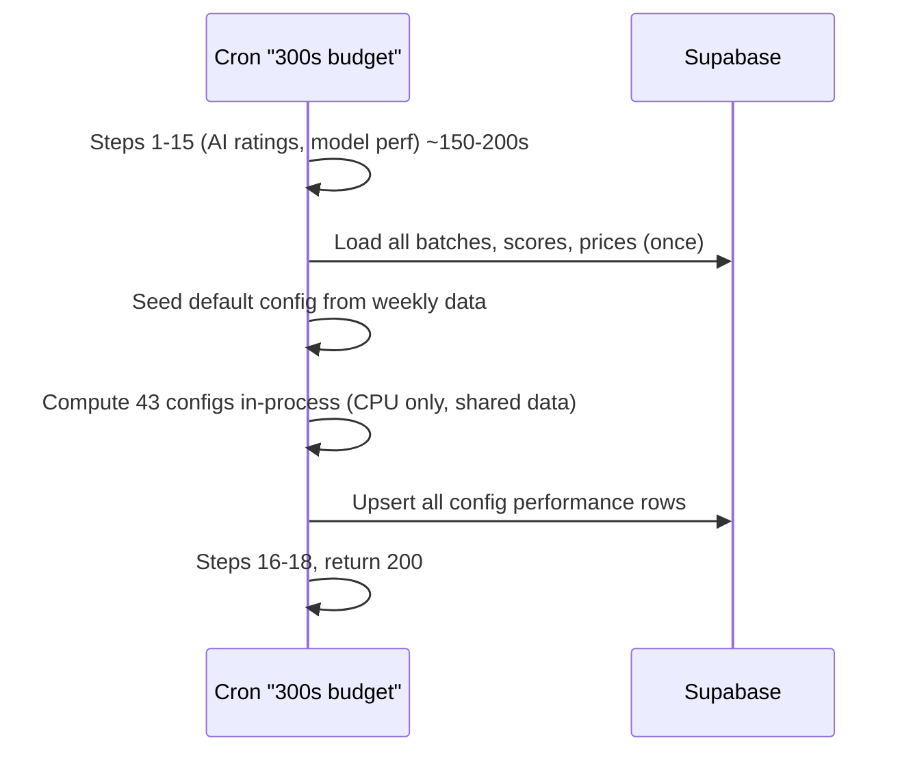

# Fix portfolio config batch compute on Vercel Hobby

## Problem

On Vercel, once a serverless function sends its HTTP response, the runtime freezes it and aborts pending network requests. The cron's Step 15b fires `void fetch(...).catch(() => {})` to the batch endpoint, which in turn fires 43 more fire-and-forget fetches to worker endpoints. Both layers get aborted. Queue data confirms nothing ran since March 23.

The previous plan proposed awaiting these HTTP calls, but that hits a **Hobby plan wall**: non-cron routes cap at 60s `maxDuration`. The batch handler can't await 43 workers (each up to 60s) within that budget.



## Fix: inline all config compute in the cron (no HTTP fan-out)

Eliminate the intermediate HTTP hops entirely. The cron has 300s and already holds a Supabase admin client. Import the batch + compute logic directly, load shared data once, and compute all 44 configs in-process.



### Why this is better than HTTP fan-out

- **No fire-and-forget**: everything runs synchronously in the cron's 300s budget
- **No Hobby 60s wall**: the batch/worker route limits don't apply
- **43x less DB I/O**: each HTTP worker independently loads ALL batches, ALL scores, ALL prices. Inlined, we load them **once** and reuse across all 43 configs
- **Full error visibility**: failures are caught in the cron and reported in the digest email

### File changes

#### 1. New shared function: [src/lib/compute-all-portfolio-configs.ts](src/lib/compute-all-portfolio-configs.ts)

Extract a callable async function (not a route handler) that:

- Accepts a Supabase admin client and strategy ID
- Loads all portfolio configs from `portfolio_configs`
- Finds the default config (risk 3, weekly, equal, top 20) and seeds it from `strategy_performance_weekly` (same logic as the current batch route's `seedDefaultFromWeekly`)
- Loads shared data **once**: all `ai_run_batches`, all `ai_analysis_runs` scores, all `nasdaq_100_daily_raw` prices
- Calls `computeEquityUpsertRows` from [src/lib/portfolio-config-compute-core.ts](src/lib/portfolio-config-compute-core.ts) for each of the 43 non-default configs using the shared data
- Calls `backfillBenchmarkEquities` for each config
- Upserts all results into `strategy_portfolio_config_performance`
- Updates `portfolio_config_compute_queue` status for each config

The function reuses all existing helpers from `portfolio-config-compute-core.ts`: `filterRebalanceBatches`, `buildScoresByBatch`, `buildPricesAndCapsByDate`, `computeEquityUpsertRows`, `backfillBenchmarkEquities`.

#### 2. [src/app/api/cron/daily/route.ts](src/app/api/cron/daily/route.ts) ~line 2212

Replace Step 15b's fire-and-forget with a direct call:

```typescript
// ----- Step 15b: Precompute all portfolio configs (inline) -----
try {
  const { computeAllPortfolioConfigs } =
    await import("@/lib/compute-all-portfolio-configs");
  const configResult = await computeAllPortfolioConfigs(supabase, strategy.id);
  digestMeta.portfolioConfigBatchTriggered = true;
  digestMeta.portfolioConfigsComputed = configResult.computed;
  digestMeta.portfolioConfigsFailed = configResult.failed;
} catch (batchError) {
  digestMeta.portfolioConfigBatchTriggered = false;
  recordCronError("Portfolio config inline compute failed", batchError);
}
```

#### 3. Keep existing HTTP routes for manual/on-demand use

- [src/app/api/internal/compute-portfolio-configs-batch/route.ts](src/app/api/internal/compute-portfolio-configs-batch/route.ts) -- keep as-is for `npm run backfill-configs` script and manual triggers
- [src/app/api/internal/compute-portfolio-config/route.ts](src/app/api/internal/compute-portfolio-config/route.ts) -- keep as-is for on-demand single-config compute
- [src/app/api/platform/portfolio-config-performance/route.ts](src/app/api/platform/portfolio-config-performance/route.ts) -- keep its `triggerPortfolioConfigCompute` call for cache-miss on-demand compute (still fire-and-forget, which is fine for user-facing since the UI polls for completion)
- [src/lib/trigger-config-compute.ts](src/lib/trigger-config-compute.ts) -- keep as-is for the above callers

### Timing budget

- Steps 1-15 (AI ratings, model perf): ~150-200s
- Load shared data (batches + scores + prices): ~3-5s (3 DB queries)
- Seed default config: ~2-3s
- Compute 43 configs: pure CPU using already-loaded data, ~5-15s total
- Upsert results: ~5-10s (chunked writes)
- Steps 16-18: ~10s
- **Total: ~180-245s** -- comfortably within 300s, and actually **faster** than the old fan-out approach because DB reads aren't duplicated 43 times
