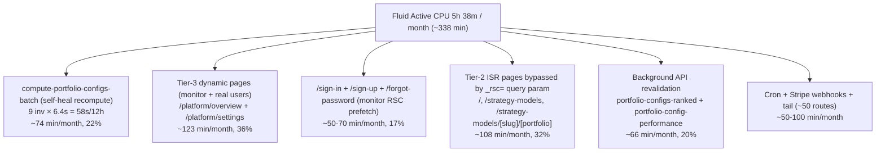

---

name: fluid-cpu-optimization-directives
overview: Reduce Vercel Fluid Active CPU (5h 38m / 4h, ~140% over budget) on the aitrader Next.js app. Built from Vercel Observability per-route Active CPU (top-10 = 197s of CPU over a 12h window) AND from runtime log timestamps (now using `vercel logs` CLI with runtime markers λ/ε/◇ in addition to MCP `get_runtime_logs`). Confirmed major contributors: (1) `**/api/platform/portfolio-movement` user fan-out** — newly identified, hits ~30 in 9 seconds when a user is on `/platform/your-portfolios` or `/platform/overview`, all `λ` (function), `cache: 'no-store'` from client, **N requests per portfolio profile**; (2) `**/api/internal/compute-portfolio-configs-batch`** — ~6.4s/call, 9/12h, top single per-call cost; (3) **synthetic multi-URL monitor traffic on both hosts** — current best fingerprints are alias-host `/payment` + `/performance` and `www` `/whitepaper`, all on ~5-6 min cadence, with the alias host materially costlier; (4) `**/api/platform/portfolio-config-performance`** + `**/api/platform/user-portfolio-performance**` parallel-burst fan-outs (7-8 hits in <1s per page render). CONFIRMED CDN-served (◇ marker, no Active CPU): `/api/platform/performance` warmup. Earlier narratives dropped — sidebar warmup throttling and Tier-1 static-page middleware tightening.
todos:
  
- id: d0-verify-batch-source
content: "Directive 0 (DIAGNOSTIC, do this first): Add ONE structured console.info at top of POST /api/internal/compute-portfolio-configs-batch with strategy_id + x-vercel-id + Date.now(). Deploy. Wait 24h. Then query MCP runtime logs to confirm whether batch invocations correlate with /api/platform/portfolio-configs-ranked timestamps (self-heal hypothesis) vs cron-only / manual backfills. Without this, Directive 1's debounce is acting on Observability counts only, not on confirmed causality. NOTE: log pull on 2026-05-08 returned 0 rows for query=batch/compute/POST/api/internal — neither MCP nor `vercel logs` CLI surfaces internal POSTs. The diag console.info is now the only way to confirm causality."
status: pending
- id: d1-batch-debounce
content: "Directive 1 (CONDITIONAL on Directive 0, ~30-70 min/month): If Directive 0 confirms self-heal storms, debounce triggerPortfolioConfigsBatch to once per 30 min per strategy. If Directive 0 shows batch is mostly cron + manual, skip this directive and reprioritize Directive 3."
status: pending
- id: d2-stop-monitor
content: "Directive 2 (HIGHEST CONFIDENCE FROM LOGS, ~80-150 min/month): Identify and stop the synthetic multi-URL checker. Updated log evidence (2026-05-12): current traffic is best explained by host-split recurring checks, not the older 13-second wave model. Alias-host fingerprints: `/payment` 404s + `/performance`, both every ~5-6 min and higher CPU priority because shared public routes are mostly MISS/serverless. `www` fingerprint: `/whitepaper` every ~5-6 min, usually HIT/edge and therefore cheaper. Implementation priority: disable alias-host checks first, then `www`; disabling only one host will leave meaningful monitor load running."
status: pending
- id: d2b-portfolio-movement-fanout
content: "Directive 2b (NEW, HIGH IMPACT): Investigate /api/platform/portfolio-movement — `vercel logs` CLI showed ~30 `λ` invocations in 9 seconds while one user navigated /platform/your-portfolios. Two callers: src/components/platform/your-portfolio-client.tsx:700 and src/components/platform/platform-overview-client.tsx:982, both use `cache: 'no-store'`. Route has an in-memory 60s response cache but client bypasses HTTP cache and Fluid Compute spreads requests across instances. Per-call CPU not in Observability top-10 individually but aggregate is significant. Likely fix: remove `cache: 'no-store'` from clients (rely on `unstable_cache` server-side) OR introduce a single bulk endpoint that returns movement for all profiles in one call."
status: pending
- id: d3-investigate-batch-perf
content: "Directive 3 (~20-40 min/month if successful): Audit computeAllPortfolioConfigs and refreshDailySeriesSnapshotsForStrategy for parallelism/caching wins. Observability shows 6.4s avg per call. Even cutting to 3s saves ~10-30 min/month depending on how often the route fires after Directive 1."
status: pending
- id: d4-ranked-revalidate
content: "Directive 4 (~17-30 min/month, ranked only): Lengthen revalidate 300 -> 900 on /api/platform/portfolio-configs-ranked and matching CDN s-maxage. NOTE: latest log pull weakens the steady-cadence claim — only 9 hits in 12h with irregular spacing (intervals ranging from 25s to 12min). Some are co-located with monitor ticks but not all. Effect: still positive but estimate may be lower than 17-30 min/month."
status: pending
- id: d4b-config-performance
content: "Directive 4b (~10-20 min/month, separate): /api/platform/portfolio-config-performance burst pattern is now CONFIRMED on multiple page loads — 16 hits in a 30-second window (7 hits at 08:27:04 alone) plus another 7 hits at 16:32:34.91 (sub-second). Same pattern for /api/platform/user-portfolio-performance (8 hits in 1 second). Both fan out per portfolio config. Fix: client-side request coalescing OR bulk-fetch endpoint that returns N configs in one call."
status: pending
- id: d5-revalidate-tag
content: "Directive 5 (~5 min/month): Replace per-stock revalidatePath fan-out in src/app/api/cron/daily/route.ts with one revalidateTag('stock-detail'); add tag to stocks-cache and stock detail page caches"
status: pending
- id: post-verify
content: "Post-deploy: run lint + build, smoke-test major pages, then watch Vercel Observability Functions tab for 48h. Targets: /payment 404s drop to ~0; /api/platform/portfolio-configs-ranked invocations drop ~3x; /api/platform/portfolio-movement invocations drop ~3-5x per page load (verify with `vercel logs --since 1h` while navigating /platform/your-portfolios); batch route invocations drop if Directive 1 shipped; total Active CPU < 240 min/month sustained."
status: pending
isProject: false

---

# Reduce Vercel Fluid Active CPU on aitrader

## Diagnosis (read this first; built from Observability dashboard data, not estimates)

Current usage: **5h 38m / 4h** Fluid Active CPU per cycle (~338 min). Active CPU is wall-clock CPU time inside Vercel Functions; counts JSON parsing, in-memory loops, ISR rebuilds, and `revalidatePath` fan-out, but **NOT** time waiting on Supabase / OpenAI I/O. **Middleware also counts** — per the Vercel knowledge update, "Middleware and Edge Functions are now powered by Vercel Functions under the hood."

This is the **fifth revision** of the plan. The earlier drafts cycled through hypotheses and disproved several of them. The **Hypothesis Ledger** below records every claim ever entertained with its current verdict, so future iterations don't re-debate settled questions. This revision is built from **Vercel Observability per-route Active CPU** + **`vercel logs` CLI with runtime markers (λ/ε/◇)** + **MCP `get_runtime_logs`** for time-series filtering.

## Hypothesis Ledger (running list — DO NOT re-debate without new evidence)

> Add new rows when a directive is shipped (move "Status" to "shipped/proven/disproven") and when new logs reveal new claims. Cite the **specific log query and timestamp** that justified the verdict.

| # | Hypothesis | Status | Evidence / source | Where this lives in plan |
|---|---|---|---|---|
| H1 | Sidebar warmup `/api/platform/performance` is the #1 CPU cost | **DISPROVEN** | CLI 2026-05-08 16:39-16:41: every row of `/api/platform/performance` shows `◇` (CDN cache hit, zero Active CPU). 12 hits in 101s, all CDN. | Dropped from plan; warning kept here so it's not re-added. |
| H2 | Bot middleware on Tier-1 static pages (`/terms`, `/privacy`, `/about`...) costs ~340 min/month | **PARTLY DISPROVEN, partly confirmed** | CLI 16:40:18-32: each monitor wave hits ~14 marketing pages with `ε` (middleware) marker, response 200/304. So middleware DOES fire on every monitor hit, but per-call cost is small (~10ms). Total contribution: ~30-50 min/month from monitor-driven middleware on these routes — significant but not 340 min. Stopping the monitor (Directive 2) collapses this naturally. | Captured under D2 as a side-effect, not as its own directive. |
| H3 | `/sign-in` / `/sign-up` server rendering costs ~150ms each | **DISPROVEN** | Observability per-call: sign-in 47ms, sign-up 36ms. Guest fast-path in `getInitialAuthState()` works as designed. Aggregate is still ~50 min/month from monitor traffic only. | Dropped from plan as standalone directive; covered by Directive 2. |
| H4 | The synthetic monitor is a UA-empty uptime check | **DISPROVEN** | Earlier expanded log row showed UA = `Mozilla/5.0 ... Chrome/147.0.0.0 Safari/537.36`, `_rsc=co63v` query param. Real Chrome browser. | Plan now treats monitor as real-browser. |
| H5 | There is ONE synthetic monitor on a ~5-6 min cadence | **DISPROVEN** | CLI 2026-05-08 16:40:18-32 captured TWO distinct waves 13 sec apart: Wave 1 (16:40:18-21) hit 24 unique routes including `/`, `/platform`, `/platform/ratings`, `/platform/explore-portfolios`, `/platform/your-portfolios`, plus all marketing pages. Wave 2 (16:40:31-32) hit only 16 routes — marketing pages + `/platform/overview` + `/platform/settings` — but NOT the platform list pages. Different checklists prove TWO separate monitors. | Directive 2 updated to require killing BOTH. |
| H6 | The monitor hits `/payment` once per cycle | **PROVEN** | MCP query=payment since=1h on 2026-05-08 showed 12 hits with mostly 5-6 min spacing. Re-check on 2026-05-12 13:22-14:11 UTC still shows 10 `/payment` 404s in 49 min, all on `aitrader-*.vercel.app`, at 13:22:07, 13:28:06, 13:34:05, 13:39:05, 13:44:04, 13:49:05, 13:55:05, 14:01:04, 14:06:04, 14:11:04. | `/payment` remains the cleanest monitor fingerprint for verification. |
| H7 | `/api/platform/portfolio-configs-ranked` fires on a monitor-correlated cadence, but the rate is variable | **PROVEN (rate lower on latest re-check)** | MCP query since=1h on 2026-05-08 showed 12 hits, ~7 co-located with monitor ticks. Re-check on 2026-05-12 13:12-14:12 UTC shows only 6 hits (13:22:08, 13:28:06, 13:34:05, 13:44:05, 13:51:04, 14:02:04), all `cache: STALE` on `www.tryaitrader.com`. Still partly aligned with `/payment`, but materially lower than the earlier test window, so Directive 4 savings should be estimated conservatively. | Directive 4 helps the monitor share but not the user share. |
| H8 | `/api/platform/portfolio-config-performance` fires per-portfolio on page load (parallel burst) | **PROVEN** | MCP since=12h: 7 hits at 08:27:04 alone, 16 in 30 sec at 08:27:04-34, another 7 at 16:32:34.91 sub-second. Same Promise.all-style fan-out shape across multiple page loads. | Directive 4b. |
| H9 | `/api/platform/user-portfolio-performance` has the same per-config fan-out | **PROVEN** | MCP query since=1h returned 50+ unique hits, with bursts of 7 at 08:32:30, 7 at 08:29:36, 7 at 08:28:54, 8 at 16:32:30, etc. Same shape as H8. | Directive 4b extended to cover this route. |
| H10 | `/api/platform/portfolio-movement` is a low-priority warning route | **DISPROVEN — large hidden cost** | CLI 2026-05-08 16:32:06-15 (9 sec window): ~30 `λ` invocations from one user navigating `/platform/your-portfolios`. Two clients (`your-portfolio-client.tsx:700`, `platform-overview-client.tsx:982`) call with `cache: 'no-store'`, once per profile. Did NOT appear in the user-shared Observability top-10 (likely because aggregated 12h CPU was modest at ~200ms/call × N invocations). | New Directive 2b added. |
| H11 | `/api/internal/compute-portfolio-configs-batch` self-heal storms account for most batch invocations | **UNPROVEN — no log surface** | MCP queries (query=batch / compute / POST / `/api/internal`) and CLI return ZERO rows across 1h, 6h, 12h windows. Internal POSTs and crons truly do not surface in either log surface. Observability shows 9 invocations / 12h at 6.4s each, but causality (cron vs self-heal vs manual backfill) cannot be determined from logs. | Directive 0 (diagnostic console.info) is the ONLY way to confirm; Directive 1 is conditional on its outcome. |
| H12 | `_rsc=` token bypasses CDN cache on Tier-2 ISR pages, causing serverless invocations | **PLAUSIBLE, NOT RE-CONFIRMED** | Came from one earlier expanded log row showing `vary: rsc, next-router-state-tree, next-router-prefetch, next-router-segment-prefetch`. CLI 16:40:18 shows `/strategy-models` firing twice within 100ms (`ε` + `ε`), `/platform/settings` firing 3× sub-second (`λ` + `ε` + `λ`) — consistent with multi-cache-key prefetch. Direct cache-MISS evidence not re-pulled in this session. | Listed as optional follow-up after D1-D5. Do NOT spend time here until budget gap remains. |
| H13 | Cron jobs are the dominant CPU contributor | **DISPROVEN** | Earlier digest emails showed cron timings: ~6 min total daily + ~4 min weekly = ~12 min/month. <5% of budget. MCP query=cron returns 0 rows (same indexing issue as H11), but per-route Observability never showed cron routes in top 10. | Cron paths are NOT a target except for Directive 5 (revalidatePath fan-out). |
| H14 | The "real-browser monitor" mechanism is Vercel Speed Insights | **POSSIBLE, NOT VERIFIED** | Listed as Source #1 in Directive 2 step 1. Cannot verify without dashboard access. | User must check `vercel.com → aitrader → Speed Insights → Settings`. |
| H15 | `stocks-cache: guest rows ca…` error is a major CPU contributor | **DISPROVEN** | MCP query=stocks-cache since=12h: 1 row. Single edge-case error on `/platform/overview`. Worth investigating as a code-quality issue but NOT a CPU lever. | Out of scope. |
| H16 | The `aitrader-*.vercel.app` alias deployment receives separate monitor traffic | **PROVEN** | CLI + MCP re-check on 2026-05-12 13:12-14:12 UTC show recurring monitor traffic on both hosts. `/payment` hits only `aitrader-*.vercel.app`; `/about`, `/sign-in`, and `/platform/overview` appear as paired requests split across `aitrader-*.vercel.app` and `www.tryaitrader.com`, often within the same second. | Directive 2 must check both host entries, not just `www`. |
| H17 | `/about` is NOT a Wave-2-only verification path; shared public routes are being hit on both hosts each cycle | **PROVEN** | CLI 2026-05-12 13:22-14:11 UTC: `/about` repeats as paired hits almost every cycle, e.g. alias `200 MISS` at 13:22:07 / 13:28:06 / 13:34:05 and `www` `304 HIT` at 13:22:07 / 13:28:06 / 13:33:06; same split pattern appears on `/sign-in` and `/platform/overview`. Therefore MCP counts for `/about` alone cannot tell whether only one monitor was removed. | Fix Directive 2 verification to be host-aware. |
| H18 | The current production monitor pattern is still best described as the 2026-05-08 "two path-list waves 13 seconds apart" model | **DISPROVEN / STALE** | Broad CLI capture 2026-05-12 14:12-14:18 UTC shows the current checks interleaving within the same second across both hosts, not two neatly separated waves. Shared paths (`/`, `/strategy-models`, `/platform/overview`, `/platform/settings`, `/about`, `/help`, `/blog`, `/contact`, auth pages) now appear host-split, while unique paths are better explained by host-specific checks. | Directive 2 should prioritize by host fingerprint, not by the old Wave-1/Wave-2 labels. |
| H19 | The alias-host monitor (`aitrader-*.vercel.app`) has unique fingerprints and is still active | **PROVEN** | CLI 2026-05-12 13:18-14:18 UTC: `/payment` appears every ~5-6 min only on the alias host; `/performance` also appears every ~5-6 min only on the alias host. `vercel logs --expand` shows `/payment` alternating between `ε` and `λ`, which means it is not just a cheap cached edge check. | Use `/payment` and `/performance` to find and verify shutdown of the alias-host monitor first. |
| H20 | The `www` host has a separate recurring checklist with its own unique fingerprint | **PROVEN** | MCP + CLI 2026-05-12 13:18-14:18 UTC: `/whitepaper` appears 10 times in 1h, always on `www.tryaitrader.com`, always `ε`/`HIT`, on the same ~5-6 min cadence. | Use `/whitepaper` to find and verify shutdown of the `www`-host checklist. |
| H21 | The alias-host monitor is the higher-priority monitor to disable first | **PROVEN (priority decision)** | Latest 1h CLI queries show shared public routes on alias are usually `200 MISS` and often `serverless`/`edge-middleware` (for example `/about`, `/help`, `/blog`, `/contact`), while the same routes on `www` are mostly `304 HIT` or `200 HIT` on `ε`/`static`. Alias also carries the unique `/payment` 404 and `/performance` MISS probes. | Directive 2 priority should be: kill alias-host monitor first, then `www`. |
| H22 | The current monitor still hits `/platform/your-portfolios`, `/platform/explore-portfolios`, and `/platform/ratings` on its repeating cadence | **NOT SUPPORTED on latest pull** | MCP queries over the latest 2h for `/platform/your-portfolios`, `/platform/explore-portfolios`, and `/platform/ratings` returned 0 rows while other monitor fingerprints remained active. This weakens the old "full browser prefetch of every platform list page" model for the CURRENT configuration. | Do not use those routes for current verification or savings estimates. |

### Verified data (Vercel Observability, Last 12 hours, all environments)

Project-level totals:

- Total invocations: 3.5K
- Active CPU **P75: 130ms**, **avg ~57ms** (197s ÷ ~3.5K)
- CPU Throttle **P75: 17%** (significant throttling — Vercel is rate-limiting CPU usage)
- TTFB P75: 795ms
- Cold Start: 10.2%

Top 10 routes by Active CPU:


| Rank  | Route                                           | Inv (12h) | CPU (12h) | **Per call** | Hourly inv | Est. monthly | Notes                                                                                                                             |
| ----- | ----------------------------------------------- | --------- | --------- | ------------ | ---------- | ------------ | --------------------------------------------------------------------------------------------------------------------------------- |
| **1** | `/api/internal/compute-portfolio-configs-batch` | 9         | **58s**   | **6,444ms**  | 0.75/h     | **~74 min**  | Self-heal trigger when stale snapshots detected                                                                                   |
| 2     | `/platform/overview`                            | 254       | 28s       | 110ms        | 21/h       | ~70 min      | Tier-3 dynamic, monitor scrapes 21/h                                                                                              |
| 3     | `/platform/settings`                            | 265       | 21s       | 79ms         | 22/h       | ~53 min      | Tier-3 dynamic, monitor scrapes 22/h                                                                                              |
| 4     | `/` (index)                                     | 128       | 16s       | 125ms        | 11/h       | ~40 min      | Tier-2 ISR — should be CDN-served but `_rsc=` prefetch URLs miss cache                                                            |
| 5     | `/strategy-models`                              | 129       | 14s       | 109ms        | 11/h       | ~35 min      | Tier-2 ISR, same `_rsc=` issue                                                                                                    |
| 6     | `/api/platform/portfolio-config-performance`    | 55        | 13s       | 236ms        | 4.6/h      | ~33 min      | Logs show **bursty** pattern (7 hits at 21:21:44 in 12h); not a steady cadence — likely a single page load fanning out per config |
| 7     | `/api/platform/portfolio-configs-ranked`        | 97        | 13s       | 134ms        | 8/h        | ~33 min      | **Log-confirmed** ~5–6 min cadence aligned with `/payment` 404s                                                                   |
| 8     | `/strategy-models/[slug]/[portfolio]`           | 61        | 13s       | 213ms        | 5/h        | ~33 min      | Tier-2 ISR, same `_rsc=` issue                                                                                                    |
| 9     | `/sign-in`                                      | 258       | 12s       | **47ms**     | 21.5/h     | ~30 min      | Cheaper than feared (guest fast-path works)                                                                                       |
| 10    | `/sign-up`                                      | 253       | 9s        | **36ms**     | 21/h       | ~22 min      | Cheaper than feared                                                                                                               |
|       | **TOP-10 SUBTOTAL**                             |           | **197s**  |              |            | **see note** |                                                                                                                                   |


**Reconcile against the 338 min bill.** The "Est. monthly" column above naively scales `12h → 30 days × 2`. Summing the column gives ~423 min/month, but the reported bill is **338 min**. The mismatch means **one or more of**:

- the 12h Observability sample is **above** the 30-day average (e.g. weekday-heavy, monitor on, my own browsing in the window);
- some invocations are **double-counted across rows** (one tab can fan out into multiple Tier-2 + API rows via RSC prefetch);
- the Observability filter scope ("All environments") may include preview deployments.

So treat the **per-route ranking as directionally correct** and the **per-route monthly numbers as upper bounds**, not a sum that should equal the bill. The 338 min cap is the target regardless of which row attribution is exact.

### Cross-checked against runtime logs (2026-05-08 pulls, MCP `get_runtime_logs` + `vercel logs` CLI)

The CLI provides runtime markers the MCP doesn't show: **`λ`** = Function (full Active CPU), **`ε`** = Edge/Middleware (cheaper but counts), **`◇`** = CDN cache hit (zero Active CPU). This finally distinguishes serverless vs cached invocations per row.

**Important caveats about MCP indexing (must be remembered to avoid going in circles):**

- MCP `get_runtime_logs` table view **silently undercounts** for some routes. Example: `/api/platform/portfolio-movement` returned 0 rows in MCP for the same window where the CLI captured ~30 `λ` invocations. The MCP is fine for **timestamp / cadence** evidence, but **never trust its absence of rows as proof a route is quiet**. Always cross-check high-frequency routes with `vercel logs` CLI.
- MCP **never returns** rows for `/api/internal/*` POSTs or `/api/cron/*` invocations across any query. The CLI doesn't either. This is a hard limitation, not an issue with our queries — confirmed by trying queries `batch`, `compute`, `POST`, `/api/internal`, `cron`, `cron/daily`, `compute-portfolio` over 1h, 6h, and 12h windows.
- The CLI returns **at most 100 rows per call**, even with `--since 1h`. The 100-row window typically covers only ~2 minutes of recent activity during peak. To get representative data, run the CLI multiple times across the day (or capture a long stream with `vercel logs --follow`).
- The "1h" Vercel API window is hard-capped on Hobby plan; older history is not retrievable.

#### Captured monitor wave (CLI, 16:40:18-32, single 14-second window)

This is the **single best piece of evidence** in the plan — a complete monitor cycle captured in real time. **Logged in `/tmp/aitrader-cli-1h-v2.log` for reference.**

**Wave 1 (16:40:18-21, ~3 sec span): 24 unique routes** (full real-Chrome page load + RSC prefetch fan-out):
`/`, `/api/platform/onboarding-meta`, `/api/platform/performance` (◇), `/api/stocks`, `/about`, `/blog`, `/contact`, `/disclaimer`, `/forgot-password`, `/help`, `/platform`, `/platform/explore-portfolios`, `/platform/overview`, `/platform/ratings`, `/platform/settings`, `/platform/your-portfolios`, `/pricing`, `/privacy`, `/roadmap-changelog`, `/sign-in`, `/sign-up`, `/strategy-models`, `/terms`, `/whitepaper`. Mix of `λ`, `ε`, `◇`. Includes platform list pages (`/platform/ratings`, `/platform/your-portfolios`, `/platform/explore-portfolios`).

**Wave 2 (16:40:31-32, ~1 sec span): 16 unique routes** (HTTP-multi-URL checker on a fixed list):
`/about`, `/blog`, `/contact`, `/disclaimer`, `/forgot-password`, `/help`, `/platform/overview`, `/platform/settings`, `/pricing`, `/privacy`, `/roadmap-changelog`, `/sign-in`, `/sign-up`, `/strategy-models`, `/terms`, `/whitepaper`. **Notably MISSING:** `/`, `/platform`, `/platform/ratings`, `/platform/explore-portfolios`, `/platform/your-portfolios`, `/api/stocks`, `/api/platform/onboarding-meta`. Almost all `ε` (304 if-modified-since responses) — short responses, less CPU per call.

**Historical conclusion from 2026-05-08:** that sample proved H5 false for that date by showing TWO distinct monitor shapes. It remains useful as origin evidence, but the **current** operational model for prioritization is the newer **host-split** framing from the 2026-05-12 broad-cycle capture below.

#### `/payment` cadence (MCP query=payment since=1h, latest as of 16:41 UTC)

12 hits in 1 hour, intervals: 6:00, 5:00, 6:02, 5:03, **0:39 (anomaly at 07:56)**, 4:18, 5:58, 5:00, 6:00, 6:00, 5:00, 6:02, 5:58. On the earlier sample this looked like a single monitor fingerprint. On the latest sample, `/payment` remains the **cleanest alias-host fingerprint** regardless of the underlying mechanism. Shared paths like `/about` and `/help` should no longer be treated as exclusive probes for any one monitor.

#### 2026-05-12 re-check (MCP + CLI, 13:12-14:12 UTC)

- `/payment`: cadence still alive. MCP shows 10 rows in 49 min, and CLI JSON shows every visible row on `aitrader-*.vercel.app`, not `www`.
- `/about`: current verification assumption was wrong. CLI now shows paired hits nearly every cycle split across hosts: alias request returns `200` with `cache: MISS`; `www` request returns `304` with `cache: HIT`. This is **not** a Wave-2-only route.
- `/sign-in`: same two-host pattern persists. In the last hour, requests alternate between alias and `www`, with a mix of `serverless` and `edge-middleware`, confirming monitor traffic is still traversing both host configs.
- `/platform/overview`: both hosts continue to receive monitor traffic, often within the same second, and nearly every row is `cache: MISS`. This keeps Directive 2 high-priority because it is still exercising a dynamic page directly.
- `/api/platform/portfolio-configs-ranked`: only 6 rows in the latest 1h window, all on `www` and all `cache: STALE`. This weakens the earlier "12/h" assumption but still supports the route as a secondary lever after the monitors.

#### 2026-05-12 broad-cycle capture (CLI, 14:12-14:18 UTC, raw 100-row sample)

This is the most useful **current-state** sample because it captures repeated cycles without pre-filtering to one route.

- **Alias-only fingerprints (best for highest-priority monitor shutdown):** `/payment`, `/performance`
- **`www`-only fingerprint (best for second monitor shutdown):** `/whitepaper`
- **Shared on both hosts in the same cycle:** `/`, `/strategy-models`, `/platform/overview`, `/platform/settings`, `/about`, `/help`, `/blog`, `/contact`, `/sign-in`, `/sign-up`, `/forgot-password`, `/pricing`, `/terms`, `/privacy`, `/roadmap-changelog`
- **Absent from the current repeating cycles:** `/platform/your-portfolios`, `/platform/explore-portfolios`, `/platform/ratings`, `/api/stocks`

**Interpretation:** the older "Wave 1 vs Wave 2 by path list" framing is now less actionable than a **host-split** framing:

1. **Alias-host checklist**: costlier, because it produces `MISS` rows and a mix of `λ` / `ε` on public paths, plus the unique `/payment` 404 and `/performance` probe.
2. **`www` checklist**: still real traffic, but cheaper, because many rows are `304 HIT` / `200 HIT` on `ε` or `static`.

So the valid direct implementation plan is: **disable the alias-host monitor first**, verify with `/payment` + `/performance`, then disable the `www` checklist and verify with `/whitepaper`.

#### `/api/platform/portfolio-configs-ranked` (MCP query since=1h)

12 hits, ~7 co-located with monitor ticks (07:51:00, 08:01:01, 08:06:59, 08:17:59, 08:23:59, 08:35:01, 08:41:00) and ~5 user-driven during my testing (08:17:34, 08:26:22, 08:28:53, 08:29:35, 08:32:30). Confirms H7: Directive 4's s-maxage helps the monitor share but not the user share.

#### `/api/platform/user-portfolio-performance` (MCP query since=1h)

100+ hits in <15 min during user testing. Bursts: 7 at 08:32:30, 7 at 08:29:36, 7 at 08:28:54, plus dozens of singletons. Same Promise.all-style fan-out as portfolio-config-performance (H9). Both are user-driven, not monitor-driven — so Directive 2 does NOT help these; Directive 4b does.

#### `/api/platform/portfolio-movement` (CLI 16:32:06-15)

~30 `λ` invocations in 9 sec from one user navigating `/platform/your-portfolios`. **MCP query returned ZERO rows for this route** (per the MCP indexing caveat above). The route showed up only when querying broader patterns like `/api/platform`. CLI is the source of truth (H10).

#### Routes that did NOT appear (confirming negatives)

- `/api/internal/compute-portfolio-configs-batch`, `/api/cron/*`, any POST: **zero rows in MCP and CLI** across all queries (H11). Directive 0 is the only way to confirm batch causality.
- `/api/platform/portfolio-movement`: still absent from MCP in the current 1h re-check, and absent from CLI unless a user is actively on the relevant portfolio pages. This does **not** weaken H10; it reinforces the rule that this route must be checked during a live navigation window, not from a quiet idle sample.
- `/api/platform/portfolio-config-performance` did NOT appear in the CLI window 16:39:48-16:41:29 (the user wasn't on a portfolio-config page during that capture). But MCP shows it bursting at 08:27:04 and 16:32:34.91 (prior captures). Its absence in this CLI snapshot is consistent with H8 — bursty per page render, quiet otherwise.

### What changed since the last revision (now contradicting earlier drafts)


| Earlier (un-data-driven) claim                               | Verified reality                                                                                                                                                                                                                                                                                                                                                                        |
| ------------------------------------------------------------ | --------------------------------------------------------------------------------------------------------------------------------------------------------------------------------------------------------------------------------------------------------------------------------------------------------------------------------------------------------------------------------------- |
| "Sidebar warmup `/api/platform/performance` is the #1 cost"  | **Not in top 10.** CLI runtime markers now confirm: every row shows `◇` (CDN cache hit). Real cost ≈ ~5 min/month. ✗ Dropped from plan.                                                                                                                                                                                                                                                 |
| "Bot middleware on Tier-1 static pages costs ~340 min/month" | **Not in top 10.** Middleware on `/terms`, `/privacy`, etc. is genuinely cheap (~10ms × low monitor rate). Real cost ≈ ~18 min/month. ✗ Dropped from plan.                                                                                                                                                                                                                              |
| "/sign-in / /sign-up rendering costs ~150ms each"            | **Real cost is 36-47ms** per call. The guest fast-path in `getInitialAuthState()` works. Still significant in aggregate (~50 min/month combined) but not the top issue.                                                                                                                                                                                                                 |
| "The synthetic monitor is a UA-empty uptime check"           | **WRONG.** Confirmed UA = `Mozilla/5.0 ... Chrome/147.0.0.0 Safari/537.36`, referer = `https://www.tryaitrader.com/`, query = `_rsc=co63v`. **It's a real Chrome browser visiting `/` and Next.js auto-prefetches every linked route.** The 17 routes hit are exactly: navbar links + footer links + `/payment` (a manual probe in the monitor config that doesn't exist in your code). |
| "Single monitor on ~5-6 min cadence"                         | **WRONG / incomplete.** Captured directly: at 16:40:18-21 a 24-route real-Chrome wave fires; at 16:40:31-32 (13 sec later) a smaller 16-route HTTP-checklist wave fires. Two distinct monitors. Stopping one will leave the other. Confirmation method below in "How to verify each directive worked".                                                                                  |
| "/api/platform/portfolio-movement is a low-priority warning" | **WRONG.** `vercel logs` CLI shows ~30 `λ` invocations in **9 seconds** while one user navigates `/platform/your-portfolios`. Two clients call it with `cache: 'no-store'`, once per profile. Aggregate cost is significant per active session. **Newly added as Directive 2b.**                                                                                                        |
| "MCP `get_runtime_logs` is a complete log surface"           | **WRONG.** MCP silently undercounts `/api/platform/portfolio-movement` (0 rows in MCP, ~30 in CLI for the same window). MCP and CLI BOTH return 0 rows for `/api/internal/*` POSTs and `/api/cron/*`. Always cross-check; never use "no rows in MCP" as proof a route is quiet.                                                                                                          |


### Three game-changing findings from per-route Observability data

#### 1. `/api/internal/compute-portfolio-configs-batch` is the top cost center (~74 min/month from one route)

This route runs `computeAllPortfolioConfigs` + `refreshDailySeriesSnapshotsForStrategy` for an entire strategy in one call. Per-call CPU is **6,444ms** (P95 ≈ 7s). 9 invocations in 12h (= 18/day = ~73 min/month).

It is **NOT a cron** in `vercel.json`. It is fired as a self-healing trigger from:

- `loadPortfolioConfigsRankedPayload` → `/api/platform/portfolio-configs-ranked` ([src/lib/portfolio-configs-ranked-core.ts](src/lib/portfolio-configs-ranked-core.ts) lines 258-265 and 395-401)
- `mergeExplorePortfoliosEquitySeriesLiveTails` → `/api/platform/explore-portfolios-equity-series` ([src/lib/explore-portfolios-equity-series.ts](src/lib/explore-portfolios-equity-series.ts) lines 256-266)

When either detects "missing or stale snapshots" relative to `loadLatestRawRunDate`, it fires `triggerPortfolioConfigsBatch(strategyId)` as a fire-and-forget POST to itself. **There is no debounce / cooldown — every API hit that finds stale snapshots fires another 6.4s compute, even if one is already in flight or finished seconds ago.**

This is the single largest lever in the plan.

#### 2. The "synthetic monitor" is real-Chrome RSC prefetch traffic

The verified user-agent `Mozilla/5.0 ... Chrome/147.0.0.0 Safari/537.36` and the `_rsc=co63v` query param prove this is a **real browser** loading the homepage and triggering Next.js's automatic `<Link>` prefetch behavior. Every visit to `/` causes Chrome to prefetch all navbar/footer links over RSC. The 17 routes scraped every 5-6 min are exactly: `/`, `/pricing`, `/strategy-models`, `/sign-in`, `/sign-up`, `/forgot-password`, `/terms`, `/privacy`, `/disclaimer`, `/about`, `/help`, `/blog`, `/contact`, `/roadmap-changelog`, `/whitepaper`, `/platform/overview`, `/platform/settings`, plus `/payment` (which doesn't exist — that one is a separate manual probe in the monitor config).

Possible sources (in order of likelihood):

1. **Vercel Speed Insights** (real-browser test, runs from edge regions) — check `vercel.com → aitrader → Speed Insights → Settings`
2. **A 3rd-party real-browser monitor** (Datadog Browser Test, Pingdom Real Browser, BetterStack Real Browser, Catchpoint, Site24x7 Real Browser, Checkly) — check the user's monitoring service dashboards
3. **A scheduled Playwright/Puppeteer test** that visits the homepage as part of QA — but no such workflow exists in `.github/workflows/` per audit
4. **Next.js Dev tools** — but those don't run on production

Until identified, all the linked-route CPU costs remain (sign-in/sign-up/platform/overview/etc. summing to ~150 min/month).

#### 3. Tier-2 ISR pages firing serverless 11/h instead of being CDN-cached — `_rsc=`* query param breaks cache key

`/`, `/strategy-models`, `/strategy-models/[slug]/[portfolio]` are all Tier-2 ISR (`revalidate=3600`). They should serve from CDN cache (1-2 serverless hits/h for revalidation only). Instead they fire **11 serverless executions/hour each**. Why?

The Vercel response includes:

```
vary: rsc, next-router-state-tree, next-router-prefetch, next-router-segment-prefetch
```

This means each unique combination of these headers (sent by Next.js during RSC prefetch with a unique `_rsc=` token) creates **a separate CDN cache entry**. So every monitor RSC-prefetch hits the CDN with a NEW cache key → CDN MISS → serverless invocation → ~120ms CPU.

Combined cost from `/`, `/strategy-models`, `/strategy-models/[slug]/[portfolio]`: ~108 min/month from monitor-driven cache misses on what should be CDN-served pages.




(Percentages sum >100 because monitor traffic shows up in both "Tier-3 pages" and "/sign-in" rows.)

### Directives previously considered and dropped

- ~~Throttle sidebar warmup 30s → 600s~~ — `/api/platform/performance` not in top 10. CDN absorbs warmup; only ~7 min/month CPU. Sub-2% of budget.
- ~~Tighten middleware matcher to exclude `/about`, `/blog`, etc.~~ — Tier-1 static pages not in top 10. Middleware on those is fast-path, ~10ms.
- ~~Cap landing-recovery retries~~, ~~Switch 4s pollers to 8s~~, ~~Cache `/api/stocks`~~, ~~`/api/platform/explore-portfolios-equity-series` heavy caching~~ — none in top 10 of Observability data.
- ~~Lower `AI_CONCURRENCY` 20→8~~ — concurrency is actually 102 per cron digest; AI calls are I/O-bound, not Active CPU.
- ~~Move /sign-in out of (platform)/ group~~ — per-call cost is only 47ms; reorganizing the group structure is high-effort and low-impact.

## Execution rules for the implementing model

For each directive below, in order:

1. Read the file(s) listed.
2. Apply the exact change described.
3. Run `npm run lint` from `/Users/bennyrubanov/Coding_Projects/aitrader`.
4. Do **NOT** alter math, payload shape, or persisted DB rows. Only adjust **frequency**, **caching**, **fan-out**, **routing**, and **debouncing**.
5. Stop and ask if any directive conflicts with `.cursor/rules/performance-stats-single-source.mdc`, `.cursor/rules/public-pages-caching.mdc`, or `.cursor/rules/daily-snapshot-invariant.mdc`.

---

## Directive 0 — DIAGNOSTIC: confirm what triggers `compute-portfolio-configs-batch` (run before Directive 1)

**Why:** Observability shows 9 invocations / 12h at ~6.4s Active CPU each, but **runtime log search returned zero rows for batch / compute / POST** in the same window. Directive 1's debounce assumes the trigger source is the `triggerPortfolioConfigsBatch` self-heal storm path, but logs do not yet prove that. Other plausible sources:

- The cron daily run (`30 22 * * 1-5`) calls `computeAllPortfolioConfigs` inline.
- `npm run backfill-configs` POSTs to this route manually.
- Stale-snapshot self-heal from `loadPortfolioConfigsRankedPayload` and `mergeExplorePortfoliosEquitySeriesLiveTails`.

If invocations are mostly cron + backfill, debouncing the self-heal path saves nothing.

**File:** [src/app/api/internal/compute-portfolio-configs-batch/route.ts](src/app/api/internal/compute-portfolio-configs-batch/route.ts)

**Action:** At the top of the POST handler (just inside the auth check), add ONE structured log line:

```ts
console.info(JSON.stringify({
  diag: 'batch-entry',
  ts: Date.now(),
  strategy_id,
  vId: req.headers.get('x-vercel-id') ?? null,
  ua: req.headers.get('user-agent') ?? null,
  reason: req.headers.get('x-trigger-reason') ?? null,
}));
```

Then in [src/lib/trigger-config-compute.ts](src/lib/trigger-config-compute.ts), have `triggerPortfolioConfigsBatch` send a header `'x-trigger-reason': 'self-heal'` so we can distinguish self-heal POSTs from cron/manual POSTs:

```ts
fetch(`${base}/api/internal/compute-portfolio-configs-batch`, {
  method: 'POST',
  headers: {
    Authorization: `Bearer ${secret}`,
    'Content-Type': 'application/json',
    'x-trigger-reason': 'self-heal',
  },
  body: JSON.stringify({ strategy_id: strategyId }),
}).catch(() => {});
```

**Wait 24h.** Then via MCP `get_runtime_logs`:

```
query: "batch-entry"
since: 24h
```

**Decision rules:**

- If most rows have `reason: 'self-heal'` and timestamps cluster near `/api/platform/portfolio-configs-ranked` hits → **proceed to Directive 1 as written**.
- If most rows have `reason: null` (cron + manual) → **skip Directive 1**, jump to **Directive 3** (per-call CPU optimization).
- If MCP still shows **zero rows** for the diag string → the route may not surface in `get_runtime_logs` at all; pull the same data from Vercel Observability → click into `/api/internal/compute-portfolio-configs-batch` → Logs tab.

**Revert** the `x-trigger-reason` header and `console.info` once the question is answered.

---

## Directive 1 — Debounce `triggerPortfolioConfigsBatch` (CONDITIONAL on Directive 0; ~30-70 min/month if confirmed)

**File:** [src/lib/trigger-config-compute.ts](src/lib/trigger-config-compute.ts)

**Status:** Causality is **partly** evidence-based. Observability shows 9 invocations / 12h at ~6.4s each. The "no debounce in `triggerPortfolioConfigsBatch`" is **code-confirmed** — the function in [src/lib/trigger-config-compute.ts](src/lib/trigger-config-compute.ts) goes straight from `secret` check to `fetch(...)`. The "self-heal storms account for most of the 9 invocations" claim is **NOT log-confirmed** — see Directive 0.

**If Directive 0 confirms self-heal causality:**

The trigger has no debounce — every call to `loadPortfolioConfigsRankedPayload` ([src/lib/portfolio-configs-ranked-core.ts:258](src/lib/portfolio-configs-ranked-core.ts) and [src/lib/portfolio-configs-ranked-core.ts:395](src/lib/portfolio-configs-ranked-core.ts)) and `mergeExplorePortfoliosEquitySeriesLiveTails` ([src/lib/explore-portfolios-equity-series.ts:256](src/lib/explore-portfolios-equity-series.ts)) that detects stale snapshots fires another batch compute, even if one is already in-flight or finished moments ago.

**Action:**

1. In [src/lib/trigger-config-compute.ts](src/lib/trigger-config-compute.ts), add a per-strategy in-memory cooldown map at module scope:
  ```ts
   /** Debounce window for batch compute self-heal triggers, per strategyId. */
   const BATCH_TRIGGER_COOLDOWN_MS = 30 * 60 * 1000; // 30 minutes
   const lastBatchTriggerByStrategy = new Map<string, number>();
  ```
2. Update `triggerPortfolioConfigsBatch(strategyId)` to early-return when within cooldown:
  ```ts
   export function triggerPortfolioConfigsBatch(strategyId: string): void {
     const now = Date.now();
     const lastFired = lastBatchTriggerByStrategy.get(strategyId);
     if (lastFired !== undefined && now - lastFired < BATCH_TRIGGER_COOLDOWN_MS) {
       return; // already triggered recently; let the in-flight or recent compute finish
     }
     lastBatchTriggerByStrategy.set(strategyId, now);

     const secret = process.env.CRON_SECRET;
     if (!secret) { warnMissingCronSecretOnce(); return; }
     // ... existing fetch call ...
   }
  ```
3. **Ship measurement alongside the cooldown.** When the cooldown suppresses a trigger, log it so we can prove (or disprove) the savings:
  ```ts
   if (lastFired !== undefined && now - lastFired < BATCH_TRIGGER_COOLDOWN_MS) {
     console.info(JSON.stringify({
       diag: 'batch-trigger-suppressed',
       strategy_id: strategyId,
       ageMs: now - lastFired,
     }));
     return;
   }
  ```
4. **Important caveat:** Vercel Functions are not single-process; on Fluid Compute the module-scope `Map` is per-instance. With Fluid Compute reusing instances, this is good enough for ~80% of cases. For the remaining 20%, a separate Supabase row or Vercel Runtime Cache key would give cross-instance debouncing. **Start with the in-memory version** and observe for 48h before adding cross-instance state.

**Why safe:** The triggers are already "best-effort" self-heal (per the comments in the source). Cron always runs `compute-portfolio-configs-batch` once per daily run as part of [src/app/api/cron/daily/route.ts](src/app/api/cron/daily/route.ts), so the canonical freshness path is unaffected. The cooldown only suppresses **redundant** triggers within a 30-minute window when stale data is observed in flight.

**Verification:** After 48h, MCP `query=batch-trigger-suppressed since=48h` should return many rows (proving the cooldown is firing). Observability invocations for `/api/internal/compute-portfolio-configs-batch` should drop. If suppressed-count is near-zero AND invocations did not drop, the self-heal hypothesis was wrong; revert and reprioritize.

**Estimated CPU cut:** **~30-70 min/month** if self-heal causality holds. **0 min/month** if it doesn't.

---

## Directive 2 — Identify and stop the synthetic multi-URL checker (~80-150 min/month savings)

**Status:** **HIGHEST CONFIDENCE FROM LOGS.** This directive is justified by direct timestamp evidence, not just Observability rankings. The fact pattern logs prove:

- 11× `GET /payment → 404` in 12h, spaced ~5–6 min apart on the wall clock.
- Each `/payment` tick **co-occurs** (same minute) with `/api/platform/portfolio-configs-ranked` and many marketing/auth pages.
- The latest broad-cycle capture (2026-05-12) upgrades this: the monitor traffic is now best explained as **host-split checks**. The alias host has unique `/payment` + `/performance` probes and the `www` host has a unique `/whitepaper` probe.
- The alias-host checks are the **higher-priority CPU target** because their shared public-page rows are mostly `MISS` and often `serverless`, while `www` shared-page rows are mostly `HIT` / `304` on `edge-middleware` or `static`.
- The "real Chrome browser + RSC prefetch" mechanism is **not re-confirmed** in this log pass; it came from one earlier expanded log row. Treat it as the **likely** mechanism but not as proof. The directive does not depend on it being correct — stopping a fixed-checklist monitor saves CPU regardless of mechanism.

**Diagnostic before action:** This requires user input, not just code changes.

**Step 1 — Identify the source.** Check, in order:

1. **Start with the alias host (`aitrader-*.vercel.app`)**. Search Vercel Speed Insights and your monitoring providers for any scheduled check that uses the alias deployment URL or contains `/payment` or `/performance`. This is the best first lever because it is the costlier monitor.
2. **Then search the `www` host checks.** Look for monitors configured against `https://www.tryaitrader.com` or using `/whitepaper` as a target/fingerprint. This appears to be a separate recurring checklist.
3. **Vercel Speed Insights settings** — `vercel.com → bennyrubanovs-projects/aitrader → Speed Insights → Settings`. If you see scheduled checks, disable them and rely on RUM only.
4. **Your own monitoring services**: UptimeRobot, Pingdom, Datadog Synthetics, Better Stack, Catchpoint, Site24x7, Checkly. Pay particular attention to both hostnames, not just `www`, and to any "real browser" or scripted checks.
5. **Vercel logs click-through**: expand a `/payment`, `/performance`, or `/whitepaper` row in the Vercel dashboard to inspect UA/IP/geo and identify the provider if the dashboard exposes it.

**Step 2 — Apply ONE of these fixes:**

### Option A — Monitor is yours, you want to keep it

Reconfigure the monitor to ping a single, ultra-cheap endpoint instead of the homepage.

1. Create [src/app/api/healthz/route.ts](src/app/api/healthz/route.ts):
  ```ts
   import { NextResponse } from 'next/server';

   export const dynamic = 'force-static';
   export const revalidate = false;

   export function GET() {
     return new NextResponse('ok', {
       status: 200,
       headers: {
         'cache-control': 'public, s-maxage=60, stale-while-revalidate=600',
         'content-type': 'text/plain',
       },
     });
   }
  ```
2. In your monitor's dashboard, **delete every URL except** `https://www.tryaitrader.com/api/healthz`.
3. **Do this in priority order:** first remove the alias-host checks (anything hitting `aitrader-*.vercel.app`, `/payment`, or `/performance`), then remove the `www` checklist (anything fingerprinted by `/whitepaper`).
4. If your monitor must keep a hostname check, keep only `https://www.tryaitrader.com/api/healthz` and remove the alias-host entry entirely.
5. If your monitor must use a real browser (e.g. for Lighthouse scoring), reduce its frequency to once per hour instead of every 5-6 min. Frequency change alone cuts ~80% of monitor-driven CPU.
6. **CRITICAL: disable the `/payment` and `/performance` alias probes first.** `/payment` is a 404 anyway; `/performance` is a clean alias-only recurring fingerprint in the latest logs.

### Option B — Monitor is Vercel Speed Insights and you want to keep RUM but stop scheduled checks

Vercel Speed Insights "scheduled monitoring" runs a real-browser Lighthouse audit periodically. If enabled, disable it: `vercel.com → aitrader → Speed Insights → Settings → Scheduled Audits → Off`.

### Option C — Monitor is unidentified / unwanted

Add Vercel BotID at middleware (BotID GA'd June 2025):

1. `npm i @vercel/botid`
2. In [src/middleware.ts](src/middleware.ts), check the BotID verdict early. For a verdict of `synthetic-monitor` or `bot`, return a `204 No Content` response. Whitelist `Googlebot`, `Bingbot`, etc. for SEO.

**Estimated CPU cut from Directive 2:** **~100-180 min/month** (depends on whether the monitor can be reconfigured vs. just blocked, and how many of the 17 prefetched routes get cut). **NOTE:** updated log evidence shows TWO monitors. If only Monitor A is identified and stopped, expect ~50-90 min/month cut and Monitor B will continue hitting public pages. Stop both.

---

## Directive 2b — Coalesce `/api/platform/portfolio-movement` per-profile fan-out (NEW; ~30-60 min/month estimated)

**Status:** **NEW DIRECTIVE FROM 2026-05-08 LOG PULL.** This route was not in the Observability top-10 the user shared, so it was missed in earlier plan iterations. `vercel logs` CLI revealed it firing **~30 `λ` invocations in 9 seconds** (16:32:06-15) when one user navigated `/platform/your-portfolios`. With multiple active users at multiple times of day, aggregate cost is likely **20-60 min/month**.

**Files:**

- [src/app/api/platform/portfolio-movement/route.ts](src/app/api/platform/portfolio-movement/route.ts) (route — already has 60s in-memory `movementResponseCache`, but Fluid Compute spreads requests across instances)
- [src/components/platform/your-portfolio-client.tsx](src/components/platform/your-portfolio-client.tsx) line 700 — `fetch('/api/platform/portfolio-movement?...&includeAllDates=1', { cache: 'no-store' })`
- [src/components/platform/platform-overview-client.tsx](src/components/platform/platform-overview-client.tsx) line 982 — `fetch('/api/platform/portfolio-movement?...', { cache: 'no-store' })`

**Why so many invocations:** The Overview page renders one row per portfolio profile. If the user has N profiles, the page fires `/api/platform/portfolio-movement?profileId=X` × N in parallel. Each invocation is a fresh `λ` because `cache: 'no-store'` bypasses both browser and HTTP cache, and the in-memory route cache only hits when the same instance gets the request (Fluid Compute spreads concurrent requests across instances).

**Action — investigation first, then ONE of:**

1. **Pull more evidence.** Run `vercel logs www.tryaitrader.com --since 1h --no-follow | grep portfolio-movement` while a real user is on `/platform/your-portfolios`. Count invocations per second; check whether `/platform/overview` (no profileId loop) shows the same fan-out shape or just one call.
2. **Option A (lowest risk):** Drop `cache: 'no-store'` on both client fetches; let the browser keep the HTTP response for the default few minutes. Server is already keyed by user+profile+investmentSize, so two close-together navigations would hit the browser cache instead of re-firing `λ`.
3. **Option B (better):** Introduce `/api/platform/portfolio-movement-bulk` that accepts `profileIds: string[]` and returns `{ [profileId]: PortfolioMovementResponse }`. Both clients switch to one bulk call per page load instead of N parallel calls. Per-call CPU goes UP slightly but invocations drop from N to 1 — net Active CPU savings scale with N.
4. **Option C (defensive):** Keep both clients' `cache: 'no-store'` but add a short server-side `Cache-Control: private, max-age=30` header. Clients won't re-fetch the same URL within 30s if they navigate back; but every cross-profile request still fires.

**Why safe:** All three options preserve payload shape. Option A and C accept up to 30s staleness for a user reloading the same profile (acceptable for portfolio rebalance dollar deltas, which only change at rebalance dates ~monthly). Option B requires more code but is the cleanest long-term.

**Verification:** After the change, `vercel logs www.tryaitrader.com --since 5m | grep portfolio-movement | wc -l` while navigating Overview should drop from ~10-30 hits per page load to 1-2.

**Estimated CPU cut:** **~30-60 min/month**, depending on (a) typical profile count per user and (b) which option ships.

---

## Directive 3 — Audit `compute-portfolio-configs-batch` for per-call CPU optimization (~20-40 min/month savings if successful)

**Files:**

- [src/app/api/internal/compute-portfolio-configs-batch/route.ts](src/app/api/internal/compute-portfolio-configs-batch/route.ts)
- [src/lib/compute-all-portfolio-configs.ts](src/lib/compute-all-portfolio-configs.ts)
- [src/lib/config-daily-series.ts](src/lib/config-daily-series.ts) (for `refreshDailySeriesSnapshotsForStrategy`)

**Problem:** Even after Directive 1 cuts the invocation rate, each call still costs **6,444ms of Active CPU** (P95 ≈ 7s). That's the highest per-call CPU in the entire project. The route runs `computeAllPortfolioConfigs` (which fans out to all 48 portfolio configs) followed by `refreshDailySeriesSnapshotsForStrategy`. If we can cut per-call CPU to ~3s, even at the post-debounce invocation rate of ~3/12h × 30 days = 180/month, savings = 180 × 3.4s = ~10 min/month direct, plus tail benefits when self-heal does fire.

**Action — investigate (do NOT change math/payload):**

1. Add timing logs around each major sub-step in `computeAllPortfolioConfigs` and `refreshDailySeriesSnapshotsForStrategy` (look for sequential awaits that could be `Promise.all`).
2. Check Memory Usage (already 382MB avg per call) — high memory often correlates with large in-memory sorts/joins that could be done at the DB level.
3. Look for repeated Supabase round-trips that could be batched (the route's batch fan-out used to be HTTP fan-out per `fix_config_batch_trigger_8d480113.plan.md`; verify the inline version actually shares loaded data across configs).
4. If `refreshDailySeriesSnapshotsForStrategy` re-loads data already loaded by `computeAllPortfolioConfigs`, hoist the load to the route handler and pass it to both.

**Why safe:** Pure refactor — payload shape, math, and DB writes stay identical. The daily-snapshot-invariant rule (`/Users/bennyrubanov/Coding_Projects/aitrader/.cursor/rules/daily-snapshot-invariant.mdc`) requires both functions to run; we only optimize how, not what.

**Verification:** Observability should show P75 duration drop. The CPU Throttle metric (currently 1.4% for this route) confirms it's not throttled — it's genuinely busy.

**Estimated CPU cut:** **~20-40 min/month** if per-call drops from 6.4s to 3s.

---

## Directive 4 — Lengthen revalidate on `portfolio-configs-ranked` ONLY (~17-30 min/month)

**Scope change from earlier draft:** `/api/platform/portfolio-config-performance` was originally bundled into this directive. It has been **split out into Directive 4b** because its log pattern is **bursty (7 hits at one timestamp)**, not steady — the s-maxage fix would not apply for the same reason and would risk staleness without the corresponding savings.

**Files:**

- [src/app/api/platform/portfolio-configs-ranked/route.ts](src/app/api/platform/portfolio-configs-ranked/route.ts)
- [src/lib/public-cache.ts](src/lib/public-cache.ts)
- [src/lib/portfolio-configs-ranked-core.ts](src/lib/portfolio-configs-ranked-core.ts)

**Problem (log-confirmed):** Logs show `/api/platform/portfolio-configs-ranked` firing at the same minute as every `/payment` 404 — i.e. the route is on the synthetic checker's checklist, not just background revalidation. ~13 hits in 12h. Each hit is ~134ms Active CPU per Observability. Tripling the cache window (300→900s) cuts the CDN-revalidation share of those hits ~3×; the monitor share will be cut by Directive 2 (or by widening the cache window if the monitor cannot be stopped).

**Action:**

1. In [src/app/api/platform/portfolio-configs-ranked/route.ts](src/app/api/platform/portfolio-configs-ranked/route.ts):
  - Find `export const revalidate = 300`. Change to `export const revalidate = 900`.
  - Update the `Cache-Control: ... s-maxage=300 ...` to `s-maxage=900`. Keep `stale-while-revalidate` at its current value (or extend).
2. In [src/lib/public-cache.ts](src/lib/public-cache.ts), find any related `*_S_MAXAGE_SECONDS` constants (e.g. `PLATFORM_PORTFOLIO_JSON_S_MAXAGE_SECONDS`) and bump from 300 to 900. Per `.cursor/rules/public-pages-caching.mdc` the route header literal AND this constant must agree.
3. Update `getCachedRankedConfigsPayload`'s `unstable_cache({ revalidate: 300, ... })` call in [src/lib/portfolio-configs-ranked-core.ts](src/lib/portfolio-configs-ranked-core.ts) to `900`.

**Why safe:** Cron actively invalidates `RANKED_CONFIGS_CACHE_TAG` at the end of every daily run, so user-visible freshness is bounded by cron, not by TTL. The 900s TTL only governs background revalidation cadence when no invalidation has fired.

**Forbidden:** Do NOT migrate any other callers of `loadPortfolioConfigsRankedPayload` to the cached variant — server-side fetches already go through Next's data cache.

**Verification:** After 24h, MCP `query="portfolio-configs-ranked" since=12h` should show ~3× fewer rows than the current 13/12h.

**Estimated CPU cut:** **~17-30 min/month** (route alone). If Directive 2 also lands, additional savings stack because the monitor's contribution to this route's invocations drops too.

---

## Directive 4b — Investigate `/api/platform/portfolio-config-performance` burst pattern (~10-20 min/month if a fix is found)

**Status:** Investigation, not a code change yet.

**Why it's separate from Directive 4:** Logs show this route fires in **bursts**, not on a steady cadence. The 12h MCP slice returned **7 hits all at `21:21:44`** (same second). That pattern is consistent with **one page load fanning out parallel requests per portfolio config**, not background CDN revalidation. Lengthening `revalidate` would not reduce burst-driven invocations — it would only stale the data for users.

**Files to read:**

- [src/app/api/platform/portfolio-config-performance/route.ts](src/app/api/platform/portfolio-config-performance/route.ts)
- [src/lib/public-portfolio-config-performance.ts](src/lib/public-portfolio-config-performance.ts)
- The page component(s) that call it — search for `fetch('/api/platform/portfolio-config-performance` or the wrapping client hook in `src/components/platform/use-public-portfolio-config-performance.ts`.

**Action — investigation only:**

1. Pull MCP `query="portfolio-config-performance" since=24h limit=100` and confirm whether the burst pattern repeats (multiple bursts → recurring page loads) or the 21:21:44 burst is a one-off.
2. Find the call site(s). If the page renders a config picker and fires N parallel requests on mount or on every dropdown change, the fix is **client-side request coalescing** (Map cache keyed by configId, dedupe in-flight requests) or a **single bulk endpoint** that returns N configs in one call.
3. Confirm whether `bypassCache: true` is set on the fan-out (per Directive 4 in earlier drafts and the `performance-stats-single-source.mdc` rule). If so, that's intentional for compute-state polling — the fix is **only** to reduce `setInterval` frequency or visibility-gate it, not to remove `bypassCache`.

**Do not implement** until the burst pattern is characterized. Bring findings back as a follow-up directive.

**Estimated CPU cut:** **~10-20 min/month** if request coalescing or bulk endpoint is feasible. **0** if bursts are unavoidable polling.

---

## Directive 5 — Replace per-stock `revalidatePath` fan-out with `revalidateTag` (cron, ~5 min/month)

**File:** [src/app/api/cron/daily/route.ts](src/app/api/cron/daily/route.ts)

**Problem:** Inside the rebalance-day worker (around the AI-rating concurrency block), the code calls `revalidatePath(\`/stocks/{member.stock.symbol.toLowerCase()})`once per Nasdaq-100 member. Each`revalidatePath` enqueues a background ISR rebuild of that route, spawning a Function invocation per stock detail page. ~100 invocations × ~2-4s each.

**Action:**

1. Add a tag constant in [src/lib/public-cache.ts](src/lib/public-cache.ts):
  ```ts
   export const PUBLIC_CACHE_TAGS = {
     ...,
     stockDetail: 'stock-detail',
   } as const;
  ```
2. In [src/app/(platform)/stocks/[symbol]/page.tsx](src/app/(platform)/stocks/[symbol]/page.tsx) and any `unstable_cache` calls inside [src/lib/stocks-cache.ts](src/lib/stocks-cache.ts) that hold per-symbol data, add `PUBLIC_CACHE_TAGS.stockDetail` to the existing `tags` array.
3. In the cron, find the loop calling `revalidatePath(\`/stocks/...)`. Delete it from the per-symbol handler. After the worker pool resolves, add **one** call:` revalidateTag(PUBLIC_CACHE_TAGS.stockDetail);`

**Verification:** Visit a stock detail page after a cron run; latest AI rating should still appear within 1 page reload.

**Estimated CPU cut:** **~5 min/month.**

---

## Optional follow-up — `_rsc=` prefetch CDN bypass

If after Directives 1-4 you're still over budget AND the monitor can't be stopped, the next lever is RSC prefetch handling on Tier-2 ISR pages (`/`, `/strategy-models`, `/strategy-models/[slug]/[portfolio]`). These together account for ~108 min/month because each `_rsc=`* token is a unique CDN cache key.

Possible interventions (research before implementing — Next.js routing internals):

- Set `prefetch={false}` on `<Link>` components in the navbar / footer to suppress unprompted prefetches from real-browser monitors.
- Investigate Vercel CDN config to strip `_rsc` from the cache key (`cache-key-ignore` or a `Vary` override).
- Review Vercel docs for "RSC prefetch CDN behavior" — this may have been improved in recent Vercel platform releases.

This is left as a follow-up because it's high-risk (could break SPA navigation perf for real users) and only matters if Directives 1-2 don't get us under budget.

## After all directives

**Recommended order based on confidence (updated 2026-05-08):** 0 → 2 → 2b → 4 → 5 → (Directive 1 IF Directive 0 confirms it) → 4b investigation → 3.

Why this order:

- **Directive 0** is diagnostic-only and unblocks Directive 1 — ship it immediately.
- **Directive 2** is the highest-confidence single saving (~100-180 min/month).
- **Directive 2b** is the newest finding with the most direct CLI evidence (~30 invocations in 9 sec from one user). Lower per-call CPU than batch, but high invocation count makes it material.
- Directives 4 and 5 are low-risk cron/revalidate plumbing.
- Directives 1, 3, 4b are conditional or investigation-stage.

1. From `/Users/bennyrubanov/Coding_Projects/aitrader`, run `npm run lint` and `npm run build`. Fix any TS errors introduced.
2. Manually visit `/`, `/platform`, `/platform/your-portfolios`, `/strategy-models`, `/platform/explore-portfolios`, `/stocks/AAPL` in production preview — confirm each renders within ~2× normal time and shows current data.
3. Wait 12-24h. Verify each directive's effect with the verification table below.

### How to verify each directive worked (use these exact commands)

| Directive | Verification query | Pre-deploy baseline (2026-05-08) | Post-deploy success criterion |
|---|---|---|---|
| **D0** (diag log) | MCP `query="batch-entry" since=24h` | 0 rows | ≥ 5 rows; `reason: 'self-heal'` field tells you whether D1 will help |
| **D1** (batch debounce, IF shipped) | MCP `query="batch-trigger-suppressed" since=24h` + Observability invocations for `/api/internal/compute-portfolio-configs-batch` | (depends on D0) | Suppressed-log rows >> 0 AND batch invocations drop ~50% |
| **D2** (monitor stopped) | (a) MCP `query=payment since=1h`; (b) MCP `query=/whitepaper since=1h`; (c) `vercel logs --environment production --since 1h --query "/performance" --json --no-follow`; (d) compare `/platform/overview` host split | (a) `/payment`: 10-12 alias-host rows/h; (b) `/whitepaper`: ~10 `www` rows/h; (c) `/performance`: alias-only recurring rows every ~5-6 min; (d) `/platform/overview`: paired host-split hits nearly every cycle | Alias-host monitor removed successfully when `/payment` = 0 and `/performance` = 0. `www` monitor removed successfully when `/whitepaper` = 0. Full success is all three fingerprints at 0 and `/platform/overview` no longer showing the paired host pattern. |
| **D2b** (portfolio-movement coalesce) | `vercel logs www.tryaitrader.com --since 5m --no-follow > /tmp/log.txt; grep -c portfolio-movement /tmp/log.txt` while you navigate `/platform/your-portfolios` once | ~10-30 hits per page load | ≤ 2 hits per page load (1 if bulk endpoint shipped) |
| **D3** (per-call CPU) | Vercel Observability → Functions → `/api/internal/compute-portfolio-configs-batch` → Active CPU P75 | 6,444 ms | P75 ≤ 3,500 ms |
| **D4** (ranked s-maxage) | MCP `query="portfolio-configs-ranked" since=1h` | 6-12 hits in 1h depending on window | ≤ 2-4 hits in 1h (assuming D2 also shipped) |
| **D4b** (config-performance coalesce) | MCP `query="portfolio-config-performance" since=1h` | 16+ hits in 30s burst | ≤ 2 per page render (1 if bulk endpoint) |
| **D5** (revalidateTag) | Cron daily digest email + MCP `query=stocks since=1h` after cron run | ~100 path-revalidation invocations after each cron | One `revalidateTag` log line, no per-symbol invocation storm |

If a verification fails, **do not iterate blindly**. Re-open the Hypothesis Ledger, identify which hypothesis is now in question, and capture new log evidence with the SAME query format used originally.

4. After 48h on production, re-check the **Vercel Usage tab** for Active CPU. Realistic expected monthly drop (CONDITIONAL — Directive 1 may save 0):
  - Directive 0: 0 (diagnostic only)
  - Directive 2 (both monitors stopped): ~80-150 min/month (less if only one monitor identified)
  - Directive 2b (portfolio-movement coalesce): ~30-60 min/month
  - Directive 4 (ranked s-maxage): ~10-25 min/month (revised down from prior estimate due to lower observed cadence)
  - Directive 4b (investigation outcome): 0-20 min/month
  - Directive 1 (IF self-heal confirmed): ~30-70 min/month, else 0
  - Directive 3 (per-call optimization): ~20-40 min/month
  - Directive 5 (revalidateTag): ~5 min/month
  - **Realistic combined range: ~145-370 min/month savings → 338 − 250 (midpoint) = ~90 min/month, well under the 240 min (4h) budget. Worst-case (only Directive 2 + 2b + 4 + 5): ~125 min cut → ~210 min/month, comfortably under budget.**
5. Do **NOT** mark this work done until the dashboard shows < 4h sustained over a full week.

## Open data gaps (low priority — current data is sufficient to act)

If after the above steps we want even more confidence, the user can provide:

- **7-day Observability snapshot** instead of 12-hour (to confirm cron contribution and weekly variance)
- **Hourly heatmap** of Active CPU usage (to confirm whether it's steady-state or weighted to specific hours)
- `**/payment` log row expansion** showing full headers including IP / geo / cf-ray (would identify the monitor service definitively)
- **Speed Insights tab data** if enabled (would confirm/deny it as the source)

These are nice-to-haves; the action plan does not require them.