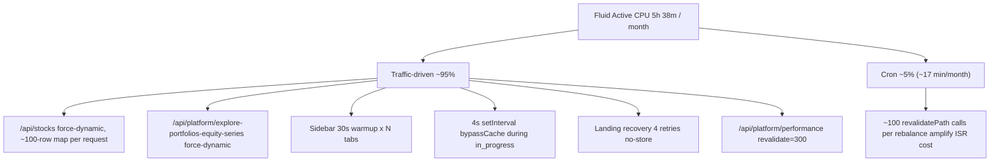

# Reduce Vercel Fluid Active CPU on aitrader

## Diagnosis (read first)

Current usage: **5h 38m / 4h** Fluid Active CPU per cycle (~338 minutes). Active CPU is wall-clock CPU time inside Vercel Functions; it counts JSON parsing, in-memory loops, ISR rebuilds, and `revalidatePath` fan-out, but **NOT** time waiting on Supabase / OpenAI I/O.

**Cron is NOT the dominant cost.** Per the most recent cron digests:

- Daily price-only cron: **29.1s wall time** total
- Rebalance-day cron: **101.4s wall time** total (AI ratings only 18.5s at concurrency=102; the heaviest section is "After performance: 48-config fan-out, rebalance log, research, revalidation" at **72.1s**)

Monthly cron CPU upper bound ≈ (22 weekdays × ~30s) + (4 rebalance days × ~101s) ≈ **17 minutes / month** ≈ **5%** of the 338-minute monthly budget.

**Therefore ~95% of Active CPU is traffic-driven.** The plan re-orders priorities accordingly: cache hot uncached endpoints first, throttle aggressive client polling second, and apply one cheap cron cleanup last.




**Directives previously considered and dropped after the cron-timing data:**

- ~~Lower `AI_CONCURRENCY` from 20→8~~ — concurrency is actually 102, AI calls are I/O-bound, lowering does not reduce Active CPU.
- ~~Parallelize `refreshDailySeriesSnapshotsForStrategy` / `computeAllPortfolioConfigs` loops~~ — saves wall time but not CPU. The 72.1s post-performance section already fits under `maxDuration = 300`.
- ~~Delete `/api/cron/weekly` redirect route~~ — too small to matter relative to traffic-driven CPU.

## Execution rules for the implementing model

For each directive below, in order:

1. Read the file(s) listed.
2. Apply the exact change described.
3. Run `npm run lint` from `/Users/bennyrubanov/Coding_Projects/aitrader`.
4. Do **NOT** alter math, payload shape, or persisted DB rows. Only adjust **frequency**, **caching**, and **fan-out**.
5. Stop and ask if any directive conflicts with `.cursor/rules/performance-stats-single-source.mdc`. Directives below are pre-checked against §7 (data invariants), §8 (multi-config surfaces), and §12 (client-side freshness).
6. After all 7 directives ship, redeploy and watch the Vercel Usage dashboard for 48 hours. Estimated combined cut: **40–60%** of Active CPU, comfortably under 4h.

---

## Directive 1 — Cache /api/stocks for authenticated users (~15–25% cut)

**File:** [src/app/api/stocks/route.ts](src/app/api/stocks/route.ts)

**Problem:** `dynamic = 'force-dynamic'` + `Cache-Control: private, max-age=60` means every navigation that mounts the stocks list triggers a full Function execution: Supabase auth, profile read, full `getAllStocks()` map over ~100 rows, and JSON serialization. Called from list pages, mini-stock-search, notification settings, etc.

**Action:**

1. Remove `export const dynamic = 'force-dynamic'`.
2. Wrap the per-tier mapping body in `unstable_cache` keyed by access tier (free/premium), with `revalidate: 300` and tags `['stocks-catalog', 'stocks-list:' + access]`. Keep auth and tier resolution **outside** `unstable_cache` (auth result must not be cached).
3. Change the response header to:

```ts
'Cache-Control': 'private, max-age=60, stale-while-revalidate=300'
```

1. After Directive 7 ships, the cron daily route will invalidate `stocks-catalog` via `revalidateTag`, keeping freshness aligned with rebalance runs. Until then, the 5-minute `revalidate` is acceptable because stocks list metadata changes only on rebalance days.

**Verification:** Hit `/api/stocks` twice in succession from a browser — second response should serve from in-memory cache without re-running `getAllStocks().map(...)`.

---

## Directive 2 — Add a route-level cache to /api/platform/explore-portfolios-equity-series (~10–15% cut)

**File:** [src/app/api/platform/explore-portfolios-equity-series/route.ts](src/app/api/platform/explore-portfolios-equity-series/route.ts)

**Problem:** This route is `dynamic = 'force-dynamic'` + `revalidate = 0` (16 commits in the last 30 days because of churn). It already uses `getCachedExplorePortfoliosEquitySeriesBase`, but the per-request `mergeExplorePortfoliosEquitySeriesLiveTails` Supabase round-trips and JSON serialization run on every visit. The explore page is a popular landing surface and this endpoint returns large multi-config payloads.

**Action:**

1. Remove `export const dynamic = 'force-dynamic'` and `export const revalidate = 0`.
2. Replace with `export const revalidate = 60` (1 minute — short enough that stale-tail detection in §8 of `performance-stats-single-source.mdc` still functions, long enough to absorb bursts).
3. Set the response `Cache-Control` to `platformPortfolioJsonCacheControl(60)` from [src/lib/public-cache.ts](src/lib/public-cache.ts) — match the route TTL.
4. Do **NOT** wrap `mergeExplorePortfoliosEquitySeriesLiveTails` in `unstable_cache` — it returns the live-tail safety net described by §8 and must reflect snapshot freshness within the same request lifecycle. Route-level CDN/ISR is the right layer.

**Verification:** Hit the endpoint twice from `curl` within 60s — second response should have an `age:` header > 0; only one Supabase query batch should appear in logs.

---

## Directive 3 — Throttle the sidebar warmup interval (~5–10% cut)

**File:** [src/components/platform/app-sidebar.tsx](src/components/platform/app-sidebar.tsx) (lines ~178–219)

**Problem:** Every open `/platform/`* tab in production calls `fetch('/api/platform/performance')` on a 30-second interval, plus on `focus`, plus on `visibilitychange`. Even though that route has `revalidate = 300` (CDN hit on most calls), one tab open for 8 hours = 960 fetches/day; Vercel still revalidates the cache every 5 minutes via a Function execution, and every CDN miss/expiration costs CPU. Multiplied across users and tabs this is meaningful.

**Action:** In [src/components/platform/app-sidebar.tsx](src/components/platform/app-sidebar.tsx), make these changes:

1. Change the interval from `30_000` to `300_000` (5 minutes — matches the route's `revalidate`).
2. Inside `warmAll`, call `warmPerformanceData()` only when `document.visibilityState === 'visible'`.
3. Remove the `focus` listener entirely. Keep `visibilitychange` (it covers tab switches).
4. Remove the `requestIdleCallback`/`setTimeout` initial warmup — the route is already prefetched on navigation.

**Verification:** Open `/platform`, leave it for 10 minutes — DevTools network panel should show at most 2 calls to `/api/platform/performance` (one on mount, one at the 5-min mark).

---

## Directive 4 — Switch the 4s "compute in progress" pollers to 8s + visibility gate (~5–10% cut)

**Files:**

- [src/components/platform/your-portfolio-client.tsx](src/components/platform/your-portfolio-client.tsx) (lines ~2315–2335)
- [src/components/platform/use-public-portfolio-config-performance.ts](src/components/platform/use-public-portfolio-config-performance.ts) (lines ~275–280)
- [src/components/platform/portfolio-onboarding-dialog.tsx](src/components/platform/portfolio-onboarding-dialog.tsx) (around line ~730)

**Problem:** Three `setInterval(..., 4000)` calls fire `bypassCache: true` fetches against `/api/platform/user-portfolio-performance` and `/api/platform/portfolio-config-performance` whenever a config is `pending` or `in_progress`. These endpoints can recompute heavy series. A user staring at the onboarding dialog for 2 minutes = 30 uncached fetches.

**Action:** In each of the 3 files above, change the interval from `4000` to `8000`, and wrap the fetch with a visibility check:

```ts
const t = setInterval(() => {
  if (typeof document !== 'undefined' && document.visibilityState !== 'visible') return;
  void loadPerf({ bypassCache: true });
}, 8000);
```

Do **not** change any other dependencies of these `useEffect` blocks. Do **not** remove `bypassCache: true` — that flag is required by §12 of `performance-stats-single-source.mdc` to avoid stale `Map` cache when compute completes.

**Verification:** Start a portfolio compute, switch to another tab, return after 30s — UI still updates within ~10s of returning. Network tab should show roughly half as many polling calls.

---

## Directive 5 — Cap landing-page recovery to 1 retry with longer delay (~3–5% cut)

**File:** [src/components/landing-performance-section.tsx](src/components/landing-performance-section.tsx) (lines ~132–189)

**Problem:** When the RSC payload is `null`, the client retries `GET /api/public/landing-all-portfolios-performance` up to 4 times with `cache: 'no-store'` at 800ms / 2000ms / 4000ms gaps. That endpoint duplicates the loader's full uncached pipeline (`loadStrategyDailySeriesBulk` + matrix build over all portfolio_configs). A handful of slow-cache-rebuild events triggers 4× full recomputations per visitor.

**Action:**

1. Replace `RECOVERY_ATTEMPT_GAPS_MS` with `[3000]` (single retry after 3 seconds).
2. After that single retry, fall back to rendering an empty state with a "Refresh" button. Do not auto-loop.

**Verification:** Block the RSC fetch in DevTools network panel; observe at most one extra `/api/public/landing-all-portfolios-performance` request, then the empty-state UI appears.

---

## Directive 6 — Raise /api/platform/performance revalidate from 300s to 600s (~3–5% cut)

**File:** [src/app/api/platform/performance/route.ts](src/app/api/platform/performance/route.ts)

**Problem:** Even after Directive 3 throttles the sidebar warmup, this route is fetched repeatedly across pages and tabs. Background revalidation at the 5-minute mark fires a Function execution to refresh the cached payload. Doubling the TTL to 10 minutes halves that background CPU without harming UX (the daily cron already invalidates the route's tags after a rebalance).

**Action:**

1. In [src/app/api/platform/performance/route.ts](src/app/api/platform/performance/route.ts), find `export const revalidate = 300`. Change to `export const revalidate = 600`.
2. Find the response `Cache-Control` header. Update `s-maxage=300` to `s-maxage=600`. Keep `stale-while-revalidate` if present; otherwise add `stale-while-revalidate=300`.
3. After Directive 3 lands, also update the sidebar warmup interval to `600_000` (10 minutes) to match.

**Verification:** Hit `/api/platform/performance` twice from a fresh browser session 8 minutes apart — both should hit cache (response header `age:` > 0 on the second).

---

## Directive 7 — Replace per-stock revalidatePath fan-out with a single revalidateTag (~2–4% cut, mostly tail-latency / ISR savings)

**File:** [src/app/api/cron/daily/route.ts](src/app/api/cron/daily/route.ts)

**Problem:** Inside the rebalance-day worker (around the AI-rating concurrency block, lines ~2390–2474), the code calls `revalidatePath(\`/stocks/{member.stock.symbol.toLowerCase()})`once per Nasdaq-100 member. Each`revalidatePath` enqueues a background ISR rebuild of that route, which spawns a Function invocation per stock detail page. ~100 invocations × ~2–4s of CPU per page rebuild = several minutes of Active CPU added to every rebalance run, before a single user even visits. Cron is only ~5% of total CPU, but this is the one cron change with non-trivial leverage.

**Action:**

1. Add a tag constant in [src/lib/public-cache.ts](src/lib/public-cache.ts) (or wherever `PUBLIC_CACHE_TAGS` lives):

```ts
export const PUBLIC_CACHE_TAGS = {
  ...,
  stocksCatalog: 'stocks-catalog',
  stockDetail: 'stock-detail',
} as const;
```

1. In [src/app/(platform)/stocks/[symbol]/page.tsx](src/app/(platform)/stocks/[symbol]/page.tsx) and any `unstable_cache` calls inside [src/lib/stocks-cache.ts](src/lib/stocks-cache.ts) that hold per-symbol data, add the `stockDetail` tag to the existing `tags` array. Also tag the per-tier cache built in Directive 1 with `stocks-catalog`.
2. In [src/app/api/cron/daily/route.ts](src/app/api/cron/daily/route.ts), find the loop that calls `revalidatePath(\`/stocks/{member.stock.symbol.toLowerCase()})`. Delete that line from the per-symbol handler. After the` chunkWithConcurrency` worker pool resolves, add **two** calls:

```ts
revalidateTag(PUBLIC_CACHE_TAGS.stockDetail);
revalidateTag(PUBLIC_CACHE_TAGS.stocksCatalog);
```

**Verification:** Visit a stock detail page after a cron run; latest AI rating should still appear within 1 page reload. Logs should show two tag invalidations per cron, not ~100 path invalidations.

---

## After all directives

1. From `/Users/bennyrubanov/Coding_Projects/aitrader`, run `npm run lint` and `npm run build`. Fix any TS errors introduced.
2. Manually visit `/`, `/platform`, `/platform/your-portfolios`, `/strategy-models`, `/platform/explore-portfolios`, `/stocks/AAPL` in production preview — confirm each renders within ~2× normal time and shows current data.
3. Open `/platform` and leave it idle for 12 minutes — DevTools network panel should show at most 2 calls to `/api/platform/performance`.
4. After 48h on production, re-check the Vercel Usage dashboard — expect Fluid Active CPU to drop below 4h. If still over, the next levers are: (a) lengthen `revalidate` on `/api/platform/explore-portfolios-equity-series` from 60 to 120, (b) lengthen Directive 1's `unstable_cache` TTL from 300 to 600, (c) audit `/api/platform/portfolio-config-performance` and `/api/platform/user-portfolio-performance` for safe caching opportunities (not included as directives because they are user-scoped and harder to cache safely).
5. Do **NOT** mark this work done until the dashboard shows < 4h sustained over a full week.

