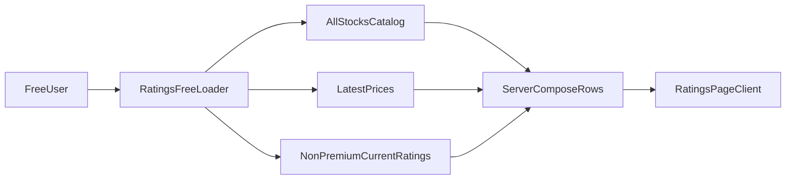

# Free-Tier Ratings Coverage Plan

## Goal

Update the stock ratings page so signed-in free users can browse all stocks alphabetically, including premium names, while premium-only AI data remains server-gated and is not shipped in the free payload for premium stocks.

## Current Findings

- The free ratings path already has a dedicated server loader and cache path: [`/Users/bennyrubanov/Coding_Projects/aitrader/src/lib/platform-server-data.ts`](/Users/bennyrubanov/Coding_Projects/aitrader/src/lib/platform-server-data.ts), [`/Users/bennyrubanov/Coding_Projects/aitrader/src/app/api/platform/ratings/route.ts`](/Users/bennyrubanov/Coding_Projects/aitrader/src/app/api/platform/ratings/route.ts), [`/Users/bennyrubanov/Coding_Projects/aitrader/src/app/platform/(workspace)/layout.tsx`](</Users/bennyrubanov/Coding_Projects/aitrader/src/app/platform/(workspace)/layout.tsx>).
- Today that loader excludes premium stocks entirely in the free branch:

```648:650:/Users/bennyrubanov/Coding_Projects/aitrader/src/lib/platform-server-data.ts
if (freeOnly && stock.is_premium_stock === true) {
  return null;
}
```

- The stock list API already shows the preferred anti-scraping pattern for free users: query non-premium rating data only, then merge it with the full stock catalog server-side: [`/Users/bennyrubanov/Coding_Projects/aitrader/src/app/api/stocks/route.ts`](/Users/bennyrubanov/Coding_Projects/aitrader/src/app/api/stocks/route.ts).
- The ratings page client currently hides rankings for all free users, but still renders chart/analysis/risk cells for each returned row: [`/Users/bennyrubanov/Coding_Projects/aitrader/src/components/platform/ratings-page-client.tsx`](/Users/bennyrubanov/Coding_Projects/aitrader/src/components/platform/ratings-page-client.tsx).

## Recommended Implementation



1. In [`/Users/bennyrubanov/Coding_Projects/aitrader/src/lib/platform-server-data.ts`](/Users/bennyrubanov/Coding_Projects/aitrader/src/lib/platform-server-data.ts), refactor the `freeTierNonPremiumOnly` branch so it no longer reads premium AI fields and then masks them client-side.
2. Build the free payload from separate sources:

- full stock catalog with premium flag and names
- latest prices for all stocks
- current AI ratings queried only for non-premium stocks

3. Extend `RatingsRow` with explicit row-level gating metadata such as `isPremiumStock` and/or `premiumFieldsLocked`, so the UI can render mixed free/unlocked rows safely without inferring from missing values.
4. Preserve the existing free-tier global rules: alphabetical ordering, no rankings, no date history, no strategy switching.

## UI Changes

- Update [`/Users/bennyrubanov/Coding_Projects/aitrader/src/components/platform/ratings-page-client.tsx`](/Users/bennyrubanov/Coding_Projects/aitrader/src/components/platform/ratings-page-client.tsx) so free mode becomes row-aware instead of assuming every row is unlocked.
- For non-premium rows on free tier, keep the current free experience.
- For premium rows on free tier:
- show symbol, company, and price
- hide AI rating value/bucket, chart trigger, analysis summary, and risks
- replace the row action with an `Upgrade` CTA
- add a clear premium badge/locked treatment so the row state is obvious
- update the header copy from “non-premium stocks only” to wording that matches “all stocks shown alphabetically; premium analysis locked”.

## Infrastructure Recommendation

- Do not widen free reads from `nasdaq100_recommendations_current_public` to include premium AI fields and then suppress them in React; that would weaken the anti-scraping design.
- Prefer the same composition pattern already used in [`/Users/bennyrubanov/Coding_Projects/aitrader/src/app/api/stocks/route.ts`](/Users/bennyrubanov/Coding_Projects/aitrader/src/app/api/stocks/route.ts): fetch only non-premium rating rows, merge with the full stock catalog on the server, and send a free-safe payload.
- Optional only if this pattern is reused in multiple places: add a dedicated server-only helper or DB projection for “free ratings catalog rows” so future pages do not re-implement the merge logic. This is not required for the first pass.

## Rule Addition

Create one always-applied rule in `.cursor/rules/` documenting this entitlement infrastructure for future AI tools. It should cover:

- guest/free payloads must never contain premium AI fields that are merely hidden in the client
- plan checks happen in server loaders/routes before data is serialized
- free-safe stock/rating responses should be composed from public-safe and gated sources, not by overfetching premium rows
- `createAdminClient()` is for server-side entitlement-aware reads only
- `nasdaq100_recommendations_current` is not a free-tier browser payload source
- when mixed lists are required, include row-level lock metadata and render locked UI from that safe payload

## Verification

- Free signed-in user: sees all stocks alphabetically; premium rows show price/basic metadata only; no AI fields leak in `/api/platform/ratings`
- Supporter/Outperformer: existing paid behavior unchanged
- Guest: existing guest shell unchanged
- Confirm cache separation between free and paid loaders remains intact
- Run lint checks on the touched ratings files and the new rule file
