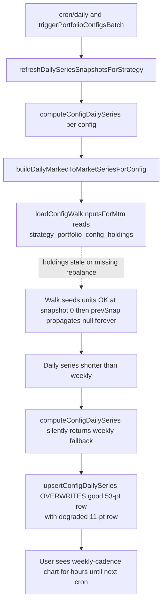

# Harden top1-weekly-equal daily snapshot

## Read this first

User-visible bug: `/`, `/strategy-models/ait-1-daneel`, and `/strategy-models/ait-1-daneel/top1-weekly-equal` periodically lose day-to-day granularity on every chart driven by the per-config `series` payload (equity curve, weekly-returns bars, CAGR-over-time, drawdown, rolling Sharpe, holding-period Sharpe). Other configs and platform pages are unaffected. Recurring; the user remembers a previous incarnation related to cron ordering.

The exact moment-by-moment trigger of any single regression is hard to pin down. Do NOT spend time trying to reproduce it locally. The plan makes the regression structurally impossible by adding fail-loud guards at the persistence boundary, fixing the underlying fragility in the daily walk, and removing two known sources of stale-data races.



The five fixes (in dependency order):

1. Degrade-block at every persistence site (Step 1) — bulletproof guard.
2. Walk self-heals across rebalances (Step 2) — removes the underlying fragility.
3. Cron self-heals holdings before computing snapshots (Step 3) — removes the leading suspected stale-input source.
4. Per-worker route uses single-config force-refresh, not strategy-wide (Step 4) — removes a structural correctness bug and a likely race.
5. Rule append (Step 7) — preserves the invariant so future agents don't reintroduce the bug.

You will edit four code files plus the two existing test files plus one rule file. Do NOT refactor anything else; do not rename helpers; do not touch UI; do not change cache TTLs.

## Verified facts you must rely on (do not re-derive)

- `DailySeriesDataStatus` is `'ready' | 'early' | 'empty' | 'failed' | 'pending'` (defined at [src/lib/config-daily-series.ts:31](src/lib/config-daily-series.ts)). There is NO `'in_progress'` literal in TS. The DB column uses `'in_progress'`, but `mapDataStatusToDb('pending') === 'in_progress'`.
- `upsertConfigDailySeries` ([src/lib/config-daily-series.ts:416-451](src/lib/config-daily-series.ts)) is unconditional — it overwrites whatever is there.
- `loadStrategyDailySeriesBulk` ([src/lib/config-daily-series.ts:599-614](src/lib/config-daily-series.ts)) already exists and returns `Map<configId, ConfigDailySeriesSnapshot>` — use it for the bulk-existing fetch in Step 1c.
- Tests use `node:test` (see [src/lib/live-mark-to-market.test.ts](src/lib/live-mark-to-market.test.ts) and [src/lib/config-daily-series.test.ts](src/lib/config-daily-series.test.ts)). The runner is `npm test`.
- `computeAllPortfolioConfigs` ([src/lib/compute-all-portfolio-configs.ts](src/lib/compute-all-portfolio-configs.ts)) writes `strategy_portfolio_config_performance` for non-default configs but does NOT write `strategy_portfolio_config_holdings`. Only `compute-portfolio-config` writes holdings; lazy self-heal is via `syncMissingConfigHoldingsSnapshots`. The cron's `refreshDailySeriesSnapshotsForStrategy` does NOT self-heal holdings — only `ensureConfigDailySeries` does.
- `ensureConfigDailySeries` early-returns when `existing.asOfRunDate === latestRawRunDate && dataStatus !== 'empty'` ([src/lib/config-daily-series.ts:704-705](src/lib/config-daily-series.ts)). This means it CANNOT be used from `compute-portfolio-config` to "force refresh after writing new perf rows" — the freshness check would skip the recompute. Step 4 introduces a dedicated `refreshDailySeriesSnapshotForConfig` helper that bypasses the freshness check.

## Step 1 — Degrade-block at the persistence layer (PRIMARY FIX)

This is the single most important change. After this lands, the user-visible regression is impossible regardless of upstream cause.

File: [src/lib/config-daily-series.ts](src/lib/config-daily-series.ts).

### 1a. Add a small comparison helper at module scope

Place just above `upsertConfigDailySeries` (around line 415):

```ts
/**
 * Returns true when persisting `incoming` would replace `existing` with a strictly shorter
 * series. We never want this: a daily snapshot must be at least as long as the prior good
 * snapshot. A flapping daily walk must NOT clobber a known-good row. Manual repair (DELETE
 * the row) is the only legitimate path to a strictly shorter snapshot.
 */
function isDegradeOverwrite(
  incoming: ConfigDailySeriesSnapshot,
  existing: ConfigDailySeriesSnapshot | null,
): boolean {
  if (!existing) return false;
  if (existing.series.length < 2) return false;
  return incoming.series.length < existing.series.length;
}

/** Test-only re-export. Do not use from runtime code. */
export const __testing_isDegradeOverwrite = isDegradeOverwrite;
```

### 1b. Wire the guard into `ensureConfigDailySeries`

In `ensureConfigDailySeries` (around [src/lib/config-daily-series.ts:744-754](src/lib/config-daily-series.ts)), replace the two existing `await upsertConfigDailySeries` / `await insertConfigDailySeriesHistory` calls with:

```ts
const snapshot = await computeConfigDailySeries(adminSupabase, {
  strategyId: params.strategyId,
  config: params.config,
  rows: withInception,
  rawObservationCount: perf.rows.length,
  asOfRunDate: latestRawRunDate,
  computeStatus: perf.computeStatus,
});

if (isDegradeOverwrite(snapshot, existing)) {
  console.error(
    `[ensureConfigDailySeries] degrade-block: strategyId=${params.strategyId} ` +
      `configId=${params.config.id} risk=${params.config.risk_level} ` +
      `freq=${params.config.rebalance_frequency} weight=${params.config.weighting_method} ` +
      `existingLen=${existing!.series.length} newLen=${snapshot.series.length} — preserving existing`,
  );
  // Never roll back asOfRunDate (manual data fix or clock-skew safety): if existing is
  // already ahead of latestRawRunDate, keep its date; otherwise advance to latest.
  const bumpedAsOf =
    existing!.asOfRunDate > latestRawRunDate
      ? existing!.asOfRunDate
      : latestRawRunDate;
  const preserved: ConfigDailySeriesSnapshot = {
    ...existing!,
    asOfRunDate: bumpedAsOf,
  };
  await upsertConfigDailySeries(adminSupabase, [preserved]);
  await insertConfigDailySeriesHistory(adminSupabase, [preserved]);
  return preserved;
}

await upsertConfigDailySeries(adminSupabase, [snapshot]);
await insertConfigDailySeriesHistory(adminSupabase, [snapshot]);
return snapshot;
```

`existing` is the variable already loaded at [src/lib/config-daily-series.ts:703](src/lib/config-daily-series.ts).

### 1c. Wire the guard into `refreshDailySeriesSnapshotsForStrategy`

`refreshDailySeriesSnapshotsForStrategy` ([src/lib/config-daily-series.ts:757-835](src/lib/config-daily-series.ts)) does NOT load existing snapshots. Add a bulk load at the top of the function (right after the `latestRawRunDate` check, before the `configsData` query):

```ts
const existingByConfig = await loadStrategyDailySeriesBulk(
  adminSupabase,
  params.strategyId,
);
```

In the per-config loop, replace `toWrite.push(snapshot)` with:

```ts
const existing = existingByConfig.get(cfg.id) ?? null;
if (isDegradeOverwrite(snapshot, existing)) {
  console.error(
    `[refreshDailySeriesSnapshotsForStrategy] degrade-block: strategyId=${params.strategyId} ` +
      `configId=${cfg.id} risk=${cfg.risk_level} freq=${cfg.rebalance_frequency} ` +
      `weight=${cfg.weighting_method} existingLen=${existing!.series.length} ` +
      `newLen=${snapshot.series.length} — preserving existing`,
  );
  const bumpedAsOf =
    existing!.asOfRunDate > latestRawRunDate
      ? existing!.asOfRunDate
      : latestRawRunDate;
  toWrite.push({ ...existing!, asOfRunDate: bumpedAsOf });
  continue;
}
toWrite.push(snapshot);
```

This intentionally preserves `existing.series` and `existing.metrics`, only bumping `asOfRunDate`. Both the live row and the history row will record the preserved snapshot — that is correct: the history table should show "we tried to recompute on this run_date and the prior snapshot is still the best we have."

### 1d. Add observability inside `computeConfigDailySeries` (no behavior change)

In [src/lib/config-daily-series.ts:304-317](src/lib/config-daily-series.ts), replace the existing block with:

```ts
let chosenSeries: PerformanceSeriesPoint[] = weeklySeries;
if (weeklySeries.length >= 2 && params.computeStatus === "ready") {
  const dailySeries = await buildDailyMarkedToMarketSeriesForConfig(
    adminSupabase,
    {
      strategyId: params.strategyId,
      riskLevel: params.config.risk_level,
      rebalanceFrequency: params.config.rebalance_frequency,
      weightingMethod: params.config.weighting_method,
      notionalSeries: weeklySeries,
      startDate: weeklySeries[0]?.date,
    },
  );
  if (dailySeries == null) {
    console.warn(
      `[computeConfigDailySeries] daily walk returned null; persistence layer may degrade-block ` +
        `strategyId=${params.strategyId} configId=${params.config.id} weeklyCount=${weeklySeries.length}`,
    );
  } else if (dailySeries.length < weeklySeries.length) {
    console.warn(
      `[computeConfigDailySeries] daily series shorter than weekly; persistence layer may degrade-block ` +
        `strategyId=${params.strategyId} configId=${params.config.id} ` +
        `dailyCount=${dailySeries.length} weeklyCount=${weeklySeries.length}`,
    );
  }
  if (dailySeries && dailySeries.length >= 2) {
    chosenSeries = dailySeries;
  }
}
```

The selection logic is unchanged — only two `console.warn` calls added. The two pre-existing `computeConfigDailySeries` tests must still pass without modification (they take the early `!sortedRows.length || baseStatus === 'failed' || baseStatus === 'empty'` branch and never reach this block).

## Step 2 — Make the daily walk self-heal across rebalances

File: [src/lib/live-mark-to-market.ts](src/lib/live-mark-to-market.ts), function `buildDailySeriesFromSnapshots`, lines 562-585.

Current logic at lines 572-583:

```572:583:src/lib/live-mark-to-market.ts
      } else {
        const preValue = computeRunningValue(date);
        if (preValue == null || prevSnap == null) {
          currentSnapshot = null;
          unitsBySymbol = new Map();
        } else {
          const turnover = computeTurnoverSnapshotHoldings(prevSnap.holdings, sn.holdings);
          const postValue = preValue * (1 - turnover * TRANSACTION_COST_RATE);
          const ok = seedUnits(postValue, sn.holdings);
          currentSnapshot = ok ? sn : null;
          if (!ok) unitsBySymbol = new Map();
        }
      }
```

Replace with:

```ts
      } else {
        const preValue = computeRunningValue(date);
        if (preValue == null || prevSnap == null) {
          // Restart from notional rather than poisoning the rest of the walk. The notional
          // series comes from `strategy_portfolio_config_performance` and is filtered to
          // finite > 0 at the snapshot-build site, so this is the same recovery path used
          // at snapshotIdx === 0. Skipping the cost-of-trade adjustment is intentional: the
          // notional already encodes realized rebalance costs, so re-applying them would be
          // double-counting.
          const okRestart = seedUnits(sn.notional, sn.holdings);
          currentSnapshot = okRestart ? sn : null;
          if (!okRestart) {
            unitsBySymbol = new Map();
            console.warn(
              `[live-mtm] restart-from-notional failed at rebalance date=${sn.date}; symbols missing prices`
            );
          }
        } else {
          const turnover = computeTurnoverSnapshotHoldings(prevSnap.holdings, sn.holdings);
          const postValue = preValue * (1 - turnover * TRANSACTION_COST_RATE);
          const ok = seedUnits(postValue, sn.holdings);
          currentSnapshot = ok ? sn : null;
          if (!ok) unitsBySymbol = new Map();
        }
      }
```

The two existing tests in `live-mark-to-market.test.ts` each have only ONE snapshot and never hit the `else` branch, so they are unaffected.

## Step 3 — Cron self-heals holdings before computing snapshots

File: [src/lib/config-daily-series.ts](src/lib/config-daily-series.ts), function `refreshDailySeriesSnapshotsForStrategy`.

Two changes:

### 3a. Include `top_n` in the configs query

Change the select at [src/lib/config-daily-series.ts:781](src/lib/config-daily-series.ts) from `'id, risk_level, rebalance_frequency, weighting_method'` to `'id, risk_level, rebalance_frequency, weighting_method, top_n'`.

Locally widen the cast at [src/lib/config-daily-series.ts:786](src/lib/config-daily-series.ts) (KEEP the variable name `configs` to minimize the diff and avoid renaming references later in the function):

```ts
const configs = (configsData ?? []) as Array<ConfigShape & { top_n: number }>;
```

Do NOT change the exported `ConfigShape` type — it is used elsewhere and we don't want churn.

### 3b. Call `syncMissingConfigHoldingsSnapshots` per-config inside the loop

At the top of `for (const cfg of configs)` (around [src/lib/config-daily-series.ts:789](src/lib/config-daily-series.ts)):

```ts
for (const cfg of configs) {
  // Self-heal holdings table so the daily walk never runs against stale rebalance rows.
  // computeAllPortfolioConfigs writes performance rows for non-default configs but NOT
  // holdings rows; without this sync, top1-weekly-equal's most recent rebalance can be
  // missing from strategy_portfolio_config_holdings during the cron snapshot loop.
  try {
    if (Number.isFinite(cfg.top_n) && cfg.top_n > 0) {
      await syncMissingConfigHoldingsSnapshots(adminSupabase, {
        strategyId: params.strategyId,
        config: {
          id: cfg.id,
          top_n: cfg.top_n,
          weighting_method: cfg.weighting_method,
          rebalance_frequency: cfg.rebalance_frequency,
        },
      });
    }
  } catch {
    /* best-effort; do not block snapshot rebuild if sync fails */
  }

  const perf = await getConfigPerformance(
    adminSupabase as never,
    params.strategyId,
    cfg.id,
  );
  // ... rest unchanged
}
```

`syncMissingConfigHoldingsSnapshots` is already imported at [src/lib/config-daily-series.ts:19](src/lib/config-daily-series.ts). It is self-rate-limited (no-op when no batches are missing).

WARNING: when `syncMissingConfigHoldingsSnapshots` actually writes, it DELETEs the `portfolio_config_daily_series` row and revalidates `mtm-walk-inputs` ([src/lib/portfolio-config-holdings-write.ts:227-233](src/lib/portfolio-config-holdings-write.ts)). That is fine here because the next thing the loop does is recompute and upsert that exact row — but it means the row will be momentarily absent. This is already true for `ensureConfigDailySeries`'s sync call. There is one important interaction with the degrade-block: the `existingByConfig` map from Step 1c is loaded BEFORE this sync runs, so if sync deletes a row mid-loop, `existingByConfig` still has the pre-deletion snapshot for the comparison. That is correct — we want to compare against the LAST known-good snapshot.

## Step 4 — Replace per-worker strategy-wide refresh with single-config force-refresh

### 4a. Add a new helper to [src/lib/config-daily-series.ts](src/lib/config-daily-series.ts)

Place right above `refreshDailySeriesSnapshotsForStrategy`:

```ts
/**
 * Force-recompute the daily snapshot for ONE config, bypassing the freshness check that
 * `ensureConfigDailySeries` uses. Intended for the per-config compute worker path
 * (`/api/internal/compute-portfolio-config`), where new perf rows have just been written
 * but `latestRawRunDate` is unchanged. Applies the same degrade-block as
 * `refreshDailySeriesSnapshotsForStrategy` and `ensureConfigDailySeries`.
 */
export async function refreshDailySeriesSnapshotForConfig(
  adminSupabase: SupabaseClient,
  params: { strategyId: string; config: ConfigShape & { top_n?: number } },
): Promise<ConfigDailySeriesSnapshot | null> {
  const latestRawRunDate = await loadLatestRawRunDate(adminSupabase);
  if (!latestRawRunDate) return null;

  // Self-heal holdings before computing (same pattern as Step 3 cron loop).
  try {
    const topN = Number(params.config.top_n ?? NaN);
    if (Number.isFinite(topN) && topN > 0) {
      await syncMissingConfigHoldingsSnapshots(adminSupabase, {
        strategyId: params.strategyId,
        config: {
          id: params.config.id,
          top_n: topN,
          weighting_method: params.config.weighting_method,
          rebalance_frequency: params.config.rebalance_frequency,
        },
      });
    }
  } catch {
    /* best-effort */
  }

  const perf = await getConfigPerformance(
    adminSupabase as never,
    params.strategyId,
    params.config.id,
  );
  const withInception = await prependModelInceptionToConfigRows(
    adminSupabase as never,
    params.strategyId,
    perf.rows,
  );
  const snapshot = await computeConfigDailySeries(adminSupabase, {
    strategyId: params.strategyId,
    config: params.config,
    rows: withInception,
    rawObservationCount: perf.rows.length,
    asOfRunDate: latestRawRunDate,
    computeStatus: perf.computeStatus,
  });

  const existing = await loadConfigDailySeries(
    adminSupabase,
    params.strategyId,
    params.config.id,
  );
  if (isDegradeOverwrite(snapshot, existing)) {
    console.error(
      `[refreshDailySeriesSnapshotForConfig] degrade-block: strategyId=${params.strategyId} ` +
        `configId=${params.config.id} existingLen=${existing!.series.length} newLen=${snapshot.series.length} — preserving existing`,
    );
    const bumpedAsOf =
      existing!.asOfRunDate > latestRawRunDate
        ? existing!.asOfRunDate
        : latestRawRunDate;
    const preserved: ConfigDailySeriesSnapshot = {
      ...existing!,
      asOfRunDate: bumpedAsOf,
    };
    await upsertConfigDailySeries(adminSupabase, [preserved]);
    await insertConfigDailySeriesHistory(adminSupabase, [preserved]);
    return preserved;
  }

  await upsertConfigDailySeries(adminSupabase, [snapshot]);
  await insertConfigDailySeriesHistory(adminSupabase, [snapshot]);
  return snapshot;
}
```

### 4b. Update the worker route

File: [src/app/api/internal/compute-portfolio-config/route.ts](src/app/api/internal/compute-portfolio-config/route.ts).

In the imports at the top, swap `refreshDailySeriesSnapshotsForStrategy` for `refreshDailySeriesSnapshotForConfig`:

```ts
import {
  CONFIG_DAILY_SERIES_CACHE_TAG,
  refreshDailySeriesSnapshotForConfig,
} from "@/lib/config-daily-series";
```

At lines 362-368 replace the existing block with:

```ts
try {
  const { data: cfgMeta } = await supabase
    .from("portfolio_configs")
    .select("id, risk_level, rebalance_frequency, weighting_method, top_n")
    .eq("id", config_id)
    .maybeSingle();
  if (cfgMeta) {
    await refreshDailySeriesSnapshotForConfig(supabase as never, {
      strategyId: strategy_id,
      config: {
        id: String((cfgMeta as { id: string }).id),
        risk_level: Number((cfgMeta as { risk_level: number }).risk_level),
        rebalance_frequency: String(
          (cfgMeta as { rebalance_frequency: string }).rebalance_frequency,
        ),
        weighting_method: String(
          (cfgMeta as { weighting_method: string }).weighting_method,
        ),
        top_n: Number((cfgMeta as { top_n?: number }).top_n ?? 20),
      },
    });
  }
  revalidateTag(CONFIG_DAILY_SERIES_CACHE_TAG);
  revalidateTag(PUBLIC_CACHE_TAGS.stockPortfolioPresence);
} catch {
  /* best effort */
}
```

Keep the existing `try { revalidateTag('mtm-walk-inputs'); } catch {}` block immediately after. Do NOT touch any other code in this file.

## Step 5 — Tests (use node:test, NOT vitest)

Append to existing files only.

### Test A: append to [src/lib/live-mark-to-market.test.ts](src/lib/live-mark-to-market.test.ts)

```ts
test("buildDailySeriesFromSnapshots restarts from notional when seedUnits would otherwise abort the walk", () => {
  const fallback = {
    nasdaq100CapWeight: 10_000,
    nasdaq100EqualWeight: 10_000,
    sp500: 10_000,
  };
  // Two single-stock weekly rebalances into different tickers. AAA prices go stale after
  // Jan 1 (>7-day forward-fill window), so computeRunningValue returns null on Jan 12.
  // BBB has fresh prices on Jan 12 and Jan 13. Without restart-from-notional, the walk
  // would permanently set currentSnapshot=null on Jan 12 and skip Jan 12 + Jan 13.
  const series = buildDailySeriesFromSnapshots(
    [
      {
        date: "2026-01-01",
        notional: 10_000,
        holdings: [{ symbol: "AAA", weight: 1 }],
      },
      {
        date: "2026-01-12",
        notional: 10_500,
        holdings: [{ symbol: "BBB", weight: 1 }],
      },
    ],
    ["2026-01-01", "2026-01-12", "2026-01-13"],
    new Map([
      ["2026-01-01", { AAA: 100 }],
      ["2026-01-12", { BBB: 200 }],
      ["2026-01-13", { BBB: 210 }],
    ]),
    new Map(),
    fallback,
  );
  assert.ok(
    series.some((p) => p.date >= "2026-01-12"),
    `walk should produce post-restart points; got ${JSON.stringify(series.map((p) => p.date))}`,
  );
});
```

### Tests B and C: append to [src/lib/config-daily-series.test.ts](src/lib/config-daily-series.test.ts)

Update the import at the top to include the helper (alongside the existing imports):

```ts
import {
  computeConfigDailySeries,
  liftTailPointForDisplay,
  rebaseSeriesForDisplay,
  sliceAndScale,
  __testing_isDegradeOverwrite,
  type ConfigDailySeriesSnapshot,
} from "@/lib/config-daily-series";
```

(Verify `ConfigDailySeriesSnapshot` is exported in 1a — it is, at [src/lib/config-daily-series.ts:53](src/lib/config-daily-series.ts).)

Then append:

```ts
function makeSnapshot(seriesLen: number): ConfigDailySeriesSnapshot {
  // Use real, monotonically-increasing ISO dates so the fixture is well-formed even at
  // seriesLen=53 (the bug case). Naive "2026-02-${17+i}" would produce invalid strings
  // like "2026-02-69" once i exceeds 11.
  const base = new Date("2026-02-17T00:00:00Z");
  return {
    strategyId: "s",
    configId: "c",
    asOfRunDate: "2026-04-30",
    dataStatus: "ready",
    series: Array.from({ length: seriesLen }, (_, i) => {
      const d = new Date(base);
      d.setUTCDate(base.getUTCDate() + i);
      return {
        date: d.toISOString().slice(0, 10),
        aiPortfolio: 10_000 + i,
        nasdaq100CapWeight: 10_000,
        nasdaq100EqualWeight: 10_000,
        sp500: 10_000,
      };
    }),
    metrics: {
      sharpeRatio: null,
      sharpeRatioDecisionCadence: null,
      cagr: null,
      totalReturn: null,
      maxDrawdown: null,
      consistency: null,
      weeksOfData: 0,
      weeklyObservations: 0,
      decisionObservations: 0,
      endingValuePortfolio: null,
      endingValueMarket: null,
      endingValueNasdaq100EqualWeight: null,
      endingValueSp500: null,
      pctWeeksBeatingSp500: null,
      pctWeeksBeatingNasdaq100EqualWeight: null,
      beatsMarket: null,
      beatsSp500: null,
    },
  };
}

test("isDegradeOverwrite returns true when new series is strictly shorter than existing", () => {
  const existing = makeSnapshot(53);
  const incoming = makeSnapshot(11);
  assert.equal(__testing_isDegradeOverwrite(incoming, existing), true);
});

test("isDegradeOverwrite returns false for equal-or-longer, missing existing, or short existing", () => {
  const existing = makeSnapshot(11);
  assert.equal(__testing_isDegradeOverwrite(makeSnapshot(53), existing), false);
  assert.equal(__testing_isDegradeOverwrite(makeSnapshot(11), existing), false);
  assert.equal(__testing_isDegradeOverwrite(makeSnapshot(11), null), false);
  assert.equal(
    __testing_isDegradeOverwrite(makeSnapshot(0), makeSnapshot(1)),
    false,
  );
});
```

The two pre-existing `computeConfigDailySeries` tests MUST continue to pass unchanged. If they fail after your edits, you have changed `computeConfigDailySeries`'s behavior beyond the warning logs — back out and try again.

## Step 6 — Verify (run sequentially, do not skip any check)

1. `npm run typecheck` — must pass with zero new errors.
2. `npm run lint` — must pass with zero new errors.
3. `npm test` — all existing tests must pass; the three new tests must pass.
4. Start dev server with `npm run dev`. From a separate shell, fire the per-config compute three times in a row:

   ```bash
   for i in 1 2 3; do
     curl -s -X POST http://localhost:3000/api/internal/compute-portfolio-config \
       -H "Authorization: Bearer $CRON_SECRET" \
       -H "Content-Type: application/json" \
       -d '{"strategy_id":"<ait-1-daneel id>","config_id":"1f26e2b8-d616-4532-803a-90e03a75ccfd"}'
     echo
   done
   ```

   All three should return `{"ok":true,"mode":"full_compute",...}`. Use the supabase MCP (read-only) to confirm the resulting row in `portfolio_config_daily_series` for that config has `json_array_length(series) >= 50`.

5. Run the supabase MCP query (read-only):
   `select config_id, json_array_length(series) as n, last_series_date, updated_at from portfolio_config_daily_series where strategy_id = '<ait-1-daneel id>' order by n;`
   — every config must have `n >= 11`, AND `top1-weekly-equal` must have `n >= 50`. If any config shows `n` strictly less than its prior value (compare against `portfolio_config_daily_series_history`), the degrade-block is broken — stop and re-read Step 1.
6. Hard-refresh `http://localhost:3000/strategy-models/ait-1-daneel/top1-weekly-equal` and confirm ALL of these charts render correctly:
   - Equity curve: smooth daily, not piecewise-linear-between-Mondays.
   - Weekly returns bars: x-axis labels land on Friday-anchored ISO-week closes.
   - CAGR over time line: annualized points reflect end-of-week closes; sanity-check magnitudes against `top5-weekly-equal`.
   - Drawdown over time, Rolling Sharpe, Holding-period Sharpe (in `mini-charts.tsx`).
7. Hard-refresh `/` (hero) and `/strategy-models/ait-1-daneel` (multi-line strategy chart) and confirm the top-portfolio line is daily-cadence.

## Step 7 — Append the invariant section to the rule file

File: [.cursor/rules/daily-snapshot-invariant.mdc](.cursor/rules/daily-snapshot-invariant.mdc).

Append at the very end of the file (after the existing `## Operational notes` section):

```markdown
## Degrade-block invariant (never overwrite a good snapshot with a worse one)

Symptom this prevents: a config's daily series silently regresses to weekly cadence (≈ N weekly points instead of ≈ 5N daily points), most often for `top_n=1` weekly configs because every rebalance is 100% turnover into one new ticker.

Required at every persistence site (`refreshDailySeriesSnapshotsForStrategy`, `ensureConfigDailySeries`, `refreshDailySeriesSnapshotForConfig`, and any future writer):

- Load the existing `portfolio_config_daily_series` row for `(strategyId, configId)` BEFORE upserting (use `loadStrategyDailySeriesBulk` for the strategy-loop case, `loadConfigDailySeries` for single-config).
- If `incoming.series.length < existing.series.length` and `existing.series.length >= 2`, DO NOT overwrite. Preserve `existing.series` and `existing.metrics`, only bumping `as_of_run_date` to the new `latestRawRunDate` so freshness checks pass. Log `console.error` with both lengths and the config identifiers.
- The history table (`portfolio_config_daily_series_history`) records the preserved snapshot — it is the actual best-known state for that run_date.
- `computeConfigDailySeries` itself must NOT change return semantics (the existing `node:test` cases lock that in). It may emit `console.warn` when `dailySeries == null` or `dailySeries.length < weeklySeries.length`, but the persistence-layer guard is the source of truth.
- Manual repair of a legitimately-shorter snapshot (e.g. inception moved later) requires a manual `DELETE` of the existing row.

## Daily walk must self-heal across rebalances

`buildDailySeriesFromSnapshots` ([src/lib/live-mark-to-market.ts](mdc:src/lib/live-mark-to-market.ts)) must NOT permanently set `currentSnapshot = null` when a non-first rebalance cannot be marked-to-market (`preValue == null` or `seedUnits` returns false). Instead it MUST restart from `sn.notional` (same recovery path used at `snapshotIdx === 0`). The notional series comes from `strategy_portfolio_config_performance` and already encodes realized transaction costs, so the restart path intentionally skips the `(1 - turnover * TRANSACTION_COST_RATE)` adjustment. Reverting this self-heal will reintroduce the top1-weekly regression.

## Cron snapshot loop must self-heal holdings before computing

`computeAllPortfolioConfigs` ([src/lib/compute-all-portfolio-configs.ts](mdc:src/lib/compute-all-portfolio-configs.ts)) writes `strategy_portfolio_config_performance` for non-default configs but does NOT write `strategy_portfolio_config_holdings`. The lazy self-heal lives in `syncMissingConfigHoldingsSnapshots` ([src/lib/portfolio-config-holdings-write.ts](mdc:src/lib/portfolio-config-holdings-write.ts)), and `refreshDailySeriesSnapshotsForStrategy` (and any other strategy-wide writer) MUST call it per-config (best-effort, swallow errors) before `getConfigPerformance` / `computeConfigDailySeries`. Without this, the daily walk runs against stale rebalance rows.

## Per-worker compute must not refresh strategy-wide

`/api/internal/compute-portfolio-config` operates on a single config and MUST NOT call `refreshDailySeriesSnapshotsForStrategy(strategyId)`. Use `refreshDailySeriesSnapshotForConfig` (force-recompute, bypasses the freshness check, applies the degrade-block) instead. Strategy-wide refreshes belong only in:

- `cron/daily` (once per cron tick, after price + holdings + perf writes complete)
- `compute-portfolio-configs-batch` (once after `computeAllPortfolioConfigs` finishes)

Concurrent strategy-wide refreshes from per-worker calls are a documented race source.
```

## Out of scope — do NOT do any of these

- Do NOT change the chart components (`Hero`, `HeroBackgroundCurve`, `ExplorePortfoliosEquityChart`, `mini-charts.tsx`).
- Do NOT change `rebaseSeriesForDisplay`, `pickDefaultPortfolioSliceFromRanked`, or any selection helper.
- Do NOT change cache TTLs (`PUBLIC_DATA_CACHE_TTL_SECONDS`, `unstable_cache` revalidate values inside `loadConfigWalkInputsForMtm` or `loadLatestRawRunDate`).
- Do NOT introduce vitest or any new test framework. Use `node:test`.
- Do NOT delete `scripts/diagnose-top1-weekly-daily.ts`.
- Do NOT regenerate or edit `supabase/schema.sql` or any migration.
- Do NOT change `computeConfigDailySeries`'s return type, signature, or selection logic. The ONLY edit there is the two `console.warn` calls in Step 1d.
- Do NOT remove or weaken the existing "downgrade to early" branch at [src/lib/config-daily-series.ts:255-287](src/lib/config-daily-series.ts).
- Do NOT widen the exported `ConfigShape` type. Step 3a uses a local intersection type for the loop body.

## Acceptance criteria

- `top1-weekly-equal` snapshot row has `series.length >= 50` after Step 6 verification, matching the daily count of every other weekly config within ±1.
- A daily walk failure produces `console.warn` from `computeConfigDailySeries` AND, when persistence would degrade an existing snapshot, `console.error` from the persistence-layer guard. The bad write never lands.
- All charts driven by the per-config payload's `series` (equity curve, weekly-returns bars, CAGR-over-time, drawdown, rolling Sharpe, holding-period Sharpe) render daily-cadence on `/strategy-models/ait-1-daneel/top1-weekly-equal` and the hero on `/`.
- The three new tests pass; the seven pre-existing tests in `live-mark-to-market.test.ts` and `config-daily-series.test.ts` still pass unchanged.
- `npm run typecheck`, `npm run lint`, and `npm test` are all green.
- The `daily-snapshot-invariant.mdc` rule file has the four new sections appended at the bottom.
