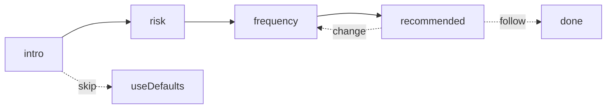

## Goal

Reduce friction in [src/components/platform/portfolio-onboarding-dialog.tsx](src/components/platform/portfolio-onboarding-dialog.tsx) from 9 steps to 4. Only ask **risk** + **rebalance frequency**, then auto-recommend the best portfolio (by total return) across the user's accessible strategies and let them follow it in one click.

## New step machine

Drop these existing steps entirely: `model`, `investment`, `allocation`, `entry-date`, `done` (summary). The current `celebrate` step becomes the new `recommended` step (re-titled, simplified copy).

`PROGRESS_STEPS` becomes `['risk', 'frequency'] as const` — only 2 dots in the indicator. The `recommended` step has no indicator (same convention as celebrate today).

## Auto-picked values (no longer asked)

- `strategySlug` and `weightingMethod`: chosen by the recommendation engine (below).
- `investmentSize`: hardcoded to `DEFAULT_PORTFOLIO_CONFIG.investmentSize` (`$10,000`). Users edit later from portfolio settings.
- `entry-date`: defaults to `localTodayYmd()`. Already the default in state today; just stop exposing the picker.

## Recommendation engine (client-side, per the user's accessible strategies)

New helper `pickRecommendedConfig(risk, frequency, accessibleSlugs)` in a new file `src/lib/onboarding-recommendation.ts`:

1. Resolve `accessibleSlugs` from `useAuthState().subscriptionTier`:
   - `guest`/`free` → only the default strategy slug
   - `supporter` → strategies with `minimum_plan_tier === 'supporter'`
   - `outperformer` → all active strategies
2. For each slug, call existing `loadRankedConfigsClient(slug)` (already cached client-side).
3. From each payload, filter `configs` to `riskLevel === risk && rebalanceFrequency === frequency` (typically 2 candidates: equal vs cap; risk 6 only equal).
4. Sort matches by `metrics.totalReturn DESC` (nulls last). Tie-break: higher `metrics.sharpeRatio`, then `isDefault === true`.
5. Return the winning `{ strategySlug, weightingMethod, riskLevel, rebalanceFrequency, matchedConfig }`.

Today there is only one active strategy ([src/lib/ai-strategy-registry.ts](src/lib/ai-strategy-registry.ts)) and `loadPortfolioConfigsRankedPayload` already lifts and ranks all 44 configs per strategy in [src/lib/portfolio-configs-ranked-core.ts](src/lib/portfolio-configs-ranked-core.ts), so no new server compute is needed; the helper just iterates and reuses the existing cached payloads.

To know which strategies the user can access without baking the rules into the dialog, extend [src/app/api/platform/onboarding-meta/route.ts](src/app/api/platform/onboarding-meta/route.ts) to include `minimumPlanTier` per strategy in the returned `strategies` array. The dialog then passes that to `allowedStrategyIdsForSubscriptionTier` from [src/lib/strategy-plan-access.ts](src/lib/strategy-plan-access.ts) (already used elsewhere) to derive `accessibleSlugs`.

## Recommended-portfolio screen (rewrite of `celebrate`)

Reuse the existing celebrate scaffolding (chart, metrics blocks, follow button, guest-account dialog, follow-limit toast) since it already pulls performance via `/api/platform/portfolio-config-performance` and supports compute-status polling. Concrete edits:

- Title: "Our recommended portfolio" (instead of "You're all set").
- Subtitle: explain it's the highest-total-return portfolio matching the chosen risk + frequency, with the matched strategy name + portfolio label.
- Drop the "Starting portfolio" eyebrow label inside the card.
- Drop the rank tooltip (`PortfolioRankingTooltipBody` block) and the "Select the current top-ranked portfolio" affordance — recommendation already is the chosen one, no need for a sidegrade.
- Drop the `draftBeforeTopRankedSelection` reset state and the `selectTopRankedPortfolioForSummary` flow (no summary anymore).
- Keep the three metric cards: Portfolio value (scaled to $10k), vs S&P 500, vs Nasdaq-100.
- Keep the buy-and-hold and "only one performance point" notices and the `CelebratePerformanceChart`.
- Footer:
  - Left: `Change selections` → `goToStep('frequency')` (one tap from risk).
  - Right: `Follow this portfolio` → existing `handleFollowThisPortfolio()` unchanged. Follow-limit tooltip and guest "Create account to save" alert dialog stay as-is.

The follow API call already accepts strategy slug, risk, frequency, weighting, investment size, and `userStartDate`; we keep passing them — they just come from the auto-picked values now.

## Frequency step simplification

Keep [src/components/platform/portfolio-onboarding-dialog.tsx](src/components/platform/portfolio-onboarding-dialog.tsx) lines 1205–1318 mostly intact, but the per-strategy "X weeks recorded / X months recorded" data-coverage hints come from the active strategy only. With cross-model recommendations these are misleading, so:

- Replace the per-strategy `frequencyMetaFromCounts` output with a static, copy-only implication line per cadence (e.g. "Active — swap weekly to follow the AI's latest picks closely.").
- Drop the data-tone (green/amber/red) since we no longer key it to a single strategy's history.
- Drop the `rebalanceCounts` fetch from the dialog. (Field can stay on the API for now; we just stop reading it.)

This also lets the frequency step render instantly without waiting on `loadOnboardingMeta`.

## Intro step

Keep the existing 3-step "How it works" intro and `Skip portfolio setup` button. Adjust step 2 copy from "You choose how to build your portfolios" to "Tell us your risk + cadence — we'll pick the rest."

## Cleanups / state to remove

In [src/components/platform/portfolio-onboarding-dialog.tsx](src/components/platform/portfolio-onboarding-dialog.tsx):

- Step type: drop `'model' | 'investment' | 'allocation' | 'entry-date' | 'done'`.
- State: drop `customInvestment`, `customInputRef`, `returnToSummary`, `draftBeforeTopRankedSelection`, `prevStepRef` (was only used for investment-step warm-up).
- Helpers: drop `EditableSummaryRow`, `INVESTMENT_QUICK_PICKS`, the cap-on-risk-6 `useEffect` for `weightingMethod` (the engine returns valid weighting, but keep a defensive guard inside `pickRecommendedConfig`).
- Imports: drop `Layers`/`CalendarIcon`/`CalendarDays`/`Clock3`/etc. that fall away with the removed steps; drop `PortfolioEntryDatePicker` and `portfolioEntryDateBounds`; drop `EqualWeightMiniPie`, `CapWeightMiniPie`, `SingleStockMiniPie`; drop `pickTopRankedConfig` (replaced by the new helper).
- `selectTopRankedPortfolioForSummary`, `resetToUserSelectionsAfterTopRanked`, `handleSummaryContinue` — remove.

Once the recommendation lands, call `setConfig(recommendedConfig)` and `setEntryDate(localTodayYmd())` so the portfolio context picks up the chosen slug + weighting before any "Follow" click.

## Edge cases

- No accessible strategies (shouldn't happen, but `loadOnboardingMeta` returning `[]`): fall back to `DEFAULT_PORTFOLIO_CONFIG.strategySlug` and `'equal'`, surface a "We're warming things up — try again in a moment" message on the recommended step, and disable Follow.
- All matched configs have `dataStatus !== 'ready'` or `totalReturn == null`: pick by `metrics.endingValuePortfolio` then by `isDefault`; show the existing "metrics will appear when performance data is ready" copy.
- Risk 6 frequency 'yearly' (single stock, sparse data): same fallback as above; chart may render an in-progress / empty state. Keep the existing buy-and-hold and "only one point" notices.
- Guest follow path: identical to today (`openGuestAccountSaveDialog`) — auto-picked values still get persisted to localStorage via `syncPendingGuestPortfolioFollowForGuestLocal`.

## Out of scope

- Dialog won't add any new server endpoints; it reuses `/api/platform/portfolio-configs-ranked` (cached) and `/api/platform/portfolio-config-performance`.
- No DB / migrations changes.
- No changes to the "post-onboarding tour" queue (`platform-post-onboarding-tour`) — still kicks off after a successful follow.
- Accounts page / portfolio settings UI for editing investment size + entry date later is unchanged.
