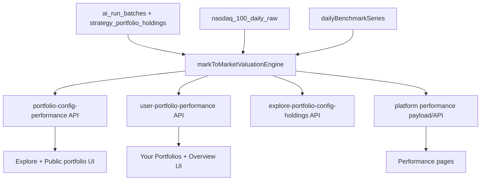

# Live Mark-to-Market Metrics Plan

## Goal

Unify all portfolio value, chart, and stat calculations to one valuation model:

- At each rebalance date, apply target weights to the portfolio notional on that rebalance date.
- Between rebalances, mark holdings to market using stored daily/latest prices.
- Compute portfolio and benchmark stats from this same up-to-date curve.
- Portfolio value graphs must use **day-by-day granularity** (not only rebalance dates + latest point), including non-weekly rebalance configs.

## Current Implementation Snapshot

### Implemented (Partial)

- Holdings allocation anchoring was corrected toward rebalance-date notional semantics.
- APIs and payloads were partially updated to append a **single latest live point** to weekly series.
- Basic live valuation helpers were introduced.

### Still Missing (Critical)

- Full **daily mark-to-market curve generation** between rebalance dates for portfolio value series.
- Graphs in Your Portfolios and Overview still effectively use weekly/rebalance cadence plus latest-point augmentation instead of full daily path.
- Monthly/quarterly/yearly portfolios still lack day-by-day portfolio value path across holding periods.
- Explore/performance/stat surfaces are not yet fully unified onto one daily valuation series.

## Decisions Locked

- Holdings + charts + stats use the same rebalance-aware mark-to-market model.
- Current allocation/value is anchored to the selected rebalance date notional, then drifted by price.
- Benchmarks remain non-rebalance series, but are evaluated on daily/latest cadence and aligned to the portfolio valuation dates for outperformance metrics.

## Implementation Blueprint

### 1) Build a shared mark-to-market valuation engine

- Add a shared service in [`/Users/bennyrubanov/Coding_Projects/aitrader/src/lib/`](/Users/bennyrubanov/Coding_Projects/aitrader/src/lib/) (new module) to:
  - reconstruct holdings units at each rebalance from `strategy_portfolio_holdings` + rebalance notional,
  - roll forward **day-by-day** with `nasdaq_100_daily_raw` price history,
  - return a **daily portfolio equity series** and per-date holdings values/weights,
  - support both model-track and user-entry rebased tracks.
- Reuse existing helpers where possible:
  - [`/Users/bennyrubanov/Coding_Projects/aitrader/src/lib/portfolio-movement.ts`](/Users/bennyrubanov/Coding_Projects/aitrader/src/lib/portfolio-movement.ts) for rebalance-notional alignment,
  - [`/Users/bennyrubanov/Coding_Projects/aitrader/src/lib/config-performance-chart.ts`](/Users/bennyrubanov/Coding_Projects/aitrader/src/lib/config-performance-chart.ts) for metric derivation shape.
- Include explicit fallback behavior:
  - when a symbol price is missing on a valuation date, carry forward last known price for that symbol if available,
  - if no historical price exists for that symbol at/after anchor, mark row as incomplete and degrade UI to target-only for that row.

### 2) Add benchmark series on daily/latest cadence

- Implement benchmark daily/latest loader (NASDAQ cap/equal + S&P) aligned to the same valuation dates used by portfolios.
- Source benchmarks from existing daily benchmark path (Stooq daily closes) and normalize to valuation dates with deterministic “on-or-before date” lookup.
- Keep benchmark logic independent of rebalances but computed on matching date points for apples-to-apples excess return stats.
- Integrate in shared valuation engine output so downstream stats always use synchronized portfolio+benchmark series.

### 3) Upgrade backend APIs to serve mark-to-market outputs

- Extend/replace portfolio performance APIs to return **daily valuation series + metrics**:
  - [`/Users/bennyrubanov/Coding_Projects/aitrader/src/app/api/platform/portfolio-config-performance/route.ts`](/Users/bennyrubanov/Coding_Projects/aitrader/src/app/api/platform/portfolio-config-performance/route.ts)
  - [`/Users/bennyrubanov/Coding_Projects/aitrader/src/app/api/platform/user-portfolio-performance/route.ts`](/Users/bennyrubanov/Coding_Projects/aitrader/src/app/api/platform/user-portfolio-performance/route.ts)
  - [`/Users/bennyrubanov/Coding_Projects/aitrader/src/app/api/platform/performance/route.ts`](/Users/bennyrubanov/Coding_Projects/aitrader/src/app/api/platform/performance/route.ts)
- Ensure `explore-portfolio-config-holdings` includes holdings-date + latest valuation fields derived from the same engine:
  - [`/Users/bennyrubanov/Coding_Projects/aitrader/src/app/api/platform/explore-portfolio-config-holdings/route.ts`](/Users/bennyrubanov/Coding_Projects/aitrader/src/app/api/platform/explore-portfolio-config-holdings/route.ts)
- Keep response contracts backward compatible during migration (additive fields first), then switch UI consumers, then remove legacy-only fields if needed.

### 4) Recompute and display all stats from the live series

- Rewire stat builders to consume new series:
  - portfolio value, total return, CAGR, max drawdown, Sharpe,
  - benchmark outperformance and consistency,
  - rank/comparison metrics where shown in Explore.
- Keep one canonical metric computation path to avoid divergence between pages.

### 5) Update UI consumers across requested surfaces

- Your Portfolios + Overview:
- Explicit acceptance target for this step:
  - portfolio value charts use daily points from anchor date to latest date,
  - no weekly-only stepping artifacts,
  - selected profile/config and selected rebalance date interactions continue to work.
  - [`/Users/bennyrubanov/Coding_Projects/aitrader/src/components/platform/your-portfolio-client.tsx`](/Users/bennyrubanov/Coding_Projects/aitrader/src/components/platform/your-portfolio-client.tsx)
  - [`/Users/bennyrubanov/Coding_Projects/aitrader/src/components/platform/platform-overview-client.tsx`](/Users/bennyrubanov/Coding_Projects/aitrader/src/components/platform/platform-overview-client.tsx)
- Explore portfolios:
  - [`/Users/bennyrubanov/Coding_Projects/aitrader/src/components/platform/explore-portfolios-client.tsx`](/Users/bennyrubanov/Coding_Projects/aitrader/src/components/platform/explore-portfolios-client.tsx)
  - [`/Users/bennyrubanov/Coding_Projects/aitrader/src/components/platform/explore-portfolio-detail-dialog.tsx`](/Users/bennyrubanov/Coding_Projects/aitrader/src/components/platform/explore-portfolio-detail-dialog.tsx)
  - [`/Users/bennyrubanov/Coding_Projects/aitrader/src/components/platform/public-portfolio-config-performance.tsx`](/Users/bennyrubanov/Coding_Projects/aitrader/src/components/platform/public-portfolio-config-performance.tsx)
- Performance pages:
  - [`/Users/bennyrubanov/Coding_Projects/aitrader/src/components/performance/performance-page-public-client.tsx`](/Users/bennyrubanov/Coding_Projects/aitrader/src/components/performance/performance-page-public-client.tsx)
  - [`/Users/bennyrubanov/Coding_Projects/aitrader/src/lib/platform-performance-payload.ts`](/Users/bennyrubanov/Coding_Projects/aitrader/src/lib/platform-performance-payload.ts)

### 6) Cache/refresh strategy for “up to date” behavior

- Adjust API caching so latest valuation refreshes appropriately while avoiding excessive load:
  - revise short-lived cache windows for high-traffic endpoints,
  - keep per-tier cache partitioning where payloads differ,
  - ensure client caches invalidate when selected rebalance date/profile changes.
- Add guardrails for compute cost:
  - memoize valuation results by `(strategyId, configId, trackMode, anchorDate)` per request window,
  - avoid recomputing full history for every UI interaction (date-switch should reuse precomputed in-memory/cache slices),
  - preserve fast initial paint with cached latest snapshot + background refresh.

## Rollout Order (Risk-Controlled)

1. Replace latest-point augmentation with full daily curve engine (server utility + tests).
2. Wire daily series into `/api/platform/portfolio-config-performance` and `/api/platform/user-portfolio-performance`.
3. Switch Your Portfolios + Overview portfolio value charts to daily series and verify no regressions.
4. Migrate Explore + Performance + ranking/stat consumers to the same daily series source.
5. Tune caches and finalize parity checks across all surfaces.

## Regression Prevention Checklist

### A) Invariants (Must Always Hold)

- Allocation math:
  - Current holding weights sum to ~100% (within tolerance) when coverage is complete.
  - Target holding weights remain unchanged from configuration/holdings snapshots.
  - Rebalance-action `targetDollars` totals match rebalance notional within cent-level tolerance.
- Time-series integrity:
  - Portfolio and benchmark series are strictly date-ordered.
  - No NaN/Infinity/negative-equity artifacts in output series.
  - User-entry tracks do not include points before entry anchor semantics.
- Metric integrity:
  - Total return, CAGR, drawdown, Sharpe, excess-return all derive from the exact same emitted series (single source of truth).
  - Benchmark outperformance uses date-aligned benchmark values.

### B) Side-by-Side Safety Mode (Before Full Switch)

- During migration, produce both:
  - legacy output (current implementation),
  - new mark-to-market output.
- Add temporary comparison logging/diagnostic fields (server-side only) to detect deltas:
  - latest portfolio value delta (% and absolute),
  - total return delta,
  - cagr delta.
- Define explicit tolerances:
  - expected large deltas where weekly-vs-daily methodology differs,
  - strict tolerance for internal arithmetic consistency (sum checks, trade deltas, unit math).

### C) Test Matrix (Automated)

- Unit tests:
  - rebalance-date anchoring and units reconstruction,
  - price carry-forward fallback,
  - missing-symbol partial coverage behavior,
  - benchmark on-or-before date resolution.
- Integration/API tests:
  - `/api/platform/explore-portfolio-config-holdings`,
  - `/api/platform/portfolio-config-performance`,
  - `/api/platform/user-portfolio-performance`,
  - `/api/platform/performance`.
- Snapshot/contract tests:
  - verify additive response compatibility during transition,
  - verify no removal/breaking field rename before consumer migration.

### D) UX Acceptance Criteria (Manual QA)

- Explore:
  - value, chart, and stats all move together from same valuation basis.
  - no mismatch between detail cards and chart endpoint.
- Your Portfolios + Overview:
  - holdings current value/current % matches selected rebalance anchor semantics,
  - headline portfolio value and chart endpoint agree on latest value,
  - rebalance action values remain coherent with holdings target percentages.
- Performance:
  - strategy/per-config metrics remain internally consistent with displayed chart.

### E) Rollback / Guard Strategy

- Introduce a temporary feature flag to switch between legacy and mark-to-market pathways per endpoint.
- Roll out in stages:
  - internal/dev only,
  - small user cohort,
  - full rollout after invariant + QA checks pass.
- Keep legacy path callable until full verification is complete.

### 7) Validation and rollout safety

- Add deterministic tests for:
  - rebalance-date notional anchoring,
  - unit carry-forward across rebalance boundaries,
  - daily/latest valuation correctness,
  - metric parity from the same series.
- Manual verification on requested pages comparing:
  - holdings current value vs target,
  - chart endpoints,
  - all headline stat cards.
- Run lint/type checks on touched files.

## Data Flow (Target)

