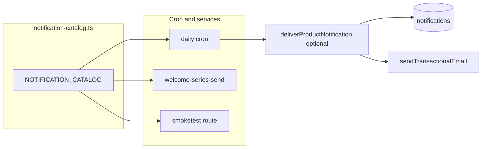

# Notifications catalog alignment — canonical implementation runbook

**This file is the only implementation plan** for notifications catalog / email–in-app alignment in this repo. Content from the deprecated duplicate `~/.cursor/plans/master_notifications_catalog_4fa45e7c.plan.md` has been merged here (lanes, catalog shape, dispatcher note, decisions, risks).

**Audience:** Engineers or automation that need explicit steps, file paths, and pass/fail checks.

**Product index (source of truth for “what”):** [.cursor/plans/notifications-email-inapp-catalog.plan.md](notifications-email-inapp-catalog.plan.md)

**Welcome edge cases:** [.cursor/plans/welcome-series-table-b-paid-transition.plan.md](welcome-series-table-b-paid-transition.plan.md)

---

## Read first (goals, do not skip)

1. **Weekly email** is one **bundle**; **weekly in-app** is one **thread** per week (head row + optional metadata for sections).
2. **Many in-app rows have no email** (`inappOnly`) — that is correct (e.g. per-event price moves).
3. **Every email must have an in-app equivalent** — not the reverse.
4. **Welcome/onboarding in-app:** threaded or milestone; **no** Settings toggle to disable in-app; **email** stops with onboarding list-unsubscribe / `email_enabled` deferral as today.
5. **Settings UI:** Five divider-separated categories (Account activity, Product updates, Portfolio updates, Stock updates, **Strategy model updates**) — spec in section **Settings categories (frozen)** below.

### Current state (code snapshot)

- **In-app:** [`cron-fanout.ts`](../../src/lib/notifications/cron-fanout.ts) inserts [`notifications`](../../supabase/migrations/20260421133925_notifications_center.sql) rows with `data.catalog_id` where applicable; types in [`types.ts`](../../src/lib/notifications/types.ts). [`weekly-digest-cron.ts`](../../src/lib/notifications/weekly-digest-cron.ts) pairs weekly email + in-app using prefs; weekly head uses `thread_id` + `thread_role: head`.
- **Email HTML:** [`email-templates.ts`](../../src/lib/notifications/email-templates.ts) + [`welcome-email-templates.ts`](../../src/lib/notifications/welcome-email-templates.ts). Most **`cron-fanout`** paths still return **`emailsSent: 0`**; **`notifyModelRatingsReady`** can send transactional email when prefs allow.
- **Welcome:** [`welcome-series-send.ts`](../../src/lib/notifications/welcome-series-send.ts) sends email and inserts in-app milestones under `onboarding:{userId}`. Signup in-app is still a separate `system` row from [`handle_new_auth_user`](../../supabase/migrations/20260422000000_welcome_notification.sql).
- **Smoketest:** [`smoketest/route.ts`](../../src/app/api/platform/notifications/smoketest/route.ts) uses kinds from [`notification-catalog.ts`](../../src/lib/notifications/notification-catalog.ts) (Phase 1b).

“Every email has an in-app equivalent” is a **product + code** change: needs **catalog** + writers that set `catalog_id` / `thread_id` and (where desired) call `sendTransactionalEmail`.

### Target: `notification-catalog.ts` (executable source of truth)

**File:** `src/lib/notifications/notification-catalog.ts` (created in Phase 1).

**Lanes** (do not put auth in the same UX as product alerts):

| Lane         | Examples                                                                      | In-app?                | Notes                                                                              |
| ------------ | ----------------------------------------------------------------------------- | ---------------------- | ---------------------------------------------------------------------------------- |
| `product`    | Rating change, rebalance, ratings ready, holdings, price move, weekly summary | Yes                    | Inbox rows + optional immediate email (Phase 5)                                    |
| `onboarding` | Welcome steps + paid transition                                               | Yes (milestone/thread) | Tied to `user_welcome_email_progress`; email deferral via `email_enabled` as today |
| `security`   | Confirm signup, password reset                                                | Optional / email-first | List in catalog for ops; minimal in-app v1 OK                                      |
| `internal`   | Smoketest, cron errors                                                        | No user prefs          | `internal: true`                                                                   |

**Each catalog entry should document** (Phase 1 implements subset; grow over time):

- **`id`** — stable string; stored as `notifications.data.catalog_id` (keep existing `type` for UI until migration story exists).
- **`lane`** — table above.
- **`dbType`** — maps to [`NotificationType`](../../src/lib/notifications/types.ts) for inbox rows; new DB types only with migration + constraint update.
- **`channels`** — `{ email: boolean; inapp: boolean }` per definition (intent; actual sends follow prefs).
- **`emailTransport`** — `none` | `immediate` | `weekly_section` (aligns with **Read first** + Phase 5).
- **`inappGranularity`** — see glossary near end of this doc.
- **`preferenceResolver`** — which DB columns apply (global prefs, `user_model_subscriptions`, `user_portfolio_profiles`, tracked stocks — document in code comment or typed map).
- **`email` / `inapp`** — hooks or references to builders (`build*EmailHtml`, row title/body shape).
- **`smoketestKind`** — optional string for operator smoketest route.

**Optional helper:** `notification-dispatch.ts` with `deliverProductNotification(admin, catalogId, userId, ctx)` — resolve prefs once → email if allowed → insert in-app with same `catalog_id`. **Order policy:** pick one (in-app first vs email first) and document in that module.



**Weekly bundle in catalog:** Prefer **one** catalog entry (or one head + `sectionIds` in metadata) for the Friday bundle so the settings matrix does not explode.

---

## Execution order

Complete **Phase 0** first (database + weekly cron gating — see below). Then **Phase 1 → 8** in numeric order. **Phase 5** may be deferred to a follow-up PR if you only ship catalog + weekly thread + welcome + UI first — if deferred, write `Phase 5 deferred` in the PR description and still complete Phase 8 footnotes honestly.

---

## Phase 0 — Database: `weekly_*_inapp` prefs (analysis and required work)

### Investigation summary (do not skip)

1. **File:** [`supabase/migrations/20260504201221_weekly_section_inapp_prefs.sql`](../../supabase/migrations/20260504201221_weekly_section_inapp_prefs.sql)  
   Adds to `public.user_notification_preferences`:  
   `weekly_product_updates_inapp`, `weekly_portfolio_summary_inapp`, `weekly_per_portfolio_inapp`, `weekly_tracked_stocks_inapp` (all `boolean not null default true`).

2. **Not redundant:** [`20260501191203_weekly_email_bundle.sql`](../../supabase/migrations/20260501191203_weekly_email_bundle.sql) adds only **email** section columns (`weekly_*_email`). The `20260504201221` migration is the **first** place **in-app** section mirrors exist. **Do not delete or revert `20260504201221`** if it has already been applied anywhere (Supabase migration history).

3. **App usage today:** [`src/lib/notifications/weekly-digest-cron.ts`](../../src/lib/notifications/weekly-digest-cron.ts) function `weeklyInappCounts` uses:
   - `weekly_tracked_stocks_inapp` → counts `stock_rating_change` rows toward `ratingChanges`
   - `weekly_per_portfolio_inapp` → counts `portfolio_price_move` toward `priceAlerts`
   - `weekly_portfolio_summary_inapp` **or** `weekly_per_portfolio_inapp` → gates counting `rebalance_action`, `portfolio_entries_exits`, `model_ratings_ready` toward `portfolioUpdates`
   - `weekly_product_updates_inapp` → **selected in prefs query** and exposed in Settings / `notification-preferences` / `allInAppOn`, but **not** referenced inside `weeklyInappCounts` (product copy comes from HTML table `weekly_product_updates`, not from `notifications` row types). Reserve for future “product line” in thread body or Phase 3 metadata.

4. **Bug before Phase 0 cron fix:** `willInapp` was only `weekly_digest_inapp && masterInapp`, so a user could turn **off** all four section in-apps and still receive a Friday in-app row with `0 portfolio updates, 0 rating changes, 0 price alerts`. That contradicts the toggles.

### Required actions (implement outside plan mode / Agent mode)

**A. New migration (comments only)** — `20260504201221` only commented two of four columns. Create a **new** file (use `date +%Y%m%d%H%M%S` for the prefix per repo rules; example slug below):

**Path:** `supabase/migrations/YYYYMMDDHHMMSS_weekly_section_inapp_prefs_comments.sql`

**Contents (copy verbatim):**

```sql
-- Completes COMMENT ON for weekly bundle in-app section prefs (20260504201221 added columns; only two had comments).

comment on column public.user_notification_preferences.weekly_portfolio_summary_inapp is
  'When true with weekly_digest_inapp, portfolio summary lines count toward the Friday in-app recap (weeklyInappCounts / body).';

comment on column public.user_notification_preferences.weekly_tracked_stocks_inapp is
  'When true with weekly_digest_inapp, tracked-stock rating-change notifications in the window count toward the Friday in-app recap.';
```

**B. Cron fix (same PR as migration A recommended)** — in `runWeeklyEmailBundle` in [`weekly-digest-cron.ts`](../../src/lib/notifications/weekly-digest-cron.ts), replace the single line that sets `willInapp` with:

```typescript
const anyWeeklySectionInapp =
  pref.weekly_product_updates_inapp ||
  pref.weekly_portfolio_summary_inapp ||
  pref.weekly_per_portfolio_inapp ||
  pref.weekly_tracked_stocks_inapp;
const willInapp = pref.weekly_digest_inapp && masterInapp && anyWeeklySectionInapp;
```

(Remove the old `const willInapp = pref.weekly_digest_inapp && masterInapp;` line.)

**C. Docs rule** — Extend the **Notifications** bullet in [`.cursor/rules/supabase-schema.mdc`](../../.cursor/rules/supabase-schema.mdc) to list the four `weekly_*_inapp` columns and that `runWeeklyEmailBundle` uses them (mirror the email bundle section names).

**D. Optional:** Add `--` comments above the four `weekly_*_inapp` columns in [`supabase/schema.sql`](../../supabase/schema.sql) for humans (keep in sync with migrations).

**E. Not required:** Dropping columns, renumbering `20260504201221`, or merging its SQL into an older migration — **forbidden** if applied in any environment.

### Phase 0 acceptance criteria

- [ ] `20260504201221_weekly_section_inapp_prefs.sql` remains in the repo unchanged.
- [ ] New comments migration applied locally / staging.
- [ ] `willInapp` requires `anyWeeklySectionInapp` as above.
- [ ] `supabase-schema.mdc` mentions `weekly_*_inapp` next to email bundle toggles.

### Optional follow-up (not Phase 0)

- If `weekly_product_updates_inapp` should affect recap **body** when there are no typed notifications, add explicit copy or a `data` flag when building the insert payload (coordinate with Phase 3 thread work).

---

## Frozen conventions (use exactly unless you update both code and this doc)

### `notifications.data` JSON keys (additive)

| Key           | Type                          | Required when                                                                                                                             |
| ------------- | ----------------------------- | ----------------------------------------------------------------------------------------------------------------------------------------- |
| `catalog_id`  | string                        | All **new** inserts from writers you touch in this project (e.g. `weekly.bundle`, `onboarding.welcome.milestone`, `portfolio.rebalance`). |
| `thread_id`   | string                        | Weekly digest head row; all onboarding companion rows for one user during welcome campaign.                                               |
| `thread_role` | `"head"` \| `"child"` \| omit | `head` = collapse group in UI; `child` = nested under same `thread_id` (optional v1: only `head` if UI cannot show children yet).         |

### `thread_id` string formats (v1)

- **Weekly:** `weekly:${userId}:${runWeekEnding}` where `runWeekEnding` is the same ISO date string you already put in weekly in-app `data` (e.g. `run_week_ending`).
- **Onboarding / welcome:** `onboarding:${userId}` (constant for that user until campaign complete — do not rotate per email step).

### Lanes (for catalog TypeScript)

- `product` — portfolio/model/stock/weekly product signals.
- `onboarding` — welcome series + paid transition companions.
- `security` — account activity (mostly email-only v1).
- `internal` — smoketest, operator — not in user prefs.

---

## Settings categories (frozen)

Implement **exactly five** toggle blocks in the settings UI, each with a visible **section title** and **`border-t`** (or equivalent) before each block after the first. Column headers stay **Email** | **In-app** where applicable. The welcome **static note** (no switches) sits outside these five.

| #   | Category                   | Email            | In-app           | Notes                                                                                                                                                                                                                                                                                                                                                                                                                                             |
| --- | -------------------------- | ---------------- | ---------------- | ------------------------------------------------------------------------------------------------------------------------------------------------------------------------------------------------------------------------------------------------------------------------------------------------------------------------------------------------------------------------------------------------------------------------------------------------- |
| 1   | **Account activity**       | Disabled, **on** | Disabled, **on** | **One row** for the whole category. Tooltip: cannot disable — required for security and billing. If no DB prefs yet, UI-only is OK for v1.                                                                                                                                                                                                                                                                                                        |
| 2   | **Product updates**        | User toggle      | Disabled, **on** | Tooltip on in-app: product-critical notices always show in-app. Maps to `weekly_product_updates_*` and future feature flags.                                                                                                                                                                                                                                                                                                                      |
| 3   | **Portfolio updates**      | User toggle      | User toggle      | Rebalance, entries/exits, price move (per followed profile), weekly portfolio / followed sections. Maps to `user_portfolio_profiles` + relevant `weekly_*` prefs.                                                                                                                                                                                                                                                                                 |
| 4   | **Stock updates**          | User toggle      | User toggle      | **Ticker-scoped** alerts: tracked `notify_rating_*`, price framing per ticker where applicable, “new ratings ready” / operational model alerts tied to **following** activity. Deep-link or aggregate PATCH for tracked list as today.                                                                                                                                                                                                            |
| 5   | **Strategy model updates** | User toggle      | User toggle      | **Strategy-model research / performance** surfaced per subscribed or followed model: e.g. beta, R², portfolio win rates vs benchmarks, quintile / regression highlights, narrative “model stats refreshed” digests. **Not** the same as single-stock bucket flips (category 4). When this ships, add prefs columns (or per-model flags) + `notification-catalog.ts` entries + writers; may include a weekly bundle section and/or dedicated cron. |

**Not a category:** Welcome/onboarding — static note only: “Getting started emails: use links in those messages to change email.” (It is **not** one of the five toggle blocks above.)

**“All notifications” master row:** When user turns **all** off, **do not** turn off Account activity (email + in-app stay effective for true account mail if implemented). Document in subtext under the master row.

---

## Phase 1 — Notification catalog module

**Goal:** One TypeScript source lists every user-facing notification kind so smoketest and future writers do not duplicate unions.

**Files to create**

- `src/lib/notifications/notification-catalog.ts`

**Files to read before coding**

- `src/app/api/platform/notifications/smoketest/route.ts` (`CORE_KINDS`, `WELCOME_SMOKETEST_KINDS`, rendering switch)
- `src/lib/notifications/types.ts` (`NOTIFICATION_TYPES`)

**Steps**

1. Define a `NotificationCatalogEntry` interface with at least: `id` (string, stable), `lane`, `dbType` (maps to [`NotificationType`](../../src/lib/notifications/types.ts) where applicable), `channels: { email: boolean; inapp: boolean }` (intent), `emailTransport` (`none` | `immediate` | `weekly_section`), `inappGranularity` (`per_event` | `milestone` | `weekly_summary`), `inappOnly` (boolean), `inappOptOutAllowed` (boolean), `settingsCategory` (`account` | `product` | `portfolio` | `stock` | `model_performance` | `none`), **`preferenceResolver`** (document which DB prefs/columns gate sends — global [`user_notification_preferences`](../../src/app/api/platform/notification-preferences/route.ts), model subs, portfolio profiles, tracked stocks, **future model-performance prefs**), optional `smoketestKind` (operator route).
2. Export `NOTIFICATION_CATALOG` as a readonly array covering: weekly bundle (prefer one entry or head + section metadata), each `cron-fanout` in-app kind, welcome steps (step + tier refs), auth rows `lane: security`, internal smoketest `internal: true`.
3. Export helper `catalogEntriesWithSmoketestEmail(): NotificationCatalogEntry[]` filtering entries that have `smoketestKind` and are not `internal` for the operator list.
4. **Optional same PR:** add `src/lib/notifications/notification-dispatch.ts` with `deliverProductNotification` (see **Target: notification-catalog.ts** mermaid) once at least one writer calls it; otherwise defer until Phase 5.

**Acceptance criteria**

- [ ] `pnpm exec tsc --noEmit` passes (or project-equivalent typecheck).
- [ ] No runtime behavior change yet except Phase 1b if done in same PR.
- [ ] If step 4 (dispatcher) is deferred, note “notification-dispatch deferred” in PR.

### Phase 1b — Smoketest uses catalog (same PR as Phase 1 preferred)

**Files to edit**

- `src/app/api/platform/notifications/smoketest/route.ts`

**Steps**

1. Replace hardcoded `CORE_KINDS` / combined `ALL_KINDS` assembly with imports from `notification-catalog.ts` so adding a catalog entry is the only place new operator kinds are registered.
2. Run operator smoketest dry-run locally; `kinds` in JSON must list the same or a superset of prior kinds (no accidental removal).

**Acceptance criteria**

- [ ] Dry-run smoketest returns `kinds` array; spot-check length vs prior main branch.

---

## Phase 2 — Thread + catalog_id data contract

**Goal:** All writers you modify set `data.catalog_id` and, where required, `data.thread_id` / `thread_role`.

**Files to edit**

- Writers: start with `src/lib/notifications/weekly-digest-cron.ts` (Phase 3) — add keys on insert payload first.
- Document in a **code comment** at top of `notification-catalog.ts` or new `src/lib/notifications/notification-data-contract.ts` (optional small file) the frozen conventions above.

**Database**

- Prefer **no migration** for v1: only JSONB `data` keys. If you add a migration for `thread_id` column later, update this plan and the catalog plan Table E.

**Acceptance criteria**

- [ ] New inserts from edited writers include `catalog_id` string.
- [ ] Weekly + welcome paths use the **exact** `thread_id` format from **Frozen conventions**.

---

## Phase 3 — Weekly digest in-app = thread head

**Goal:** One `weekly_digest` (or same `type` as today) row per user per week with `thread_id` = `weekly:userId:runWeekEnding`, `thread_role: "head"`, `catalog_id: "weekly.bundle"` (or your catalog id).

**Prerequisite:** Phase 0 **B** (`willInapp` + `anyWeeklySectionInapp`) merged so section in-app toggles behave correctly before you add thread metadata.

**Files to edit**

- `src/lib/notifications/weekly-digest-cron.ts`

**Steps**

1. Locate `admin.from('notifications').insert({` for weekly in-app (search file for `weekly_digest`).
2. Add `data: { ...existing, catalog_id, thread_id, thread_role: 'head' }` using frozen formats. Preserve existing keys (`run_week_ending`, `by_type`, `href`, etc.).
3. If email is not sent (prefs) but in-app is on, **still** insert the head row (already mostly true — do not regress).

**Acceptance criteria**

- [ ] For a dry-run user, DB row has `data.thread_id` matching `weekly:${userId}:${runWeekEnding}`.
- [ ] No duplicate head rows for same user + same `run_week_ending` (upsert or delete-before-insert — match existing dedupe style if any; if none, add idempotent check query before insert).

---

## Phase 4 — Welcome in-app companions

**Goal:** After successful welcome or paid-transition **email** send, insert in-app row(s) with `thread_id = onboarding:${userId}`, `lane` metadata in `data`, `catalog_id` per milestone, `inappGranularity` milestone (one row per milestone, not per drip, unless product changes).

**Files to edit**

- `src/lib/notifications/welcome-series-send.ts` (after `sendTransactionalEmail` success paths)
- `src/app/api/stripe/webhook/route.ts` — inside the path that calls `trySendWelcomePaidTransitionAfterCompletedFreeSeries` after successful send, ensure in-app insert runs there too **or** centralize in `trySendWelcomePaidTransitionAfterCompletedFreeSeries` so webhook and cron share one code path.

**Files you must NOT break**

- `src/lib/notifications/welcome-email-templates.ts` (copy only unless needed)

**Steps**

1. After `send.ok === true` for normal step **and** paid-transition branch, `insert` into `notifications` with `user_id`, `type` (`system` with `data.kind` **or** new type — if new type, add Supabase check constraint migration + update `types.ts` + RLS unchanged).
2. Set `data.thread_id`, `data.catalog_id`, optional `data.welcome_step` / `data.paid_transition`.
3. Do **not** add Settings toggles for onboarding.

**Acceptance criteria**

- [ ] Run welcome cron in dev for test user: see new row(s) with same `thread_id` across sends in one campaign window.
- [ ] `email_enabled` false still skips **email**; decide explicitly in PR whether in-app milestone still fires (product: default **yes** for parity in-app-only onboarding — if yes, document in catalog plan welcome subsection).

---

## Phase 5 — Fan-out immediate email (optional / follow-up)

**Goal:** For catalog entries with `emailTransport: immediate`, send email and in-app with same `catalog_id` where prefs allow.

**Files to edit**

- `src/lib/notifications/cron-fanout.ts`
- Possibly `src/lib/mailer.ts` (no API change expected)
- `src/lib/notifications/email-templates.ts` (reuse builders)

**Steps**

1. For one kind only in the first PR (e.g. `rebalance_action` **or** `model_ratings_ready` — pick one), after prefs check, if email allowed call `sendTransactionalEmail` and increment returned `emailsSent` (fix always-zero today for that kind).
2. Use same `catalog_id` on the in-app insert already done in that function.

**Acceptance criteria**

- [ ] Daily cron log / digest meta shows `emailsSent > 0` for that kind in a staging test.
- [ ] Update `.cursor/rules/supabase-schema.mdc` if you re-enable per-event email columns (repo rule file).

**Do not** in the first Phase 5 PR: enable high-volume per-stock email without rate review.

---

## Phase 6 — Inbox UI: group by `thread_id`

**Goal:** Bell and full list visually collapse rows sharing `data.thread_id` into one thread (chevron expand optional v1: v1 minimum is **one line per thread_id** showing latest activity + count badge).

**Files to read**

- `src/components/platform/notifications-bell.tsx`
- `src/app/api/platform/notifications/route.ts`

**Steps**

1. API: either return raw rows and let client group by `thread_id`, or add grouped payload — pick one and document in API response type.
2. Client: sort groups so `weekly:*` and `onboarding:*` threads appear with a clear label (“Weekly summary”, “Getting started”).
3. Unread: **recommend** one unread per **thread** until expanded (state in PR).
4. Notification list / bell filters: support **five** category chips; map future `model_performance` / strategy-stats notifications via `data.catalog_id` or dedicated `type` once defined.

**Acceptance criteria**

- [ ] Two child notifications same `thread_id` do not render as two unrelated full-width cards without a shared header.
- [ ] Filter UI lists five category chips (hide or disable category 5 chip until first writer ships, if desired).
- [ ] Bell tray badge **`unreadCount`** remains **per notification row** (`read_at is null`) by design; thread grouping in the list is UI-only (changing badge to “one per thread” would be a deliberate API follow-up).

---

## Phase 7 — Settings: five categories

**Goal:** Match **Settings categories (frozen)** section (five divider-separated toggle groups + welcome static note).

**Files to edit**

- `src/components/platform/notifications-settings-section.tsx`
- `src/app/api/platform/notification-preferences/route.ts` when **Strategy model updates** prefs exist (new columns or structured JSON — migration required); Account activity may stay UI-only v1.

**Steps**

1. Restructure JSX: **Account** → **Product** → **Portfolio** → **Stock** → **Strategy model updates**; each preceded by divider + `text-sm font-medium` title.
2. Move existing `ChannelPair` rows into the correct block per the mapping table in the catalog plan (Settings summary + prefs column).
3. **Strategy model updates block:** Until notifications exist, may show a short “Coming soon” or hide the block behind a feature flag — when writers ship, wire toggles to new prefs and list API filter `settingsCategory === model_performance` (via `data.catalog_id` prefix or enum).
4. Add `Tooltip` from `@/components/ui/tooltip` on disabled switches (Account + Product in-app).
5. Reconcile **“All notifications”** with Account activity rule (see frozen settings section). Decide whether “all off” affects category 5 the same as 3–4 (recommend **yes**).

**Acceptance criteria**

- [ ] Visual: **five** titled sections with dividers (+ welcome note outside toggles).
- [ ] Product in-app switch cannot be turned off; shows tooltip.
- [ ] Account row cannot turn off email or in-app.
- [ ] Category 5 row exists in UI with documented behavior when backend prefs are absent (placeholder vs hidden).

---

## Phase 8 — Documentation + verification

**Steps**

1. Update [.cursor/plans/notifications-email-inapp-catalog.plan.md](notifications-email-inapp-catalog.plan.md) Table D footnote if fan-out sends email. Table E if new `notifications.type` values ship. **Database** subsection if new migrations ship after Phase 0.
2. Run smoketest dry-run + one manual bell check on staging.

**Acceptance criteria**

- [ ] Catalog plan tables match production behavior after merge.
- [ ] `supabase-schema.mdc` notifications bullet matches live prefs columns (including after Phase 0).

---

## Glossary — `inappGranularity` (reference)

| Value            | Use when                                                                          |
| ---------------- | --------------------------------------------------------------------------------- |
| `per_event`      | Each distinct cron event gets its own row (rating change, rebalance, price move). |
| `milestone`      | Welcome / campaign — few rows per campaign.                                       |
| `weekly_summary` | One head row per weekly email period; thread in UI.                               |

---

## Decisions to lock before coding

1. **Auth / security emails:** Exclude from paired in-app for v1 (recommended) vs minimal “Account” inbox rows (higher scope).
2. **Weekly bundle:** One catalog entry with section metadata (recommended) vs separate catalog rows per email section — avoid settings explosion.
3. **Identifiers:** Prefer `data.catalog_id` + existing `notifications.type` until there is a migration + backfill story for new enum values or check constraint changes.

---

## Risk / volume

- Per-stock rating changes can produce many emails if Phase 5 enables immediate mail without batching — mirror in-app batch sizes, consider digest or caps, document in catalog entry.

---

## Out of scope for this runbook (unless explicitly added)

- New billing email templates from Stripe (separate initiative).
- Push notifications / mobile OS permissions.
- Rewriting auth email copy.

---

## Related

- [.cursor/plans/notifications-email-inapp-catalog.plan.md](notifications-email-inapp-catalog.plan.md)
