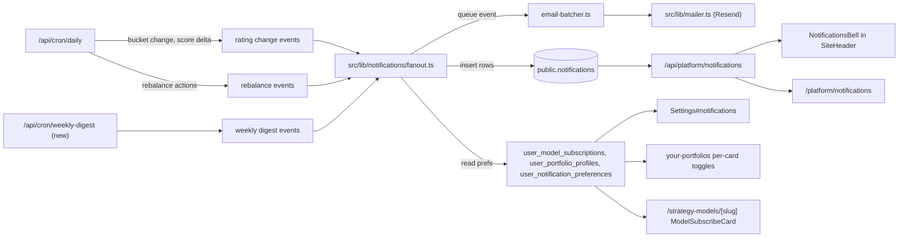

## 0. Decisions (locked)

- **Inbox + preferences** both ship.
- **Per-portfolio subscriptions** track rebalance actions and holdings changes (use `user_portfolio_profiles`).
- **Per-model subscriptions** track stock rating changes in that model (new `user_model_subscriptions` table). The previous `notifications_enabled` boolean on `user_portfolio_profiles` is replaced; no production users are affected.
- **Channels v1:** in-app + email.
- **Email provider: Resend for all user-facing mail** (auth verification, password reset, notifications, weekly digest). See Section 1.
- **Keep `sendEmailByGmail` for the operator-only daily cron digest to `tryaitrader@gmail.com`.** Gmail→Gmail, tiny volume, useful as an independent channel if Resend ever has an incident.

## 1. Email infrastructure: switch from Gmail SMTP to Resend

### Why not keep Gmail SMTP (`src/lib/sendEmailByGmail.ts`)

- Gmail SMTP is a consumer relay. It has hard send limits (~500/day free Gmail, ~2000/day Workspace), throttles on bursts, and is not a transactional provider.
- Deliverability is poor for bulk transactional mail: the envelope sender is a Gmail address, so downstream receivers see a mismatch vs. your product domain. You cannot set up DKIM/SPF/DMARC for a domain you control.
- Gmail actively rewrites `From:` in some cases and adds "on behalf of" which looks like phishing.
- A single Gmail account suspension kills all mail.

### Recommended: Resend

- Purpose-built transactional provider with strong deliverability when you verify your domain (DKIM + SPF) and set DMARC.
- Free tier: 3,000 emails/month, 100/day. $20/mo = 50,000.
- Simple SDK (`resend` npm package). Good bounce/complaint webhooks.
- Plays well with Vercel/Next.js. React Email integration available if wanted later.

### Concrete steps

1. Install: `pnpm add resend` (or `npm i resend`).
2. Add env vars (in Vercel + `.env.example`): `RESEND_API_KEY`, `RESEND_FROM` (e.g. `AItrader <notifications@your-domain.com>`), `RESEND_REPLY_TO` (optional).
3. Verify your sending domain in the Resend dashboard; add the DNS records it prints (DKIM, SPF, DMARC) to the domain registrar.
4. Create `src/lib/mailer.ts`:

```ts
import { Resend } from 'resend';

const resend = new Resend(process.env.RESEND_API_KEY);

export type SendMailInput = {
  to: string | string[];
  subject: string;
  html: string;
  text?: string;
  headers?: Record<string, string>;
  tags?: { name: string; value: string }[];
};

export async function sendMail(input: SendMailInput): Promise<{ ok: true; id: string } | { ok: false; error: string }> {
  try {
    const { data, error } = await resend.emails.send({
      from: process.env.RESEND_FROM!,
      replyTo: process.env.RESEND_REPLY_TO,
      to: input.to,
      subject: input.subject,
      html: input.html,
      text: input.text,
      headers: input.headers,
      tags: input.tags,
    });
    if (error) return { ok: false, error: error.message };
    return { ok: true, id: data!.id };
  } catch (err) {
    return { ok: false, error: err instanceof Error ? err.message : String(err) };
  }
}
```

5. Port user-facing call sites off `sendEmailByGmail` to `sendMail` (Resend):
   - `src/app/api/auth/signup/route.ts`
   - `src/app/api/auth/password-reset/route.ts`
   - All new notification sends (Section 4.5 batcher).
   
   **Deliberately keep `sendEmailByGmail.ts`** and keep using it for one call site only:
   - `src/app/api/cron/daily/route.ts` — the operator digest to `CRON_ERROR_EMAIL` (`tryaitrader@gmail.com`). Rationale: Gmail→Gmail delivery is fine, volume is trivial, and it gives you an independent second channel if Resend has an incident. Add a code comment at the import and at the call site documenting this is intentional: `// Intentional: operator-only digest; see notifications plan Section 1.`.

6. Deliverability checklist the implementer must verify before enabling notifications in production:
   - DKIM records pass (check Resend dashboard).
   - SPF includes Resend.
   - DMARC policy at least `p=none` with a reporting address.
   - From address is on the verified domain (never a gmail.com address).
   - Set `List-Unsubscribe` and `List-Unsubscribe-Post` headers on every user-facing notification email (see Section 5).
   - Every email must include a visible unsubscribe link that deep-links into `/platform/settings#notifications` with a signed token to one-click disable the relevant channel.

## 2. Architecture at a glance



Core principle: `public.notifications` is the single source of truth for the in-app inbox. Email is derived from the same events and always batched per user per type within a cron run. Preferences gate both channels independently.

## 3. Data model

Create ONE migration file. Per `.cursor/rules/supabase-migrations.mdc`, the implementer must use the real current time for the prefix: run `date +%Y%m%d%H%M%S` and name the file `<ts>_notifications_center.sql`.

### 3.1 Full SQL (paste into the new migration)

```sql
-- ---------- 1. notifications inbox ----------
create table if not exists public.notifications (
  id uuid primary key default gen_random_uuid(),
  user_id uuid not null references auth.users(id) on delete cascade,
  type text not null check (type in (
    'stock_rating_change',
    'rebalance_action',
    'model_ratings_ready',
    'weekly_digest',
    'system'
  )),
  title text not null,
  body text,
  data jsonb not null default '{}'::jsonb,
  read_at timestamptz,
  created_at timestamptz not null default now()
);

create index if not exists notifications_user_created_idx
  on public.notifications (user_id, created_at desc);

create index if not exists notifications_user_unread_idx
  on public.notifications (user_id)
  where read_at is null;

alter table public.notifications enable row level security;

create policy "notifications_select_own" on public.notifications
  for select using (auth.uid() = user_id);

create policy "notifications_update_own_read" on public.notifications
  for update using (auth.uid() = user_id)
  with check (auth.uid() = user_id);

-- service_role writes only; no insert policy for normal users.

-- ---------- 2. user_model_subscriptions ----------
create table if not exists public.user_model_subscriptions (
  id uuid primary key default gen_random_uuid(),
  user_id uuid not null references auth.users(id) on delete cascade,
  strategy_id uuid not null references public.strategy_models(id) on delete cascade,
  notify_rating_changes boolean not null default true,
  email_enabled boolean not null default true,
  inapp_enabled boolean not null default true,
  created_at timestamptz not null default now(),
  updated_at timestamptz not null default now(),
  unique (user_id, strategy_id)
);

alter table public.user_model_subscriptions enable row level security;

create policy "ums_owner_all" on public.user_model_subscriptions
  for all using (auth.uid() = user_id) with check (auth.uid() = user_id);

-- ---------- 3. user_notification_preferences ----------
create table if not exists public.user_notification_preferences (
  user_id uuid primary key references auth.users(id) on delete cascade,
  weekly_digest_enabled boolean not null default true,
  weekly_digest_email boolean not null default true,
  weekly_digest_inapp boolean not null default true,
  email_enabled boolean not null default true,
  updated_at timestamptz not null default now()
);

alter table public.user_notification_preferences enable row level security;

create policy "unp_owner_all" on public.user_notification_preferences
  for all using (auth.uid() = user_id) with check (auth.uid() = user_id);

-- Auto-create a preferences row on signup. Reuse handle_new_user pattern
-- already used for user_profiles (see supabase/schema.sql).
create or replace function public.handle_new_user_notification_prefs()
returns trigger language plpgsql security definer set search_path = public as $$
begin
  insert into public.user_notification_preferences (user_id)
  values (new.id)
  on conflict do nothing;
  return new;
end;
$$;

drop trigger if exists on_auth_user_created_notification_prefs on auth.users;
create trigger on_auth_user_created_notification_prefs
after insert on auth.users
for each row execute function public.handle_new_user_notification_prefs();

-- Backfill for existing users.
insert into public.user_notification_preferences (user_id)
select id from auth.users
on conflict (user_id) do nothing;

-- ---------- 4. Reshape user_portfolio_profiles ----------
-- Previous boolean replaced with granular per-channel flags.
alter table public.user_portfolio_profiles
  add column if not exists notify_rebalance boolean not null default true,
  add column if not exists notify_holdings_change boolean not null default true,
  add column if not exists email_enabled boolean not null default true,
  add column if not exists inapp_enabled boolean not null default true;

-- Drop legacy column (no production users).
alter table public.user_portfolio_profiles
  drop column if exists notifications_enabled;
```

### 3.2 Regenerate Supabase TypeScript types

After the migration runs locally, regenerate types (the project already has a generated types file; follow existing repo instructions — typically `pnpm supabase gen types typescript --linked > src/types/supabase.ts` or equivalent). The implementer must confirm the new columns/tables appear in the generated file.

### 3.3 Files that reference the removed column

Search and fix all references to `notifications_enabled` on `user_portfolio_profiles`:

- `src/app/api/platform/user-portfolio-profile/route.ts` — replace `notifications_enabled` in `fullSelect`, `coreSelect`, and in the PATCH handler (`body.notificationsEnabled`). See Section 6.3 for the new PATCH shape.
- `src/components/platform/your-portfolio-client.tsx` — replace `notifications_enabled` in `UserPortfolioProfileRow` and anywhere the value is read.
- Any other grep hit for `notifications_enabled` on a profile row.

## 4. Shared library

### 4.1 `src/lib/notifications/types.ts`

```ts
export const NOTIFICATION_TYPES = [
  'stock_rating_change',
  'rebalance_action',
  'model_ratings_ready',
  'weekly_digest',
  'system',
] as const;
export type NotificationType = (typeof NOTIFICATION_TYPES)[number];

export type NotificationRow = {
  id: string;
  user_id: string;
  type: NotificationType;
  title: string;
  body: string | null;
  data: Record<string, unknown>;
  read_at: string | null;
  created_at: string;
};

export type RatingChangeEvent = {
  kind: 'stock_rating_change';
  stock_id: string;
  symbol: string;
  prev_bucket: 'buy' | 'hold' | 'sell' | null;
  next_bucket: 'buy' | 'hold' | 'sell';
  prev_score: number | null;
  next_score: number;
  run_date: string;
};

export type RebalanceEvent = {
  kind: 'rebalance_action';
  strategy_id: string;
  config_id: string;
  run_date: string;
  action_counts: { enter: number; exit: number };
};

export type ModelRatingsReadyEvent = {
  kind: 'model_ratings_ready';
  strategy_id: string;
  run_date: string;
};

export type Event = RatingChangeEvent | RebalanceEvent | ModelRatingsReadyEvent;
```

### 4.2 `src/lib/notifications/hrefs.ts`

Single source of truth for "where does this notification link to?" so UI rows and emails agree.

```ts
export function hrefForRatingChange(ev: { symbol: string }) {
  return `/stocks/${encodeURIComponent(ev.symbol)}`; // adjust to actual stock page route
}
export function hrefForRebalance(ev: { strategy_id: string; profile_id: string }) {
  return `/platform/your-portfolios?profile=${ev.profile_id}`;
}
export function hrefForModel(ev: { strategy_slug: string }) {
  return `/strategy-models/${ev.strategy_slug}`;
}
```

The implementer must verify each route exists before merging.

### 4.3 `src/lib/notifications/fanout.ts`

Exports **pure functions** that take a Supabase admin client (from `@/utils/supabase/admin`) plus an event, read subscribers, return the rows to insert + emails to queue. This keeps it unit-testable with a mock client (follow the pattern in `src/lib/platform-performance-payload.test.ts`).

Required exported functions:

```ts
export async function fanOutRatingChange(
  admin: SupabaseAdmin,
  ev: RatingChangeEvent
): Promise<{ inserted: number; queuedEmails: QueuedEmail[] }>;

export async function fanOutRebalance(
  admin: SupabaseAdmin,
  ev: RebalanceEvent
): Promise<{ inserted: number; queuedEmails: QueuedEmail[] }>;

export async function fanOutModelRatingsReady(
  admin: SupabaseAdmin,
  ev: ModelRatingsReadyEvent
): Promise<{ inserted: number; queuedEmails: QueuedEmail[] }>;
```

Behavior rules (encode as unit tests):

- `fanOutRatingChange` queries `strategy_portfolio_config_holdings` (latest `run_date` per strategy/config) to find models currently holding `ev.stock_id`, then joins to `user_model_subscriptions` with `notify_rating_changes = true`. For each subscriber, further gate by `user_notification_preferences.email_enabled` and `user_model_subscriptions.email_enabled` for email; `inapp_enabled` for inbox.
- `fanOutRebalance` selects `user_portfolio_profiles` where `strategy_id = ev.strategy_id AND config_id = ev.config_id AND is_active = true AND notify_rebalance = true`.
- Both use set-based inserts (`admin.from('notifications').insert([...])` with an array built in memory). No per-user DB round-trips.
- Dedup guard: include `(user_id, type, data->>'run_date', data->>'stock_id')` in a uniqueness check before insert — the simplest pattern is to build a `unique_key` text column via a `generated` expression, or just rely on upsert with `on_conflict` using a partial unique index. For v1, skip the partial index and prevent re-runs by checking `run_date` guards in the cron.

### 4.4 `src/lib/notifications/email-templates.ts`

Three template functions returning `{ subject, html, text }`:

- `renderRatingChangeDigest({ userName, items })` where `items` is an array of `{ symbol, prev_bucket, next_bucket }`. One email per user per cron run (never one per stock).
- `renderRebalanceAlert({ strategyName, profileId, actions })`.
- `renderWeeklyDigest({ userName, ratingChanges, rebalances, unsubscribeUrl })`.

Each template must include:

- Plain `<html><body>` with inline styles (no webfonts, keep under 100 KB).
- Preheader text (hidden <span>) for the inbox preview.
- Visible unsubscribe footer with `{unsubscribeUrl}`.
- `text` plaintext fallback.

### 4.5 `src/lib/notifications/email-batcher.ts`

Exports `enqueue(event)` and `flush()`:

```ts
type QueuedEmail = { to: string; userId: string; kind: NotificationType; payload: unknown };

export function createBatcher() {
  const queue = new Map<string /*userId*/, Map<NotificationType, QueuedEmail[]>>();
  return {
    enqueue(e: QueuedEmail) { /* group by user+type */ },
    async flush(): Promise<{ sent: number; failed: number }> {
      // for each user, for each type, render ONE email and call sendMail()
    },
  };
}
```

Unit tests verify: N rating-change events for one user produce exactly 1 email; events across users stay segregated; a failed send does not block others.

## 5. Cron integration

### 5.1 Feature flag

Add env var `NOTIFICATIONS_ENABLED=true|false` (default false in production until you're ready). All new fan-out code must short-circuit when the flag is off. Add to `.env.example`.

### 5.2 Edits to `src/app/api/cron/daily/route.ts`

Three insertion points (the implementer should add inline comments `// NOTIFICATIONS: ...` at each point):

1. **After `ai_analysis_runs` upsert loop completes** — you already have both previous and current `bucket` per stock in scope (see lines ~1904–2048). Collect a `changedBuckets: RatingChangeEvent[]` array while iterating. After the loop, call `fanOutRatingChange` for each, funneling queued emails into `batcher`.

2. **After `strategy_rebalance_actions` upsert** (lines ~2537–2570) — for each `(strategy_id, config_id, run_date)` with at least one action, call `fanOutRebalance`.

3. **End of run, after all writes** — call `batcher.flush()` and include the `{ sent, failed }` counts in the operator digest that already goes to `CRON_ERROR_EMAIL`.

All three blocks must be wrapped in `if (process.env.NOTIFICATIONS_ENABLED === 'true') { ... }` and in `try/catch` so a notification failure does not fail the cron.

### 5.3 Weekly digest cron

- New file `src/app/api/cron/weekly-digest/route.ts` that runs at Friday 21:00 UTC. It selects users with `user_notification_preferences.weekly_digest_enabled = true`, builds per-user aggregates from `notifications` for the last 7 days, writes a `weekly_digest` row, and sends one email via the batcher.
- Add to `vercel.json`:

```json
{
  "framework": "nextjs",
  "crons": [
    { "path": "/api/cron/daily", "schedule": "35 13 * * 1-5" },
    { "path": "/api/cron/weekly-digest", "schedule": "0 21 * * 5" }
  ]
}
```

- **Vercel plan caveat:** Hobby allows only daily crons. If the project is on Hobby, the fallback is: detect Friday inside `/api/cron/daily` and run the weekly aggregation at the end of that invocation. Implementer must check the Vercel plan first and pick one path.

## 6. API routes

All routes use `@/utils/supabase/server` to enforce user ownership via RLS; privileged fan-out uses `@/utils/supabase/admin`. Pattern matches existing routes (see `src/app/api/platform/user-portfolio-profile/route.ts`).

### 6.1 Inbox

- `GET /api/platform/notifications` → `{ items: NotificationRow[], nextCursor: string|null, unreadCount: number }`.
  - Query params: `limit` (default 20, max 50), `cursor` (ISO created_at), `type` (optional filter), `unreadOnly=true`.
- `GET /api/platform/notifications/unread-count` → `{ count: number }` (cheap, single `count` query).
- `PATCH /api/platform/notifications/[id]` → body `{ read: true }`; sets `read_at = now()` where `user_id = auth.uid()`.
- `POST /api/platform/notifications/mark-all-read` → `update ... set read_at=now() where user_id=auth.uid() and read_at is null`.

### 6.2 Preferences + model subscriptions

- `GET /api/platform/notification-preferences` → returns the row (auto-create on miss).
- `PUT /api/platform/notification-preferences` → body matches column names; upsert on `user_id`.
- `GET /api/platform/model-subscriptions` → list for current user with `strategy_models(slug, name)` joined.
- `POST /api/platform/model-subscriptions` → body `{ strategyId, notifyRatingChanges?, emailEnabled?, inappEnabled? }`; upsert on `(user_id, strategy_id)`.
- `DELETE /api/platform/model-subscriptions?strategyId=...`.

### 6.3 Extend `PATCH /api/platform/user-portfolio-profile`

In `src/app/api/platform/user-portfolio-profile/route.ts`, replace the `notificationsEnabled` branch with:

```ts
if (typeof body.notifyRebalance === 'boolean') updates.notify_rebalance = body.notifyRebalance;
if (typeof body.notifyHoldingsChange === 'boolean') updates.notify_holdings_change = body.notifyHoldingsChange;
if (typeof body.emailEnabled === 'boolean') updates.email_enabled = body.emailEnabled;
if (typeof body.inappEnabled === 'boolean') updates.inapp_enabled = body.inappEnabled;
```

Update `hasProfileColumnUpdate` to include these four flags. Update `fullSelect` and `coreSelect` to include the new columns and drop `notifications_enabled`.

### 6.4 One-click unsubscribe endpoint

- `GET /api/platform/notifications/unsubscribe?token=...` where `token` is a signed HMAC over `{ userId, channel }` (use `crypto.createHmac` with `NOTIFICATIONS_UNSUBSCRIBE_SECRET`). On success, flip the relevant flag and render a minimal confirmation page. Used by the `List-Unsubscribe` header and the email footer link.

## 7. UI changes

### 7.1 Bell in header — replaces Home button

Edit `src/components/platform/site-header.tsx` lines ~200–224. Replace the signed-in `Home` button with:

```tsx
{isAuthenticated && <NotificationsBell />}
```

Keep `ThemeToggle` and `SiteHeaderGuestAuth` as-is. The favicon in the top-left already goes to `/` — that is now the sole "go home" affordance.

New file `src/components/platform/notifications-bell.tsx`:

- Use `DropdownMenu`, `DropdownMenuTrigger`, `DropdownMenuContent` from `@/components/ui/dropdown-menu` (same primitives as `nav-user.tsx`).
- Trigger: `Button variant="ghost" size="icon"` with `Bell` (lucide) and a `<span>` unread badge (red dot + count ≤ 9, "9+" beyond) positioned top-right.
- Content: fixed width ~360px, max-height with scroll:
  - Header row: "Notifications" + "Mark all read" text-button.
  - List rows (~20 items from `useSWR('/api/platform/notifications?limit=20', fetcher, { refreshInterval: 60_000, revalidateOnFocus: true })`).
  - Each row: type icon, title (bold if unread), relative time (`date-fns formatDistanceToNow`), clicking the row PATCHes read and navigates to `data.href`.
  - Empty state: "You're all caught up."
  - Footer: `<Link href="/platform/notifications">See all</Link>` and `<Link href="/platform/settings#notifications">Settings</Link>`.

### 7.2 Inbox page

- `src/app/platform/notifications/page.tsx` — server component, just renders `<NotificationsInboxClient />`.
- `src/components/platform/notifications-inbox-client.tsx` — full list, type filter `Select`, infinite scroll or a "Load more" button via `cursor`, "Mark all read" button.

### 7.3 Per-portfolio alerts dialog

- New `src/components/platform/portfolio-alerts-dialog.tsx`:
  - Props: `{ profileId: string; initial: { notifyRebalance; notifyHoldingsChange; emailEnabled; inappEnabled }; onSaved?: () => void }`.
  - Four `Switch` rows.
  - Save: `PATCH /api/platform/user-portfolio-profile` with the four fields.
- In `src/components/platform/your-portfolio-client.tsx`, add an "Alerts" button next to "Entry settings" on the selected-portfolio header. Hydrate `initial` from the already-loaded `UserPortfolioProfileRow`.
- Update `UserPortfolioProfileRow` (replace `notifications_enabled` with the four new flags).

### 7.4 Per-model subscribe card

- New `src/components/strategy-models/model-subscribe-card.tsx`:
  - Client component shown only when authenticated.
  - On mount: `GET /api/platform/model-subscriptions` once for the current user, find the row for this `strategyId`.
  - Renders: primary switch "Alert me when ratings change" + sub-switches "Email" / "In-app". No row → treat all off; first toggle-on creates the row via `POST`.
- Mount inside the `StrategyModelSidebarSlot` on `src/app/strategy-models/[slug]/page.tsx`. Pass `strategyId` (load alongside the existing `getStrategyDetail`).

### 7.5 Settings#notifications overhaul

Edit `src/app/platform/settings/page.tsx` notifications section:

- Section A — Global: switches bound to `user_notification_preferences` (weekly digest enabled, weekly digest email, weekly digest in-app, global email master).
- Section B — Model subscriptions: list of rows from `GET /api/platform/model-subscriptions` with inline per-row toggles and a "Remove" button (DELETE).
- Section C — Portfolio subscriptions: list of rows from `GET /api/platform/user-portfolio-profile` with the four per-row toggles (PATCH).
- Keep the existing `newsletter_subscribers` toggle; when the user toggles "Weekly digest" in Section A, mirror the boolean into `newsletter_subscribers.status` for marketing parity.

## 8. Testing plan

- `src/lib/notifications/fanout.test.ts` — unit tests for the three fan-out functions. Mock the Supabase admin client; assert the rows and queued emails. Use the structure of `src/lib/platform-performance-payload.test.ts`.
- `src/lib/notifications/email-batcher.test.ts` — verify grouping, single-email-per-user-per-type, failure isolation.
- `src/lib/notifications/email-templates.test.ts` — snapshot the rendered HTML/text to catch regressions.
- Add a narrow integration test for the cron: feed a synthetic `ai_run_batches` + `ai_analysis_runs` set, run the notification section, assert `notifications` rows exist for subscribed users and not for unsubscribed ones.

## 9. Rollout phases (what a less-capable implementer ships in each PR)

- **Phase 1 — Mailer swap and migration (merge-first):** `email-provider-swap` todo + `migration` todo + `types-and-constants`. No UI changes, no cron changes. Deliverable: DNS verified, `sendMail` works, new tables exist, `notifications_enabled` gone, all code compiles.
- **Phase 2 — Inbox read-path only:** `api-notifications` + `bell-ui` + `inbox-page` + `polling`. The bell shows up but is always empty (no writer yet). Deliverable: zero-risk UI shell.
- **Phase 3 — Fan-out + cron:** `fanout-lib` + `email-templates` + `email-batcher` + `cron-integration`. Behind `NOTIFICATIONS_ENABLED=false` flag. Enable flag once verified in a preview env.
- **Phase 4 — Preferences UIs:** `api-preferences` + `per-portfolio-ui` + `per-model-ui` + `settings-overhaul`.
- **Phase 5 — Weekly digest:** `weekly-digest` todo.

## 10. Acceptance criteria per phase

- Phase 1: `pnpm test` green. Migration applies cleanly locally and to staging. `sendMail` successfully delivers a test email from the verified domain (check Resend dashboard).
- Phase 2: Signed-in user sees Bell with 0 badge; clicking opens the dropdown with "You're all caught up." Inbox page renders the same empty state. No console errors.
- Phase 3: With `NOTIFICATIONS_ENABLED=true` and a seed rating-bucket change, a subscribed user gets (a) a new row in `notifications`, (b) exactly one Resend email. Operator digest reports `{ sent, failed }` counts.
- Phase 4: Toggling any switch in Settings or on a portfolio/model immediately persists (verify with a page refresh) and subsequently gates future fan-out.
- Phase 5: Friday 21:00 UTC (or Friday daily-cron run), subscribed users receive exactly one digest notification + one email summarizing the week.

## 11. Pitfalls to call out to the implementer

- Do **not** insert from route handlers that run under the user's Supabase client — you will hit RLS. All fan-out writes go through `createAdminClient()`.
- Never send email from inside a React render or server component. Only from API routes or cron routes with `runtime = 'nodejs'`.
- Always include `List-Unsubscribe` and a visible unsubscribe link, or Gmail/Outlook will mark the email as spam.
- Do not write one email per event. The batcher exists for a reason. A single rating-bucket-change day can produce dozens of events per user.
- Do not rename an already-applied migration; create a new migration if something needs fixing.
- When regenerating Supabase types, commit the regenerated file.

## 12. Open items that require a product decision later

- Do we want browser push (Web Push API / service worker)? Deferred; not in v1.
- Do we want SMS for critical rating changes (sell signal on a held stock)? Deferred; would add Twilio dependency.
- Do we want to show a model-subscribe toggle on the strategy-models list page cards, or only on the detail page? Deferred to Phase 4 polish.
- Do we want to add AWS SES as a secondary provider behind `sendMail` for uptime redundancy? Not in v1; revisit if Resend ever has an incident that affects us.

## 13. Operator runbook (what Benny must do by hand)

The implementer must finalize a runbook file at `docs/notifications-runbook.md` after Phase 1 ships. It must contain the exact steps below, with the specific DNS records Resend prints filled in. This section of the plan is the template.

### 13.1 One-time account + DNS (you, before Phase 1 merges)

1. Create a Resend account at `https://resend.com` with `tryaitrader@gmail.com` (or a team address).
2. In Resend → Domains → Add Domain, add the domain you want to send from (e.g. `tryaitrader.com` or `mail.tryaitrader.com`). A dedicated subdomain like `mail.` is recommended so your main-domain SPF isn't affected.
3. Copy the DNS records Resend prints:
   - 1× SPF `TXT` (usually `v=spf1 include:_spf.resend.com ~all` on the sending domain/subdomain).
   - 2× DKIM `TXT` (or CNAME, depending on the Resend setup wizard).
   - 1× DMARC `TXT` on `_dmarc.<domain>` with `v=DMARC1; p=none; rua=mailto:dmarc@<domain>;` minimum.
4. Add each record at your DNS host (Vercel, Cloudflare, etc.).
5. Wait for Resend to show all three as "Verified" (usually <1 hour).
6. Resend → API Keys → Create key with "Sending access". Save the key once; you cannot view it again.

### 13.2 Env vars to set

Set these in Vercel (Production + Preview) and locally in `.env.local`:

- `RESEND_API_KEY` — the key from step 13.1.6.
- `RESEND_FROM` — e.g. `AItrader <notifications@mail.tryaitrader.com>`. Must be on the verified domain/subdomain.
- `RESEND_REPLY_TO` — optional, e.g. `support@tryaitrader.com`.
- `NOTIFICATIONS_ENABLED` — start `false`. Flip to `true` only after verifying Phase 3 in staging.
- `NOTIFICATIONS_UNSUBSCRIBE_SECRET` — 32+ random bytes (`openssl rand -hex 32`).

Keep existing Gmail vars for the operator digest:

- `EMAIL_HOST`, `EMAIL_USER`, `EMAIL_PASS`, `EMAIL_FROM`, `CRON_ERROR_EMAIL` — unchanged.

### 13.3 Apply the migration

After the implementer commits the new migration file:

```bash
# local
pnpm supabase db reset   # or equivalent migration runner for this repo
# staging / prod (linked project)
pnpm supabase db push
```

Then regenerate types and commit:

```bash
pnpm supabase gen types typescript --linked > src/types/supabase.ts
```

### 13.4 Verify mailer works (Phase 1 go/no-go)

Before merging Phase 1:

- From a Preview deployment, trigger the password-reset flow with your own email. Confirm the email arrives from the Resend domain and lands in the **inbox**, not spam.
- Open the Resend dashboard → Logs: confirm the message shows `delivered` and DKIM/SPF both pass.

### 13.5 Enable notifications (Phase 3)

1. Confirm Phase 2 UI shell is live (bell shows, inbox page renders empty).
2. In Vercel, flip `NOTIFICATIONS_ENABLED=true` for Preview only. Trigger the daily cron manually:

   ```bash
   curl -X POST "https://<preview-url>/api/cron/daily?forceRun=1" -H "x-cron-secret: $CRON_SECRET"
   ```

3. In Supabase → Table editor → `notifications`, confirm rows appeared for a test user subscribed to a model.
4. Check Resend logs: the batcher should show one email per user per type, not one per event.
5. If good, flip `NOTIFICATIONS_ENABLED=true` in Production.

### 13.6 Enable weekly digest (Phase 5)

- Confirm Vercel plan supports a second cron path. If on Hobby, use the daily-cron fallback the implementer built in.
- Deploy; wait for the first Friday run; verify one digest row in `notifications` per opted-in user and one Resend email each.

### 13.7 Rollback

- To disable everything instantly: set `NOTIFICATIONS_ENABLED=false` in Vercel; redeploy is not required (env is read at request time inside the cron). The UI shell remains harmless — the bell will just stay empty.
- To roll back the migration in an emergency: the migration is additive except for the drop of `user_portfolio_profiles.notifications_enabled`. Re-adding the column is a one-liner if ever needed, but because no users depend on it, the safest rollback is forward-fix.

### 13.8 What the executing implementer must hand back

After Phase 1 ships, the implementer must deliver:

- The filled-in `docs/notifications-runbook.md` with the actual DNS values printed by Resend for this account.
- A Loom/screenshot proving a Phase 1 password-reset email lands in inbox with SPF+DKIM green.
- A short release note for each subsequent phase.
