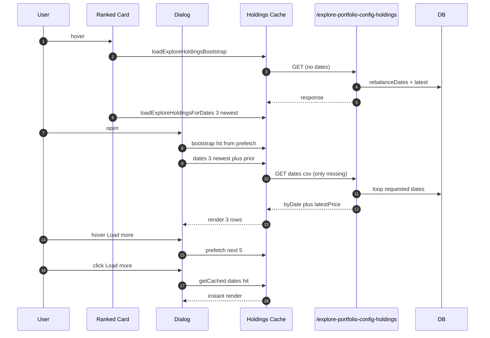
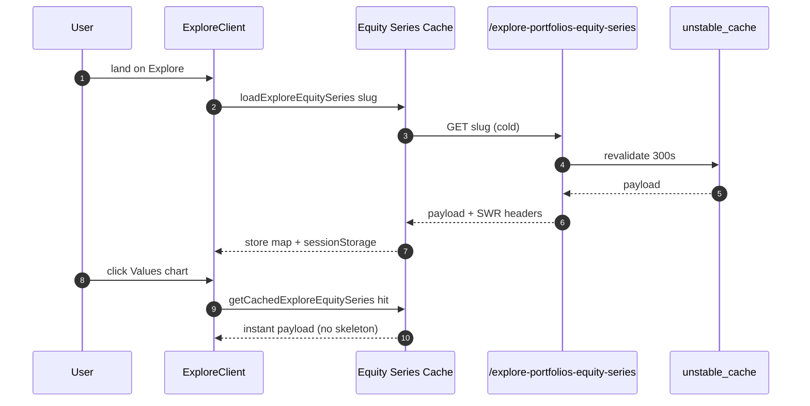
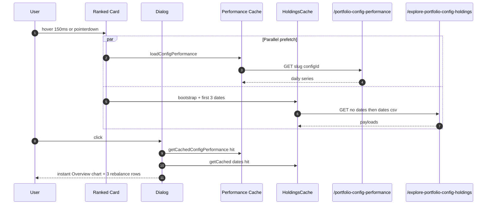

## Current behavior (baseline)

On dialog open, [src/lib/portfolio-config-holdings-cache.ts](src/lib/portfolio-config-holdings-cache.ts) calls the API with `includeAllDates=1`, and the server [src/app/api/platform/explore-portfolio-config-holdings/route.ts](src/app/api/platform/explore-portfolio-config-holdings/route.ts) loops every `rebalanceDates` entry serially (one `getPortfolioConfigHoldings` + one `nasdaq_100_daily_raw` query per date). For a multi-year portfolio this can be 50+ sequential DB roundtrips in a single request. Client cache is in-memory only (lost on hard reload).

Target: fetch only what the user is looking at, let them opt into more, and persist what is loaded across reloads (within the tab session) the same way [src/lib/platformClientCache.ts](src/lib/platformClientCache.ts) already does.

## Server: `dates=` batch parameter

In [src/app/api/platform/explore-portfolio-config-holdings/route.ts](src/app/api/platform/explore-portfolio-config-holdings/route.ts):

- Add `dates=YYYY-MM-DD,YYYY-MM-DD,…` query param (comma-separated, cap at `MAX_DATES_PER_REQUEST = 10`).
- Replace the `includeAllDates` loop with a bounded loop over the requested dates only. Same response shape (`rebalanceDates`, `byDate`, `latestPriceBySymbol`) so the client parser keeps working.
- Extend the `responseCacheKey` to include the sorted CSV of requested dates so batches are memoized independently.
- Keep a lightweight non-`dates` path for the "bootstrap" call (returns `rebalanceDates` + latest as-of only, no `byDate`). That's exactly today's `!includeAllDates` branch — no code changes needed there.
- Remove the `includeAllDates` branch (or have it 400 with a deprecation message — no external callers).

Roughly, the new `byDate` loop:

```ts
const requestedDates = parseDatesCsv(req.nextUrl.searchParams.get("dates"))
  .filter((d) => rebalanceDates.includes(d))
  .slice(0, MAX_DATES_PER_REQUEST);

if (requestedDates.length > 0) {
  byDate = {};
  const symbolUnion = new Set(symbols);
  for (const date of requestedDates) {
    // ... same per-date logic as today's loop ...
  }
  // ... latestPrice fetch for the union ...
}
```

## Client cache: align with `platformClientCache` pattern

Rewrite [src/lib/portfolio-config-holdings-cache.ts](src/lib/portfolio-config-holdings-cache.ts) so each rebalance-date payload is stored under a stable key in both an in-memory `Map` and `sessionStorage`, with a TTL check on read (matches [src/lib/platformClientCache.ts](src/lib/platformClientCache.ts)):

- `CACHE_PREFIX = 'aitrader.platform.cache.v1.explore-holdings'`.
- `TTL_MS = 5 * 60_000` (5 minutes; 90s server cache remains the authoritative backstop).
- Per-date cache entry: `{ value: ExploreHoldingsPayload, updatedAt: number }`.
- New API:
  - `loadExploreHoldingsBootstrap(slug, configId)` — lightweight fetch that hydrates only `rebalanceDates` + latest as-of data (the existing `!includeAllDates` path).
  - `loadExploreHoldingsForDates(slug, configId, dates[])` — splits `dates` into cached-fresh vs missing; if missing is non-empty, issues ONE request with `dates=` param; merges the response into Map + sessionStorage; dedupes in-flight via an `inflight` Map keyed by sorted-dates.
  - `getCachedExploreHoldings(slug, configId, date)` — unchanged signature; reads Map first, falls back to `sessionStorage`, honors TTL.
  - `invalidateExploreHoldingsCache()` — clears Map and removes all `sessionStorage` keys under the prefix.
- Remove `prefetchExploreHoldingsDates`'s "warm every date" behavior; replace with a thin wrapper over `loadExploreHoldingsForDates`.

Invalidation (industry-standard — event-driven + TTL):

- TTL: 5 min in Map/sessionStorage, 90s on server (unchanged).
- Event: in a top-level effect (e.g. in [src/components/auth/auth-state-provider.tsx](src/components/auth/auth-state-provider.tsx) or alongside the existing `USER_PORTFOLIO_PROFILES_INVALIDATE_EVENT` listener), subscribe and call `invalidateExploreHoldingsCache()` on: sign-in, sign-out, subscription tier change, follow/unfollow — all the existing triggers the platform already broadcasts.

## Dialog pagination

In [src/components/platform/explore-portfolio-detail-dialog.tsx](src/components/platform/explore-portfolio-detail-dialog.tsx):

- New state on the dialog:
  - `visibleDateCount: number` — init to `3`, bumped by `LOAD_MORE_STEP = 5`.
  - `loadingMoreDates: boolean`.
- Effects (runs when `open`, `strategySlug`, `config.id`, `visibleDateCount` change):
  1. First run: `loadExploreHoldingsBootstrap(slug, configId)` populates `rebalanceDates` via the existing state setter.
  2. Compute `datesToFetch = rebalanceDates.slice(0, Math.min(visibleDateCount + 1, rebalanceDates.length))`. The `+1` is the extra prior-date needed so the oldest-visible row can compute its buy/sell/hold diff and the Holdings tab "movement" view has a prior snapshot.
  3. Call `loadExploreHoldingsForDates(slug, configId, datesToFetch)`.
- Derived memos:
  - `visibleDates = rebalanceDates.slice(0, visibleDateCount)`.
  - `exploreHoldingsTimeline` and `exploreRebalanceActionsTimeline` (around [explore-portfolio-detail-dialog.tsx](src/components/platform/explore-portfolio-detail-dialog.tsx) lines 779 and 854) iterate over `visibleDates` instead of the full `rebalanceDates`.
  - `missingDates` becomes "dates in `visibleDates` not yet cached" rather than "all remaining"; the existing `STREAMING_REBALANCE_SKELETON_CAP = 3` skeleton behavior keeps working unchanged.
- UI additions (combined desktop tab + each mobile tab share the same state):
  - At the bottom of the combined/rebalance-history section, render a `<LoadMoreButton>` when `visibleDateCount < rebalanceDates.length`.
    - Label: `Load ${Math.min(LOAD_MORE_STEP, rebalanceDates.length - visibleDateCount)} more`.
    - `onMouseEnter`: 150ms-debounced hover-prefetch that calls `loadExploreHoldingsForDates` for the NEXT batch but does NOT advance `visibleDateCount` — warms the cache so the click feels instant.
    - `onMouseLeave`: cancel the debounced prefetch.
    - `onPointerDown` / `onTouchStart`: prefetch immediately (mobile + touch-first desktop).
    - `onClick`: `setVisibleDateCount((n) => n + LOAD_MORE_STEP); setLoadingMoreDates(true)`. The fetch effect deduplicates via the client cache and clears `loadingMoreDates` when the dates are all resolved.
  - Spinner/`Skeleton` replaces the current `Loading N more rebalance date(s)…` text for the rows currently being fetched (already uses `ExploreActionsCardSkeleton` / `ExploreHoldingsCardSkeleton`, capped at `STREAMING_REBALANCE_SKELETON_CAP`).

## Ranked-card prefetch alignment

In [src/components/platform/explore-portfolios-client.tsx](src/components/platform/explore-portfolios-client.tsx), `prefetchHoldingsForConfig` currently calls the old `loadExplorePortfolioConfigHoldings(slug, configId, null)` which triggers `includeAllDates=1`. Change it to:

1. `await loadExploreHoldingsBootstrap(slug, configId)` to learn `rebalanceDates`.
2. `void loadExploreHoldingsForDates(slug, configId, rebalanceDates.slice(0, 3))` to warm exactly what the dialog will show first.

Keeps the existing hover / pointer-down prefetch triggers intact; just smaller payload.

## Data flow



## Explore "Portfolio values" chart — instant feel

Today, [src/components/platform/explore-portfolios-client.tsx](src/components/platform/explore-portfolios-client.tsx) only fires `GET /api/platform/explore-portfolios-equity-series` when the user clicks the "Values chart" toggle (`browseMode === 'chart'`), showing a full-chart skeleton until it returns. The server route ([src/app/api/platform/explore-portfolios-equity-series/route.ts](src/app/api/platform/explore-portfolios-equity-series/route.ts)) is already aggressively cached via `unstable_cache` (`revalidate: 300`) and ships with `Cache-Control: public, s-maxage=300, stale-while-revalidate=1800`, so warming it from the client is essentially free after the first hit per strategy.

### Client cache module

Add `src/lib/explore-equity-series-cache.ts`, a small module modeled 1:1 on the holdings cache (and on [src/lib/platformClientCache.ts](src/lib/platformClientCache.ts)):

- Two-tier store: in-memory `Map` + `sessionStorage`.
- Cache key: `${slug}`.
- `CACHE_PREFIX = 'aitrader.platform.cache.v1.explore-equity-series'`.
- `TTL_MS = 5 * 60_000` (matches the server's 5 min revalidate; browser HTTP cache picks up the SWR window beyond that).
- API:
  - `getCachedExploreEquitySeries(slug)` — Map then sessionStorage, TTL-checked.
  - `loadExploreEquitySeries(slug)` — returns cached value if fresh; otherwise single in-flight fetch that populates both tiers.
  - `invalidateExploreEquitySeriesCache()` — wired to the same sign-in/sign-out/tier-change broadcast used for holdings invalidation.

### Prefetch on page mount

In [src/components/platform/explore-portfolios-client.tsx](src/components/platform/explore-portfolios-client.tsx):

- Add a new `useEffect` keyed on `strategySlug` that fires `void loadExploreEquitySeries(strategySlug)` in the background as soon as the page mounts and each time the user switches strategies — regardless of `browseMode`. The server cache absorbs duplicate calls cheaply.
- Replace the existing `useEffect` at lines 455-495 with a version that:
  1. Synchronously reads `getCachedExploreEquitySeries(strategySlug)` into `equitySeriesPayload` on mount / strategy change (so a warm cache hydrates state on the first render).
  2. If still `null` when `browseMode === 'chart'`, calls `loadExploreEquitySeries` (which will piggy-back on the in-flight prefetch, no duplicate request).
  3. Only sets `equitySeriesLoading = true` when the call is a genuine cold miss — prevents the full-chart skeleton from flashing on the common warm path.
- Keep the `setEquitySeriesPayload(null)` reset on `strategySlug` change, but immediately follow with the cache-read so state doesn't go through a blank frame.

### Cross-page prefetch (optional, low cost)

If the user lands on a non-Explore platform tab, we can optionally prefetch the default strategy's equity series from the workspace mount in [src/components/platform/platform-workspace-mount.tsx](src/components/platform/platform-workspace-mount.tsx) so that navigating into Explore is already warm. Guard by strategy availability; keep this behind a feature flag-free single call with no retries so it doesn't add tail latency elsewhere.



## Overview chart (dialog) — skeleton-until-daily + prefetch

Revert the prior "render weekly series instantly, then upgrade to daily" behavior in [src/components/platform/explore-portfolio-detail-dialog.tsx](src/components/platform/explore-portfolio-detail-dialog.tsx). The swap causes a visible chart reshape which reads as a regression. New model: show the chart skeleton until the daily `/portfolio-config-performance` series arrives, but make sure that arrival is nearly instant via prefetch on ranked-card intent.

### Dialog changes

- In the Overview chart effect:
  - Drop the `fallbackSeries = Array.isArray(config.performanceSeriesWeekly) ? config.performanceSeriesWeekly : []` seeding.
  - `setExplorePerfSeries([])` + `setExplorePerfLoading(true)` on open.
  - Read from the new performance-payload cache (below) first. If cached, set state synchronously and skip `setExplorePerfLoading(true)`.
  - On fetch resolve, set only `apiSeries` (no weekly fallback merge).
- Chart render gate reverts to: show skeleton whenever `explorePerfSeries.length === 0 && explorePerfLoading`; show the chart only once the daily payload is in.

### Drop the weekly preload from ranked payload

In [src/lib/portfolio-configs-ranked-core.ts](src/lib/portfolio-configs-ranked-core.ts):

- Remove `performanceSeriesWeekly: PerformanceSeriesPoint[]` from `RankedConfig` (added earlier).
- In `computeRankedConfigMetrics`, stop returning `performanceSeriesWeekly`.
- Bump the `unstable_cache` key (e.g. `v8-weekly-series-preload` → `v9-no-weekly-preload`) so the new shape is picked up.

This also shrinks the ranked-configs payload size — a free win for the Explore page's initial load.

### New client cache module for performance payloads

Add `src/lib/portfolio-config-performance-cache.ts`, a twin of the holdings/equity-series caches:

- Two-tier Map + sessionStorage.
- Cache key: `${slug}\0${configId}`.
- `CACHE_PREFIX = 'aitrader.platform.cache.v1.config-performance'`.
- `TTL_MS = 5 * 60_000`.
- API:
  - `getCachedConfigPerformance(slug, configId)`.
  - `loadConfigPerformance(slug, configId)` — in-flight-deduped fetch that populates both tiers.
  - `invalidateConfigPerformanceCache()` — wired to the shared invalidation broadcast.

### Prefetch on ranked-card intent

In [src/components/platform/explore-portfolios-client.tsx](src/components/platform/explore-portfolios-client.tsx), extend the existing `prefetchHoldingsForConfig` flow so the same `onMouseEnter` (150ms debounced) / `onPointerDown` / `onTouchStart` also fires `void loadConfigPerformance(slug, configId)` in parallel with the holdings bootstrap. Same per-session dedupe set to avoid redundant calls.

End-to-end timing: by the time the user clicks a ranked card, both the holdings bootstrap + first-3-dates AND the daily performance series are already resolving (or resolved). Dialog opens → Overview chart either renders instantly from cache or shows the skeleton for the last ~100-300ms while the already-in-flight request completes.



## Out of scope

- Holding charts per symbol.
- Deep-link URL state for `visibleDateCount`.
- Real-time invalidation via server push (websocket/SSE). Event + TTL is sufficient.
