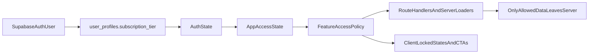

# Paywall Access Layer

## Security-First Direction

Your requirement means the paywall cannot be treated as a UI problem. If a non-paying user can still fetch the underlying response through the browser, page payload, or Supabase client, the data is effectively public.

The implementation should therefore follow this order:

1. classify which datasets are actually paid
2. remove public access to those datasets
3. centralize entitlement checks on the server
4. add reusable app-state helpers for UX and routing
5. roll out locked states page by page

## Canonical Access Matrix

Use this as the source of truth for both dataset security and UI behavior.

### Public or teaser-safe

- performance charts and model performance summaries on Performance and Strategy Model pages
- portfolio performance stats and rankings on Explore portfolios
- stock price graphs and recent news on stock pages
- landing-page stock prices
- premium stock names/tickers on the landing search, shown as locked
- newsletter signup

### Signed-in free

- onboarding flow is required before overview and portfolio-following surfaces
- overview shell and top performing portfolio summary, but no holdings and no rebalance actions
- AI Ratings for about 40 non-premium stocks for the default model only
- no rankings in AI Ratings
- stock pages for non-premium stocks on the default model, but still no rankings
- stock pages for premium stocks show only price/news plus locked AI area
- your portfolios is usable after onboarding, but holdings tables stay fully locked

### Supporter

- all paid holdings data and rebalance-action data for the default model only
- full AI Ratings and rankings for the default model only
- full stock-page AI data for all stocks on the default model only
- full portfolio functionality, notifications, and explore holdings for the default model only
- premium models remain visible as locked choices where appropriate

### Outperformer

- all paid data across all strategy models
- model-scoped ratings/history across all models
- all portfolio holdings data across all models
- full stock-page AI data across all models
- future access for Custom Strategies and Chat once those features ship

## Dataset Classification

Classify the actual data, not just the pages.

### Fully public datasets

- strategy model metadata safe for public comparison
- strategy/model performance time series and summary metrics
- portfolio config performance stats and rankings
- stock prices and recent news
- non-sensitive landing search metadata

### Supporter-only datasets

- latest and historical portfolio holdings for the default strategy model
- rebalance actions for the default strategy model
- full AI ratings dataset for the default strategy model
- stock-page AI detail for all stocks on the default strategy model
- portfolio-following data that reveals paid holdings outputs for the default strategy model

### Outperformer-only datasets

- latest and historical portfolio holdings for non-default strategy models
- rebalance actions for non-default strategy models
- full AI ratings dataset for non-default strategy models
- stock-page AI detail for non-default strategy models
- model-filtered portfolio and alerting data across all models

### Teaser-only datasets

These can be rendered as locked UI, but the raw paid payload must not be sent:

- latest holdings teasers on the Performance page
- portfolio holdings table shells on Explore portfolios and Your Portfolios
- locked premium model entries in dropdowns
- locked AI rating areas for premium stocks or premium models

## What Exists Now

The app already has the billing truth and much of the auth plumbing you need:

- `[/Users/bennyrubanov/Coding_Projects/aitrader/src/lib/auth-state.ts](/Users/bennyrubanov/Coding_Projects/aitrader/src/lib/auth-state.ts)` already exposes `subscriptionTier` and `hasPremiumAccess`.
- `[/Users/bennyrubanov/Coding_Projects/aitrader/src/lib/get-initial-auth-state.ts](/Users/bennyrubanov/Coding_Projects/aitrader/src/lib/get-initial-auth-state.ts)` and `[/Users/bennyrubanov/Coding_Projects/aitrader/src/components/auth/auth-state-provider.tsx](/Users/bennyrubanov/Coding_Projects/aitrader/src/components/auth/auth-state-provider.tsx)` both hydrate from `user_profiles.subscription_tier`.
- `[/Users/bennyrubanov/Coding_Projects/aitrader/src/app/api/platform/holdings/route.ts](/Users/bennyrubanov/Coding_Projects/aitrader/src/app/api/platform/holdings/route.ts)` already enforces `supporter | outperformer`.
- `[/Users/bennyrubanov/Coding_Projects/aitrader/src/components/performance/performance-page-public-client.tsx](/Users/bennyrubanov/Coding_Projects/aitrader/src/components/performance/performance-page-public-client.tsx)` currently infers guest/free/premium indirectly from `/api/platform/holdings` returning `401` or `403`.

But there are also current exposure points that need to be addressed before the paywall is trustworthy:

- `[/Users/bennyrubanov/Coding_Projects/aitrader/supabase/rls_policies.sql](/Users/bennyrubanov/Coding_Projects/aitrader/supabase/rls_policies.sql)` currently grants public read access to several strategy/research tables, including `strategy_portfolio_holdings`, `ai_analysis_runs`, `strategy_performance_weekly`, `strategy_quintile_returns`, and `strategy_cross_sectional_regressions`.
- `[/Users/bennyrubanov/Coding_Projects/aitrader/src/lib/platform-performance-payload.ts](/Users/bennyrubanov/Coding_Projects/aitrader/src/lib/platform-performance-payload.ts)` uses `createPublicClient()` broadly, which is correct for truly public datasets but unsafe for any dataset you later decide is paid.
- `[/Users/bennyrubanov/Coding_Projects/aitrader/src/app/api/platform/explore-portfolio-config-holdings/route.ts](/Users/bennyrubanov/Coding_Projects/aitrader/src/app/api/platform/explore-portfolio-config-holdings/route.ts)` is currently public and returns holdings data.
- `[/Users/bennyrubanov/Coding_Projects/aitrader/src/app/api/platform/ratings/route.ts](/Users/bennyrubanov/Coding_Projects/aitrader/src/app/api/platform/ratings/route.ts)` correctly gates strategy-specific ratings to `outperformer`, which is a good model to reuse.

## Proposed Architecture

Treat access as two separate layers:

### 1. Create a paid-data inventory

Before implementation, define which datasets are:

- fully public
- teaser-safe public
- supporter-only
- outperformer-only

This should be done at the dataset level, not the page level. For example:

- strategy summary stats may remain public
- latest portfolio holdings may be paid
- historical holdings may be paid
- strategy-filtered ratings may be outperformer-only
- raw AI stock ratings may be paid

That inventory will determine which current public routes and public RLS grants must change.

### 2. Lock sensitive data at the server and database boundary

Apply best practice for any valuable paid dataset:

- do not expose it through `createPublicClient()` reads
- do not include it in public SSR payloads
- do not leave it behind open `/api/platform/*` routes
- do not leave the underlying tables/views queryable by `anon` or broadly by `authenticated` if free users should not access them

For this codebase, that likely means reviewing and tightening:

- `[/Users/bennyrubanov/Coding_Projects/aitrader/supabase/rls_policies.sql](/Users/bennyrubanov/Coding_Projects/aitrader/supabase/rls_policies.sql)`
- `[/Users/bennyrubanov/Coding_Projects/aitrader/src/lib/platform-performance-payload.ts](/Users/bennyrubanov/Coding_Projects/aitrader/src/lib/platform-performance-payload.ts)`
- `[/Users/bennyrubanov/Coding_Projects/aitrader/src/app/api/platform/explore-portfolio-config-holdings/route.ts](/Users/bennyrubanov/Coding_Projects/aitrader/src/app/api/platform/explore-portfolio-config-holdings/route.ts)`
- any other `api/platform` routes that return strategy, ratings, or holdings data

The goal is: if a user is not entitled, the server returns no sensitive payload at all.

### 3. Centralize entitlement checks

Add one shared server-side access helper that resolves:

- `guest`
- `free`
- `supporter`
- `outperformer`

and answers entitlement questions like:

- can this user receive latest holdings data?
- can this user receive historical holdings data?
- can this user receive strategy-scoped ratings?
- can this user receive raw AI rating outputs?

Then use that same helper in route handlers and server loaders before any sensitive query executes or before any sensitive response is returned.

### 4. Add a derived access model for UI reuse

Add a shared module alongside auth, for example `[/Users/bennyrubanov/Coding_Projects/aitrader/src/lib/app-access.ts](/Users/bennyrubanov/Coding_Projects/aitrader/src/lib/app-access.ts)`, with:

- `type AppAccessState = 'guest' | 'free' | 'supporter' | 'outperformer'`
- `getAppAccessState(authState)`
- small predicates derived from the server entitlement rules
- optional feature-key policy map, e.g. `FEATURE_ACCESS.performanceLatestHoldings = ['supporter', 'outperformer']`

This module is for consistent UX and client branching. It should not be the only protection layer.

### 5. Remove duplicated tier-to-state mapping

Extract the duplicated `user_profiles` -> `AuthState` mapping into one shared helper used by both:

- `[/Users/bennyrubanov/Coding_Projects/aitrader/src/lib/get-initial-auth-state.ts](/Users/bennyrubanov/Coding_Projects/aitrader/src/lib/get-initial-auth-state.ts)`
- `[/Users/bennyrubanov/Coding_Projects/aitrader/src/components/auth/auth-state-provider.tsx](/Users/bennyrubanov/Coding_Projects/aitrader/src/components/auth/auth-state-provider.tsx)`

That keeps server render, client hydration, and the access layer perfectly aligned.

## First Rollout Slice

### Performance pages

Use the new access layer inside `[/Users/bennyrubanov/Coding_Projects/aitrader/src/components/performance/performance-page-public-client.tsx](/Users/bennyrubanov/Coding_Projects/aitrader/src/components/performance/performance-page-public-client.tsx)`:

- Read `useAuthState()` directly instead of treating `401/403` as the primary source of page state.
- Keep all performance charts, config performance, and model performance visible to all four states.
- Gate only the holdings section via the shared feature policy, after its underlying data path is confirmed secure.
- For `guest` and `free`:
  - rename the section from `Portfolio holdings` to `Top rated stocks`
  - show locked/teaser presentation and CTA
  - CTA copy differs by state:
    - `guest` -> sign in / get started
    - `free` -> upgrade / view plans
- For `supporter` and `outperformer`:
  - show the current holdings table exactly as today

Implementation note: keep the API enforcement in `[/Users/bennyrubanov/Coding_Projects/aitrader/src/app/api/platform/holdings/route.ts](/Users/bennyrubanov/Coding_Projects/aitrader/src/app/api/platform/holdings/route.ts)`. The client access layer should drive UX; the API remains the security boundary.

Also review whether `strategy_portfolio_holdings` and related paid-source tables should remain publicly readable at all in Supabase. If not, tighten RLS and route those reads through your server only.

### Strategy Model pages

The strategy-model pages are already mostly public SSR content and do not currently expose the same holdings table. For this first slice, likely only light alignment is needed:

- ensure any CTA/copy references use the same access terminology
- do not add new restrictions where nothing sensitive is currently exposed
- reserve the shared feature-policy layer for later gated elements on these pages

## What Best Practice Means Here

For your requirements, best practice is:

- free and guest users never receive paid raw data in any response
- client lock states are cosmetic only; the server decides what data exists
- Supabase `anon` access is limited to genuinely public datasets
- `authenticated` access is not automatically trusted; free users still need plan checks
- all paid data routes use one entitlement helper, not scattered inline tier checks
- page-by-page rollout is fine only after the data boundary is secure

That gives you one place to answer:

- what state is this user in?
- what data can this state receive?
- what CTA should this state see?

## Immediate High-Risk Areas To Audit

- `[/Users/bennyrubanov/Coding_Projects/aitrader/supabase/rls_policies.sql](/Users/bennyrubanov/Coding_Projects/aitrader/supabase/rls_policies.sql)` because several strategy and research tables are currently public.
- `[/Users/bennyrubanov/Coding_Projects/aitrader/src/lib/platform-performance-payload.ts](/Users/bennyrubanov/Coding_Projects/aitrader/src/lib/platform-performance-payload.ts)` because it reads broadly with `createPublicClient()`.
- `[/Users/bennyrubanov/Coding_Projects/aitrader/src/app/api/platform/explore-portfolio-config-holdings/route.ts](/Users/bennyrubanov/Coding_Projects/aitrader/src/app/api/platform/explore-portfolio-config-holdings/route.ts)` because it is public and returns holdings.
- `[/Users/bennyrubanov/Coding_Projects/aitrader/src/app/api/platform/ratings/route.ts](/Users/bennyrubanov/Coding_Projects/aitrader/src/app/api/platform/ratings/route.ts)` as the pattern to standardize, since it already gates by plan.
- any other route or server helper returning AI stock ratings, current portfolio constituents, or historical holdings.

## Concrete Enforcement Targets

The access helper should answer at least these questions:

- can access overview shell?
- can access onboarding-required platform pages?
- can receive holdings for default model?
- can receive holdings for non-default models?
- can receive rebalance actions for default model?
- can receive rebalance actions for non-default models?
- can receive full ratings for default model?
- can receive full ratings for non-default models?
- can receive rankings?
- can receive stock AI details for premium stocks on default model?
- can receive stock AI details for non-default models?

That produces a reusable rule set that can be consumed by:

- route handlers and server loaders for security
- client components for locked state copy and CTA selection
- navigation for hiding or locking unavailable entry points

## Key Implementation Notes

- Do not replace API checks with client-only checks.
- Keep `subscription_tier` as the billing truth in `user_profiles`; the new layer should be derived, not a second source of truth.
- For this first slice, treat `Top rated stocks` as the locked-state section title/copy, not a new public holdings dataset. If later you want an actual public stock list here, add a separate safe endpoint rather than loosening the holdings route.
- Avoid using `hasPremiumAccess` alone for all future rules, because `supporter` and `outperformer` will diverge more over time; use the four-state access model instead.
- If you tighten paid-table access in Supabase, update both `supabase/schema.sql` and `supabase/rls_policies.sql`, and add any needed helper SQL function for the new access model.
- The safest default is: if a dataset contains raw AI output, rankings, holdings, or rebalance actions, assume it is paid until explicitly marked public.
