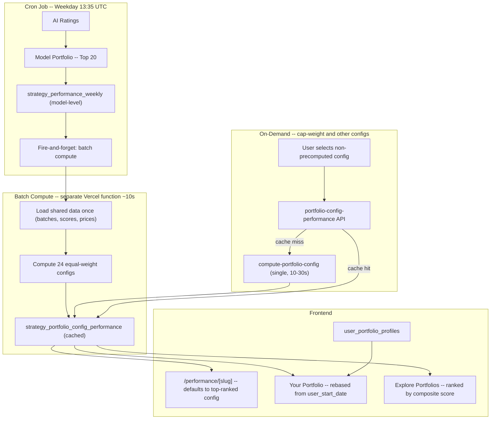

# Portfolio Platform Overhaul

## Current State Assessment

The portfolio construction layer (Layer B) schema and core compute pipeline exist but are partially wired. Key gaps:

- **Queue drain gap**: Cron enqueues config compute jobs into `portfolio_config_compute_queue`, but **nothing drains it**. The compute endpoint (`/api/internal/compute-portfolio-config`) processes individual jobs but is never called automatically.
- **Config-metrics mismatch on /performance/[slug]**: The `PublicPortfolioConfigPerformance` component drives only the chart. Flip cards, returns tables, risk metrics, and consistency stats still use model-level `strategy_performance_weekly` data, creating a mismatch when a non-default config is selected.
- **Late user entry not implemented**: `user_portfolio_profiles` table exists with `user_start_date` but is never read or written. Entry date is localStorage-only.
- **User portfolio API is old-style**: `/api/platform/user-portfolio` only reads `user_portfolio_stocks` (watchlist), not `user_portfolio_profiles`.

---

## Workstream 1: Config Compute Pipeline (Foundation)

Without this, no config performance data exists for non-default configs, and the ranking system has nothing to rank.

### Compute time estimates

Per-config individually: 1-3s (DB round trips dominate). But the expensive queries (batches, scores, prices) are identical across configs for the same strategy. A **batch endpoint** that loads shared data once can compute all 24 equal-weight configs in ~7-10s.

### Approach: Batch precompute (equal-weight) + on-demand (cap-weight)

**A. New batch compute endpoint: `/api/internal/compute-portfolio-configs-batch`**

- Accepts `{ strategy_id }`.
- Loads shared data once: all batches, all AI scores, all prices/market caps.
- Iterates over all 24 equal-weight configs (risk 1-6 x weekly/monthly/quarterly/yearly): for each, filters rebalance dates by frequency, builds top-N holdings, computes equity curve, upserts rows.
- Default config (risk-3/weekly/equal/top-20) uses `backfill_portfolio_config_mappings()` shortcut.
- `maxDuration = 120` (generous, expect ~10s).
- Idempotent (upsert semantics).

**B. Cron changes in `[src/app/api/cron/daily/route.ts](src/app/api/cron/daily/route.ts)`**

- After Step 15b enqueue: fire-and-forget `fetch('/api/internal/compute-portfolio-configs-batch', { strategy_id })`. The cron does NOT await the response -- it returns immediately. The batch compute runs as a separate Vercel function invocation with its own timeout.
- This means cron runtime is unchanged (adds ~50ms for the fire-and-forget fetch).

**C. On-demand for non-precomputed configs (cap-weight, etc.)**

- `[/api/platform/portfolio-config-performance](src/app/api/platform/portfolio-config-performance/route.ts)` already checks for cached data. When it finds none:
  1. Enqueue via `enqueueConfigCompute()` (dedup lock).
  2. Fire-and-forget `fetch()` to the existing single-config compute endpoint.
  3. Return `computeStatus: 'in_progress'` to frontend.
  4. Frontend polls every 3-5s until `ready`.
- First view: ~10-30s wait. Every subsequent view: instant cache hit.

**D. Queue table** (`portfolio_config_compute_queue`): kept as dedup/status lock to prevent duplicate computes.

### Late user entry: NO per-user computation

Config performance data is strategy-level (same equity curve regardless of viewer). Late entry is a **client-side rebase** in `config-performance-chart.ts`:

- Filter rows to `run_date >= user_start_date`
- Scale first row's equity to `user_investment_size`
- Recompute metrics from this subset

Zero DB work, zero cron work.

---

## Workstream 2: Performance Page -- Config as Primary Driver

**Goal**: When a user selects a config on `/performance/[slug]`, ALL metrics (flip cards, returns table, risk, consistency) reflect that config.

**Approach**: Extend `[src/lib/config-performance-chart.ts](src/lib/config-performance-chart.ts)` to compute the full metrics set from `strategy_portfolio_config_performance` rows (client-side). No new DB columns needed.

### Steps:

1. **Extend `ConfigChartMetrics`** in `config-performance-chart.ts` to include:

- `pctMonthsBeatingNasdaq100` (% months AI equity > Nasdaq cap-weight equity)
- `weeklyReturns` array (for distribution chart)
- `monthlyReturns` array (for returns table)
- Benchmark metrics (nasdaq100 total return/CAGR/maxDrawdown, sp500 same)

1. **Refactor `[performance-page-public-client.tsx](src/components/performance/performance-page-public-client.tsx)`**:

- Move `PublicPortfolioConfigPerformance` to a dominant position (top of page, full-width config selector bar).
- When config data is `ready`, pass `ConfigChartMetrics` down to flip cards, returns table, risk section, consistency section (replacing `payload.metrics`).
- Keep `payload.metrics` (model-level) as a "Model tracking portfolio" fallback/label.
- Research section (quintiles, regression) stays model-level with a label explaining it.

1. **"What you are looking at" section**: Update to reflect the selected config (top_n, frequency, weighting), not the model defaults.

---

## Workstream 3: Strategy Model Page Simplification

**File**: `[src/app/strategy-models/[slug]/page.tsx](src/app/strategy-models/[slug]/page.tsx)`

- Remove the detailed portfolio construction UI (risk/frequency/weighting selector) from this page.
- Keep a brief "Portfolio Construction Options" subsection under Methodology explaining that users can configure risk level (1-6), rebalance frequency, and weighting method, with a CTA link to `/platform/explore-portfolios`.
- Keep the `PublicPortfolioConfigPerformance` chart but default it to the **top-ranked config** (rank === 1), not the default config.
- Header `ModelHeaderCard` stats: switch from model-level to top-ranked config metrics (fetch from `/api/platform/portfolio-configs-ranked`).

---

## Workstream 4: Late User Entry

### 4a. Backend Persistence

Create `**/api/platform/user-portfolio-profile` (new route):

- `POST`: Create a profile in `user_portfolio_profiles` with `user_id`, `strategy_id`, `config_id`, `investment_size`, `user_start_date`. Also snapshot current holdings into `user_portfolio_positions` with `entry_price` from `nasdaq_100_daily_raw`.
- `GET`: Return all active profiles for the authenticated user.
- `PATCH`: Update config or investment size.
- `DELETE`: Soft-delete (set `is_active = false`).

### 4b. Onboarding Writes to DB

Update `[portfolio-onboarding-dialog.tsx](src/components/platform/portfolio-onboarding-dialog.tsx)` "done" step to `POST /api/platform/user-portfolio-profile` (in addition to localStorage context).

### 4c. User-Scoped Performance

In `[your-portfolio-client.tsx](src/components/platform/your-portfolio-client.tsx)`:

- Fetch config performance rows via `/api/platform/portfolio-config-performance`.
- Filter rows to `run_date >= user_start_date`.
- Rebase equity curve: first row becomes `investment_size` (user's entry amount), subsequent rows scale proportionally.
- Compute metrics from this filtered/rebased series.
- Display "Your performance since [entry_date]" vs "Model performance since inception" toggle.

No special cron computation needed -- late entry is purely a **client-side filter + rebase** of existing config performance data.

---

## Workstream 5: Overview Page Redesign

**File**: `[src/components/platform/platform-overview-client.tsx](src/components/platform/platform-overview-client.tsx)`

Current page is a config management + "target vs held" stock comparison view. Replace with a **bento-box dashboard**.

### Remove:

- "Portfolio construction" config tile card (config lives in sidebar + onboarding)
- "What you hold vs. what you should hold" section (stock add/remove is being removed)
- "Automation status" card
- `PortfolioConfigPanel` trigger in header

### New layout (bento grid):

- **Portfolio cards** (one per followed portfolio from `user_portfolio_profiles`):
  - Config summary (risk label, frequency, weighting, top-N)
  - Key stat: total return since entry OR since inception
  - Mini sparkline (from config performance series, last 12 points)
  - Notification on/off toggle
  - Link to "Your Portfolio" detail for that profile
- **Quick links row**: This Week's Ratings, Explore Portfolios, Performance, Strategy Models
- **Empty state** (no portfolios yet): "Get started" CTA that triggers onboarding, brief explanation of what portfolios are

### Onboarding:

- Keep `PortfolioOnboardingDialog` rendering here
- Change title to "Choose starting portfolio configuration"
- Add copy: "You can follow multiple portfolios with different configurations."
- `resetOnboarding()` on mount stays for testing (already has TODO comment)

---

## Workstream 6: "Your Portfolio" Redesign

**File**: `[src/components/platform/your-portfolio-client.tsx](src/components/platform/your-portfolio-client.tsx)`

- **Left sidebar/panel**: List all user profiles (from `user_portfolio_profiles`), each showing strategy name + config summary. Let user switch between portfolios.
- **Main content**:
  - Selected strategy key stats (risk label, frequency, top-N, weighting).
  - Mini performance chart (total returns vs benchmark from entry date).
  - Current holdings table (all stocks in the config, with weekly score history from `strategy_portfolio_holdings`).
  - CTA: "Follow this portfolio" (subscribe to notifications).
- **Bento box presets**: On first load (no profiles), show popular config cards (e.g. "Conservative Weekly", "Aggressive Monthly") that create a profile on click.
- **Remove**: stock add/remove functionality (currently from `user_portfolio_stocks`).
- **Notifications**: Per-profile toggle (stores in `user_portfolio_profiles` or a new `notify` boolean column).

---

## Workstream 7: Explore Portfolios Page

**File**: `[src/components/platform/explore-portfolios-client.tsx](src/components/platform/explore-portfolios-client.tsx)`

Current state is partially implemented. Needs:

- Move below "Your Portfolios" in sidebar nav (currently already below it in `[app-sidebar.tsx](src/components/platform/app-sidebar.tsx)`).
- **Config ranking** (already implemented in `/api/platform/portfolio-configs-ranked`):
  - Composite: `0.4 * Sharpe + 0.3 * CAGR + 0.2 * consistency - 0.1 * drawdown` -- already correct.
  - Badges: "Top ranked", "Best risk-adjusted", "Most consistent" -- already implemented.
  - Do NOT show composite score -- already hidden.
  - "Early performance -- rankings may change" for limited data -- already implemented.
- **Add**: Click a config to show detailed performance (expand card or navigate to a detail view using `PublicPortfolioConfigPerformance`).
- **Add**: "Add to my portfolios" button that creates a `user_portfolio_profile` via the new API.
- **Label each config**: Use existing `label` and `risk_label` from `portfolio_construction_configs`.

---

## Workstream 8: Model Ranking

**Goal**: Rank strategy models against each other (currently only one model, but future-proofing).

**New API**: `/api/platform/strategy-models-ranked`

- For each strategy model:
  - `breadth`: % of its configs beating the benchmark (Nasdaq-100 cap-weight).
  - `quality`: Median config Sharpe or CAGR across all eligible configs.
  - `upside`: Best config's Sharpe or CAGR.
  - `model_score = 0.5 * breadth + 0.3 * quality + 0.2 * upside`
- Used by strategy models list page and as default model selection in onboarding.

**Update** `[strategy-models-client.tsx](src/components/strategy-models/strategy-models-client.tsx)` to use this ranking instead of raw Sharpe from `strategy_performance_weekly`.

---

## Key Architectural Decisions

- **Model performance** (`strategy_performance_weekly`): continuous global track, used for research (quintiles, regression). Computed by cron.
- **Config performance** (`strategy_portfolio_config_performance`): per-config equity curves, drives all user-facing metrics. 24 equal-weight configs **batch-precomputed** after each cron run (~10s, separate function). Cap-weight configs computed **on-demand**.
- **User performance**: same config performance rows, **client-side rebased** from `user_start_date` to `investment_size`. No per-user DB computation.
- **Extended metrics** (consistency, weekly/monthly returns, benchmark comparisons): computed client-side from config performance rows in `config-performance-chart.ts`.
- **Cron load**: unchanged. Adds only a single fire-and-forget `fetch()` (~50ms). Batch compute runs in its own function with a 120s timeout.
- **Ranking**: available immediately on page load because precomputed configs already have performance data. Public pages default to rank-1 config.

---

## Implementation Order

Workstreams are ordered by dependency:

1. **Batch + on-demand compute** (WS1) -- unblocks all config performance data and ranking
2. **Config-performance-chart extension** (WS2 step 1) -- shared foundation
3. **Performance page refactor** (WS2 steps 2-3) -- most visible fix
4. **Strategy model page** (WS3) -- quick cleanup
5. **User profile API** (WS4a) -- backend for user features
6. **Onboarding + overview** (WS4b, WS5) -- wires to backend
7. **Your Portfolio redesign** (WS6) -- depends on user profiles + config perf
8. **Explore Portfolios completion** (WS7) -- depends on user profiles
9. **Model ranking** (WS8) -- independent, can be done anytime
