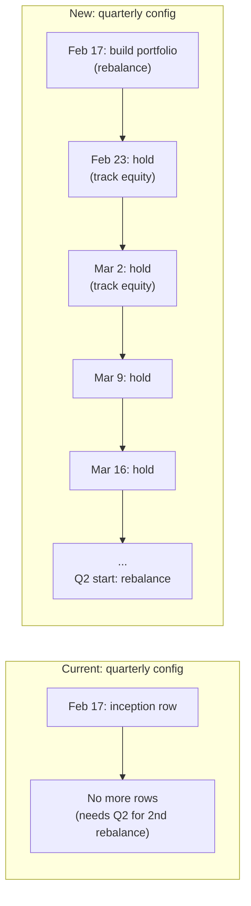

# Precompute All 48 Portfolio Configs (with Buy-and-Hold Tracking)

## Problem

Only 9 of 48 configs have performance data because:

1. The batch route hard-filters to `weighting_method = 'equal'` (24 cap configs excluded)
2. The batch times out before completing even the 24 equal configs (fire-and-forget, 120s max)
3. Quarterly/yearly configs are rejected with "Insufficient historical data" because the compute function requires >= 2 rebalance-frequency batches -- but they should be tracked as buy-and-hold between rebalances

## Key Insight: Buy-and-Hold Between Rebalances

Currently `computeEquityUpsertRows` only produces rows at **rebalance** dates. For weekly configs that works (every week IS a rebalance). But for quarterly/yearly, it means no data until a second rebalance period exists.

The fix: decouple **tracking dates** (every weekly batch) from **rebalance dates** (frequency-dependent). Between rebalances, the portfolio is held unchanged (buy-and-hold), and weekly equity is still tracked. This gives every config a weekly performance curve from inception.



## Changes

### 1. Rework `computeEquityUpsertRows` in [portfolio-config-compute-core.ts](src/lib/portfolio-config-compute-core.ts)

New signature adds `allBatches` (all weekly dates for price tracking):

```typescript
export function computeEquityUpsertRows(params: {
  strategy_id: string;
  config_id: string;
  top_n: number;
  weighting_method: "equal" | "cap";
  allBatches: BatchRow[]; // every weekly batch -- used for price tracking
  rebalanceBatches: BatchRow[]; // subset where holdings change
  scoresByBatch: Map<string, ScoreRow[]>;
  pricesByDate: Map<string, Map<string, number>>;
  capsByDate: Map<string, Map<string, number>>;
}): object[];
```

New logic:

- Build a `Set<string>` of rebalance dates from `rebalanceBatches`
- Iterate over **`allBatches`** (weekly tracking dates starting from the first rebalance date)
- At each rebalance date: build new holdings from scores, incur turnover/transaction cost
- At each non-rebalance date: keep held portfolio unchanged (buy-and-hold), turnover = 0, transaction cost = 0
- Compute `next_rebalance_date` for each row based on the next entry in `rebalanceBatches` (or null if unknown yet)
- Minimum requirement drops from "2 rebalance batches" to "1 rebalance batch + 1 subsequent weekly batch"

### 2. Expand batch route to process ALL configs

In [compute-portfolio-configs-batch/route.ts](src/app/api/internal/compute-portfolio-configs-batch/route.ts):

- Remove `.eq('weighting_method', 'equal')` filter (line 130) -- fetch all 48 configs
- Pass `allBatches` to `computeEquityUpsertRows` alongside the filtered `rebalanceBatches`
- Pass `cfg.weighting_method` instead of hardcoded `'equal'`
- Update docstring from "equal-weight" to "all portfolio configs"

### 3. Prevent timeout: fan-out orchestrator

Refactor the batch route from sequential inline compute to a fan-out:

- Fetch all configs + enqueue them in `portfolio_config_compute_queue`
- Fire parallel `POST /api/internal/compute-portfolio-config` calls (fire-and-forget) for each config
- Return immediately with the list of triggered config IDs
- Each single-config worker gets its own 60s execution budget

### 4. Update single-config worker

In [compute-portfolio-config/route.ts](src/app/api/internal/compute-portfolio-config/route.ts):

- Load `allBatches` (already does this on line 103-107)
- Pass both `allBatches` and `rebalanceBatches` to `computeEquityUpsertRows`
- Remove the `rebalanceBatches.length < 2` rejection (line 114) -- now we only need >= 1 rebalance batch + 1 subsequent weekly batch

### 5. Fix markDone/markFailed to use upsert

Both batch and single-config routes use `.update()` for queue status, which is a no-op when no queue row exists (batch-initiated configs skip the enqueue step). Change `markDone` and `markFailed` in both routes to use `.upsert()` with `onConflict: 'strategy_id,config_id'`.

### 6. Add manual backfill trigger

Add a simple way to trigger a full backfill now without waiting for the next cron:

- Option A: `npm run backfill-configs` script that POSTs to `/api/internal/compute-portfolio-configs-batch` with the active strategy ID and CRON_SECRET
- Option B: Re-use the existing route -- just document a `curl` command the user can run

### 7. Surface buy-and-hold state in UI

In the [portfolio-config-performance API](src/app/api/platform/portfolio-config-performance/route.ts) response, add:

- `nextRebalanceDate: string | null` -- pulled from the latest performance row's `next_rebalance_date`
- `isHoldingPeriod: boolean` -- true when the config has only had its initial rebalance (no second rebalance yet)

In [public-portfolio-config-performance.tsx](src/components/platform/public-portfolio-config-performance.tsx), show a banner when `isHoldingPeriod` is true:

> "This portfolio is in a buy-and-hold period. Next rebalance: {date}. Performance reflects holding the initial selection unchanged."

Replace the existing single-point warning (line 518) with this more informative message.

### 8. Update cron comment

In [cron/daily/route.ts](src/app/api/cron/daily/route.ts) line 1938: update comment to "Precompute all portfolio configs".

## Expected Outcome

- **Weekly** (12 configs): full weekly equity curve from inception
- **Monthly** (12 configs): weekly equity curve, rebalances monthly
- **Quarterly** (12 configs): weekly equity curve, buy-and-hold until Q2 rebalance
- **Yearly** (12 configs): weekly equity curve, buy-and-hold until 2027 rebalance
- Header card: "X of 48" with accurate beat-market counts
- All 48 configs available for ranking from day one
