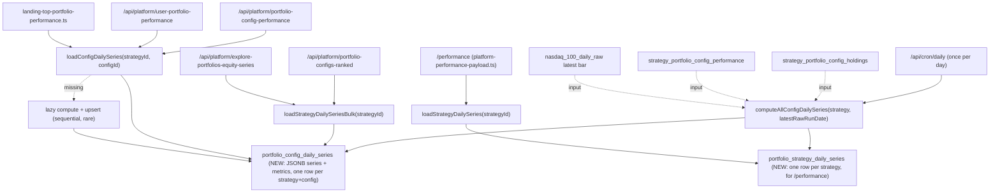

## Root cause

Every one of these six surfaces independently rebuilds the per-config daily mark-to-market series from raw Supabase data on each cache miss:

- [src/app/api/platform/portfolio-configs-ranked/route.ts](src/app/api/platform/portfolio-configs-ranked/route.ts) → [src/lib/portfolio-configs-ranked-core.ts](src/lib/portfolio-configs-ranked-core.ts) (powers `/platform/overview`, sidebar pickers, explore list sort)
- [src/app/api/platform/explore-portfolios-equity-series/route.ts](src/app/api/platform/explore-portfolios-equity-series/route.ts) (powers explore-portfolios chart)
- [src/app/api/platform/portfolio-config-performance/route.ts](src/app/api/platform/portfolio-config-performance/route.ts) (powers single-config detail chart)
- [src/app/api/platform/user-portfolio-performance/route.ts](src/app/api/platform/user-portfolio-performance/route.ts) (powers "your portfolios")
- [src/lib/landing-top-portfolio-performance.ts](src/lib/landing-top-portfolio-performance.ts) (powers the landing top card)
- [src/lib/platform-performance-payload.ts](src/lib/platform-performance-payload.ts) (powers `/performance`, strategy-level variant)

The common building block is `buildDailyMarkedToMarketSeriesForConfig` / `buildLatestMtmPointFromLastSnapshot` in [src/lib/live-mark-to-market.ts](src/lib/live-mark-to-market.ts), which runs a per-rebalance-date `Promise.all` of `getPortfolioConfigHoldings` — each call issues ~5 queries. At 44 configs with weekly cadences this produces ~1.5k–3k Supabase reads per cold invocation, verified against the live project (44 configs, 165 holdings rows, 440 performance rows, `nasdaq_100_daily_raw` latest `2026-04-21`). `unstable_cache` masks it behind a 300s / 7200s layer; every cron-triggered `revalidateTag(RANKED_CONFIGS_CACHE_TAG)` unmasks it for the next visitor.

Key invariant (verified by inspection of every call site): the daily MTM series is **user-independent**. Every metric each surface displays — Sharpe, CAGR, max drawdown, total return, consistency, ending values vs. benchmarks — derives from that series plus, for "your portfolios", a user-specific slice/scale. The series changes at most once per day, tied to the latest `nasdaq_100_daily_raw.run_date`.

## Target architecture



Everything downstream (headline metrics, rebased user series, composite scores, badges, equity plots) becomes deterministic transforms over a single precomputed series.

## Phase 1 — Tables, writer, shared read helper

### 1a. Migration: current + history split

Two pairs of tables, following [.cursor/rules/supabase-migrations.mdc](.cursor/rules/supabase-migrations.mdc) and the existing `strategy_portfolio_config_performance` pattern.

**Config-scoped (44 rows per strategy):**

- `portfolio_config_daily_series` — **current state**. PK `(strategy_id, config_id)`. Upsert-in-place. What every read path queries. Columns:
  - `strategy_id uuid`, `config_id uuid` (PK, FK cascades)
  - `as_of_run_date date` — the `nasdaq_100_daily_raw.run_date` this row is current as of; used to skip work when cron runs twice on the same bar
  - `series jsonb` — array of `{ date, aiTop20, nasdaq100CapWeight, nasdaq100EqualWeight, sp500 }` from inception through `as_of_run_date`
  - Denormalized config-level metrics: `sharpe_ratio`, `cagr`, `total_return`, `max_drawdown`, `consistency`, `weekly_observations`, `decision_observations`, `ending_equity`, `ending_nasdaq100_cap`, `ending_nasdaq100_equal`, `ending_sp500`, `beats_nasdaq_cap_weekly_pct`, `beats_nasdaq_equal_weekly_pct`, `data_status text` (one of `ready | in_progress | failed | empty`)
  - `computed_at timestamptz default now()`
  - Indexes: `(strategy_id, as_of_run_date desc)`, `(strategy_id) include (config_id)` for the ranking bulk read
  - RLS: public read via `public` schema; writes restricted to service role

- `portfolio_config_daily_series_history` — **append-only audit log**. PK `(strategy_id, config_id, as_of_run_date)`. Same columns as current table. One row inserted per cron invocation per config (44 rows/day/strategy). Queried only for time-travel debugging. Retention handled by a future scheduled cleanup job if storage grows (not needed immediately).

**Strategy-scoped (1 row per strategy):**

- `portfolio_strategy_daily_series` — current state, PK `(strategy_id)`. Same JSONB-series-plus-metrics shape, minus `config_id`. Feeds `/performance`.
- `portfolio_strategy_daily_series_history` — append-only, PK `(strategy_id, as_of_run_date)`.

Rationale: current-table reads stay O(1) on a tiny hot index; history lives on a separate larger table used only for audit. Matches the shape of existing weekly `strategy_portfolio_config_performance` but at daily granularity.

### 1b. Shared lib `src/lib/config-daily-series.ts`

Exports:

- `computeConfigDailySeries(adminSupabase, strategy, cfg, perfRows, inceptionDate, latestRawRunDate)` — produces `{ series, metrics, dataStatus }` using the current `computeRankedConfigMetrics` logic (moved here from [src/lib/portfolio-configs-ranked-core.ts](src/lib/portfolio-configs-ranked-core.ts)).
- `computeStrategyDailySeries(adminSupabase, strategy, latestRawRunDate)` — calls `buildDailyMarkedToMarketSeriesForStrategy` once.
- `upsertConfigDailySeries(adminSupabase, rows)` / `upsertStrategyDailySeries(...)` — bulk upserts.
- `loadConfigDailySeries(supabase, strategyId, configId)` — single-row read, returns `null` when missing (triggers lazy path).
- `loadStrategyDailySeriesBulk(supabase, strategyId)` — one query, joined against `portfolio_configs`; returns everything the ranking and explore endpoints need.
- `loadStrategyDailySeries(supabase, strategyId)` — strategy-level for `/performance`.
- `sliceAndScale(series, startDate, investmentSize)` — pure function: slice from `startDate`, divide everything by `series[startDate].aiTop20 / investmentSize`. Returns user-facing series.

Internal `ensureConfigDailySeries(...)` does lazy-compute-and-upsert when a read misses. Used by single-config endpoints so a fresh config doesn't 404.

### 1c. Cron writer

In [src/app/api/cron/daily/route.ts](src/app/api/cron/daily/route.ts), add a final step that runs on **every** invocation (rebalance day and non-rebalance day, since prices change daily):

1. Load `latestRawRunDate` once.
2. For each active strategy:
   - Check whether `portfolio_config_daily_series` already has all configs at `as_of_run_date = latestRawRunDate`. If so, skip.
   - Otherwise compute missing/stale rows with small concurrency (e.g. `Promise.all` over chunks of 4 configs).
   - Bulk upsert into `portfolio_config_daily_series` (current) and bulk insert into `portfolio_config_daily_series_history` (audit).
   - Also compute + upsert `portfolio_strategy_daily_series` (current) and insert into `portfolio_strategy_daily_series_history`.
3. `revalidateTag(CONFIG_DAILY_SERIES_CACHE_TAG)` (new) + existing `RANKED_CONFIGS_CACHE_TAG`.

Also call from [src/app/api/internal/compute-portfolio-configs-batch/route.ts](src/app/api/internal/compute-portfolio-configs-batch/route.ts) and [src/app/api/internal/compute-portfolio-config/route.ts](src/app/api/internal/compute-portfolio-config/route.ts) to keep admin-triggered recomputes coherent.

## Phase 2 — Rewrite each surface to read, not recompute

### 2a. Ranking endpoint (`/platform/overview`, sidebar picker, explore list)

Replace body of `loadPortfolioConfigsRankedPayload` in [src/lib/portfolio-configs-ranked-core.ts](src/lib/portfolio-configs-ranked-core.ts):

1. `strategy_models` by slug (1 query)
2. `portfolio_configs` (1 query)
3. `loadStrategyDailySeriesBulk(strategyId)` (1 query → joined rows with metrics)
4. Build `RankedConfig[]`, composite score, badges in-memory. Composite math + normalization unchanged.
5. Lazy compute for any missing configs (expected 0 steady-state).

Target: **3 Supabase queries** (down from ~2000).

### 2b. Explore equity series endpoint

Replace body of `loadExplorePortfoliosEquitySeriesPayload` in [src/app/api/platform/explore-portfolios-equity-series/route.ts](src/app/api/platform/explore-portfolios-equity-series/route.ts):

1. Strategy + `portfolio_configs` + `loadStrategyDailySeriesBulk(strategyId)` (3 queries)
2. Pivot JSONB `series` arrays into `{ dates[], series[{ configId, label, equities[] }], benchmarks }` in memory. (The pivot logic that already exists at lines 196–245 stays but runs against the snapshot rows.)

### 2c. Single-config detail endpoint

In [src/app/api/platform/portfolio-config-performance/route.ts](src/app/api/platform/portfolio-config-performance/route.ts): replace the `buildDailyMarkedToMarketSeriesForConfig` + `buildLatestMtmPointFromLastSnapshot` block (lines 127–155) with `await ensureConfigDailySeries(admin, strategyId, configId)` → recompute metrics from series if the consumer needs different sharpeReturns basis.

### 2d. User-portfolio endpoint

In [src/app/api/platform/user-portfolio-performance/route.ts](src/app/api/platform/user-portfolio-performance/route.ts): swap the `buildDailyMarkedToMarketSeriesForConfig` + `buildLatestMtmPointFromLastSnapshot` block for `loadConfigDailySeries(...)` → `sliceAndScale(series, userStart, investmentSize)` → `buildMetricsFromSeries(userSeries, ...)`. Pure in-memory, no extra DB round-trips per user.

Deferred optimization: a module-level LRU keyed by `(strategy_id, config_id, user_start_date, invested_cents, as_of_run_date)` would dedup the slice+metric CPU across users with common entry dates. Not added in this pass — the transform is <5ms and the query-count guardrail (phase 4b) will surface it if it becomes a hotspot.

### 2e. Landing top card

In [src/lib/landing-top-portfolio-performance.ts](src/lib/landing-top-portfolio-performance.ts): swap the `buildDailyMarkedToMarketSeriesForConfig` call for `loadConfigDailySeries`.

### 2f. `/performance` page

In [src/lib/platform-performance-payload.ts](src/lib/platform-performance-payload.ts): swap `buildDailyMarkedToMarketSeriesForStrategy` for `loadStrategyDailySeries`.

## Phase 3 — Shrink the remaining on-demand compute path

The cron writer and the lazy-compute fallback still use `buildDailyMarkedToMarketSeriesForConfig`. Make it fast so the daily cron stays well within Vercel limits and lazy fallbacks stay cheap:

1. **Bulk-load holdings** in `loadConfigWalkInputsUncached` at [src/lib/live-mark-to-market.ts](src/lib/live-mark-to-market.ts). Replace the per-rebalance-date `Promise.all(... getPortfolioConfigHoldings(d))` with one `select run_date, holdings from strategy_portfolio_config_holdings where strategy_id = $1 and config_id = $2`. Fall back to the old derivation only if empty.
2. **Cache `loadLatestRawRunDate`** with `react.cache` so it's one round-trip per request.
3. **Skip `rankChange` for MTM paths** — thread an `includeRankChange: false` flag through `getPortfolioConfigHoldings` → `buildHoldingsForBatch` so MTM avoids the prev-batch `ai_analysis_runs` query.

## Phase 4 — Guardrails (prevent regression)

### 4a. ESLint no-restricted-imports

Add to the repo ESLint config:

```js
'no-restricted-imports': ['error', {
  paths: [{
    name: '@/lib/live-mark-to-market',
    importNames: [
      'buildDailyMarkedToMarketSeriesForConfig',
      'buildLatestMtmPointFromLastSnapshot',
      'buildDailyMarkedToMarketSeriesForStrategy',
      'buildLatestLiveSeriesPointForConfig',
      'buildLatestLiveSeriesPointForStrategy',
    ],
    message: 'Use @/lib/config-daily-series helpers instead. The daily series is precomputed by the cron; rebuilding it per request causes Supabase fan-out. See .cursor/rules/daily-snapshot-invariant.mdc.',
  }],
}]
```

Plus a `no-restricted-imports` override in `src/lib/config-daily-series.ts`, `src/app/api/cron/**`, and `src/app/api/internal/compute-**` where those helpers are legitimately used.

### 4b. Supabase query-count instrumentation

Wrap `createAdminClient` / `createPublicClient` / `createClient` in [src/utils/supabase/](src/utils/supabase) to proxy each Supabase query through a counter keyed by an `AsyncLocalStorage` request scope. Add a Next.js middleware that starts a counter per request and logs `[supabase-count] path=… count=…` on response. In development and CI, throw above a threshold (default 50 queries/request) so fan-out regressions become test failures, not observability-only warnings.

### 4c. Workspace rule

Add `.cursor/rules/daily-snapshot-invariant.mdc` (AI-readable; not user docs) documenting:

- The "one daily write, many reads" pattern.
- The set of endpoints that must read from `portfolio_config_daily_series` / `portfolio_strategy_daily_series`.
- The ESLint-enforced allowlist of files that may import the raw MTM builders.
- A reminder that per-user views are slice+scale over the shared series, never a fresh DB fan-out.

### 4d. Cache hygiene

Introduce `CONFIG_DAILY_SERIES_CACHE_TAG`. Drop the `unstable_cache` wrappers on the four endpoints above — caching now lives in Postgres (precomputed rows), so the in-memory layer just adds staleness without saving compute. Keep `Cache-Control: public, s-maxage=…` response headers for CDN-layer dedup.

## Verification

- For a known slug, diff JSON payloads of each of the six endpoints before vs. after. Metric fields must match within 1e-9.
- Hit each endpoint 10× cold: Vercel logs should show ≤10 Supabase queries per request (target: 3–5).
- Cron logs: "config daily series: wrote 44 rows in Ns" and "strategy daily series: wrote 1 row" every run.
- Delete one row from `portfolio_config_daily_series` for a config; hit the ranking endpoint; confirm lazy recompute upserts just that row and doesn't fan out the rest.
- Verify ESLint fails on a crafted PR that imports `buildDailyMarkedToMarketSeriesForConfig` from a new file outside the allowlist.
- Verify query-count guardrail throws in dev when a synthetic test route runs the old fan-out code.
