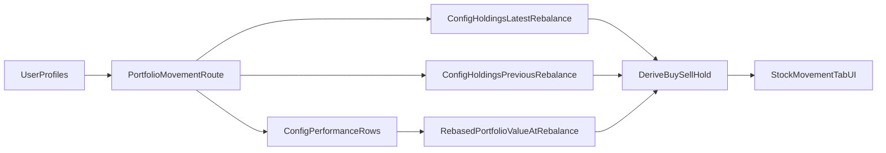

# Build Stock Movement Tab

## What Changes

Replace the current notification-based panel in [`/Users/bennyrubanov/Coding_Projects/aitrader/src/components/platform/platform-overview-client.tsx`](/Users/bennyrubanov/Coding_Projects/aitrader/src/components/platform/platform-overview-client.tsx) with a config-aware portfolio movement view.

The current tab is still wired to `OverviewTrackedStocksPanel`, `notifyProfiles`, and `stockNotif`:

```2116:2124:/Users/bennyrubanov/Coding_Projects/aitrader/src/components/platform/platform-overview-client.tsx
              <TabsContent
                value="tracked-stocks"
                className="mt-5 ring-offset-0 focus-visible:outline-none focus-visible:ring-0"
              >
                <OverviewTrackedStocksPanel
                  notifyProfiles={notifyProfiles}
                  stockNotif={stockNotif}
                />
              </TabsContent>
```

The replacement should use config-level holdings snapshots, not the old weekly strategy notification route, because user portfolios can rebalance weekly, monthly, quarterly, or yearly.

```174:220:/Users/bennyrubanov/Coding_Projects/aitrader/src/lib/portfolio-config-holdings.ts
export async function getPortfolioConfigHoldings(
  supabase: SupabaseClient,
  strategyId: string,
  riskLevel: number,
  rebalanceFrequency: string,
  weightingMethod: string,
  asOfRunDate: string | null
): Promise<{
  holdings: HoldingItem[];
  asOfDate: string | null;
  configSummary: ConfigHoldingsSummary | null;
  rebalanceDates: string[];
}> {
  ...
}
```

## Data Flow



## Implementation Steps

### 1. Build a dedicated movement payload

Add a new authenticated route, likely under [`/Users/bennyrubanov/Coding_Projects/aitrader/src/app/api/platform/`](/Users/bennyrubanov/Coding_Projects/aitrader/src/app/api/platform/), that accepts a `profileId` and returns one portfolio’s last rebalance summary.

For each profile, the route should:

- Load the user profile and its `strategy_id`, `config_id`, `investment_size`, `user_start_date`, and config metadata.
- Resolve the config cadence from the profile’s `portfolio_config` fields.
- Use `getPortfolioConfigHoldings(...)` twice: once for the latest rebalance snapshot and once for the immediately previous rebalance snapshot.
- Use config performance rows from [`/Users/bennyrubanov/Coding_Projects/aitrader/src/lib/portfolio-config-utils.ts`](/Users/bennyrubanov/Coding_Projects/aitrader/src/lib/portfolio-config-utils.ts) and the existing rebase helpers in [`/Users/bennyrubanov/Coding_Projects/aitrader/src/lib/config-performance-chart.ts`](/Users/bennyrubanov/Coding_Projects/aitrader/src/lib/config-performance-chart.ts) to compute the portfolio’s dollar notional at that rebalance date.
- Derive three groups by diffing previous vs current config holdings:
  - `buy`: names newly entering the portfolio
  - `sell`: names leaving the portfolio
  - `hold`: names present in both snapshots
- For each row, include target weight, target dollar value, and trade delta dollar value. The default assumption is that dollar targets should be based on the user portfolio’s rebased value on that rebalance date, not just the original `investment_size`.
- Return an empty-state payload for portfolios that do not yet have two rebalance snapshots.

### 2. Remove notification-specific code

Delete the notification-only state and fetch path from [`/Users/bennyrubanov/Coding_Projects/aitrader/src/components/platform/platform-overview-client.tsx`](/Users/bennyrubanov/Coding_Projects/aitrader/src/components/platform/platform-overview-client.tsx):

- `StockNotifState`
- `RebalanceAction` / `HoldingRow` types that only support the old panel
- `notifyProfiles`
- the `useEffect` that calls `/api/platform/stock-notifications`
- `OverviewTrackedStocksPanel`

Also remove the obsolete route at [`/Users/bennyrubanov/Coding_Projects/aitrader/src/app/api/platform/stock-notifications/route.ts`](/Users/bennyrubanov/Coding_Projects/aitrader/src/app/api/platform/stock-notifications/route.ts) once the new tab no longer depends on it.

### 3. Build the new tab UI

In [`/Users/bennyrubanov/Coding_Projects/aitrader/src/components/platform/platform-overview-client.tsx`](/Users/bennyrubanov/Coding_Projects/aitrader/src/components/platform/platform-overview-client.tsx), replace the old tab content with a list of portfolio movement cards.

Each row should be a two-column layout:

- Left: a compact tile-like portfolio summary, reusing the same visual language and helpers already used by `OverviewPortfolioTile` for strategy name, config line, risk badge, entry/investment labels, and current value where appropriate.
- Right: last rebalance date, then grouped lists for `Hold`, `Sell`, and `Buy` with per-stock dollar targets. Each row should make the intended action obvious at a glance.

Use all active `profiles`, not `notifications_enabled`, since the feature is no longer notification-driven.

### 4. Handle loading and sparse-history states

Add clear states for:

- no portfolios
- loading per-portfolio movement data
- only one rebalance snapshot available
- config performance not yet computed

These should keep the tab usable even for new or infrequently rebalanced portfolios.

### 5. Verify and tighten

After implementation:

- run lints on the touched files
- make sure the tab still renders correctly when one or many portfolios exist
- confirm monthly / quarterly / yearly portfolios show the correct config rebalance date rather than the model’s weekly action date
- confirm the old notification route and imports are no longer referenced
