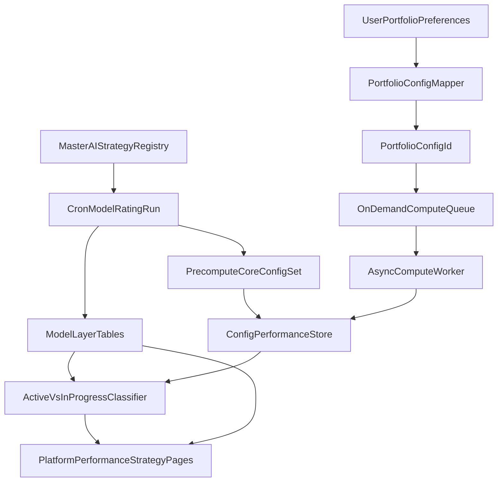

# Segment Strategy And Portfolio Layers

## Product Intent To Implement

- Explicitly separate:
  - **Layer A: AI strategy rating models** (prompt + model + ranking output)
  - **Layer B: portfolio construction** (risk, rebalance frequency, weighting, investment size)
- Keep current model performance/research credibility intact while adding user-facing construction controls.
- Make portfolio construction controls visible and synchronized across:
  - platform overview
  - sidebar
  - performance pages
  - strategy model pages
- Ship defaults and label them clearly:
  - top 20
  - equal weighting
  - $10,000 starting investment
  - weekly rebalancing
  - balanced risk (risk level 3)

## Decision Principles

- Avoid over-personalization beyond a minimal input set in this release.
- Preserve reproducibility and comparability of strategies (no hidden dynamic strategy switching).
- Keep **model-level since inception** and **user-level since join date** strictly separate.
- Prioritize clean migration over runtime backward compatibility while preserving historical data joins.

## Scope Included (Big-Bang)

- Backend redesign for strategy registry + portfolio config layer.
- Supabase schema additions/migrations/backfill, including hard table rename and slug migration.
- Hybrid performance compute architecture:
  - light precompute in cron
  - async on-demand compute for other configs
- Frontend UX redesign (platform + performance + strategy model surfaces, mobile-ready onboarding).
- Recommended portfolio logic and timeframe/status messaging.
- Late-entry user portfolio handling and performance labeling.

## User Inputs And Portfolio Construction Contract

- Required user inputs (MVP):
  - `rebalance_frequency` (`weekly`, `monthly`, `quarterly`, `yearly`)
  - `risk_level` (`1..6`)
- Optional inputs:
  - `weighting_method` (`equal`, `cap`)
  - `investment_size (default to $10000)`
- Risk mapping to portfolio size (`top_n`):
  - 1 conservative -> top 30
  - 2 careful -> top 25
  - 3 balanced -> top 20
  - 4 aggressive -> top 10
  - 5 max_aggression -> top 5
  - 6 experimental -> top 1
- Weighting behavior:
  - `equal`: equal target weights across selected names.
  - `cap`: weights by normalized market cap within selected top-N set.

## Strategy Model Naming And Identity

- Introduce canonical display identity:
  - `AIT-1 Daneel`, `AIT-2 ...`
- Canonical slug must correspond directly to canonical display identity:
  - example slug: `ait-1-daneel`
  - example canonical route: `/strategy-model/ait-1-daneel`
- No runtime backward-compatibility layer for old slug formats after migration.
- Legacy slugs are migrated to canonical slugs in-place as part of DB migration.
- Target identity model:
  - technical immutable strategy row (UUID + canonical slug + app-version lineage)
  - display identity fields (`ait_code`, `robot_name`, `display_name`)
- Keep “strategy model versioning” independent from “portfolio construction settings”.
- Remove model-version axis from identity (`MODEL_VERSION` retired).

## Strategy Registry Refactor

- Replace single static `STRATEGY_CONFIG` dependency with a master strategy registry file:
  - contains strategy code/name metadata
  - model provider/name + inference settings
  - prompt system/developer instructions + user input template
  - universe/rating run controls
- Preserve existing version guards in cron:
  - no silent prompt/model mutation
  - mismatch throws remain in place
- Changelog concern handling:
  - keep `APP_VERSION` as sole strategy lineage/version guardrail
  - add validation workflow so config changes cannot ship without version/changelog updates
  - include strategy registry metadata to reduce manual misses

## Routing And Slug Contract

- Canonical strategy route is singular:
  - `/strategy-model/[slug]` where slug is canonical identity, e.g. `ait-1-daneel`
- Slug is the primary strategy identity across frontend and backend lookups.
- `APP_VERSION` remains part of strategy identity lineage metadata, but is not required in visible slug.
- No legacy route compatibility requirement post-migration:
  - old `/strategy-models/[slug]` and legacy slug formats are not maintained at runtime
  - all clients must use canonical `/strategy-model/[slug]`
- All performance/model/config queries must key by canonical slug -> strategy_id resolution.

## Supabase Schema Design (Detailed)

- Keep existing core tables:
  - `ai_models` (no longer used as a strategy identity version axis; model metadata only)
  - `ai_prompts`
  - NASDAQ membership and stock tables
  - user/newsletter/subscription tables
  - existing `strategy` analytics tables (model-level truth)
- Rename existing `trading_strategies` table to `strategy_models` via migration.
- Add AIT display fields + lifecycle columns on `strategy_models`.
- Keep historical links by `strategy_id` (FKs continue pointing to the same UUIDs after rename).
- Migrate legacy slug values in `strategy_models.slug` to canonical format in-place.
- Add portfolio construction domain:
  - `portfolio_construction_configs`
    - dimensions: `risk_level`, `rebalance_frequency`, `weighting_method`, `top_n`
    - metadata: `label`, `is_default`, `min_suggested_investment`
  - `strategy_portfolio_config_performance`
    - key: (`strategy_id`, `config_id`, `run_date`)
    - metrics: returns/equity/turnover/transaction_cost
    - status fields: `strategy_status`, `first_rebalance_date`, `next_rebalance_date`
    - validity flags for comparison eligibility
  - `user_portfolio_profiles`
    - key: one active profile per user per strategy/config (or per user-selected profile)
    - stores `investment_size`, `user_start_date`, `entry_prices_snapshot_at`, `next_rebalance_date`
  - `user_portfolio_positions`
    - holdings and target/current weights/units
  - optional `user_portfolio_trades`
    - generated buy/sell/adjust instructions over time
- RLS updates:
  - strategy/model/config performance readable to anon/authenticated as needed
  - user portfolio tables locked to owner rows
- Required sync:
  - update [supabase/schema.sql](/Users/bennyrubanov/Coding_Projects/aitrader/supabase/schema.sql)
  - update [supabase/rls_policies.sql](/Users/bennyrubanov/Coding_Projects/aitrader/supabase/rls_policies.sql)
  - update [.cursor/rules/supabase-schema.mdc](/Users/bennyrubanov/Coding_Projects/aitrader/.cursor/rules/supabase-schema.mdc)

## Rebalance Frequency Execution Rules

- Supported options:
  - weekly, monthly, quarterly, yearly
- On config creation/selection:
  - construct portfolio immediately
  - store `rebalance_frequency` and computed `next_rebalance_date`
  - portfolio is active immediately
- Before first scheduled rebalance:
  - behavior = buy-and-hold since inception/allocation
  - no holdings rotation yet
- Strategy status:
  - `in_progress`: no completed rebalance cycle
  - `active`: first rebalance completed
- Display requirements when `in_progress`:
  - show equity curve and total return
  - show label: performance reflects initial allocation only
  - exclude from rankings and “best strategy” leaderboards
- Post first rebalance:
  - promote to `active`
  - include in normal comparisons

## Hybrid Performance Compute Pipeline

- Cron should stay lean to avoid timeout:
  - precompute only core set:
    - risk 1-6 + weekly/monthly + equal
    - risk 3 + weekly/monthly + cap
- Async on-demand compute:
  - when user selects non-precomputed config, enqueue compute job
  - persist results into `strategy_portfolio_config_performance`
  - cache and serve once ready
- Compute orchestration:
  - cron writes run metadata and precompute tasks
  - worker/API route processes tasks asynchronously
  - deduplicate by (`strategy_id`, `config_id`, `run_date`)
- Failure/timeout handling:
  - idempotent retries
  - partial status surfaced to UI (`pending`, `ready`, `failed`)

## Recommended Portfolio Logic

- “Current recommended portfolio” derives from best-performing **eligible** strategy/config pair.
- Eligibility rules:
  - include only `active` configs
  - exclude `in_progress` from ranking
  - require minimum history threshold by selected timeframe
- Timeframe views:
  - weekly, monthly, quarterly, yearly
  - if insufficient history:
    - show explicit “limited historical data” messaging
    - keep chart available where meaningful
- Output details:
  - holdings list
  - target weights
  - trade instructions (buy/sell/adjust)
  - for user investment size, show dollar guidance per position

## Late User Entry Rules

- Always separate:
  - model portfolio (continuous, global)
  - user portfolio (start-date specific)
- On join at `t0`:
  - fetch latest model portfolio state for chosen config
  - initialize user positions at current prices
  - store `user_start_date` and entry basis
- User performance:
  - starts at `t0` only
  - never backfill pre-entry returns into user PnL
- UI must always show both tracks:
  - strategy performance since inception
  - your performance since you started
- Mid-cycle joins:
  - no simulated missed trades
  - follow next scheduled rebalance directly

## Frontend UX Redesign (Page-By-Page)

- Platform overview:
  - primary location for portfolio construction controls
  - first-time onboarding wizard (mobile compatible)
  - clear default labels and recommended defaults
- Sidebar:
  - persistent quick summary of selected config
  - easy entry point to edit config
- Performance page:
  - config selector controls visible
  - charts and metrics react to selected config
  - status/limited-history/in-progress badges
- Strategy model page:
  - same config controls and synchronized state
  - model layer explanation separate from construction layer
- Recommended portfolio page:
  - current recommendation for selected strategy/config context
  - historical portfolio snapshots by period where data exists
- Customized portfolio feature:
  - “Outperformer plan — coming soon” gated module only (non-functional in this release)
- Mobile requirements:
  - onboarding steps and controls fully usable on small screens
  - no desktop-only dependencies in critical flow

## API And Payload Refactor

- Build canonical mapping:
  - `(risk, frequency, weighting) -> portfolio_config_id`
- Extend payload builders to return:
  - selected config metadata
  - config-level performance series
  - status fields (`active`, `in_progress`, compute status)
  - history availability flags
- Update routes and selectors:
  - strategy resolution with canonical slug only
  - config-aware stock history and holdings endpoints
- Preserve existing consumers while adding new fields to avoid abrupt breakage.

## Migration And Backfill Plan

- Introduce non-destructive schema migration first.
- Backfill defaults:
  - map existing weekly top20/equal data into default config rows.
- Strategy naming backfill:
  - assign `AIT-1 Daneel` to current default lineage
  - set canonical slug `ait-1-daneel`
  - convert all legacy slug formats to canonical slugs in `strategy_models`
- Add SQL editor helper function for safe repeatable backfill:
  - `public.backfill_portfolio_config_mappings()`
  - returns counts/checksums for verification
- Verify:
  - historical charts unchanged for legacy default config
  - all updated URLs resolve under canonical route
  - RLS works for user-only tables

## Detailed Execution Sequence

1. Finalize schema contract and status enums.
2. Implement migrations in [supabase/schema.sql](/Users/bennyrubanov/Coding_Projects/aitrader/supabase/schema.sql) and [supabase/rls_policies.sql](/Users/bennyrubanov/Coding_Projects/aitrader/supabase/rls_policies.sql).
3. Add/update migration script(s), including table rename, slug conversion, and backfill function.
4. Introduce master strategy registry and adapt [src/lib/strategyConfig.ts](/Users/bennyrubanov/Coding_Projects/aitrader/src/lib/strategyConfig.ts).
5. Refactor cron at [src/app/api/cron/daily/route.ts](/Users/bennyrubanov/Coding_Projects/aitrader/src/app/api/cron/daily/route.ts) to:

- read registry
- run model layer
- trigger precompute and async tasks

1. Add async compute path (route/job handler + persistence).
2. Update performance payload builders in [src/lib/platform-performance-payload.ts](/Users/bennyrubanov/Coding_Projects/aitrader/src/lib/platform-performance-payload.ts).
3. Update platform data routes:

- [src/app/api/platform/holdings/route.ts](/Users/bennyrubanov/Coding_Projects/aitrader/src/app/api/platform/holdings/route.ts)
- [src/app/api/platform/stock-history/route.ts](/Users/bennyrubanov/Coding_Projects/aitrader/src/app/api/platform/stock-history/route.ts)

1. Add frontend shared config state/provider and wire to platform shell.
2. Implement overview onboarding and sidebar config summary:

- [src/components/platform/app-sidebar.tsx](/Users/bennyrubanov/Coding_Projects/aitrader/src/components/platform/app-sidebar.tsx)
- [src/app/platform/settings/page.tsx](/Users/bennyrubanov/Coding_Projects/aitrader/src/app/platform/settings/page.tsx) (if settings hosts profile controls)

1. Wire performance + strategy model pages to shared config:

- [src/components/performance/performance-page-public-client.tsx](/Users/bennyrubanov/Coding_Projects/aitrader/src/components/performance/performance-page-public-client.tsx)
- [src/app/strategy-model/[slug]/page.tsx](/Users/bennyrubanov/Coding_Projects/aitrader/src/app/strategy-model/[slug]/page.tsx)
- [src/components/platform/performance-page-client.tsx](/Users/bennyrubanov/Coding_Projects/aitrader/src/components/platform/performance-page-client.tsx)

1. Implement recommended portfolio ranking and timeframe availability labels.
2. Add “Outperformer coming soon” custom portfolio placeholder.
3. Run migration verification + regression checks + rollout checklist.

## Validation And Acceptance Criteria

- Layer separation is explicit in code and UI.
- Config changes update displayed performance across platform/performance/model pages.
- Default config appears and is labeled.
- Quarterly/yearly pre-rebalance states show mandatory messaging.
- In-progress configs are excluded from comparative rankings.
- User-vs-model performance labels are always present and correct.
- Canonical strategy route and slugs work end-to-end after migration.
- Cron runtime remains safe (no timeout regressions).

## Risks And Mitigations

- Cron timeout risk -> keep precompute set small + async queue for uncommon configs.
- Data consistency risk -> idempotent writes keyed by strategy/config/date.
- URL breakage risk -> migration checklist updates all internal links to canonical route before release.
- Historical mismatch risk -> backfill verification and side-by-side metric comparisons.
- UI complexity risk -> shared config provider and single source of truth for selection state.

## Data Flow Diagram

## Required SQL Editor Functions (Design)

- `public.backfill_portfolio_config_mappings()`
  - create canonical config rows
  - map legacy weekly performance into default config
  - compute initial status fields and first rebalance dates
  - return counts for each step
- `public.migrate_strategy_model_identity()`
  - rename `trading_strategies` to `strategy_models`
  - convert legacy slugs to canonical identity slugs
  - enforce canonical slug constraints and uniqueness
- `public.verify_strategy_model_migration()`
  - validate renamed table integrity
  - validate slug format and uniqueness
  - validate downstream FK references and row counts
- `public.refresh_strategy_config_performance(p_strategy_id uuid, p_config_id uuid)`
  - recompute config performance deterministically
  - support async retries/idempotency

## Versioning Contract Update

- `MODEL_VERSION` is removed from strategy identity and versioning workflow.
- `APP_VERSION` is retained as the only version lineage field for strategy changes.
- Canonical strategy identity is:
  - `slug` (e.g. `ait-1-daneel`)
  - `ait_code` (e.g. `AIT-1`)
  - `robot_name` (e.g. `Daneel`)
  - `app_version` (for lineage/changelog/audit)
- Cron and mismatch guards compare registry values against DB using this updated contract.
