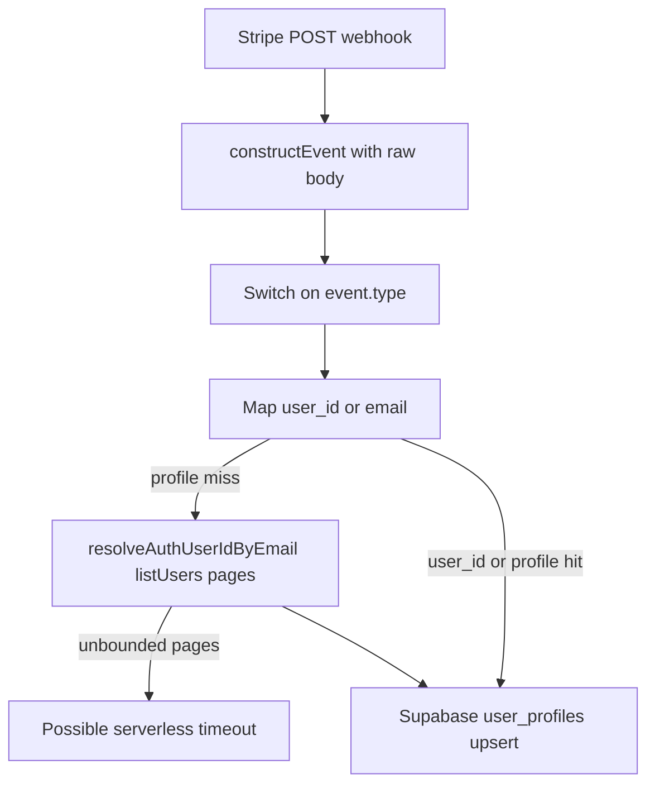

# Fix live Stripe webhook delivery (`/api/stripe/webhook`)

## What the app does today

- Handler: [`src/app/api/stripe/webhook/route.ts`](src/app/api/stripe/webhook/route.ts) — `runtime = "nodejs"`, reads **raw body** via `await req.text()`, verifies with `stripe.webhooks.constructEvent`, then updates `user_profiles` via `createAdminClient()`.
- **Middleware does not run for `/api/...`** (matcher excludes `api/`), so Supabase cookie refresh in [`src/middleware.ts`](src/middleware.ts) / [`src/utils/supabase/middleware.ts`](src/utils/supabase/middleware.ts) is not the likely blocker for Stripe’s server-to-server POSTs.

## Failure modes to distinguish (do this first in Stripe)

In **Stripe Dashboard → Developers → Webhooks → your endpoint → Recent deliveries**, open a few failed attempts and note:

- **HTTP status** (e.g. 400/500) vs **no response / timeout / TLS / DNS** (often bucketed as “other errors” in summary emails).
- **Response body** (your route returns JSON for 400/500 with explicit messages like `Missing STRIPE_WEBHOOK_SECRET` or handler errors).

That single step tells you whether this is **config/hosting** vs **handler runtime**.

## Likely infrastructure / config causes

- **`STRIPE_WEBHOOK_SECRET` missing or wrong in Vercel production** — route returns **500** if unset ([`route.ts` lines 266–268](src/app/api/stripe/webhook/route.ts)); **400** if signature verification fails (live events need the **live** endpoint signing secret, not test).
- **`STRIPE_SECRET_KEY` not live in production** — mismatched keys often surface as signature or downstream Stripe API issues depending on event shape.
- **Vercel Deployment Protection / IP blocking** — if the production deployment requires browser auth for all routes, Stripe may never get a clean 2xx (check Vercel project **Deployment Protection** and any WAF/bot rules in front of `tryaitrader.com`).

## High-probability code issue: unbounded `listUsers` in email fallback

`updateTierByEmail` calls `resolveAuthUserIdByEmail`, which **pages through every Auth user** until it finds a matching email or exhausts all pages — **no page cap** ([`route.ts` lines 111–135](src/app/api/stripe/webhook/route.ts)).

By contrast, [`src/app/api/auth/password-login-hint/route.ts`](src/app/api/auth/password-login-hint/route.ts) already uses **`maxPages`** to bound work.

Why this can match Stripe’s “other errors”:

- If `user_profiles` has no row for the email **and** the Auth user is not found early in pagination (or there is no Auth user), the webhook can run **many sequential `listUsers` calls** and hit **Vercel’s default function wall clock** (often ~10s on lower tiers) → Stripe sees a **timeout / connection reset** rather than a JSON 500.

This path is realistic whenever **`user_id` is absent** from Checkout/Subscription metadata (e.g. checkout started while signed out — see [`src/app/api/stripe/checkout/route.ts`](src/app/api/stripe/checkout/route.ts) where `metadata.user_id` is only set when `user?.id` exists) **and** the email lookup in `user_profiles` misses.

## Recommended implementation direction (after Dashboard confirms timeouts or 500s)

1. **Bound or eliminate the full-user scan**
   - **Short-term (minimal change):** Add a **`maxPages` cap** (and optionally lower `perPage`) in `resolveAuthUserIdByEmail`, mirroring the `password-login-hint` pattern; log clearly when the cap is hit so you can see mapping misses in logs.
   - **Better (still server-only):** Add a **small Postgres helper** (e.g. `security definer` function in `public` querying `auth.users` by normalized email) **executable only by `service_role`**, and call it from the webhook instead of paginating `listUsers`. This preserves correctness for late-matched users without O(n) Auth API paging. (Requires a migration in `supabase/migrations/` plus updates to [`supabase/schema.sql`](supabase/schema.sql) per your repo rules.)

2. **Optional hardening**
   - Add `export const maxDuration = 60` on the webhook route **only if** your Vercel plan allows it (otherwise it has no effect or must be aligned to plan limits). This is a safety margin, not a substitute for fixing unbounded work.

3. **After deploy**
   - Use Stripe’s **“Resend” / replay** for failed events once deliveries return 2xx, and spot-check `user_profiles` billing columns for affected customers.

## Testing and regression procedure

### Phase 0: Baseline evidence (identify root cause before code changes)

1. In Stripe Dashboard for endpoint `https://tryaitrader.com/api/stripe/webhook`, collect at least 3 recent failures:
   - event type
   - delivery status category (HTTP 4xx/5xx vs timeout/TLS/DNS)
   - response body (if present)
   - request timestamp and endpoint version
2. In Vercel logs for the matching timestamps, confirm whether requests reached the function:
   - **No matching request logs** suggests network/protection/TLS routing issues.
   - **Request logs with long duration + timeout** supports the unbounded-work hypothesis.
   - **Immediate 400/500 JSON response** points to env/signature/config issues.
3. Record current env presence in production (values not printed):
   - `STRIPE_SECRET_KEY`
   - `STRIPE_WEBHOOK_SECRET`

### Phase 1: Local functional verification (no regressions in webhook behavior)

Use Stripe CLI with a local server tunnel for deterministic testing:

1. `stripe listen --forward-to localhost:3000/api/stripe/webhook`
2. Trigger representative events:
   - `checkout.session.completed`
   - `invoice.paid`
   - `invoice.payment_failed`
   - `customer.subscription.updated`
   - `customer.subscription.deleted`
3. Verify each returns HTTP `2xx` when payload is valid.
4. Send one request with an invalid signature and verify HTTP `400` still occurs (security behavior must not regress).

### Phase 2: Supabase data assertions (billing correctness)

After each successful replay, validate `user_profiles` updates for affected user(s):

- `subscription_tier`
- `stripe_last_event_id`
- `stripe_last_event_created`
- `stripe_subscription_status`
- billing snapshot fields (`stripe_customer_id`, `stripe_subscription_id`, period end, pending/recurring cadence fields)

Also verify stale event protection still works:

1. Replay a newer event (should update row).
2. Replay an older event for same user (should not overwrite `stripe_last_event_created` state).

### Phase 3: Timeout/regression guard for email fallback path

Create a replay scenario where no direct `user_id` mapping is available (forces email fallback), then verify:

- Handler completes within expected serverless window.
- No unbounded pagination loop occurs.
- If user cannot be mapped, endpoint still returns `2xx` and logs warning (to avoid repeated Stripe retries for non-fatal mapping misses).

### Phase 4: Production validation after deploy

1. Use Stripe Dashboard **Resend** on previously failed events.
2. Confirm delivery status flips to success (`2xx`) and no repeated retries continue.
3. Compare before/after metrics:
   - failed deliveries count
   - timeout/error class distribution
   - median webhook response time (from Stripe delivery logs)

### Pass criteria

- All valid replayed webhook events return `2xx`.
- Invalid signature requests return `400`.
- Supabase entitlement/billing fields update correctly and stale events are ignored.
- No webhook request times out in production for the replayed failure set.
- No new regressions in unrelated Stripe paths (`/api/stripe/checkout`, `/api/stripe/portal`) during smoke tests.

## What we are _not_ seeing in code

- No `middleware` on `/api/stripe/webhook`.
- Body handling for signature verification is **correct** (`req.text()` before parsing).

