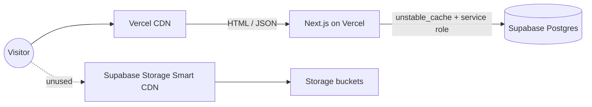

# Supabase egress audit + Smart CDN clarification

## Background

Supabase has two independent egress meters:



- `public-pages-caching.mdc` governs the Vercel chain. Its "egress" means **Postgres bytes** flowing into Next runtime, amortized via `unstable_cache` + `Cache-Control: public, s-maxage=...`.
- Smart CDN only matters for the right chain (object delivery from Storage). The codebase has zero `supabase.storage` usage, no Storage hosts in [`next.config.js`](next.config.js), and all assets live under `public/` served by Vercel. So the right chain is dormant and not affecting bills.

## Part A. Doc note (rule clarification)

Add a short subsection to [`.cursor/rules/public-pages-caching.mdc`](.cursor/rules/public-pages-caching.mdc), positioned after `## Single source of truth`:

```markdown
### Scope: Postgres egress, not Storage egress

This rule governs Supabase **Postgres** egress (rows flowing from `createPublicClient()` / `createAdminClient()` into Next routes). It does NOT govern Supabase **Storage** Smart CDN, which only applies if the project starts serving objects from Storage buckets. The codebase currently has zero `supabase.storage.*` usage, so Smart CDN settings (cacheControl, signed-vs-public buckets, cacheNonce) are out of scope. If/when an asset class moves to Storage, add a sibling section here for those settings; do not conflate the two.
```

Rationale: the existing rule never names the layer, and a future contributor reading it after seeing Supabase's billing dashboard could try to "tighten Smart CDN" without realizing the project doesn't use it.

## Part B. Postgres-egress hotspot tightening

### B1. `/api/stocks` — wrap the 3 daily-stable Postgres reads in `unstable_cache` (primary action)

[`src/app/api/stocks/route.ts`](src/app/api/stocks/route.ts) is `force-dynamic` and called on every `/platform/ratings` load (and any tier-aware browser refresh). Per request, after `getInitialAuthState`-equivalent work (`supabase.auth.getUser()` + `user_profiles` lookup), it does **three** uncached Postgres round-trips that only change once per cron tick:

```36:46:src/app/api/stocks/route.ts
  const { data: dateRow, error: dateErr } = await admin
    .from('nasdaq_100_daily_raw')
    .select('run_date')
    .order('run_date', { ascending: false })
    .limit(1)
    .maybeSingle();

  if (dateErr || !dateRow?.run_date) return map;

  const { data: rows, error: rowsErr } = await admin
    .from('nasdaq_100_daily_raw')
    .select('symbol, company_name, last_sale_price, net_change, percentage_change, run_date')
    .eq('run_date', dateRow.run_date);
```

Plus one of three `nasdaq100_recommendations_current_public` SELECTs (lines 80-128) branched by `access`. None are cached.

**Change:** factor the daily-stable parts into a new `src/lib/stocks-list-payload.ts`:

- `getCachedLatestNasdaqQuotesBySymbol()` — wraps the two `nasdaq_100_daily_raw` reads in `unstable_cache(..., { revalidate: PUBLIC_DATA_CACHE_TTL_SECONDS, tags: [PUBLIC_CACHE_TAGS.stocksCatalog] })`.
- `getCachedRatingsBySymbolForAccess(access)` — three cache entries (`guest` / `free` / `paid`) keyed by access bucket, each tagged `[PUBLIC_CACHE_TAGS.stocksCatalog]` so the existing cron `revalidateTag(stocksCatalog)` in [`src/app/api/cron/daily/route.ts`](src/app/api/cron/daily/route.ts) busts them too. (Note: collapse `supporter` and `outperformer` to `paid` for cache key purposes since both load the unfiltered ratings set.)

Update [`src/app/api/stocks/route.ts`](src/app/api/stocks/route.ts) `GET` to:

1. Resolve `access` (unchanged).
2. Call the two cached helpers instead of the inline reads.
3. Compose the tier-specific payload exactly as today.

Result: 3 Postgres reads per visitor → 3 reads per cron tick (~1/day). Amortizes ~thousands of reads/day for `/platform/ratings`.

### B2. `loadLatestRawRunDate` — short cross-request `unstable_cache` (optional)

[`src/lib/live-mark-to-market.ts`](src/lib/live-mark-to-market.ts) wraps `loadLatestRawRunDate` in React's `cache()` (per-request memoization only):

```55:75:src/lib/live-mark-to-market.ts
export async function loadLatestRawRunDate(
  supabase: SupabaseClient
): Promise<string | null> {
  return loadLatestRawRunDateCached(supabase);
}

type CachedFn = (...args: unknown[]) => unknown;
const cacheFn =
  (React as unknown as { cache?: <T extends CachedFn>(fn: T) => T }).cache ??
  (<T extends CachedFn>(fn: T) => fn);

const loadLatestRawRunDateCached = cacheFn(
  async (supabase: SupabaseClient): Promise<string | null> => {
    const { data } = await supabase
      .from('nasdaq_100_daily_raw')
      .select('run_date')
      .order('run_date', { ascending: false })
      .limit(1)
      .maybeSingle();
    return data?.run_date ?? null;
  }
```

Used on every visit to `/api/platform/explore-portfolios-equity-series` and `/api/platform/portfolio-config-performance` as a freshness probe. Each visitor still pays one Postgres round-trip. Add a thin `unstable_cache` wrapper with `revalidate: 60` and `tags: [PUBLIC_CACHE_TAGS.configDailySeries]` so subsequent visitors share it during the 60s window. Cron already revalidates `configDailySeries` synchronously after writing snapshots, so the stale-window collapses to ~0 in practice.

Marginal bandwidth win, but it eliminates a per-visitor Postgres call from two of the busiest routes. Mark optional; ship only if Part B1 lands cleanly.

### B3. Hygiene check (no code change)

- `LANDING_TOP_PORTFOLIO_PERFORMANCE_CACHE_TAG`, `RANKED_CONFIGS_CACHE_TAG`, `STRATEGY_MODELS_RANKED_CACHE_TAG`, `CONFIG_DAILY_SERIES_CACHE_TAG` all already re-export from `PUBLIC_CACHE_TAGS` — no drift risk for cron writers.
- All `(public)` route loaders verified to go through `unstable_cache(..., { revalidate: PUBLIC_DATA_CACHE_TTL_SECONDS, tags: [...] })` and avoid `getInitialAuthState` / `cookies()`.
- Public-backing API routes (`/api/platform/explore-portfolios-equity-series`, `/api/platform/portfolio-config-performance`, `/api/platform/performance`, `/api/platform/portfolio-configs-ranked`, `/api/platform/guest-preview`, `/api/nasdaq100/members`, `/api/stocks/price`) already set `Cache-Control: public, s-maxage=...` for stable responses and `no-store` for transitional/error.

The single consequential gap is Part B1.

## Out of scope

- Adopting Supabase Storage / Smart CDN for any asset (no current candidate).
- Changing TTLs for already-cached `(public)` loaders.
- Refactoring `getInitialAuthState` / four-tier client init (separately governed).
- Any change to `/api/platform/performance`'s hardcoded `300` literal — single use, lifting to `public-cache.ts` is over-engineering until a second consumer appears.

## Verify

1. `npm run build` succeeds.
2. Cold-cache `curl /api/stocks` once (logged via existing `runWithSupabaseQueryCount` is not present in this route — add or temporarily inspect Supabase request logs to confirm the new cached helpers fire on first visit only). Subsequent calls within `PUBLIC_DATA_CACHE_TTL_SECONDS` should show zero Postgres reads for the quotes + ratings sets.
3. Trigger cron (or manually call `revalidateTag('stocks-catalog')` via a dev console / a temporary debug route) and confirm next `/api/stocks` visit re-reads Postgres exactly once.
4. `grep -nR "supabase.storage" src/` returns empty (sanity, prevents accidentally introducing Storage usage without a companion rule update).
