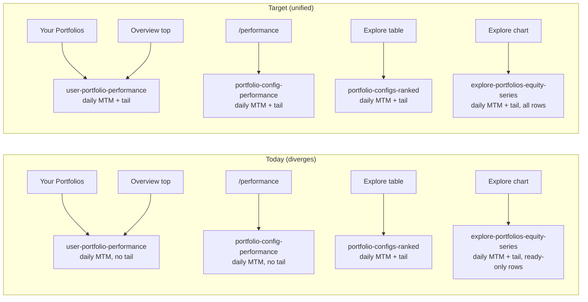

# Unify Portfolio Stats Pipeline

## Root cause (read first, do NOT skip)

Headline metrics (`cagr`, `totalReturn`, `sharpeRatio`, `maxDrawdown`) all come from the same helper `buildMetricsFromSeries` in [src/lib/config-performance-chart.ts](src/lib/config-performance-chart.ts). They differ across surfaces only because each surface feeds that helper a differently-shaped equity series:

- Your Portfolios + Overview → `/api/platform/user-portfolio-performance` → daily MTM, **no tail**
- `/performance` → `/api/platform/portfolio-config-performance` → daily MTM, **no tail**
- Explore table → `/api/platform/portfolio-configs-ranked` → daily MTM + **tail** (reference implementation)
- Explore chart → `/api/platform/explore-portfolios-equity-series` → daily MTM + **tail**, but **ready-only** row filter (divergent from ranked)

Two fixes, plus a Sharpe annualization correction, plus a cache-key bump, will unify everything.

## Data flow today vs target



Reference implementation to copy from: [src/lib/portfolio-configs-ranked-core.ts](src/lib/portfolio-configs-ranked-core.ts) lines 279-305 (the `chosenSeries` / `tailPoint` block inside `computeRankedConfigMetrics`).

---

## Step 1 — Add live tail to `/performance`

**File:** [src/app/api/platform/portfolio-config-performance/route.ts](src/app/api/platform/portfolio-config-performance/route.ts)

### 1a. Add import

Find the existing import on line 35:

```ts
import { buildDailyMarkedToMarketSeriesForConfig } from '@/lib/live-mark-to-market';
```

Replace with:

```ts
import {
  buildDailyMarkedToMarketSeriesForConfig,
  buildLatestMtmPointFromLastSnapshot,
} from '@/lib/live-mark-to-market';
```

### 1b. Append tail after daily MTM block

Find this block (currently lines 122-138):

```ts
    if (series.length > 0 && computeStatus === 'ready' && configMeta) {
      const adminSupabase = createAdminClient();
      const dailySeries = await buildDailyMarkedToMarketSeriesForConfig(adminSupabase, {
        strategyId,
        riskLevel,
        rebalanceFrequency: frequency,
        weightingMethod: weighting,
        notionalSeries: series,
        startDate: series[0]?.date,
      });
      if (dailySeries && dailySeries.length >= 2) {
        series = dailySeries;
        const fromSeries = buildMetricsFromSeries(series);
        metrics = fromSeries.metrics;
        fullMetrics = fromSeries.fullMetrics;
      }
    }
```

Replace with:

```ts
    if (series.length > 0 && computeStatus === 'ready' && configMeta) {
      const adminSupabase = createAdminClient();
      const dailySeries = await buildDailyMarkedToMarketSeriesForConfig(adminSupabase, {
        strategyId,
        riskLevel,
        rebalanceFrequency: frequency,
        weightingMethod: weighting,
        notionalSeries: series,
        startDate: series[0]?.date,
      });
      if (dailySeries && dailySeries.length >= 2) {
        series = dailySeries;
      }

      const tailPoint = await buildLatestMtmPointFromLastSnapshot(adminSupabase, {
        strategyId,
        riskLevel,
        rebalanceFrequency: frequency,
        weightingMethod: weighting,
        notionalSeries: series,
      });
      if (tailPoint && tailPoint.date > series[series.length - 1]!.date) {
        series = [...series, tailPoint];
      }

      const fromSeries = buildMetricsFromSeries(series);
      metrics = fromSeries.metrics;
      fullMetrics = fromSeries.fullMetrics;
    }
```

Do NOT change anything else in this file.

---

## Step 2 — Add live tail to Your Portfolios / Overview

**File:** [src/app/api/platform/user-portfolio-performance/route.ts](src/app/api/platform/user-portfolio-performance/route.ts)

### 2a. Add import

Find the existing import on line 28:

```ts
import { buildDailyMarkedToMarketSeriesForConfig } from '@/lib/live-mark-to-market';
```

Replace with:

```ts
import {
  buildDailyMarkedToMarketSeriesForConfig,
  buildLatestMtmPointFromLastSnapshot,
} from '@/lib/live-mark-to-market';
```

### 2b. Append tail after daily MTM block

Find this block (currently lines 121-143):

```ts
  const configTrack = buildUserEntryConfigTrack(cfgRows, userStart, investmentSize);
  let userSeries = configTrack.series;
  if (userSeries.length > 0) {
    const { data: cfg } = await admin
      .from('portfolio_configs')
      .select('risk_level, rebalance_frequency, weighting_method')
      .eq('id', row.config_id)
      .maybeSingle();
    if (cfg) {
      const dailySeries = await buildDailyMarkedToMarketSeriesForConfig(admin, {
        strategyId: row.strategy_id,
        riskLevel: Number(cfg.risk_level),
        rebalanceFrequency: String(cfg.rebalance_frequency),
        weightingMethod: String(cfg.weighting_method),
        notionalSeries: userSeries,
        startDate: userStart,
      });
      if (dailySeries && dailySeries.length >= 2) {
        userSeries = dailySeries;
      }
    }
  }
  const userSeriesMetrics = buildMetricsFromSeries(userSeries).metrics;
```

Replace with:

```ts
  const configTrack = buildUserEntryConfigTrack(cfgRows, userStart, investmentSize);
  let userSeries = configTrack.series;
  if (userSeries.length > 0) {
    const { data: cfg } = await admin
      .from('portfolio_configs')
      .select('risk_level, rebalance_frequency, weighting_method')
      .eq('id', row.config_id)
      .maybeSingle();
    if (cfg) {
      const dailySeries = await buildDailyMarkedToMarketSeriesForConfig(admin, {
        strategyId: row.strategy_id,
        riskLevel: Number(cfg.risk_level),
        rebalanceFrequency: String(cfg.rebalance_frequency),
        weightingMethod: String(cfg.weighting_method),
        notionalSeries: userSeries,
        startDate: userStart,
      });
      if (dailySeries && dailySeries.length >= 2) {
        userSeries = dailySeries;
      }

      if (computeStatus === 'ready' && userSeries.length >= 1) {
        const tailPoint = await buildLatestMtmPointFromLastSnapshot(admin, {
          strategyId: row.strategy_id,
          riskLevel: Number(cfg.risk_level),
          rebalanceFrequency: String(cfg.rebalance_frequency),
          weightingMethod: String(cfg.weighting_method),
          notionalSeries: userSeries,
        });
        if (tailPoint && tailPoint.date > userSeries[userSeries.length - 1]!.date) {
          userSeries = [...userSeries, tailPoint];
        }
      }
    }
  }
  const userSeriesMetrics = buildMetricsFromSeries(userSeries).metrics;
```

Notes:
- `computeStatus` is already in scope from the `getConfigPerformance` destructure on line 97.
- `buildLatestMtmPointFromLastSnapshot` already uses `pickNotionalAtOrBefore` internally, so it works correctly with the user-entry rebased `userSeries` (the rebased notional is what gets scaled to today's close).
- Do NOT change anything else in this file (leave `computeExcessReturnVsNasdaqCap`, `computeExcessReturnVsNasdaqEqual`, `computeWeeklyConsistencyVsNasdaqCap` untouched — they take the extended `userSeries` automatically).

---

## Step 3 — Align row filter in Explore chart API

**File:** [src/app/api/platform/explore-portfolios-equity-series/route.ts](src/app/api/platform/explore-portfolios-equity-series/route.ts)

### 3a. Drop the ready-only pre-filter

Find this block (currently lines 152-158):

```ts
      const rawRows = perfByConfigRaw.get(cfg.id) ?? [];
      if (rawRows.length === 0) return null;
      const readyRows = rawRows.filter((r) => r.compute_status === 'ready');
      const rowsForSeries = (readyRows.length > 0 ? readyRows : rawRows).sort((a, b) =>
        a.run_date.localeCompare(b.run_date)
      );
      const withInception = ensureInceptionPrefix(rowsForSeries);
```

Replace with:

```ts
      const rawRows = perfByConfigRaw.get(cfg.id) ?? [];
      if (rawRows.length === 0) return null;
      const rowsForSeries = [...rawRows].sort((a, b) => a.run_date.localeCompare(b.run_date));
      const withInception = ensureInceptionPrefix(rowsForSeries);
```

This matches `loadPortfolioConfigsRankedPayload` in [src/lib/portfolio-configs-ranked-core.ts](src/lib/portfolio-configs-ranked-core.ts) which feeds all rows (no `compute_status === 'ready'` pre-filter) into `buildConfigPerformanceChart`.

### 3b. Bump cache key (Step 4 also depends on this)

Find the cache key tuple (currently line 291):

```ts
    ['explore-equity-series', slug, 'v2-daily-mtm'],
```

Replace with:

```ts
    ['explore-equity-series', slug, 'v3-daily-mtm-tail-sharpe'],
```

This invalidates stale cached payloads so the UI picks up the new unified numbers immediately.

---

## Step 4 — Fix Sharpe annualization (daily vs weekly vs monthly)

**File:** [src/lib/config-performance-chart.ts](src/lib/config-performance-chart.ts)

### 4a. Replace `computeSharpeWeekly` with periods-per-year-aware helper

Find this block (currently lines 39-46):

```ts
function computeSharpeWeekly(returns: number[]): number | null {
  if (returns.length < 2) return null;
  const mean = returns.reduce((sum, v) => sum + v, 0) / returns.length;
  const variance = returns.reduce((sum, v) => sum + (v - mean) ** 2, 0) / (returns.length - 1);
  const stdDev = Math.sqrt(variance);
  if (!Number.isFinite(stdDev) || stdDev <= 0) return null;
  return (mean / stdDev) * Math.sqrt(52);
}
```

Replace with:

```ts
function computeSharpeAnnualized(returns: number[], periodsPerYear: number): number | null {
  if (returns.length < 2) return null;
  const mean = returns.reduce((sum, v) => sum + v, 0) / returns.length;
  const variance = returns.reduce((sum, v) => sum + (v - mean) ** 2, 0) / (returns.length - 1);
  const stdDev = Math.sqrt(variance);
  if (!Number.isFinite(stdDev) || stdDev <= 0) return null;
  if (!Number.isFinite(periodsPerYear) || periodsPerYear <= 0) return null;
  return (mean / stdDev) * Math.sqrt(periodsPerYear);
}

function medianCalendarDayGap(dates: string[]): number | null {
  if (dates.length < 2) return null;
  const gaps: number[] = [];
  for (let i = 1; i < dates.length; i++) {
    const prev = new Date(`${dates[i - 1]!}T00:00:00Z`).getTime();
    const curr = new Date(`${dates[i]!}T00:00:00Z`).getTime();
    if (!Number.isFinite(prev) || !Number.isFinite(curr) || curr <= prev) continue;
    gaps.push((curr - prev) / (1000 * 60 * 60 * 24));
  }
  if (gaps.length === 0) return null;
  gaps.sort((a, b) => a - b);
  const mid = Math.floor(gaps.length / 2);
  return gaps.length % 2 === 0 ? (gaps[mid - 1]! + gaps[mid]!) / 2 : gaps[mid]!;
}

function inferPeriodsPerYearFromDates(dates: string[]): number {
  const median = medianCalendarDayGap(dates);
  if (median == null) return 52;
  if (median <= 3) return 252;
  if (median <= 8) return 52;
  return 12;
}
```

### 4b. Update both callers inside `buildFullMetricsFromSeries` and `buildMetricsFromSeries`

Find (currently inside `buildFullMetricsFromSeries`, around line 94):

```ts
    sharpeRatio: computeSharpeWeekly(netReturns),
```

Replace with (leave the file — there is only one occurrence in this function; the other caller is in `buildMetricsFromSeries`):

```ts
    sharpeRatio: computeSharpeAnnualized(netReturns, inferPeriodsPerYearFromDates(series.map((p) => p.date))),
```

Next find (currently inside `buildMetricsFromSeries`, around line 163):

```ts
    sharpeRatio: computeSharpeWeekly(netReturns),
```

Replace with:

```ts
    sharpeRatio: computeSharpeAnnualized(netReturns, inferPeriodsPerYearFromDates(series.map((p) => p.date))),
```

Finally find (currently inside `buildConfigPerformanceChart`, around line 317):

```ts
    sharpeRatio: computeSharpeWeekly(netReturns),
```

Replace with:

```ts
    sharpeRatio: computeSharpeAnnualized(netReturns, 52),
```

(Weekly rows are literally strategy_portfolio_config_performance weekly run_dates, so 52 is always correct in this path. Do not auto-detect here.)

### 4c. Sanity check

After edits, `computeSharpeWeekly` should no longer appear anywhere in [src/lib/config-performance-chart.ts](src/lib/config-performance-chart.ts). Run a repo-wide search for `computeSharpeWeekly` and confirm zero other references; if any remain, update them to `computeSharpeAnnualized(..., 52)` with the same weekly assumption. Do not export the new helpers — they remain file-private.

---

## Step 5 — Smoke-verify (manual, browser-based)

After all edits land and dev server is restarted, do this with one real config and one real user profile:

1. Pick a ready config slug + risk + frequency + weighting combination that you know is fully computed (e.g. `ait-1-daneel` risk 3 equal weekly).
2. Pick one of your own `user_portfolio_profiles` rows that has a non-null `user_start_date`.
3. Hit these four endpoints in the browser (or `curl` with your auth cookies for the authenticated one) and record `series[last].date`, `metrics.totalReturn`, `metrics.cagr`, `metrics.sharpeRatio`, `metrics.maxDrawdown`:
   - `GET /api/platform/portfolio-config-performance?slug=<slug>&risk=<r>&frequency=<f>&weighting=<w>` (model track; /performance page)
   - `GET /api/platform/portfolio-configs-ranked?slug=<slug>` → locate the config in `configs[]` matching the same risk/frequency/weighting and inspect its `metrics` (Explore table)
   - `GET /api/platform/explore-portfolios-equity-series?slug=<slug>` → take `dates[dates.length - 1]` (Explore chart)
   - `GET /api/platform/user-portfolio-performance?profileId=<your-profile-id>` (Your Portfolios / Overview)
4. Assertions:
   - `series[last].date` (or `dates[last]`) is identical across all four.
   - `totalReturn` and `cagr` match between the three model-track endpoints (`portfolio-config-performance`, `portfolio-configs-ranked`, `explore-portfolios-equity-series`) for the same config. User-entry numbers will differ by construction (different base), but Your Portfolios and Overview (both user-entry) must match each other.
   - `sharpeRatio` values on all daily-MTM surfaces (everyone except fallback weekly path) will be roughly `sqrt(252/52) ≈ 2.2x` larger than they were before this change. This is the correction, not a regression.
5. If any assertion fails, debug before claiming done.

Do NOT write automated tests for this change in this PR.

---

## Ordering and dependencies

Do steps in this order; each step is independent of the others at the code-edit level, but the smoke verification at the end must see all four in place:

1. Step 4 first (Sharpe helper). Runs in pure-TS with no side effects; cheapest to get right.
2. Step 1 (`/performance` tail).
3. Step 2 (user-portfolio-performance tail).
4. Step 3 (Explore chart row filter + cache-key bump).
5. Step 5 smoke verification.

After all edits:

- Run the project's type check / build to catch any typos in the imports or the new helper.
- If the build warns about unused imports anywhere (e.g. `buildLatestMtmPointFromLastSnapshot` is already imported in the explore-equity-series file — do NOT re-add it), leave the existing import alone.

## Non-goals (do NOT do any of the following)

- No schema, RLS, or migration changes. `benchmark_daily_prices` stays as-is.
- No cron / ingestion / `src/app/api/cron/daily/route.ts` changes.
- No UI copy changes to distinguish "since your entry" vs "since inception".
- No changes to `buildUserEntryConfigTrack`, `buildConfigPerformanceChart`, `buildDailyMarkedToMarketSeriesForConfig`, or `buildLatestMtmPointFromLastSnapshot` themselves.
- No changes to `src/lib/portfolio-configs-ranked-core.ts` — it is the reference implementation and is already correct (it gets Sharpe correction for free via its use of `buildMetricsFromSeries`).
- Do NOT create any new markdown documents or README files.
