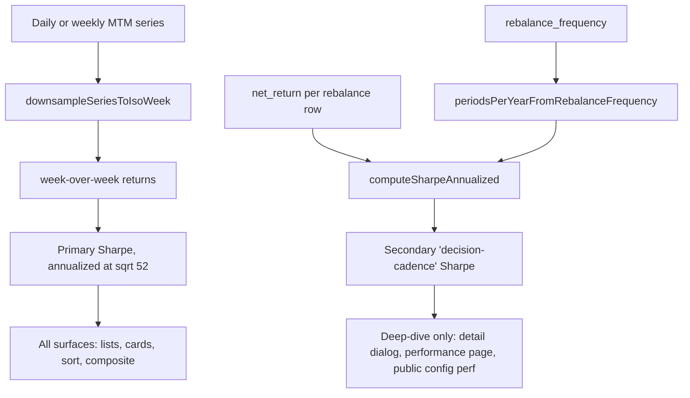

## Concept

Two Sharpes, two questions, clearly separated by surface so users are never asked to compare apples to apples.

- **Primary (headline, used everywhere including lists/cards/sort/composite):** weekly-MTM Sharpe. Downsample the MTM series to weekly closes, take week-over-week simple returns, annualize at √52. Gate at 8 weekly observations ≈ ~2 calendar months. Answers "holding-experience risk/reward."
- **Secondary (deep-dive only):** rebalance-cadence Sharpe (current methodology). Uses `net_return` and `periodsPerYearFromRebalanceFrequency`. Gate at 8 rebalance periods. Answers "is the decision process earning its volatility?"

Why no daily + Lo/Newey-West: weekly equity return autocorrelation is ~0.02–0.05 and the correction would require estimating autocorrelations from ~42 points at the gate, which is too noisy to help. Weekly-MTM is empirically unbiased and simple to explain.

---

## Architecture change overview



---

## Step 1 — Shared helper in `src/lib/metrics-annualization.ts`

Append the following below the existing `computeSharpeAnnualized` function (around line 74):

```ts
/**
 * Weekly-MTM Sharpe: downsample the series to one point per ISO week, compute
 * week-over-week simple returns, annualize at sqrt(52). Retail-grade: no
 * autocorrelation correction needed at weekly sampling.
 *
 * Returns { sharpe, weeklyObservations } where weeklyObservations is the count
 * of week-over-week returns that went into the estimate. Gate is still
 * MIN_OBS_FOR_SHARPE (8), enforced inside computeSharpeAnnualized.
 */
export function computeWeeklyMtmSharpe(
  series: { date: string; aiTop20: number }[],
): { sharpe: number | null; weeklyObservations: number } {
  if (!series.length) return { sharpe: null, weeklyObservations: 0 };
  // Cast is safe: downsampleSeriesToIsoWeek only reads .date on the input.
  const padded = series.map((p) => ({
    date: p.date,
    aiTop20: p.aiTop20,
    nasdaq100CapWeight: 0,
    nasdaq100EqualWeight: 0,
    sp500: 0,
  }));
  const weekly = downsampleSeriesToIsoWeek(padded);
  if (weekly.length < 2) return { sharpe: null, weeklyObservations: 0 };
  const returns: number[] = [];
  for (let i = 1; i < weekly.length; i++) {
    const prev = weekly[i - 1]!.aiTop20;
    const curr = weekly[i]!.aiTop20;
    if (prev > 0 && Number.isFinite(prev) && Number.isFinite(curr)) {
      returns.push(curr / prev - 1);
    }
  }
  return {
    sharpe: computeSharpeAnnualized(returns, 52),
    weeklyObservations: returns.length,
  };
}
```

No existing code in that file changes.

---

## Step 2 — Extend `MetricReadinessPill` with a new kind

File: [src/components/platform/metric-readiness-pill.tsx](src/components/platform/metric-readiness-pill.tsx).

Replace the file with:

```tsx
"use client";

import {
  Tooltip,
  TooltipContent,
  TooltipTrigger,
} from "@/components/ui/tooltip";
import { cn } from "@/lib/utils";

export type MetricReadinessKind =
  | "sharpe"
  | "cagr"
  | "composite"
  | "sharpe-decision";

/**
 * Disclosure when a metric is null (Not ready) or based on <12 observations (Early data).
 * For 'sharpe' the observation unit is weeks of holding returns.
 * For 'sharpe-decision' the observation unit is completed rebalance periods.
 * For 'cagr' and 'composite' the observation unit is weeks (matches existing callers).
 */
export function MetricReadinessPill({
  kind,
  value,
  weeksOfData,
  rebalanceFrequency,
  className,
}: {
  kind: MetricReadinessKind;
  value: number | null;
  /** Observation count — weeks for 'sharpe'/'cagr'/'composite', rebalance periods for 'sharpe-decision'. */
  weeksOfData?: number | null;
  /** Only used when kind==='sharpe-decision' to make the copy read naturally. */
  rebalanceFrequency?: string;
  className?: string;
}) {
  const w = weeksOfData;
  const wNum = w ?? 0;
  if (value != null && Number.isFinite(value) && w != null && w >= 12)
    return null;
  if (value != null && Number.isFinite(value) && w == null) return null;

  const isNotReady = value == null || !Number.isFinite(value);
  const label = isNotReady ? "Not ready" : "Early data";

  const unit =
    kind === "sharpe-decision"
      ? `rebalance period${wNum === 1 ? "" : "s"}`
      : `week${wNum === 1 ? "" : "s"}`;
  const wPhrase =
    w == null ? "limited history so far" : `${wNum} ${unit} of data`;

  const freqWord = (rebalanceFrequency ?? "").toLowerCase() || "rebalance";
  const body = isNotReady
    ? kind === "sharpe"
      ? `Sharpe needs at least 8 weeks of holding returns. This portfolio has ${wPhrase}.`
      : kind === "sharpe-decision"
        ? `Decision-cadence Sharpe needs at least 8 completed ${freqWord} rebalance periods. This portfolio has ${wPhrase}.`
        : kind === "cagr"
          ? `CAGR is hidden until about 12 weeks of history so short-window annualization does not mislead (${wPhrase}).`
          : `Composite needs Sharpe, total return, consistency, max drawdown, and excess vs Nasdaq-100 cap — some inputs are still gathering (${wPhrase}).`
    : `Based on ${wNum} ${unit} of data — expect these numbers to move as history grows.`;

  return (
    <Tooltip>
      <TooltipTrigger asChild>
        <span
          className={cn(
            "ml-1 inline-flex max-w-[4.5rem] cursor-help truncate rounded border px-1 py-0.5 align-middle text-[9px] font-semibold uppercase leading-none",
            isNotReady
              ? "border-amber-500/40 bg-amber-500/10 text-amber-800 dark:text-amber-200"
              : "border-muted-foreground/30 bg-muted/50 text-muted-foreground",
            className,
          )}
        >
          {label}
        </span>
      </TooltipTrigger>
      <TooltipContent side="top" className="max-w-xs text-xs">
        {body}
      </TooltipContent>
    </Tooltip>
  );
}
```

Semantic change: the `weeksOfData` prop is still called `weeksOfData`, but for `kind='sharpe-decision'` the caller passes **rebalance-period count** (the copy adjusts automatically). Callers for `kind='sharpe'` must pass **weekly-observation count**, not decision-observation count (this is the key bug fix forcing a callsite audit).

---

## Step 3 — Extend types

### 3a. `ConfigMetrics` in [src/lib/portfolio-configs-ranked-core.ts](src/lib/portfolio-configs-ranked-core.ts) (line 39-51)

Replace the type with:

```ts
export type ConfigMetrics = {
  sharpeRatio: number | null;
  /** Sharpe computed from rebalance-period net returns; used only in deep-dive surfaces. */
  sharpeRatioDecisionCadence: number | null;
  cagr: number | null;
  totalReturn: number | null;
  maxDrawdown: number | null;
  consistency: number | null;
  /** @deprecated Alias for decisionObservations (raw performance-row count). Kept to avoid breaking callers; prefer weeklyObservations for Sharpe readiness. */
  weeksOfData: number;
  /** Unique ISO weeks of MTM data — used by the primary Sharpe readiness pill. */
  weeklyObservations: number;
  /** Count of completed rebalance periods (= performance rows). Used by the secondary Sharpe pill. */
  decisionObservations: number;
  endingValuePortfolio: number | null;
  endingValueMarket: number | null;
  endingValueSp500: number | null;
  beatsMarket: boolean | null;
  beatsSp500: boolean | null;
};
```

Update `emptyConfigMetrics` (line 209) accordingly:

```ts
function emptyConfigMetrics(weeksOfData: number): ConfigMetrics {
  return {
    sharpeRatio: null,
    sharpeRatioDecisionCadence: null,
    cagr: null,
    totalReturn: null,
    maxDrawdown: null,
    consistency: null,
    weeksOfData,
    weeklyObservations: 0,
    decisionObservations: weeksOfData,
    endingValuePortfolio: null,
    endingValueMarket: null,
    endingValueSp500: null,
    beatsMarket: null,
    beatsSp500: null,
  };
}
```

### 3b. `PlatformPerformancePayload.metrics` in [src/lib/platform-performance-payload.ts](src/lib/platform-performance-payload.ts) (line 179-210)

Add the two fields after `sharpeRatio`:

```ts
  metrics: {
    startingCapital: number;
    endingValue: number;
    totalReturn: number | null;
    cagr: number | null;
    maxDrawdown: number | null;
    sharpeRatio: number | null;
    sharpeRatioDecisionCadence: number | null;
    weeklyObservations: number;
    pctWeeksBeatingNasdaq100: number | null;
    // ... rest unchanged
  } | null;
```

### 3c. `StrategyListItem` (line 21-40)

Add two fields:

```ts
export type StrategyListItem = {
  // ... existing
  runCount: number;
  sharpeRatio: number | null;
  sharpeRatioDecisionCadence: number | null;
  weeklyObservations: number;
  totalReturn: number | null;
  cagr: number | null;
  maxDrawdown: number | null;
};
```

### 3d. `StrategyDetail` (line 1011-1050)

Add:

```ts
sharpeRatio: number | null;
sharpeRatioDecisionCadence: number | null;
weeklyObservations: number;
```

### 3e. Chart return types in [src/lib/config-performance-chart.ts](src/lib/config-performance-chart.ts) (line 137-153)

```ts
export type ConfigChartMetrics = {
  sharpeRatio: number | null;
  sharpeRatioDecisionCadence: number | null;
  totalReturn: number | null;
  cagr: number | null;
  maxDrawdown: number | null;
  weeklyObservations: number;
};

export type FullConfigPerformanceMetrics = NonNullable<
  PlatformPerformancePayload["metrics"]
>;

export type UserEntryConfigTrack = {
  series: PerformanceSeriesPoint[];
  metrics: ConfigChartMetrics | null;
  fullMetrics: FullConfigPerformanceMetrics | null;
  hasMultipleObservations: boolean;
  sharpeReturns: number[];
};
```

---

## Step 4 — Update `src/lib/config-performance-chart.ts`

Edits, from top to bottom:

**4a. Update imports (line 12-16)** — already has `computeSharpeAnnualized`, `downsampleSeriesToIsoWeek`, `periodsPerYearFromRebalanceFrequency`. Add `computeWeeklyMtmSharpe`:

```ts
import {
  computeSharpeAnnualized,
  computeWeeklyMtmSharpe,
  downsampleSeriesToIsoWeek,
  periodsPerYearFromRebalanceFrequency,
} from "@/lib/metrics-annualization";
```

**4b. Replace `buildFullMetricsFromSeries` (line 66-135)**. Key changes: compute weekly-MTM sharpe from `series`, keep existing decision-cadence sharpe as the secondary:

```ts
function buildFullMetricsFromSeries(
  series: PerformanceSeriesPoint[],
  sharpeReturns: number[],
  rebalanceFrequency: string,
): FullConfigPerformanceMetrics | null {
  if (!series.length) return null;
  const firstPoint = series[0]!;
  const lastPoint = series[series.length - 1]!;
  const firstDate = firstPoint.date;
  const lastDate = lastPoint.date;
  const aiStart = firstPoint.aiTop20;
  const capStart = firstPoint.nasdaq100CapWeight;
  const eqStart = firstPoint.nasdaq100EqualWeight;
  const spStart = firstPoint.sp500;

  const totalReturnAi = computeTotalReturn(aiStart, lastPoint.aiTop20);
  const totalReturnCap = computeTotalReturn(
    capStart,
    lastPoint.nasdaq100CapWeight,
  );
  const totalReturnEqual = computeTotalReturn(
    eqStart,
    lastPoint.nasdaq100EqualWeight,
  );
  const totalReturnSp = computeTotalReturn(spStart, lastPoint.sp500);

  const weeklySeries = downsampleSeriesToIsoWeek(series);
  const weeklyMtm = computeWeeklyMtmSharpe(series);
  const sharpeDecision = computeSharpeAnnualized(
    sharpeReturns,
    periodsPerYearFromRebalanceFrequency(rebalanceFrequency),
  );

  return {
    startingCapital: aiStart,
    endingValue: lastPoint.aiTop20,
    totalReturn: totalReturnAi,
    cagr: cagrGated(aiStart, lastPoint.aiTop20, firstDate, lastDate),
    maxDrawdown: computeMaxDrawdown(series.map((p) => p.aiTop20)),
    sharpeRatio: weeklyMtm.sharpe,
    sharpeRatioDecisionCadence: sharpeDecision,
    weeklyObservations: weeklyMtm.weeklyObservations,
    pctWeeksBeatingNasdaq100: computePctWeeksBeatingNasdaq100(
      weeklySeries.map((p) => ({
        aiValue: p.aiTop20,
        benchmarkValue: p.nasdaq100CapWeight,
      })),
    ),
    pctWeeksBeatingSp500: computePctWeeksBeatingNasdaq100(
      weeklySeries.map((p) => ({
        aiValue: p.aiTop20,
        benchmarkValue: p.sp500,
      })),
    ),
    pctWeeksBeatingNasdaq100EqualWeight: computePctWeeksBeatingNasdaq100(
      weeklySeries.map((p) => ({
        aiValue: p.aiTop20,
        benchmarkValue: p.nasdaq100EqualWeight,
      })),
    ),
    pctMonthsBeatingNasdaq100: computePctMonthsBeating(
      weeklySeries.map((p) => ({
        date: p.date,
        aiValue: p.aiTop20,
        benchmarkValue: p.nasdaq100CapWeight,
      })),
    ),
    benchmarks: {
      // unchanged
      nasdaq100CapWeight: {
        endingValue: lastPoint.nasdaq100CapWeight,
        totalReturn: totalReturnCap,
        cagr: cagrGated(
          capStart,
          lastPoint.nasdaq100CapWeight,
          firstDate,
          lastDate,
        ),
        maxDrawdown: computeMaxDrawdown(
          series.map((p) => p.nasdaq100CapWeight),
        ),
      },
      nasdaq100EqualWeight: {
        endingValue: lastPoint.nasdaq100EqualWeight,
        totalReturn: totalReturnEqual,
        cagr: cagrGated(
          eqStart,
          lastPoint.nasdaq100EqualWeight,
          firstDate,
          lastDate,
        ),
        maxDrawdown: computeMaxDrawdown(
          series.map((p) => p.nasdaq100EqualWeight),
        ),
      },
      sp500: {
        endingValue: lastPoint.sp500,
        totalReturn: totalReturnSp,
        cagr: cagrGated(spStart, lastPoint.sp500, firstDate, lastDate),
        maxDrawdown: computeMaxDrawdown(series.map((p) => p.sp500)),
      },
    },
  };
}
```

**4c. Replace `buildMetricsFromSeries` (line 158-187)** to include the two new fields in the returned `metrics`:

```ts
export function buildMetricsFromSeries(
  series: PerformanceSeriesPoint[],
  rebalanceFrequency: string,
  sharpeReturns: number[],
): {
  metrics: ConfigChartMetrics | null;
  fullMetrics: FullConfigPerformanceMetrics | null;
} {
  if (!series.length) return { metrics: null, fullMetrics: null };
  const firstPoint = series[0];
  const lastPoint = series[series.length - 1];
  const firstDate = firstPoint?.date ?? "";
  const lastDate = lastPoint?.date ?? "";
  if (!firstPoint || !lastPoint) return { metrics: null, fullMetrics: null };

  const weeklyMtm = computeWeeklyMtmSharpe(series);
  const sharpeDecision = computeSharpeAnnualized(
    sharpeReturns,
    periodsPerYearFromRebalanceFrequency(rebalanceFrequency),
  );

  const metrics: ConfigChartMetrics = {
    totalReturn: computeTotalReturn(firstPoint.aiTop20, lastPoint.aiTop20),
    cagr: cagrGated(firstPoint.aiTop20, lastPoint.aiTop20, firstDate, lastDate),
    maxDrawdown: computeMaxDrawdown(series.map((p) => p.aiTop20)),
    sharpeRatio: weeklyMtm.sharpe,
    sharpeRatioDecisionCadence: sharpeDecision,
    weeklyObservations: weeklyMtm.weeklyObservations,
  };
  const fullMetrics = buildFullMetricsFromSeries(
    series,
    sharpeReturns,
    rebalanceFrequency,
  );
  return { metrics, fullMetrics };
}
```

**4d. Replace `buildConfigPerformanceChart` metrics block (line 341-349)** similarly:

```ts
const weeklyMtm = computeWeeklyMtmSharpe(series);
const sharpeDecision = computeSharpeAnnualized(
  netReturns,
  periodsPerYearFromRebalanceFrequency(rebalanceFrequency),
);

const metrics: ConfigChartMetrics = {
  totalReturn: computeTotalReturn(INITIAL_CAPITAL, lastPoint.aiTop20),
  cagr: cagrGated(INITIAL_CAPITAL, lastPoint.aiTop20, firstDate, lastDate),
  maxDrawdown: computeMaxDrawdown(series.map((p) => p.aiTop20)),
  sharpeRatio: weeklyMtm.sharpe,
  sharpeRatioDecisionCadence: sharpeDecision,
  weeklyObservations: weeklyMtm.weeklyObservations,
};
```

**4e. `buildUserEntryConfigTrack` (line 206-280)** — the `metrics:` block at line 268-275 picks from `fullMetrics`. Replace that mapping:

```ts
    metrics: fullMetrics
      ? {
          sharpeRatio: fullMetrics.sharpeRatio,
          sharpeRatioDecisionCadence: fullMetrics.sharpeRatioDecisionCadence,
          weeklyObservations: fullMetrics.weeklyObservations,
          totalReturn: fullMetrics.totalReturn,
          cagr: fullMetrics.cagr,
          maxDrawdown: fullMetrics.maxDrawdown,
        }
      : null,
```

---

## Step 5 — Update `src/lib/portfolio-configs-ranked-core.ts`

**5a. In `computeRankedConfigMetrics` (line 227-319)**, add derived fields and populate the new `metrics` shape. Replace the `const metrics: ConfigMetrics = {...}` block (line 298-316) with:

```ts
const weeklyObservations =
  chosenSeries && chosenSeries.length
    ? new Set(chosenSeries.map((p) => isoWeekBucketKey(p.date))).size
    : 0;

const metrics: ConfigMetrics = {
  sharpeRatio: headline?.sharpeRatio ?? null,
  sharpeRatioDecisionCadence: headline?.sharpeRatioDecisionCadence ?? null,
  cagr: headline?.cagr ?? null,
  totalReturn: headline?.totalReturn ?? null,
  maxDrawdown: headline?.maxDrawdown ?? null,
  consistency,
  weeksOfData: rawObservationCount,
  weeklyObservations,
  decisionObservations: rawObservationCount,
  endingValuePortfolio: full?.endingValue ?? null,
  endingValueMarket: full?.benchmarks.nasdaq100CapWeight.endingValue ?? null,
  endingValueSp500: full?.benchmarks.sp500.endingValue ?? null,
  beatsMarket:
    full != null &&
    full.endingValue > 0 &&
    full.benchmarks.nasdaq100CapWeight.endingValue > 0
      ? full.endingValue > full.benchmarks.nasdaq100CapWeight.endingValue
      : null,
  beatsSp500:
    full != null &&
    full.endingValue > 0 &&
    full.benchmarks.sp500.endingValue > 0
      ? full.endingValue > full.benchmarks.sp500.endingValue
      : null,
};
```

Add `import { isoWeekBucketKey } from '@/lib/metrics-annualization';` at the top of the file.

**5b. Bump the cache version string (line 595)**:

```ts
    [RANKED_CONFIGS_CACHE_TAG, slug, 'v7-weekly-mtm-sharpe'],
```

**5c. Composite score behavior — no code change needed.** `compositeInputsReady` reads `m.sharpeRatio` which is now the weekly-MTM version. Weights and formula stay.

---

## Step 6 — Update `src/lib/platform-performance-payload.ts`

**6a. Strategy metrics (line 546-597).** Replace the `metrics` object construction to include both Sharpes and the weekly observation count:

Locate:

```ts
const weeklyNetReturns = perfRows.map((r) => toNumber(r.net_return, 0));
const sharpePeriods = periodsPerYearFromRebalanceFrequency(
  strategy.rebalance_frequency,
);
const weeklySeriesForPct = downsampleSeriesToIsoWeek(series);
```

Immediately after, add:

```ts
const weeklyMtm = computeWeeklyMtmSharpe(series);
```

Also add the import at top (line 7-11):

```ts
import {
  computeSharpeAnnualized,
  computeWeeklyMtmSharpe,
  downsampleSeriesToIsoWeek,
  periodsPerYearFromRebalanceFrequency,
} from "@/lib/metrics-annualization";
```

Then inside the `metrics =` object (around line 550), update:

```ts
          sharpeRatio: weeklyMtm.sharpe,
          sharpeRatioDecisionCadence: computeSharpeAnnualized(weeklyNetReturns, sharpePeriods),
          weeklyObservations: weeklyMtm.weeklyObservations,
```

(Keep the rest of the object unchanged.)

**6b. Strategies list item (lines 953-980).** Replace with:

```ts
const weeklyMtm = computeWeeklyMtmSharpe(
  rows.map((r) => ({
    date: r.run_date,
    aiTop20: toNumber(r.ending_equity, INITIAL_CAPITAL),
  })),
);
return {
  id: strategy.id,
  // ... unchanged fields ...
  runCount: rows.length,
  sharpeRatio: weeklyMtm.sharpe,
  sharpeRatioDecisionCadence: computeSharpeAnnualized(
    netReturns,
    periodsPerYearFromRebalanceFrequency(strategy.rebalance_frequency),
  ),
  weeklyObservations: weeklyMtm.weeklyObservations,
  totalReturn:
    rows.length >= 2 ? computeTotalReturn(INITIAL_CAPITAL, endEquity) : null,
  cagr:
    firstRow && lastRow && rows.length >= 2
      ? cagrGated(
          INITIAL_CAPITAL,
          endEquity,
          firstRow.run_date,
          lastRow.run_date,
        )
      : null,
  maxDrawdown:
    rows.length >= 2
      ? computeMaxDrawdown(
          rows.map((r) => toNumber(r.ending_equity, INITIAL_CAPITAL)),
        )
      : null,
} satisfies StrategyListItem;
```

Also update the sort (line 984-989) to sort by the (now weekly-MTM) `sharpeRatio` — no code change since we're still using the same field name.

**6c. Strategy detail (lines 1167-1200).** Similarly:

```ts
const weeklyMtm = computeWeeklyMtmSharpe(
  perfRows.map((r) => ({
    date: r.run_date,
    aiTop20: toNumber(r.ending_equity, INITIAL_CAPITAL),
  })),
);

return {
  // ... existing fields ...
  sharpeRatio: weeklyMtm.sharpe,
  sharpeRatioDecisionCadence: computeSharpeAnnualized(
    netReturns,
    periodsPerYearFromRebalanceFrequency(row.rebalance_frequency),
  ),
  weeklyObservations: weeklyMtm.weeklyObservations,
  // ... rest ...
};
```

---

## Step 7 — Update every other caller of the chart builders

Search results already confirmed:

- [src/lib/guest-local-profile.ts](src/lib/guest-local-profile.ts) lines 219, 229 — uses the `metrics` object: since we preserved the field names and added new ones, these still compile. No code change required.
- [src/app/api/platform/user-portfolio-performance/route.ts](src/app/api/platform/user-portfolio-performance/route.ts) lines 133, 169 — same.
- [src/app/api/platform/portfolio-config-performance/route.ts](src/app/api/platform/portfolio-config-performance/route.ts) lines 120, 152 — same.
- [src/components/platform/your-portfolio-client.tsx](src/components/platform/your-portfolio-client.tsx) line 2260 — uses `buildConfigPerformanceChart`; reads `metrics`/`fullMetrics` as before. No code change required beyond type-propagation.
- [src/app/api/platform/explore-portfolios-equity-series/route.ts](src/app/api/platform/explore-portfolios-equity-series/route.ts) line 157 — same.
- [src/lib/landing-top-portfolio-performance.ts](src/lib/landing-top-portfolio-performance.ts) line 92 — same.

If `tsc` surfaces any missing-field errors after the type changes, add the new fields with `null`/`0` defaults in the offending object literal.

---

## Step 8 — UI: explore portfolio detail dialog

File: [src/components/platform/explore-portfolio-detail-dialog.tsx](src/components/platform/explore-portfolio-detail-dialog.tsx).

**8a. Re-point the existing Sharpe pill (line 855-861)** to use weekly observations instead of `m.weeksOfData`:

```tsx
                  afterLabel={
                    <MetricReadinessPill
                      kind="sharpe"
                      value={m.sharpeRatio}
                      weeksOfData={m.weeklyObservations}
                    />
                  }
```

**8b. After the existing Sharpe FlipCard closes (after line 862), add a secondary FlipCard.** Because the grid above it is `grid-cols-1 sm:grid-cols-3` (line 845), and there are currently 3 cards (Sharpe, CAGR, Max drawdown), we need to either:

- (i) keep 3-up responsive and drop the secondary into a new row, or
- (ii) change to `sm:grid-cols-4`.

Pick (i) — insert a new dedicated 1-col row _above_ or _below_ the 3-up grid:

After the closing `</div>` on line 878 (the 3-up grid), insert:

```tsx
<div className="grid grid-cols-1 gap-2 sm:grid-cols-2">
  <FlipCard
    label="Decision-cadence Sharpe"
    value={fmtNum(m.sharpeRatioDecisionCadence)}
    explanation="Sharpe computed from this portfolio's rebalance-period net returns, annualized at its rebalance cadence. Answers whether the decision process is earning its volatility, independent of intra-period holding-period risk. Requires at least 8 completed rebalance periods before displaying a value."
    valueClassName={
      m.sharpeRatioDecisionCadence != null &&
      Number.isFinite(m.sharpeRatioDecisionCadence)
        ? sharpeRatioValueClass(m.sharpeRatioDecisionCadence)
        : undefined
    }
    afterLabel={
      <MetricReadinessPill
        kind="sharpe-decision"
        value={m.sharpeRatioDecisionCadence}
        weeksOfData={m.decisionObservations}
        rebalanceFrequency={config?.rebalanceFrequency}
      />
    }
  />
</div>
```

Keep other FlipCards in this file unchanged.

---

## Step 9 — UI: performance page public client

File: [src/components/performance/performance-page-public-client.tsx](src/components/performance/performance-page-public-client.tsx).

**9a. Re-point primary Sharpe pills.** Find the existing `displayMetricWeeksOfData` (line 757):

```tsx
const displayMetricWeeksOfData =
  performanceHoldingsRankedRow?.metrics.weeksOfData ?? null;
```

Leave it (used by CAGR pills). Add above it:

```tsx
const displayMetricWeeklyObservations =
  performanceHoldingsRankedRow?.metrics.weeklyObservations ?? null;
const displayMetricDecisionObservations =
  performanceHoldingsRankedRow?.metrics.decisionObservations ?? null;
```

**9b. Update the two existing primary Sharpe pills** (lines 1317-1323 and 1868-1874) to pass `weeksOfData={displayMetricWeeklyObservations}`.

**9c. Insert secondary Sharpe FlipCard after each existing Sharpe card.**

At line 1328 (after the primary Sharpe FlipCard in the returns section), insert:

```tsx
<FlipCard
  label="Decision-cadence Sharpe"
  afterLabel={
    <MetricReadinessPill
      kind="sharpe-decision"
      value={displayMetrics.sharpeRatioDecisionCadence}
      weeksOfData={displayMetricDecisionObservations}
      rebalanceFrequency={effectiveStrategy?.rebalanceFrequency}
    />
  }
  value={fmt.num(displayMetrics.sharpeRatioDecisionCadence)}
  explanation="Sharpe computed from rebalance-period net returns, annualized at the strategy's rebalance cadence. This complements the primary Sharpe above by isolating the decision-process edge from intra-period holding risk."
  positive={(displayMetrics.sharpeRatioDecisionCadence ?? 0) > 1}
  positiveTone="brand"
/>
```

Do the same after line 1879 in the Risk section.

(`effectiveStrategy` already exists in this file and carries `rebalanceFrequency`.)

---

## Step 10 — UI: public portfolio config performance

File: [src/components/platform/public-portfolio-config-performance.tsx](src/components/platform/public-portfolio-config-performance.tsx).

**10a. Replace `metricWeeksOfData` derivation (line 133-135)**. Keep the existing weekly-bucket count for CAGR but also expose the decision count from `m`:

```tsx
const metricWeeklyObservations = perf?.series?.length
  ? new Set(perf.series.map((p) => isoWeekBucketKey(p.date))).size
  : null;
const metricDecisionObservations =
  (m as { weeksOfData?: number } | undefined)?.weeksOfData ?? null;
```

**10b. Update the existing primary Sharpe row (line 176-187)** to use `weeksOfData={metricWeeklyObservations}`. Leave the CAGR row (line 188-200) using `metricWeeklyObservations` (weeks-based).

**10c. Insert a new secondary row directly after the Sharpe row** (line 187):

```tsx
      {
        label: 'Decision-cadence Sharpe',
        value: fmt.num((m as { sharpeRatioDecisionCadence?: number | null }).sharpeRatioDecisionCadence ?? null),
        afterLabel: (
          <MetricReadinessPill
            kind="sharpe-decision"
            value={(m as { sharpeRatioDecisionCadence?: number | null }).sharpeRatioDecisionCadence ?? null}
            weeksOfData={metricDecisionObservations}
            rebalanceFrequency={perf?.config?.rebalance_frequency}
          />
        ),
        hint: `Sharpe of rebalance-period net returns, annualized at the portfolio's rebalance cadence. ${metricsPeriodNote}`,
        ...headerStatSentiment(
          'Sharpe',
          (m as { sharpeRatioDecisionCadence?: number | null }).sharpeRatioDecisionCadence ?? null
        ),
      },
```

The `as { sharpeRatioDecisionCadence... }` casts are a small pragmatic accommodation because `m` flows in from `PlatformPerformancePayload['metrics']` which we have typed in Step 3b — after the type flows through, the cast can be removed, but using it guarantees this step works even if one of the upstream payload sites is missed.

---

## Step 11 — Tooltip copy

File: [src/components/tooltips/spotlight-stat-tooltips.ts](src/components/tooltips/spotlight-stat-tooltips.ts).

Replace the `sharpe_ratio` entry (line 15-18):

```ts
  sharpe_ratio: {
    title: 'Sharpe ratio',
    body: 'Return per unit of risk: weekly holding-period returns (taken from the last close in each calendar week) divided by their week-to-week volatility, annualized at sqrt(52). Ready after about 8 weeks of history. Higher is better; above about 1.0 is often considered strong for equity strategies.',
  },
```

Add a new entry right after (preserving the trailing comma syntax):

```ts
  sharpe_ratio_decision_cadence: {
    title: 'Decision-cadence Sharpe',
    body: 'Sharpe computed from this portfolio\'s rebalance-period net returns, annualized at its rebalance cadence. This complements the primary Sharpe by isolating the decision-process edge from intra-period holding risk. Ready after 8 completed rebalance periods.',
  },
```

---

## Step 12 — Align the CAGR readiness gate with Sharpe

Goal: primary Sharpe and CAGR both become ready at week 8 so the headline metric set populates together. The existing `MetricReadinessPill` "Early data" tier (`weeksOfData < 12` while value is non-null) automatically provides the short-window disclosure for weeks 8-11 — no pill logic change needed.

File: [src/lib/performance-cagr.ts](src/lib/performance-cagr.ts).

Replace line 30-34:

```ts
/**
 * CAGR over a short window annualizes to extreme percentages. Values become visible once this
 * much calendar time has passed since the first observation (~8 weeks, matching the primary
 * Sharpe gate). Between 8 and 12 weeks the value is shown with an "Early data" pill warning.
 */
export const MIN_YEARS_FOR_CAGR_OVER_TIME_POINT = 8 / 52;
```

That is the only change. All downstream consumers (`cagrGated` in `config-performance-chart.ts` and `platform-performance-payload.ts`, `seriesHasMinimumPointsForCagrOverTimeChart` for chart rendering, and every CAGR pill usage) read this constant, so the single edit propagates.

Impact summary:

- CAGR value first appears at ~8 weeks of calendar data (was ~12 weeks).
- CAGR-over-time chart renders ~4 weeks earlier.
- Existing CAGR "Early data" pill tier (`value != null && weeksOfData < 12`) covers weeks 8-11 with the copy "Based on N weeks of data — expect these numbers to move as history grows," which reads correctly for short-window CAGR.

---

## Step 13 — Surfaces that must stay unchanged (verification only)

The following surfaces read `sharpeRatio` from upstream payloads and should render the new (weekly-MTM) primary Sharpe transparently, with no source change required. Manually open each file and confirm there is no direct use of `sharpeReturns` or the old methodology; if there is, swap it for the field:

- [src/components/platform/explore-portfolios-client.tsx](src/components/platform/explore-portfolios-client.tsx)
- [src/components/platform/platform-overview-client.tsx](src/components/platform/platform-overview-client.tsx)
- [src/components/platform/recommended-portfolio-client.tsx](src/components/platform/recommended-portfolio-client.tsx)
- [src/components/platform/your-portfolios-guest-preview.tsx](src/components/platform/your-portfolios-guest-preview.tsx)
- [src/components/platform/your-portfolio-client.tsx](src/components/platform/your-portfolio-client.tsx)
- [src/components/platform/performance-page-client.tsx](src/components/platform/performance-page-client.tsx)
- [src/components/platform/portfolio-onboarding-dialog.tsx](src/components/platform/portfolio-onboarding-dialog.tsx)

Additionally: make sure these do NOT start displaying the secondary Sharpe. The only edits allowed here are re-pointing existing Sharpe readiness pills from `weeksOfData` → `weeklyObservations` if any such pill exists for the primary Sharpe (search each file for `kind="sharpe"` and update if found).

---

## Step 14 — Verify

Run, in order:

1. `npx tsc --noEmit` — must pass.
2. `ReadLints` (all edited files) — must be clean.
3. Spot-verify behavior mentally for three strategies:
   - Weekly strategy with 10 weekly rows: primary Sharpe ready (≥8 weekly obs), CAGR ready (≥8 calendar weeks), both show "Early data" pill until week 12; secondary Sharpe ready (≥8 decisions), no pill.
   - Quarterly strategy with 1 rebalance and 10 weeks of MTM: primary Sharpe ready with "Early data" pill; CAGR ready with "Early data" pill; secondary Sharpe shows "Not ready" / "1 rebalance period of data".
   - Yearly strategy with 0 rebalances beyond initial and 4 weeks of MTM: primary Sharpe pill shows "Not ready" / "4 weeks of data"; CAGR pill shows "Not ready"; secondary Sharpe pill shows "Not ready" / "0 rebalance periods of data".
   - Same yearly strategy at week 9: primary Sharpe ready with "Early data"; CAGR ready with "Early data"; secondary still "Not ready" / "0 rebalance periods of data".

---

## Out-of-scope (explicitly do not touch)

- Composite score formula or weights.
- CAGR _methodology_ (it is a pure two-point function; only the calendar-time readiness gate is tightened in Step 12).
- Consistency / pct-weeks-beating methodology.
- Sort behaviors other than the implicit Sharpe change.
- Any DB migration.
- `FREQUENCY_LIMITATIONS` copy in [src/components/portfolio-config/portfolio-config-shared.ts](src/components/portfolio-config/portfolio-config-shared.ts).
