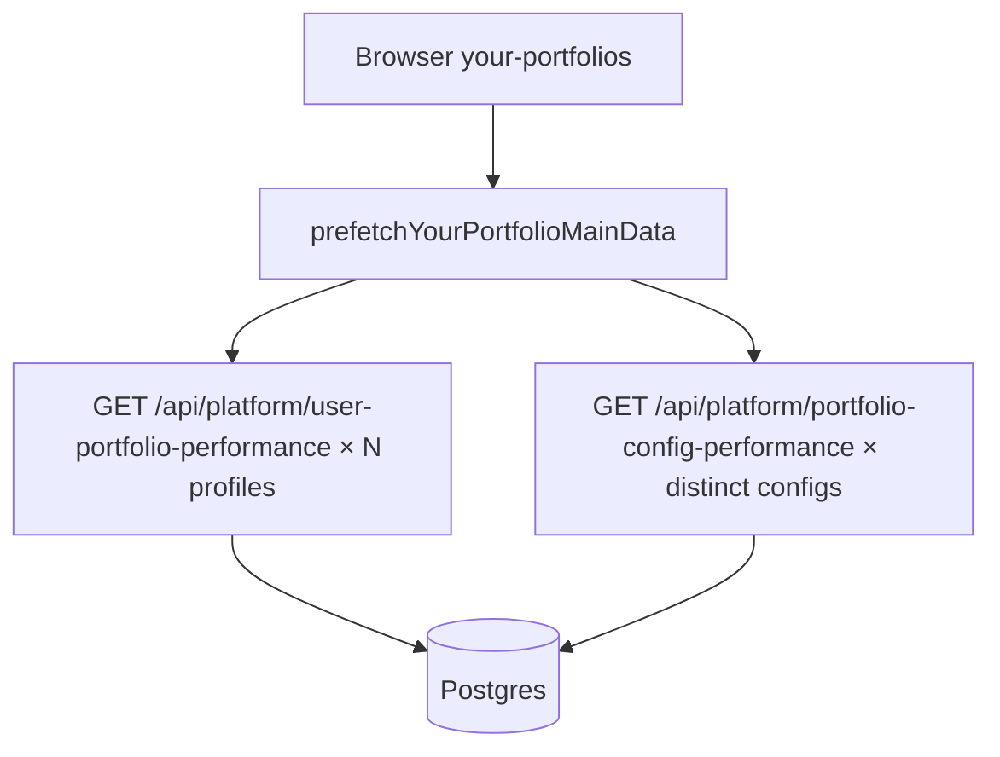

# Reduce Supabase Postgres egress (GB) — `/your-portfolios` priority

## Does the previous “query count” plan address egress?

**No.** `[supabase-count]` counts **HTTP round-trips** to Supabase, not **gigabytes**. Egress is driven mainly by:

- **How many rows and columns** each query returns (payload size).
- **How often** those queries run **without** hitting a durable cache (`unstable_cache`, CDN, or client reuse).
- **Duplication**: N profiles × the same heavy reads multiplies bytes.

So fewer round-trips can help a little, but **the dominant egress wins are fewer/lighter reads** and **not downloading full chart series for every profile on every cold load**.

## Goal (sole priority)

Lower **total uncached Postgres egress (GB)** attributed to platform usage, especially **`/platform/your-portfolios`**, **without product regressions** (same numbers where the product promises them, same invalidation behavior where writers already `revalidateTag`).

Non-goals: micro-optimizing dev-only duplicate fetches unless they also reflect production traffic patterns.

## Current architecture (why egress is high)

[`prefetchYourPortfolioMainData`](src/lib/your-portfolio-data-cache.ts) intentionally warms **every** followed profile (user-entry + config perf), batched to 6 concurrent jobs. Each `user-portfolio-performance` request runs auth + profile + admin reads including [`getPortfolioRunDates`](src/lib/platform-performance-payload.ts) and [`ensureConfigDailySeries`](src/lib/config-daily-series.ts) ([`user-portfolio-performance/route.ts`](src/app/api/platform/user-portfolio-performance/route.ts)). That is correct for UX but **expensive in egress** when N is large or rows/series are wide.

## Implementation verification (double-checked against code)

These details tighten the plan so it matches **actual** coupling in [`your-portfolio-client.tsx`](src/components/platform/your-portfolio-client.tsx) + [`your-portfolio-data-cache.ts`](src/lib/your-portfolio-data-cache.ts):

1. **Prefetch really is “all profiles.”** `profilesPrefetchOrdered` is built as: visible filtered rows first, then same-strategy rows hidden by filters, then **`rest`** = profiles not in the current sidebar cohort ([`profilesPrefetchOrdered` useMemo](src/components/platform/your-portfolio-client.tsx) ~L1760–1780). So prefetch is not limited to the visible sidebar slice; it eventually includes **other strategies** too. Any egress plan that only mentions “sidebar” understates the pipeline.

2. **User-entry cache drives sidebar $ / % and sort gating.** `getSidebarRowPerf` reads `getCachedUserEntryPayload(p.id)`; if missing → **`showLoading: true`** (skeleton) for that row’s value/return ([`getSidebarRowPerf`](src/components/platform/your-portfolio-client.tsx) ~L296–329).

3. **Performance sort is explicitly blocked until the whole same-strategy cohort is cached.** `allSidebarCached` = every `sidebarProfiles` row either has no `user_start_date` **or** has a cached user-entry payload ([`allSidebarCached`](src/components/platform/your-portfolio-client.tsx) ~L1718–1723). `sortedSidebarProfiles`: if sort metric ≠ `follow_order` **and** `!allSidebarCached`, the list stays in **raw `follow_order`** ([`sortedSidebarProfiles`](src/components/platform/your-portfolio-client.tsx) ~L1726–1732). So shrinking prefetch without a **replacement** (light summary API or batched payload) changes UX: **delayed or absent performance-based ordering** and **more loading rows**.

4. **Prefetch completion bumps sort epoch.** When `prefetchYourPortfolioMainData` returns `didWork`, the effect calls `setSidebarSortCacheEpoch` ([useEffect ~L1826–L1833](src/components/platform/your-portfolio-client.tsx)), which re-runs memos that depend on that epoch — intentional so the list **resorts** once caches fill. Removing bulk prefetch requires an equivalent signal when partial data arrives.

5. **Ranked configs + filters are a separate path.** `rankedBySlug` comes from `loadRankedConfigsClient` / `/api/platform/portfolio-configs-ranked` ([grep `loadRankedConfigsClient`](src/components/platform/your-portfolio-client.tsx)); filters use `rankedBySlug`, not the user-entry cache. Narrowing user-entry prefetch does **not** by itself fix ranked egress (separate lever).

6. **Plan lever (2) remains valid:** `getPortfolioRunDates` is still a full `strategy_portfolio_holdings` `select('run_date')` ordered by `run_date` ([`getPortfolioRunDates`](src/lib/platform-performance-payload.ts) ~L850–857) — potentially **large row counts** per strategy = high egress per `user-portfolio-performance` call. Any replacement must preserve `pickHoldingsRunDate` semantics.

## UX impact and pros / cons (by lever)

### A) Prefetch scope — fetch full user-entry / config perf for fewer profiles (or lazy)

| Pros | Cons / UX changes |
|------|-------------------|
| **Largest egress reduction** if today each profile downloads full `series` + heavy server work. | **Sidebar rows** show loading until cache populated ([`getSidebarRowPerf`](src/components/platform/your-portfolio-client.tsx)). |
| Faster initial **connection** saturation / less DB load on cold visit. | **Sort by return / Sharpe / etc.** does not apply until `allSidebarCached` is true — with partial data, order stays **`follow_order`** ([`sortedSidebarProfiles`](src/components/platform/your-portfolio-client.tsx)). Users who expect immediate “best performer first” see a **behavior change** unless you add a **light** summary fetch for all rows. |
| Lower cost for users with many dormant profiles. | **Other strategies’ profiles** are still in `profilesPrefetchOrdered` tail; lazy-only-visible must redefine that list or **off-strategy profiles** stay cold until clicked (extra spinners on switch-strategy). |

**Mitigation (keeps UX, still saves egress):** add a **small** list endpoint or batched read that returns only fields needed for sort + row $/% (e.g. last NAV, total return, status) **without** full daily `series`; keep full `user-portfolio-performance` for selected / detail. That is more engineering than “turn down prefetch” but avoids sort/loading regressions.

### B) Narrow / bound heavy selects (including `getPortfolioRunDates`)

| Pros | Cons / risks |
|------|----------------|
| **No intentional UX change** if responses stay byte-identical for clients. | Wrong cap or wrong source for run dates → **wrong anchor** → holdings / user track inconsistencies (high-severity regression). |
| Drops egress even when N profiles stays large. | Requires careful validation vs [`pickHoldingsRunDate`](src/lib/user-portfolio-entry.ts) + snapshot rules ([`daily-snapshot-invariant`](.cursor/rules/daily-snapshot-invariant.mdc)). |

### C) Batch `user-portfolio-performance` (same JSON per profile)

| Pros | Cons |
|------|------|
| **Fewer HTTP round-trips** from browser; **one `getUser()`** per batch; shared strategy-level reads possible → lower duplicate bytes and CPU. | **Large single response** if each profile still embeds full `series` — may **not** cut GB much unless combined with payload slimming. |
| **No sidebar UX change** if cache is populated synchronously from batch response same as today. | RLS / auth edge cases; handler complexity; careful cache invalidation per profile. |

### D) Longer `unstable_cache` TTLs

| Pros | Cons |
|------|------|
| Fewer repeated Postgres reads for identical keys. | **Stale UI** if any writer forgets `revalidateTag`; harder to debug than prefetch scope. |

---

**Reader summary:** The plan’s **direction** matches the code (N-profile prefetch + heavy per-request reads). The main **UX** risk is **not** “slower chart for one profile” — it is **sidebar loading states + performance sort stuck in follow_order** until every same-strategy row has data, unless you ship a **light** summary path alongside reduced full prefetch.

## Ranked levers (egress impact vs regression risk)

### 1) Prefetch scope (highest egress leverage, medium risk)

**Idea:** Stop treating “cold load” as “fetch full user-entry + config performance for all profiles.”

- **List / sidebar:** use **minimal** payloads (e.g. profile metadata + small summary fields you already need for sorting) from an existing or new **narrow** API, or reuse a single **batched** read.
- **Detail / selected profile:** keep current **full** `user-portfolio-performance` + `portfolio-config-performance` behavior.

**Regression guard:** Match current headline behavior for the **selected** profile; compare before/after for list ordering, badges, and “first paint” expectations. Use [`daily-snapshot-invariant`](.cursor/rules/daily-snapshot-invariant.mdc) / [`performance-stats-single-source`](.cursor/rules/performance-stats-single-source.mdc) as review gates so chart/metrics stay internally consistent.

### 2) Narrow / bound heavy selects (high leverage, lower risk if done carefully)

Audit per-request paths for **unbounded or wide** reads:

- **`getPortfolioRunDates`**: `strategy_portfolio_holdings` `select('run_date')` still scans all matching rows unless limited; consider a **lighter** source for “available run dates” if semantics allow (e.g. distinct dates with cap, or reuse a smaller index-friendly table the product already trusts).
- **`ensureConfigDailySeries`**: confirm we never re-stream **full** `portfolio_config_daily_series` blobs on every profile poll when a **cached** path suffices; align with existing “hot poll bypass” patterns in public rules.

**Regression guard:** Same `anchorHoldingsRunDate` / series endpoints as today for identical inputs; add targeted tests or SQL checks for a few fixture profiles.

### 3) Batch API for user-entry (medium leverage, medium risk)

Replace N× `/api/platform/user-portfolio-performance` with **one** route (or server action) that:

- Calls `getUser()` once.
- Fetches **all** requested profiles in fewer round-trips (bulk `in('id', …)` with `user_id` filter, shared strategy date loads where safe).

**Regression guard:** Response must be **per-profile identical** to current JSON (or explicitly versioned with client migration). Watch RLS: bulk reads must preserve the same authorization boundary as today.

### 4) Server / edge caching TTL (variable leverage, higher policy risk)

Where routes already use `unstable_cache` + `PUBLIC_CACHE_TAGS`, **longer TTL** lowers egress but can **stale** data if writers miss a tag. Only tighten TTLs where cron/API writers already `revalidateTag` every mutation path you care about.

**Regression guard:** Cross-check writers in [`public-pages-caching.mdc`](.cursor/rules/public-pages-caching.mdc) and cron routes before extending TTL.

## What we will **not** rely on for your stated goal

- **React Strict Mode / multi-tab dev duplicates** — real egress is dominated by **production** traffic; dev fixes are secondary unless you see the same duplicate pattern in prod analytics.
- **Reducing query count alone** — without shrinking rows or eliminating redundant full-series fetches, GB may barely move.

## Suggested execution order

1. **Baseline** in Supabase (egress + top SQL or Logflare if available) and reproduce worst case: many profiles + cold cache.
2. **Prefetch scope** (largest GB win if list currently pulls full series).
3. **Select / path audit** inside `user-portfolio-performance` + `getPortfolioRunDates` + `ensureConfigDailySeries`.
4. **Batch** only if (2)+(3) are insufficient or N is still too large.
5. **Regression suite** focused on your-portfolios flows + snapshot invariants.

---

**Bottom line:** The original plan **did not** target egress GB. This plan does: prioritize **less data over the wire per visitor** (prefetch + payload shape), then **dedupe reads**, then **cache policy** only where invalidation is already correct.
